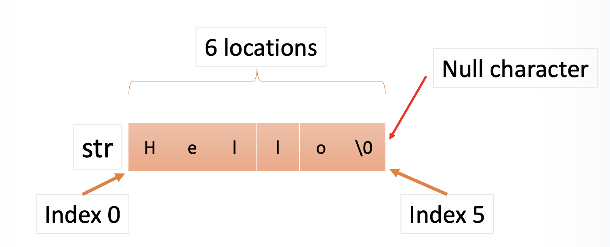

# Function, String and Arrays
## Table of content
- Function in C
- Variable with value and reference
- Array in C and C++
- String in C and C++
- Functions/methods of string
## Functions in C/C++
> Only one kind of function in Java: member function
> In C: independent function
> In C++: member function (method) and independent function

| Java            | C                    | C++                                                     |
| :-------------: | :------------------: | :-----------------------------------------------------: |
| member function | independent function | member function (method)<br>and<br>independent function |

Syntax:
```c
Return_type/void function_name(Arg_List){
    Function body;
}
```  
`Arg_List` is a comma separated list of arguments.  
Example:
```c
int TestFunction(int x){
    return x+1;
}
```
### Passing Parameters in C/C++ Functions
形式参数：parameter
实际参数：argument
- In C and C++ there are two methods of passing parameters to a function.
    - Pass by value:
        - A copy of the parameter is passed to the function.
        - The parameter itself <span style="color: red"><strong>cannot be modified</strong></span> within the function.
    - Pass by reference:
        - <span style="color: red">Memory address</span> of the parameter is passed.
        - The parameter **can be modified** within the function.
#### A Function in C: Pass by Value
```c
int addOneTo(int x) {
    x++; return x;
}
int main() {
    int x = 20;
    int y = addOneTo(x);
    printf(“%i\n”,x);
    printf(“%i\n”,y);
    return 0;
}
```
This will display:
```console
20
21
```
#### A Function in C: Pass by Reference
星号✳️：asterisk  
此处表示指针
```c
int addOneTo(int *x) {
// Thinking Question: What is the real meaning of the “*X”
// -- Pointer
// int *x: int type pointer
    *x = *x + 1;
    return *x;
}
int main() {
    int z = 20;
    int y = addOneTo(&z); //&z: address of z
    printf(“%i\n”,z);
    printf(“%i\n”,y);
    return 0;
}
```
This will display:
```console
21
21
```
## How variables are stored
- When you create a variable, the compiler allocates some space in memory for the variable.
- When the variable is later referred to, it can be in two senses:
    - ➢The actual <span style="color: red">value</span> of the variable;
    - ➢The location in memory of the variable (the <span style="color: red">address</span> or <span style="color: red">reference</span>)
- To pass a variable to a function, one of these <span style="color: #8B0000">must be copied</span> to be given to the function. (Making a copy of some kind is inevitable because there must be a <span style="color: red">fixed location</span> in memory the function reads to find out what to work on.)
## Value and reference
explicit: 清晰的；显式的
implicit: 隐晦的；隐式的
- The process of using value and reference types is hidden in Java, but is <span style="color: #8B0000">explicit</span> in C (and in C++ to a lesser extent)
- You have already used this when you call `scanf` in C. 
```c
int number;
scanf(“%i”,&number);
```
- The <span style="color: red">&amp;</span> operator gives the address of the named variable.
- You need to provide the address to `scanf` so it can update the contents of the variable `number`.
### Accepting references via pointer
```c
void addOneTo(uint16_t *x) {
    *x = *x + (uint16_t)1;
}
int main() {
    uint16_t b = 2;
    addOneTo(&b);
    printf(“%i\n”,b);
}
```
---
Find the difference:
```c
#include <stdio.h>
uint16_t addOneTo(uint16_t *x) {
    *x = *x + (uint16_t)1;
    return *x;  // Pay attention to this line
}
int main(){
    uint16_t x = 2;
    printf("%i\n", x);
    uint16_t y = addOneTo(&x);
    printf("%i\n", x);
    printf("%i\n", y);
    return 0;
}
```
```c
#include <stdio.h>
uint16_t addOneTo(uint16_t *x) {
    *x = *x + (uint16_t)1;
    return x;  // Pay attention to this line
}
int main(){
    uint16_t x = 2;
    printf("%i\n", x);
    uint16_t y = addOneTo(&x);
    printf("%i\n", x);
    printf("%i\n", y);
    return 0;
}
```
```console
2
3
52284
```
上面的52284是被转换后的地址
### Accepting references
```c
void addOneTo(uint16_t *x) {
    *x = *x + (uint16_t)1;
}
```
This shows how you can write a function that updates its parameter, like `scanf`. 
- `uint16_t *x` declares that <span style="color: red">x</span> holds <span style="color: red">the address of</span> a 16-bit unsigned integer (this is called a <span style="color: red">pointer</span>) 
- `*x` tells C to go to the address stored in <span style="color: red">x</span> and read or update the value there.
<p style="text-align:center;">This is called <span style="color: red">dereferencing（解除引用）</span></p>

```c
int main() {
    uint16_t b = 2;
    addOneTo(&b);
    printf(“%i”,b);
}
```
- When we call addOneTo(), we have to pass it a pointer, not a number. So we use the <span style="color: red">&amp;</span> operator.
- Note that we are passing a basic type, an int, by reference here. One of the benefits of <span style="color: red">references being explicit（显式引用）</span> in C is that we can pass any type we choose by reference or by value.
#### Accepting references in C
```c
void addOneTo(uint16_t &x) {
    x = x + (uint16_t)1;
}
int main() {
    uint16_t b = 2;
    addOneTo(b);
    printf(“%i”,b);
}
```
Try to figure out the result:
```cpp
#include <iostream>
void addOneTo(uint16_t *x) {
    (*x) ++;
}
void addOneTo2(uint16_t y) {
    y++;
    printf("the intermediate variable is %i \n",y);
}
void addOneTo3(uint16_t &y) {
    y++;
    printf("the intermediate variable is %i \n",y);
}
int main() {
    uint16_t b = 2;
    printf("%i, \n", b);
    addOneTo(&b) ;
    printf("%i. \n", b);
    addOneTo2(b);
    printf("add again without pointer, the result is %iln ", b);
    addOneTo3(b);
    printf("add again with &, the result is %i\n ", b);
}
```
```console
2,
3.
the intermediate variable is 4
add again without pointer the result is 3
 the intermediate variable is 4
add again with & the result is 4
```
C language can’t accept the function arguments like `void addOneTo3(int &x);`  
> Sorry, I wrote it in a C++ environment

#### Accepting references in C++
- In C++, declaring a parameter with an <span style="color: red">&amp;</span> instead of a <span style="color: red">*</span> creates a special reference parameter (called a <span style="color: #8B0000">reference</span> rather than a <span style="color: #8B0000">pointer</span>)
- It behaves like the pointer did in C, except that the compiler deals with getting addresses and dereferencing for you.
- You do not have to remember to write `&b` when calling the function, nor to write `*x` when modifying the value, <span style="color: red">because</span> the compiler knows that the type is a reference and inserts these for you.
---
```cpp
#include <iostream>
using namespace std;
int main() {
    int *p;
    *p = 123;
    cout<<*p<<endl;
    cout<<p<<endl;
    return 0;
}
```
```console
(empty)
```
Note the difference
```cpp
#include <iostream>
using namespace std;
int main() {
    int *p;
    int q;
    q = 123;
    p = &q;
    cout<<*p<<endl;
    cout<<p<<endl;
    return 0;
}
```
```console
123
0x8000127e0
```
<span style="color: red">Where is the “123” in memory?</span>

---
- Danger awaits those who incautiously use pointers.
- When you create a pointer in C++, <span style="color: red">the computer allocates memory to hold an address, but it does not allocate memory to hold the data to which the address points.</span>
- Creating space for the data involves a separate step. Omitting that step, as in the above, is an invitation to disaster.
```cpp
int main() {
    int *p = new int;
    *p = 123;
    cout<<*p<<endl;
    return 0;
}
```
<span style="color: red">Thinking Question: Ok or not? Why?</span>
```console
123
```
`new`: allocate memory -> constructor  
`int *p = new int;`: 请求分配一块内存给变量（此变量只有指针，没有变量名）

---
- The `<<` operator in C++ (as in `cin >> name`) works like this. It is declared to accept a reference, so you do not have to write `&name;` C++ <span style="color: red">automatically</span> passes in the address because it knows `<<` accepts a reference.
- Using this syntax can help prevent mistakes.
- However, it also hides what is going on.
##### Summary
Now, the difference between \* and &:  
<span style="color: red">&amp; is the reference operator, and * is the dereference.</span>

| &                                        | \*                                               |
| ---------------------------------------- | ------------------------------------------------ |
| is used to get the address of a variable | is used to create a variable to store an address |
## Declaring an array in C
`uint16_t scores[20];`  
The C compiler will:
- Look at the size of the array (20) and the size of the type you asked for. Then multiply these together to get a total size for the array.
- Reserve that much memory in the static data area of the program and store the address of this memory.
- Treat anything mentioning the variable <span style="color: #8B0000">scores</span> as meaning that <span style="color: red">address</span>.
## Arrays: watch out!
`uint16_t scores[20];`
- `scores[0]` will give a uint16
- ...
- `scores[19]` will give a uint16
<span style="color: #8B0000">scores</span> on its own will give an <span style="color: #8B0000">address</span>
`scores2 = scores;`
- will not copy the entire array. It will <span style="color: red">set the address of scores2 equal to the address of scores</span>. This means that both will refer to the same area of memory and changes made to one will apply to the other.
## Using an array in C
```c
int main() {
    uint32_t scores[5];
    for (uint8_t x=0; x<5; x++) {
        printf(“Enter score %i: ”,x);
        scanf(“%u”, &scores[x]
    }
    for (uint8_t x=0; x<5; x++) {
        printf("%u ", scores[x]);
    }
    printf("\n");
}
```
## Strings in C
- In C, a string is just <span style="color: red">an array of characters</span>. 
    `char name[20];`
- Note that since it is an array, you <span style="color: red">must</span> specify a maximum length.
- The actual length of the string is <span style="color: #8B0000">not stored directly!</span>
---
- To mark the actual length of the string, C inserts a Null character (ASCII 0) in the array after the last character.
- This means that `name[20]`can actually store only up to 19 characters because there must be a room for the Null character.
- When inputting a string using `scanf`, it is important to restrict the length that can be input to ensure there is no attempt to store a longer string than the array can hold.
---
```c
char str[6] = “Hello”;
puts(str);
```
Will display: `Hello`  
Here, `str` is a **pointer/memory address!**  


---
- `char str[6] = “Hello”;` is allowed.
- This allocates enough memory to store “Hello\0” and stores the **starting address** in str.
- However, `str = “Hello”` does not work!
### Strings in C: Copying
```c
char name[20];
name[20] = “Bob”;
```
Why doesn’t this work?
> ➢ Machine code has no way to handle variable length strings.  
> ➢ Every time you work with a string, the compiler has to insert machine code loops to manage them character by character.

How to fix it?
```c
char name[20];
name[0] = ‘B’; //Single quote for char type
name[1] = ‘o’;
name[2] = ‘b’;
name[3] = ‘\0’; // Null character.
```
---
In fact, this is exactly what the `strcpy` function does, but with a loop.  
Format: `char *strcpy(char *dest, char *src);`  
Example: `strcpy(name,”Bob”);`  
<span style="color: red">In C/C++: Double quotes (“”) for strings and single for char type.</span>
### Strings in C: Compare
```c
char name[20];
scanf(“%19s”,name);
if (name == “Bob”) {
    puts(“Hello Bob.”);
} else {
    puts(“I don’t know you.”);
}
```
Why does this always print “I don’t know you”, even if you type “Bob”?
> ➢ <span style="color: red">Name</span> stores an address.  
> ➢ comparing the address stored in <span style="color: red">name</span> with the address where the compiler stored the constant string `Bob`.

- Again, to compare strings the function `strcmp` is provided. This encapsulates the loop necessary to compare the strings.
- Also, it returns 0 if the strings match which must be allowed for in the if statement.
- `if (strcmp(“Bob”,name) == 0) {`
### C string functions
- `strcpy(a,b)`
    Copy string from b to a.
- `strncpy(a,b,n)`
    Copy up to n characters of string from b to a.
- `strcmp(a,b)`
    Compare strings a and b, return 0 if they match.
- `strcat(a,b)`
    Append string b to a. A must have been declared large enough to hold the result.
- `strlen(a)`
    Get actual length (not including zero terminator) of string stored in a.
```c
char phrase[20];
strcpy(phrase,”Hello There”);
```
- Suppose we now wanted to modify <span style="color: red">phrase</span> so that it contains “Hello Chris”.
- We could <span style="color: red">strcpy</span> the whole phrase into the array, overwriting the previous one.
- But we can also do: 
    `strcpy(phrase+6,”Chris”);`
- A preferable syntax for this is 
    `strcpy(&phrase[6],”Chris”);`
- Phrase holds an address. At that address are stored the bytes 
    `H e l l o <spc> …`
- Thus, moving the address on by 6 bytes will reach the address where `T h e r e` is stored. And we can copy “Chris” into this address.
## C++ strings
- C++ has a type <span style="color: red">string</span> which is a <span style="color: red">class</span>, like Java strings.
- All of the complex loops are hidden inside the methods of the class.
- C++ allows methods to <span style="color: red">override</span> the basic operators applied to a class type.
- So using = on a C++ string actually calls a method that acts like <span style="color: red">strcpy</span>. Using == to test equality calls a method that acts like <span style="color: red">strcmp</span>.
### C++ string methods
`string s;`
- `s.length()`
    Gives length of the string.
- `s.append(“test”)`
    Appends a string to the end of the string.
- `s.insert(2,”add”)`
    Inserts a string in the middle of the string.
- `s.erase(2,3)`
    Deletes characters in the middle of the string.  
…And many other methods you can find in online references.
## Inputting C++ strings
- You can input a string in C++ using `cin << s` as usual.
- <span style="color: red">Caution</span>, the input will stop at a whitespace character (such as a space).
- To input a line ending in a return, use the function `getline(cin, s);`
- Just like `<<`, `getline` uses reference parameters so you are effectively <span style="color: red">passing the address of</span> `s`, even without writing it explicitly.
## C++ string and C strings
- Every C++ string contains an embedded C-style string (array of characters) which you can access as `s->data`.
- In C++, you can turn a C-string into a C++ string by wrapping it in a string object: 
    `string cppstring(cstring);`  
    or  
    `string* cppstring = new string(cstring);`  
## C and C++
- Given that C++ is much more convenient, you might be wondering <span style="color: red">why does anyone use C</span>?
- In exchange for programmer convenience C++ (and many modern languages) hides complexity from the programmer. It is easy to write code which takes a lot of CPU time or memory without realizing it, because it is hidden.
- When writing programs that need to be <span style="color: red">small</span> and <span style="color: red">efficient, you’d better encoding by C.</span>
- C makes sure you are fully aware of what is going on.
## Summary
- The key symbol & in C
- The meaning of the pointer
- The composition of the Char Array
- How the compiler identify array in C or string in C++
- Functions and methods of String
