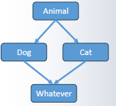

# Object Orientation II

<table>
    <tr>
        <td>Base Class</td>
        <td>Super Class</td>
    </tr>
    <tr>
        <td>Sub Class</td>
        <td>Derived Class</td>
    </tr>
</table>

## Inheritance and Polymorphism

- **Inheritance:** the ability for a class to extend or inherit another class. A derived class obtains all of the base class’s properties and methods, and can override them or add new ones.
- **继承**：一个类扩展或继承另一个类的能力。派生类获得基类所有的属性和方法，可以覆盖它们或添加新的。
- **Polymorphism:** if a class inherits from another class, it can be treated as a member of that base class. For example, if `Dog` inherits `Animal`, a `Dog` instance can be referred to as an `Animal` and passed to functions that expect `Animal` parameters.
- **多态**：如果一个类继承自另一个类，它可以被当作基类的一个成员来处理。例如，如果 `Dog` 继承自 `Animal` ，一个 `Dog` 实例可以被引用为 `Animal` ，并传递给期望 `Animal` 参数的函数。

## What’s different between Java & C++?

| Java                                                                                   | C++                                                                                                  |
| -------------------------------------------------------------------------------------- | ---------------------------------------------------------------------------------------------------- |
| Everything inherits from class **Object**<br>所有内容都继承自 **Object** 类                     | There is no universal base class<br>没有通用的基类                                                          |
| Inherited methods and properties have the same access specifiers<br>继承的方法和属性具有相同的访问修饰符 | Derived classes can limit access to inherited methods and properties<br>派生类可以限制对继承方法和属性的访问           |
| “Interfaces” act like classes with no definitions<br>“接口”像是没有定义的类                      | “Pure virtual classes” replace interfaces, but are still classes<br>“纯虚类”取代了接口，但仍然是类                 |
| You can extend only one class, then implement interface<br>您只能扩展一个类，然后实现接口             | You can inherit any number of classes, virtual or otherwise<br>您可以继承任意数量的类，无论是虚类还是其他类                |
| Methods are automatically late bound<br>方法会自动进行晚期绑定                                    | You must specify that methods should be late bound<br>您必须指定方法应该是后期绑定                                 |
| Objects are automatically references for polymorphism<br>对象自动引用以实现多态                   | Objects can be value or reference, but polymorphism only works for references<br>对象可以是值或引用，但多态仅适用于引用 |

## Defining a class

```cpp
class Animal {
  public:
    uint16_t getAge();
    std::string *getName();
    void makeNoise();
  protected:
    uint16_t age;
    std::string name;
};
```

## Defining methods

```cpp
uint16_t Animal::getAge() {
  return this->age;
}
std::string *Animal::getName() {
  return &(this->name);
}
void Animal::makeNoise() {
  std::cout << "Hunc.";
}
```

## Defining a derived class

Additional code example:

```cpp
class Dog : public Animal {
public:
  std::string colour;
  void makeNoise();
};
void Dog::makeNoise() {
  std::cout << "Woof!";
}
```

### Access after different inheritance modes

> “Beware of this new attribution” — In C++, the inheritance mode can lower access.  
> “小心这种新的属性分配”——在 C++中，继承模式可以降低访问权限。

| Inheritance | Base (Animal) member | Access in Derived (Dog)  |
|-------------|----------------------|--------------------------|
| public      | public               | public                   |
| public      | protected            | protected                |
| public      | private              | private *(inaccessible)* |
| protected   | public               | protected                |
| protected   | protected            | protected                |
| protected   | private              | private *(inaccessible)* |
| private     | public               | private                  |
| private     | protected            | private                  |
| private     | private              | private *(inaccessible)* |

- We specify that we inherit from `Animal` as a `public` inheritance. This means that all properties and methods in `Animal` will retain the same access in a `Dog` (as they always do in Java)
- 我们指定从 `Animal` 继承作为 `public` 继承。这意味着 `Animal` 中的所有属性和方法在 `Dog` 中都将保持相同的访问权限（就像它们在 Java 中始终那样）
- If we instead wrote `protected Animal` then all public members of Animal would be `protected` in `Dog`. If we wrote `private Animal` then all public or protected members of `Animal` would be `private` in `Dog`.
- 如果我们写成 `protected Animal` ，那么 Animal 的所有公共成员在 `Dog` 中都将 `protected` 。如果我们写成 `private Animal` ，那么 `Animal` 的所有公共或受保护的成员在 `Dog` 中都将 `private` 。
- **You can only lower access in a derived class, not raise it** (so you cannot make non-public methods in an `Animal` public in a `Dog`). This can be used to block access to methods you don’t want to be available to callers.
- **您只能在派生类中降低访问级别，而不能提高它**（因此您不能将非公共方法在 `Animal` 中声明为 `Dog` ）。这可以用来阻止对您不希望调用者可用的方法的访问。
- Note that when we want to override a method, we have to declare it in the class declaration as well as redefine it.
- 请注意，当我们想要重写一个方法时，我们不仅要在类声明中声明它，还要重新定义它。

## Using a class’s objects

- Derived objects can be used just like base objects.
- 派生对象可以像基对象一样使用。

- **By value**

  ```cpp
  Dog rover;
  rover.makeNoise();
  ```

- **By reference**

  ```cpp
  Dog *fido = new Dog;
  fido->makeNoise();
  ```

## Declaring a constructor in the base class

```cpp
class Animal {
  public:
    uint16_t getAge();
    std::string* getName();
    void makeNoise();
    Animal(uint16_t _age, const char* _name);
  protected:
    uint16_t age;
    std::string name;
};

Animal::Animal(uint16_t _age, const char* namestr)
  : age(_age), name(namestr) {
  std::cout << name << " has arrived!";
}
```

## Declaring a constructor in the derived class

- Now that `Animal` has a constructor which takes parameters, we will get an error if we keep the existing definition of `Dog`.
- 现在 `Animal` 有一个带参数的构造函数，如果我们保留现有的 `Dog` 定义，将会出现错误。
- Because `Dog` inherits from `Animal`, an `Animal` must be created whenever a `Dog` is created. This means running an `Animal` constructor, and this means supplying values to its parameters.
- 因为 `Dog` 继承自 `Animal` ，每当创建一个 `Dog` 时，都必须创建一个 `Animal` 。这意味着运行一个 `Animal` 构造函数，这也意味着需要为其参数提供值。
- When `Animal` has a parameterized constructor, `Dog` **must** construct the base part by calling the `Animal` constructor in its member-initializer list.
- 当 `Animal` 有一个参数化构造函数时， `Dog` **必须**通过在其成员初始化列表中调用 `Animal` 构造函数来构建基类部分。

```cpp
Dog::Dog(const char* _name, const char* _colour)
  : Animal(3, _name), colour(_colour) {
  std::cout << name << " is a dog!";
}
```

*Like calling `super(...)` in Java.*

### Using an object with a parameterized constructor

```cpp
Dog rover("Rover", "Green");
rover.makeNoise();
// Output:
// Rover has arrived!
// Rover is a dog!
// Woof!
```

(The `Animal` constructor runs first; then the `Dog` constructor.)  
（ `Animal` 构造函数首先运行；然后是 `Dog` 构造函数。）

## Polymorphism

> [!IMPORTANT]
> 1. sub-class object can be assigned to base-class object, but the base-class object has no properties that only belong to sub-class.  
> 2. base-class pointer can point to sub-class object, but cannot call the methods <mark>only</mark> belongs to sub-class.  
> 3. use `virtual` to override same name methods.  
> 4. pure virtual class = abstract class <br>Any class that contains a pure virtual function is a pure virtual class, cannot instantiate any instance.  
> 5. if want to differentiate the calling of some name methods of sub-class, use virtual.  

- An object which is a member of a derived class can be *referred to* as if it was a member of its base class.
- 一个派生类的成员对象可以像它是其基类的成员一样被引用。

- Writing

```cpp
Animal myPet = rover;
```

- is not referring to `rover` as an `Animal`; it is creating a new `Animal` object by copying the `Animal` part of `rover`.
- 并不是将 `rover` 作为 `Animal` 来引用；它通过复制 `rover` 的 `Animal` 部分来创建一个新的 `Animal` 对象。
- This is not polymorphism. myPet will be a separated object.
- 这并不是多态。myPet 将成为一个独立的对象。
- its `Colour` property will *be wiped out*, because `Animal` does not have it.
- 它的 `Colour` 属性将被清除，因为 `Animal` 没有这个属性。

```txt
be wiped out means:
myPet.colour//not allowed
```

To invoke Polymorphism we must use a reference, that is, a pointer/address:  
要调用多态，我们必须使用引用，即指针/地址：

```cpp
Animal *myPet = &rover;
```

myPet is a variable of type `Animal*` now, but it points to `rover`, which is an object of `Dog`.  
myPet 现在是一个类型为 `Animal*` 的变量，但它指向 `rover` ，这是一个 `Dog` 的对象。  

Polymorphism means that there is no type error.  
多态意味着没有类型错误。  

myPet could be cast back to `Dog*` and the `Colour` member accessed if necessary (although this is bad design practice).  
myPet可以被强制转换回`Dog*`，如果有必要，可以访问 `color` 成员（尽管这是糟糕的设计实践）。  


The following example shows how the `Dog` class inherits from `Animal`, adds a new member (`colour`), and overrides the `makeNoise` method to demonstrate inheritance and polymorphism in C++.  
以下示例展示了 `Dog` 类如何继承自 `Animal` ，添加一个新成员（ `colour` ），并重写 `makeNoise` 方法以演示 C++中的继承和多态。  

```cpp
class Dog: public Animal{
  public:
    Dog(int a,const char * n,const char* c);
    string colour;
    void makeNoise();
    void makeBark();
};
Dog::Dog(int a,const char * n,const char* c):
Animal(a,n),colour(c)
{
  cout<<name<<" is a "<<colour<<" dog!";
}
  void Dog::makeNoise() {
  cout<<“Woof"<<endl;
}
  void Dog::makeBark() {
  cout<<"WonWon again"<<endl;
}
```

```cpp
int main() {
  Dog rover(3,"Rover","yellow");
  cout<<rover.colour<<endl;
  Animal myPet = rover;
  Animal *myPet2= &rover;
  myPet2->makeNoise();
  return 0;
  }
```

Could we use?

```cpp
cout<<myPet.colour<<endl;
// NO
```

Could we use?

```cpp
myPet2->makeBark()<<endl;
// NO
```

What's the output of `myPet2->makeNoise();`?

```txt
Hunc.
```

### Summary

- The pointer of a base class can point to a subclass object
- 基类的指针可以指向子类的对象
- But it (the pointer) can’t call methods or use attributes that only existed in the subclass
- 但是（指针）不能调用仅在子类中存在的方法或使用属性

## Passing a derived class

```cpp
void kick(Animal *victim) {
  cout << “Bad boy kicked " <<
    *(victim->getName()) << "!" <<endl;
  victim->makeNoise();
  }
int main() {
  Dog rover(“Rover”, “Black”);
  kick(&rover);
}
```

There is no type error because, since `Dog` extends `Animal`, `&rover` (of type `Dog*`) can polymorph into a value of type `Animal*`.  
由于 `Dog` 扩展了 `Animal` ，因此 `&rover` （类型为 `Dog*` ）可以多态地转换为类型 `Animal*` 的值。  

However, the result may not be what we expect!  
然而，结果可能并非我们所期望的！  

## Compile time binding

```txt
Rover has arrived!
Rover is a dog!
Bad boy kicked Rover!
Hunc.
```

Everything is fine until the call to `makeNoise()`.  
直到调用 `makeNoise()` 之前一切正常。  
It prints `Hunc`. (the value from `Animal::makeNoise()`).  
它打印 `Hunc` 。（来自 `Animal::makeNoise()` 的值。）  

> [!NOTE]
> Shouldn’t it print `Woof!`  
> (the effect of `Dog::makeNoise()`)?  
> 它不应该打印 `Woof!` （ `Dog::makeNoise()` 的效果）吗？

## The machine code

```cpp
void kick(Animal *victim) {
. . .
  victim->makeNoise();
}
```

compiles to

```txt
void kick(Animal *victim) {
. . .
  _ZN6Animal9MakeNoiseEv(&victim);
}
```

> [!NOTE]
> Whatever we pass the base class object reference or a subclass object
> reference to `victim`, it always be recognized as an `Animal` type pointer,
> so the compiler will choose the method of `Animal`  
> 无论我们将基类对象引用或子类对象引用传递给 `victim` ，它始终被识别为 `Animal` 类型指针，因此编译器将选择 `Animal` 的方法

## Compile time method binding

- When you remember how methods are converted to machine code, it makes it clearer what is going on.
- 当你记得方法是如何转换为机器码时，这会使正在发生的事情更加清晰。
- The C++ compiler has to identify which mangled function name to use for the method call. By default, it does this at *compile time*.
- C++编译器必须确定用于方法调用的名称修饰函数名称。默认情况下，它在*编译*时执行此操作。
- Because it’s compile time, the compiler can only go based on the *declared* type of the object.
- 因为这是编译时，编译器只能根据对象的*声明*类型进行判断。
- The *declared* type of `victim` is `Animal`. So the compiler inserts a call to the `Animal` version of `makeNoise`.
- `victim` 的*声明*类型是 `Animal` 。因此，编译器插入对 `makeNoise` 的 `Animal` 版本的调用。
- If we want it to respect the overriding of `makeNoise`, we actually need to make the machine code much more complicated.
- 如果我们想让它尊重 `makeNoise` 的覆盖，实际上我们需要让机器码变得更加复杂。

## The necessary code

```cpp
void kick(Animal *victim) {
  . . .
  victim->makeNoise();
}
```

We want is actually

```txt
void kick(Animal *victim) {
    . . .
    if (victim isReallyA Dog)
        _ZN3Dog9MakeNoiseEv(&victim);
    else
        _ZN6Animal9MakeNoiseEv(&victim);
}
```

The if-else can make sure which will be executed at running time.  
if-else 语句可以确保在运行时执行哪个分支。

## Late method binding
> 延迟绑定

- Because the compiler does not know at compile time what type(s) of derived value will be passed to `kick`, it cannot predict at compiling time which mangled function to call.
- 因为编译器在编译时不知道将传递给 `kick` 的派生值的类型，所以它无法预测在编译时调用哪个名称混淆的函数。
- So, it has to insert an if statement in machine code which chooses between them at run time instead of compile time.
- 因此，它必须在机器码中插入一个 if 语句，在运行时而不是编译时选择它们。
- This is called **late binding** (or sometimes **dynamic binding** or **dynamic dispatch**).
- 这被称为后期绑定（有时也称为动态绑定或动态调度）。
- Java does this automatically for every method, but for C++ it is a choice. There is a performance loss associated with this extra `if` statement, although it is very small on modern systems.
- Java 会自动为每个方法执行此操作，但对于 C++来说，这是一个选择。这种额外的 `if` 语句会带来一定的性能损失，尽管在现代系统中这个损失非常小。
- Because of Java, late binding is considered normal nowadays. But at the time C++ was invented, this behavior was seen as strange and dangerous – calling a method on an object and not knowing exactly, at the time you write the code, what function will run!
- 由于 Java，现在人们认为晚期绑定是正常的。但在 C++被发明的时候，这种行为被视为奇怪且危险的——在对象上调用方法，而在编写代码的时候却不知道到底会运行哪个函数！

## The magic word `Virtual`

```cpp {5}
class Animal {
  public:
    uint16_t getAge();
    string *getName();
    virtual void makeNoise();
    . . .
};

class Dog : public Animal {
public:
  string colour;
  void makeNoise() override;
};
```

- Declaring a method **virtual** tells the compiler: “Use late binding on this method.” In other words, “Whenever this method is called, include a machine code if statement to check what type the object really is, instead of just calling the method on this class.”
- 将方法声明为虚拟（virtual）告诉编译器：“在这个方法上使用晚期绑定。”换句话说，“每次调用这个方法时，包含一个机器代码 if 语句来检查对象的实际类型，而不是仅仅调用这个类上的方法。”
- Placing **override** after a method declaration tells the compiler: “Make this method **virtual**, and also check it’s overriding something from my base class and give an error if it isn’t.”
- 在方法声明后放置重写（override）告诉编译器：“使这个方法为虚方法，并检查它是否覆盖了我基类中的某个方法，如果不是则报错。”
- **Override** is optional – you can just use **virtual** in the derived class also – but it is easier to read and avoids mistakes.
- 重写（override）是可选的——你也可以在派生类中使用虚方法（virtual）——但它更容易阅读，并且可以避免错误。
- **Virtual** is also optional in the derived class since an overridden method is automatically virtual. But you should always include it (or **override**) to avoid having to trace all the way back to base classes to find out which methods are virtual and which are not.
- 在派生类中虚方法（virtual）也是可选的，因为覆盖的方法会自动成为虚方法。但你应该始终包含它（或重写），以避免需要追溯到基类来找出哪些方法是虚方法，哪些不是。

## The magic goes away

- If a method is not **virtual** in the base class, you can still redefine it in a derived class – but as we saw, it will not be called if the object is not declared as being that derived type. Technically, this is called **hiding** the method, rather than **overriding** it.
- 如果一个方法在基类中不是虚拟的，你仍然可以在派生类中重新定义它——但正如我们所见，如果对象没有被声明为该派生类型，它将不会被调用。技术上，这被称为隐藏方法，而不是重写方法。
- In a constructor, **virtual** methods are ignored, and methods are always called based on the declared type. This is because during the construction process, the object is still being set up, so the machine code if statement to go to the correct function cannot be written – it depends on data created during that setup. (In Java, this works but is banned by most coding conventions and gives a warning in most IDEs, for similar reasons.)
- 在构造函数中，虚函数会被忽略，总是根据声明的类型调用方法。这是因为构造过程中，对象仍在设置中，所以无法编写跳转到正确函数的机器代码 if 语句——它依赖于设置过程中创建的数据。（在 Java 中，这可行但大多数编码规范禁止这样做，并且在大多数 IDE 中会发出警告，原因类似。）

## Calling the super class method

```cpp
void Dog::makeNoise() {
  Animal::makeNoise();
  cout << "Woof!";
}
```

- It is sometimes useful in a derived class to call the same method in the base class and then adapt the results.
- 有时在派生类中调用基类中的相同方法并随后调整结果是有用的。
- The Java equivalent is calling `super.makeNoise()`.
- Java 的等效操作是调用 `super.makeNoise()` 。

## Pure virtual classes

```cpp {3}
class NoisyThing {
public:
  virtual void makeNoise() = 0;
};
```

- The `= 0` definition specifies that the `makeNoise()` method in `NoisyThing` has no definition.
- `= 0` 的定义指定了 `makeNoise()` 方法在 `NoisyThing` 中没有定义。
- This means that you cannot create any instance of class `NoisyThing`.
- 这意味着您不能创建 `NoisyThing` 类的任何实例。
- You can, however, inherit it, and instantiate objects in derived classes. In this way it resembles an `interface` in Java (or an abstract class).
- 您可以继承它，并在派生类中实例化对象。这种方式类似于 Java 中的 `interface` （或抽象类）。

## Multiple inheritance

```cpp
class Red {
public:
    virtual void beRed();
};
class Blue {
public:
    virtual void beBlue();
};
public:
class Purple : public Red, public Blue { // [!code error]
public:
    virtual void bePurple();
};
```

```cpp
Purple p;
p.beRed();
p.beBlue();
p.bePurple();

Red *r = &p;
Blue *b = &p;
r->beRed();
b->beBlue();
```

Please check the example “virtual and override”  
请查看“虚函数和重写”示例

- C++’s true multiple inheritance can be helpful, but it must be used extremely carefully.
- C++的真正多重继承可能很有用，但必须极其小心地使用。
- It may be a good idea to restrict yourself to the Java rules – inherit only one real class, and beyond that, inherit only pure virtual classes.
- 将自身限制在 Java 规则中可能是个好主意——仅继承一个真实类，并且超出这个范围，仅继承纯虚拟类。
- If you inherit multiple real classes, be very careful of clashing method names or property names between them.
- 如果你继承了多个真实类，要非常小心它们之间可能出现的冲突方法名或属性名。

---

- Doubly, beware of the *diamond of death* – inheriting two classes, which themselves both inherit a common ancestor. This guarantees clashes and confuses the inheritance chain. By default the common ancestor will be subclassed twice!
- 其次，要警惕“死亡菱形”——继承两个类，这两个类本身又都继承了一个共同祖先。这保证了冲突并混淆了继承链。默认情况下，共同祖先将被子类化两次！
- You can disable the double subclassing by using the **virtual** keyword in the inheritance declaration. But sharing the common ancestor may not be ideal either. It is best to just **avoid this structure completely**!
- 您可以通过在继承声明中使用虚拟关键字来禁用双重子类化。但共享共同的祖先也可能不是理想的选择。最好是完全避免这种结构！

## Summary

- The base class and subclass (derived class)
- 基类和子类（派生类）
- The construction of subclass
- 子类的构造
- Polymorphism by base class pointer
- 多态通过基类指针
- Virtual
- 虚

