# Streams and Overload Operator
## Table of content
- Operator overload
    - ostream
    - istream
    - Overload >>
    - Overload <<
- Stream
    - stream
    - String stream
    - File stream

## Streams
- Streams are a very central and powerful concept in C++
- 流是 C++中一个非常核心且强大的概念
- Screen/keyboard, files, network communication, or just memory
- 屏幕/键盘，文件，网络通信，或者仅仅是内存
- Standard library provides three essential parts
- 标准库提供三个基本部分
- Generic interfaces / templates
- 通用接口/模板
- Standard implementations
- 标准实现
- Common operators that can operate on <span style="color: red"><u>all</u></span> streams
- <span style="color: red"><u>所有</u></span>流都可以操作的常见运算符

---

- You know `cin` and `cout` already
- 您已经知道 `cin` 和 `cout`
- They implement the basic <span style="color: blue">input-stream</span> and <span style="color: blue">output-stream</span>
- 它们实现了基本的<span style="color: blue">输入流</span>和<span style="color: blue">输出流</span>
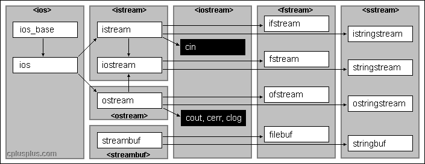

---

- The operator `<<` is one of the general manipulator for streams
- 运算符 `<<` 是流的一般操纵器之一
> `<<`：向左移位符

```cpp
#include <iostream>
int main() {
    std::cout<< "Hello, World!" << std::endl;
    return 0;
}
```

> This one has the signature  
> `ostream& operator<< (ostream& os, const string& str);`  
> It is defined in `<string>`  

---

```cpp
std::cout << "Hello, World!" << std::endl;
```
↓
```cpp
ostream& operator<< (ostream& os, const string& str)
```

> First parameter: Represent the output stream object which exist at the left side of operator `<<`  
> 第一个参数：代表位于操作符 `<<` 左侧的输出流对象  
> second parameter: Represent the const string which exist at the right side of operator `<<`  
> 第二个参数：表示位于操作符 `<<` 右侧的 const 字符串  
> how to use operator `<<`  
> 如何使用操作符 `<<`  
> Return type: Output stream object reference  
> 返回类型：输出流对象引用

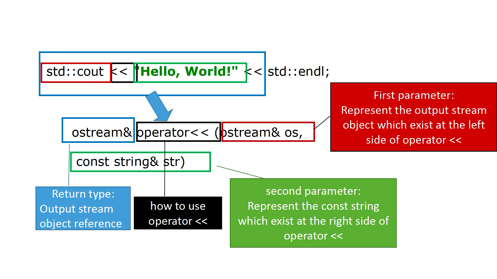

> [!TIP]
> argument: 实参  
> parameter: 形参

> [!NOTE]
> [双目运算符](https://blog.csdn.net/YoyoHuzeyou/article/details/132281592)  
> [三目运算符](https://blog.csdn.net/weixin_44259499/article/details/140224379)&emsp;`condition ? expression1 : expression2;`

---

- The operator `>>` is another one of the general manipulator for streams
- 操作符 `>>` 是流的一般操作符之一

```cpp
double x;
int n;
std::cin >> x >> n;
```
↓
```cpp
istream& operator>> (istream& is, double& val);
istream& operator>> (istream& is, int& val);
```

> Return type: Output stream object reference  
> 返回类型：输出流对象引用  
> how to use operator `>>`  
> 如何使用操作符 `>>`
> second parameter: Represent the const string which exist at the right side of operator `>>`  
> 第二个参数：表示操作符 `>>` 右侧存在的常量字符串

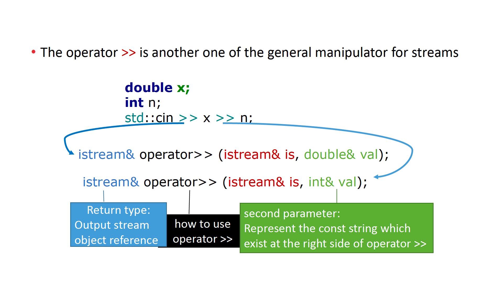

## Operator overloading
- `cin` is the object of `istream` class
- `cin` 是 `istream` 类的对象
- `cout` is the object of `ostream` class
- `cout` 是 `ostream` 类的对象
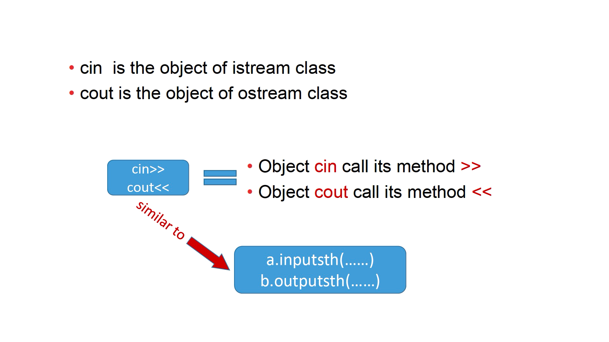

---

- Overload one operator by using following format
- 使用以下格式重载一个运算符
```cpp
operator <op> (……)
```

<table>
    <tr>
        <td>Keyword: operator<br>关键词：operator</td>
        <td>the operator which is overloaded<br>重载的运算符<br>Such as =,>>,+.etc<br>例如 =,>>,+.等</td>
        <td>parameters which will participate in the operation<br>将参与操作的参数</td>
    </tr>
</table>


---

The following operators can be given custom definitions:  
以下运算符可以赋予自定义定义：
- `+ - * / % ? ++ -- += -= *= /= %=`
- `&& || & | ~ ! &= |=`
- `< > << >> >>= <<= == != <= >=`
- `->* -> ( ) [ ]`
- `= new delete`

> [!IMPORTANT]
> Don’t overload `->* -> new delete`

### Operator overloading——`cout` an object directly
```cpp {8-11}
#include <iostream>
using namespace std;
class MyInteger{
public:
    MyInteger(int64_t iP) : i(iP) {}
    int64_t i;
};
ostream& operator<<(ostream& os, const MyInteger &num){
    os << num.i;
    return os;
}
int main () {
    MyInteger mi(6);
    cout << mi;
    return 0;
}
```
> Overload operator `<<` to let it can output object of MyInteger class  
> 重载操作符 `<<` 以使其能够输出 MyInteger 类的对象  
> Overloaded operator `<<` can accept object of MyInteger class as output content  
> 重载的操作符 `<<` 可以接受 MyInteger 类的对象作为输出内容  
> standard operator `<<`  
> 标准操作符 `<<`  
> Overloaded operator `<<` can output object directly  
> 重载操作符 `<<` 可以直接输出对象

> Example: cout object

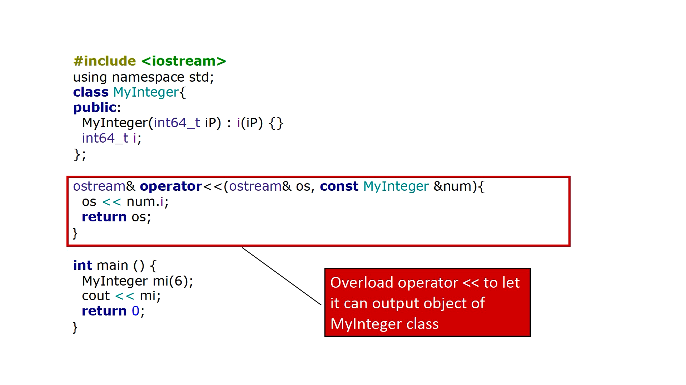

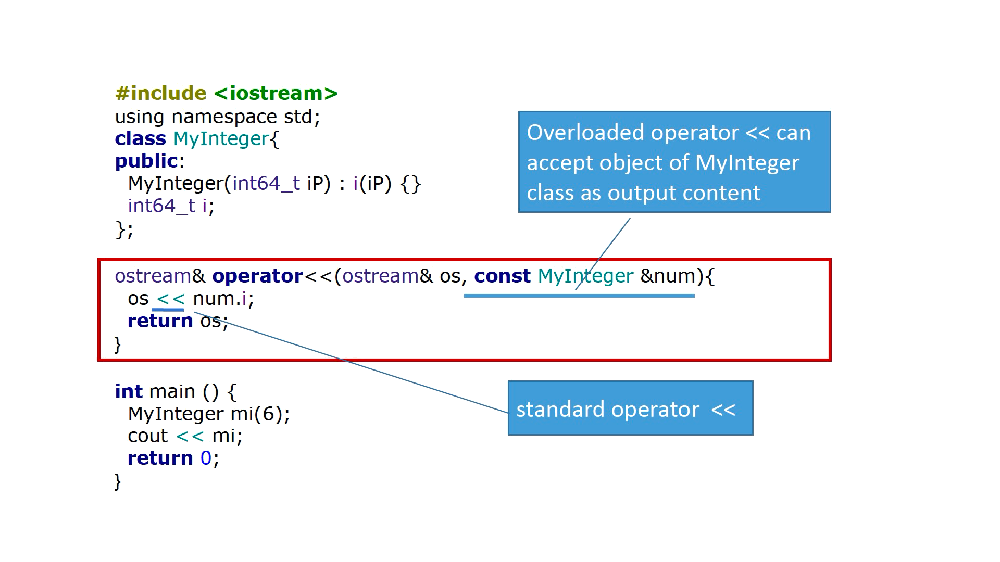

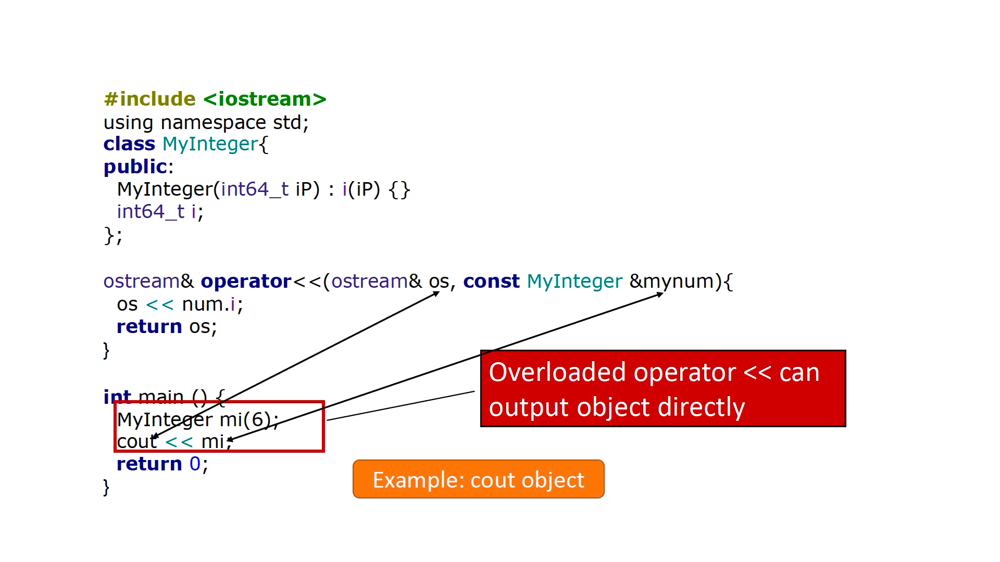

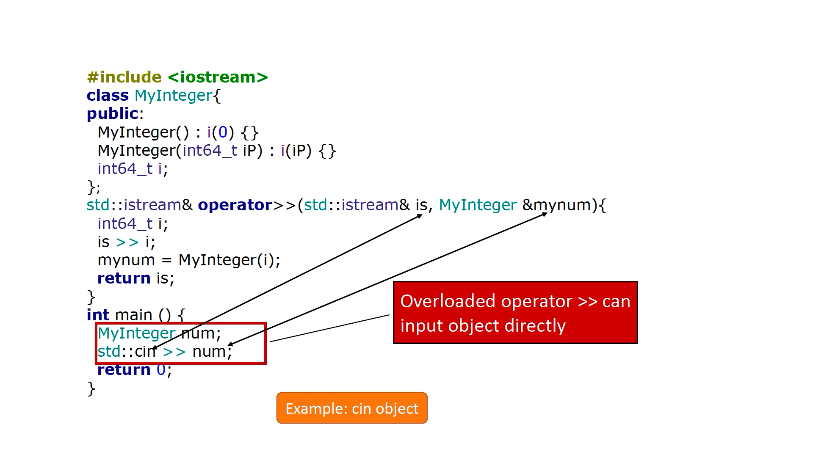

## Back to Stream Part

- `istream` means in→stream
- `ostream` means out→stream
- `iostream` means in and out →stream

## String Stream
- Another stream is the <span style="color: blue">stringstream</span>
- 另一个流是 <span style="color: blue">stringstream</span>
- A <span style="color: blue">stringstream</span> represents a string
- 一个 <span style="color: blue">stringstream</span> 表示一个字符串
- Can be modified by `<<` and `>>`
- 可以通过 `<<` 和 `>>` 进行修改
```cpp
#include <string> // std::string
#include <iostream> // std::cout
#include <sstream> // std::stringstream, std::stringbuf
int main () {
    std::stringstream ss("Example string");
    std::string s = ss.str(); // get current string
    std::cout << s << std::endl; // Example string
    return 0;
}
```
> Example: stringstream1

---

- A <span style="color: blue">stringstream</span> represents a string
- Can be modified by `<<` and `>>`
```cpp
#include <string> // std::string
#include <iostream> // std::cout
#include <sstream> // std::stringstream, std::stringbuf
int main () {
    std::stringstream ss("120*3.5");
    int n;
    char c;
    double x;
    ss >> n >> c >> x;
    std::cout << "(int)n=" << n << std::endl; // 120
    std::cout << "(char)c=" << c << std::endl; // *
    std::cout << "(double)x=" << x << std::endl; // 3.5
    return 0;
}
```
> Example: stringstream2

## File Stream
- Files, too, are represented and manipulated by such streams
- 同样地，文件也通过此类流进行表示和处理
- <span style="color: blue">ofstream</span>: Writable file (output-file-stream)
- <span style="color: blue">ofstream</span>：可写文件（输出文件流）
```cpp
#include <fstream> // std::fstream
int main () {
    std::ofstream myFile("myfile.txt");
//create one myfile.txt file as object myFile
    myFile << "Hello, World!";
    myFile.close();
    return 0;
}
```
> Example: filestream1

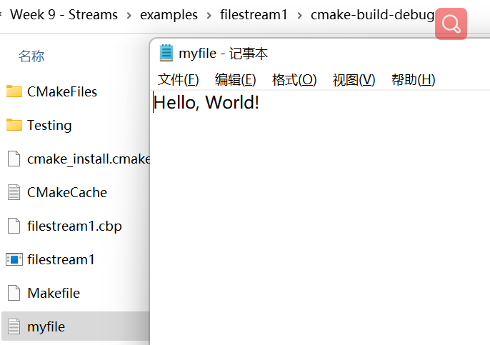

---

- Input file streams (<span style="color: blue">ifstream</span>)
- 输入文件流（<span style="color: blue">ifstream</span>）
- Can read formatted input (int, double) with operator, but other methods possible
- 可以使用操作符读取格式化输入（int，double），但还有其他方法可行

```cpp
#include <iostream>
#include <fstream> // std::fstream
int main () {
    std::ifstream myFile("myfile.txt");
//myfile.txt already existed in folder,it be input to myFile object
    std::string content;
    myFile >> content;
    std::cout << content;
    myFile.close();
    return 0;
}
```
> Example: filestream2

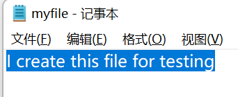
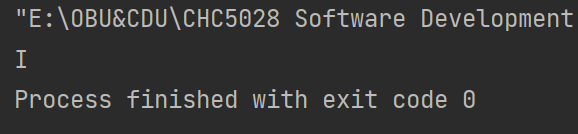

---

- Input file streams (<span style="color: blue">ifstream</span>)

```cpp
#include <iostream>
#include <fstream> // std::fstream
int main () {
    std::ifstream myFile("myfile.txt");
    std::string content;
    getline(myFile, content);
    std::cout << content;
    myFile.close();
    return 0;
}
```
> Example: filestream3

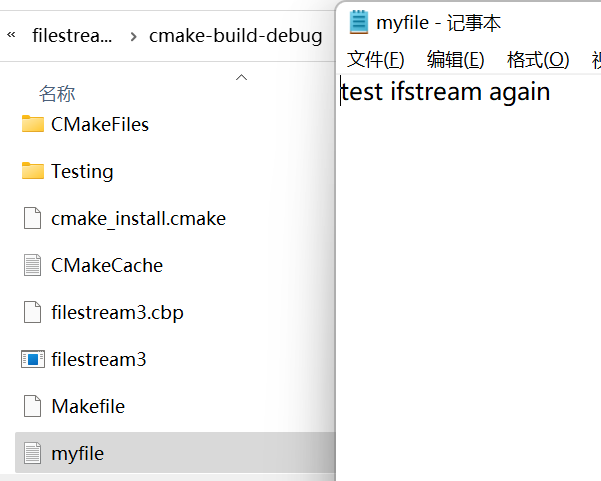
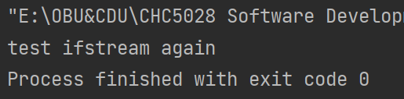

---

- Structured input can go wrong!
- 结构化输入可能会出错！
```cpp
#include <iostream>
#include <fstream> // std::fstream
int main () {
    std::ifstream myFile("myfile.txt");
    double x;
    myFile >> x;
    std::cout << "Read number " << x;
    myFile.close();
    return 0;
}
```
> Example: filestream4

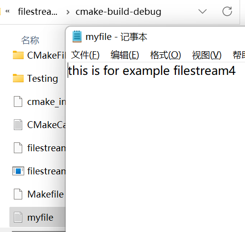
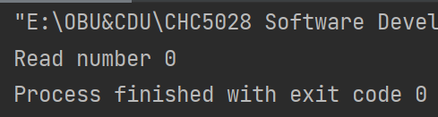

---

- Errors due to content / logical errors
- 由于内容/逻辑错误导致的错误
- Test with `fail()`
- 使用 `fail()` 进行测试
```cpp
#include <iostream>
#include <fstream> // std::fstream
int main () {
    std::ifstream myFile("myfile.txt");
    double x;
    myFile >> x;
    if(myFile.fail()){
        std::cout << "Could not read number" << std::endl;
    }
    std::cout << "Number is " << x;
    myFile.close();
    return 0;
}
```
> Example: filestream5

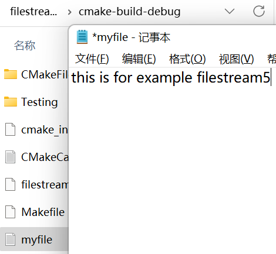
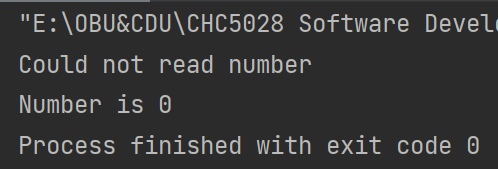

## Stream states
- Streams can be in various states
- 流可以处于各种状态
- Any error flags can be cleared with `clear()`
- 任何错误标志都可以通过 `clear()` 清除

- Since `fail()` depends on application logic, it is good practice to set it in custom operators if an unexpected input occurs
- 由于 `fail()` 依赖于应用程序逻辑，如果出现意外输入，在自定义算子中设置它是良好的实践
- Always watch this flag(s) when reading structured input
- 始终在读取结构化输入时关注此标志（或标志组）

## Stream access
- Many different (unstructured) I/O methods commonly available
- 许多不同的（非结构化）I/O 方法通常可用
- Common for <span style="color: red">output</span> streams:
- 对于<span style="color: red">输出</span>流：
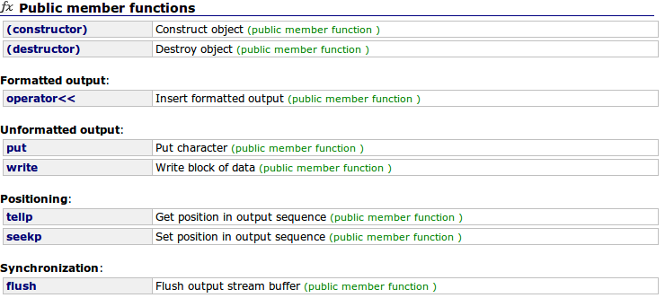

---

Common for <span style="color: red">input</span> streams:  
对于<span style="color: red">输入</span>流：
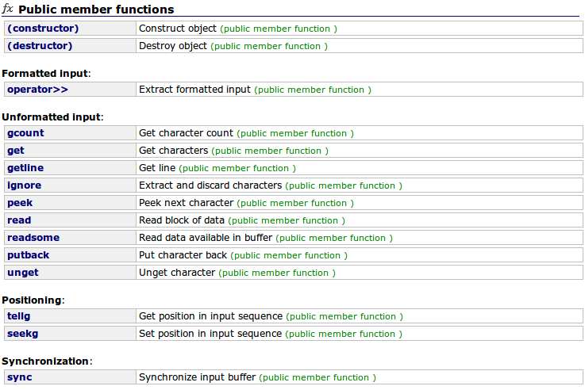

## Summary
- Can encode to overload operator
- Can use
    - `stringstream` object
    - `ofstream` object
    - `ifstream` object
