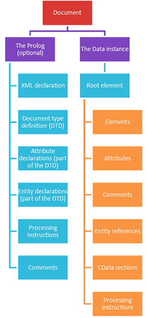

# Overview
> [!TIP]
> Maged Refat Fakirah  
> maged@zy.cdut.edu.cn

> [!WARNING]
> - Coursework1 20% Week7 14th Nov. 2025, Friday at 13:00
> - Coursework2 30% Week12 19th Dec. 2025, Friday at 13:00
> - Exam 50%

## Contact Hours: 36h/week
- 2h lecture
- 1h seminar (Bring laptop)
## Independent Study: 114h
- 42h Directed/Independent Study

## Assessment
- Coursework1 (20%) Due week7 14th Nov. 2025
- Coursework2 (30%) Due week12 19th Dec. 2025
- Written Exam (50%) Multiple Choices week13

## Student Website
1. Basic module documents
2. Lecture Notes
3. Additional reading materials

# Introduction to XML
- Introduction.
- Explain the difference between structured and unstructured data.
- Explain encoding, why it is used.
- Explain what XML is, where it is used and what it is used for.
- Explain how XML is structured.
- Setup a development environment.
- Writing a basic XML script from scratch.

## Data
Data are raw facts that have not been processed to explain their meaning.  
Data -> Knowledge -> Action

### Different types of data
#### Structured data 
- It gives a proper view and understanding of the data. 
- 它提供了一个正确的视图和数据的理解。
- Stored in a tabular format (rows and columns). 
- 以表格形式存储（行和列）。
- It can easily been searched by an algorithm (Where to look and what to compare).
- 它可以很容易地被搜索算法（在哪里看和比较什么）。
#### Unstructured data 
- No pre-defined structure. 
- 没有预定义的结构。
- Data is irregular and ambiguous. 
- 数据是不规则和模糊的。
- Requires more storage. 
- 需要更多的存储空间。
- Provides a lot of information. 
- 提供大量的信息。
- Most of the available data is unstructured.
- 大多数可用的数据都是非结构化的。
#### Semi-structured data 
- It falls between structured and unstructured data. 
- 它介于结构化数据和非结构化数据之间。
- It is a combination of both. 
- 它是两者的结合。
- It has some organizational framework but does not have the complete structure that is required to fit in a relational database. 
- 它具有一些组织框架，但不具有适合关系数据库所需的完整结构。
- Example: XML files.
### Text as a data type
A data type is data with predefined characteristics.  
数据类型是具有预定义特征的数据。  
Text isa data type with minimal rules.  
文本是具有最少规则的数据类型。  
It can therefore be used where a programmer is unsure about the range of values in the data source i.e. receiving data from an external source.  
因此，它可以用于程序员不确定数据源中的值范围的地方，即从外部源接收数据。  
Text may not be the most efficient method of storing data.  
文本可能不是存储数据的最有效方法。  
### Plain text files
Each group of bits in the file represents a character from a known set making them cross platform compatible.  
文件中的每一组位代表一个已知字符集中的字符，使它们跨平台兼容。  
Text files don't support meta data directly, so can't contain formatting.  
文本文件不直接支持元数据，因此不能包含格式。  
Main alternative to plain text files are binary files  
纯文本文件的主要替代方案是二进制文件  
- Plain text files tend to be easier to parse
- 纯文本文件往往更容易解析
- Binary files are generally smaller
- 二进制文件通常较小
### Metadata
Metadata: is data that provides information about other data.  
元数据：提供其他数据信息的数据。  
There are many distinct types of metadata, including:  
元数据有许多不同的类型，包括：  
- Descriptive metadata. 描述性元数据。
- Structural metadata. 结构元数据。
- Administrative metadata. 管理元数据。
- Statistical metadata. 统计元数据。
- Legal metadata. 法律元数据。
#### Metadata Types 
- Descriptive metadata: It is used for discovery and identification. It includes elements such as (Who, What, Where, When). 
- 描述性元数据：用于发现和识别。它包括诸如（Who, What, Where, When）之类的元素。
- Structural metadata: How compound objects are put together (the relationship with other objects). 
- 结构元数据：复合对象如何组合在一起（与其他对象的关系）。
- Administrative metadata: Information to help manage a resource, like resource type, size, and when and how it was created. 
- 管理元数据：帮助管理资源的信息，如资源类型、大小、创建时间和方式。
- Statistical metadata: also called process data, may describe processes that collect, process, or produce statistical data. 
- 统计元数据：也称为过程数据，可以描述收集、处理或产生统计数据的过程。
- Legal metadata: provides information about the creator, copyright holder, and public licensing, if provided.
- 法律元数据：提供有关创建者、版权所有者和公共许可（如果提供的话）的信息。
### ENCODING TEXT
Encoding is the process of turning characters into a coded representation.  
编码是将字符转换为编码表示的过程。  
Some encodings use a single byte (eight bits) some use more.   
有些编码使用单个字节（8位），有些使用更多字节。  
This limits how many characters you can encode.  
这限制了可以编码的字符数量。  
### ASCII
- Abbreviated from **American Standard Code for Information Interchange**. 
- 源自**美国信息交换标准代码**的缩写。
- It maps the decimal numbers from 0-127 to a character. 
- 它将0-127之间的十进制数映射为一个字符。
- is a character encoding standard for electronic communication. 
- 是一种用于电子通信的字符编码标准。
- So it represents text in computers, telecommunications equipment, and other devices.
- 因此，它表示计算机、电信设备和其他设备中的文本。
### Encoding (Unicode)
“Unicode provides a unique number for every character, no matter what the platform, no matter what the program and no matter what the language” 
“Unicode为每个字符提供了一个唯一的数字，无论在什么平台上，无论什么程序，无论什么语言”  
- Text encoding specification
- 文本编码规范
- Designed to represent different languages with the same character set.
- 设计用于用相同的字符集表示不同的语言。
- Groups characters (ie letter, number, punctuation)
- 分组字符（如字母，数字，标点符号）
- Support includes Latin, Greek, Cyrillic, Armenian, Hebrew, Arabic, and Braille
- 支持包括拉丁语，希腊语，西里尔语，亚美尼亚语，希伯来语，阿拉伯语和盲文
- Version 11 supports over 137,000 characters
- 版本11支持超过137,000个字符
    - http://www.unicode.org/versions/Unicode11.0.0
- Code point is often expressed as U+hex number
- 码点通常表示为U+十六进制数
    - i.e. U+0061 represents lowercase 'a'
    - 即U+0061代表小写字母“a”
### Unicode Transformation Format (UTF)
- 2 main encoding methods are UTF-8 and UTF-16
- 2种主要的编码方式是UTF-8和UTF-16
- In UTF-8, Unicode characters are encoded into bytes.
- 在UTF-8中，Unicode字符被编码成字节。
- UTF-8 uses a single byte to represent most (simple) characters, and can use up to 4
- UTF-8使用单个字节来表示大多数（简单）字符，最多可以使用4个字节
- UTF-16 uses 2 or more
- UTF-16使用2或更多
- UTF-8 gives smaller files, UTF-16 tends to be easier to decode (as most characters use 2 bytes).
- UTF-8提供更小的文件，UTF-16往往更容易解码（因为大多数字符使用2字节）。
### CSV / TSV files
- CSV = COMMA separated values. 
- CSV = 逗号分隔的值。
- TSV = TAB separated values. 
- TSV = TAB分隔值。
- Stores TABULAR data in plain text (usually with the file extension .csv or .tsv) 
- 以纯文本形式存储TABULAR数据（通常文件扩展名为.csv或.tsv）
- Data is stored in a plain text format that follows a structure. 
- 数据以遵循结构的纯文本格式存储。
- Sometimes the first row contains a list of the field names (referred to as ‘headers’). 
- 有时第一行包含字段名称列表（称为“标题”）。
- DELIMITED text files. 
- 带分隔符的文本文件。
- Encoded in same way as a text file.
- 以与文本文件相同的方式编码。
### What is XML
Extensible Markup Language (XML):  
扩展标记语言（XML）： 
- Is a simple and a very flexible text format derived from SGML. 
- 是从SGML派生出来的一种简单而又非常灵活的文本格式。
- SGML (Standard Generalized Generic Markup Language): 
- 标准通用标记语言（SGML）：
    the international standard for defining markup to describe the structure of different type of electronic documents.  
    定义标记以描述不同类型电子文档结构的国际标准。  
- XML is originally designed to meet the challenges of large-scale electronic publishing. 
- XML最初是为了应对大规模电子出版的挑战而设计的。
- XML is also playing an increasingly important role in the storage and exchange of a wide variety of data on the Web and elsewhere.
- XML在Web和其他地方的各种数据的存储和交换方面也发挥着越来越重要的作用。
### XML Versions
- Extensible Markup Language (XML) 1.0 (Fifth Edition) W3C Recommendation 26 November 2008
- 可扩展标记语言（XML）1.0（第五版）W3C推荐标准2008年11月26日
- Extensible Markup Language (XML) 1.1 (Second Edition)W3C Recommendation 16 August 2006, edited in place 29 September 2006
- 可扩展标记语言（XML）1.1（第二版）2006年8月16日W3C推荐，2006年9月29日编辑完成
The World Wide Web Consortium (W3C) is an international community that develops open standards to ensure the long-term growth of the Web.  
万维网联盟（W3C）是一个开发开放标准以确保Web长期发展的国际社区。
### Applications
Intellij IDEA
### Where can we use XML?
- Storing data 存储数据
- Describing data 描述数据
- Representing data 表示数据
- Transforming data 转换数据
- Transferring data 传输数据
- Displaying data 显示数据
### The Structure of an XML document

