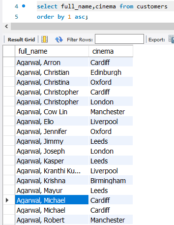
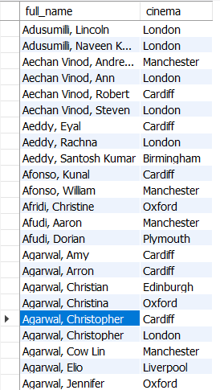
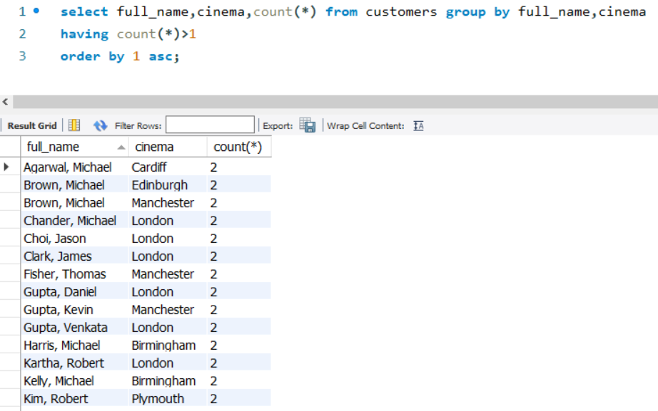
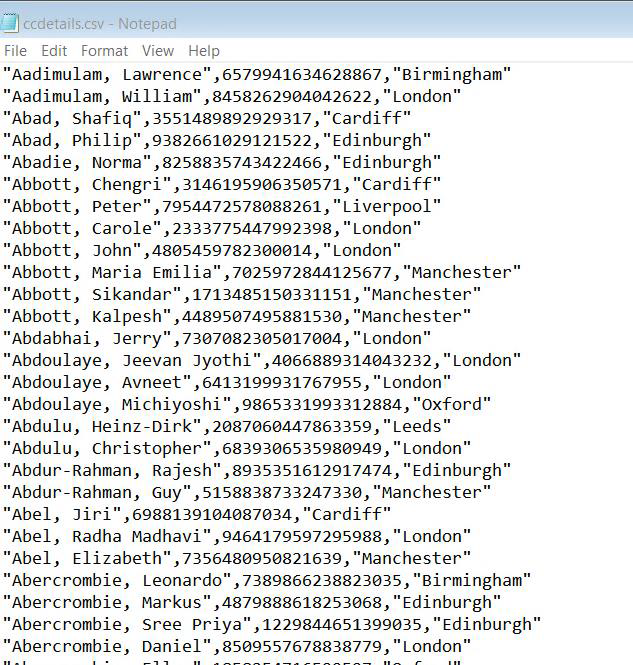
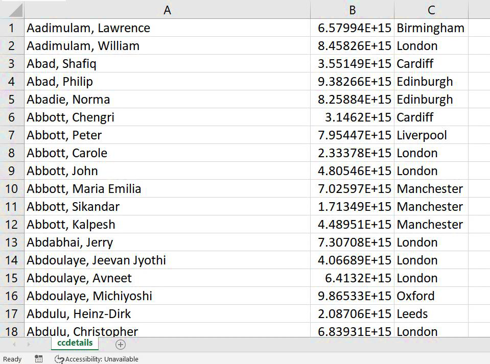
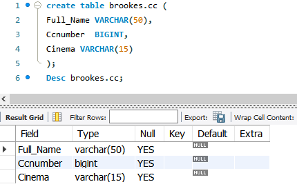
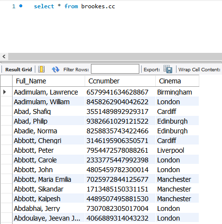
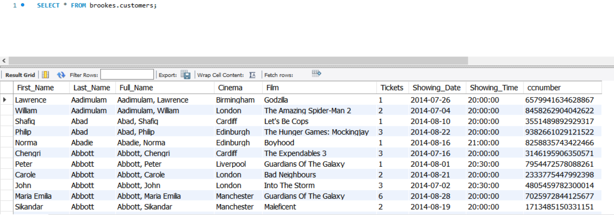
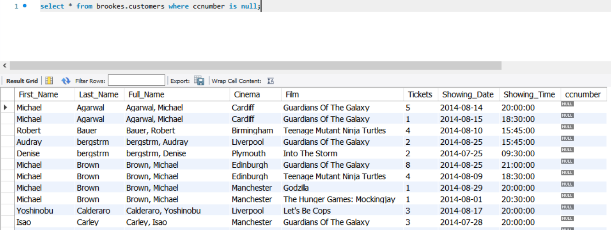
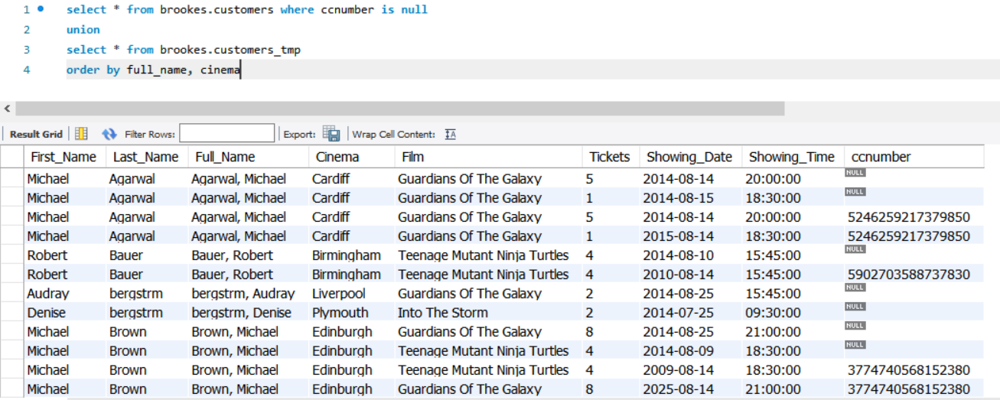

# New Model
## Table of content
- Review Week9 Tutorial.
- Having Clause.
- Model extension.
- Normal forms.

## Current Structure

> 上图为 Logical Model  
> 在其基础上增加数据类型和数据大小即为 Physical Model

---


## Querying Data
```sql
select count(*) from customers;
select count(distinct full_name) from customers;
select count(distinct full_name, cinema) from customers;
-- Same full_name, different cinema still be considered as diffrent record
```

---

```sql
select full_name, cinema
from customers
order by 1 asc;
```


## Querying Data (Distinct)
```sql
select distinct full_name, cinema 
from customers 
order by full_name asc;
```


## Querying Data (HAVING Clause)
The MySQL HAVING clause is used in combination with the GROUP BY clause to restrict the groups of returned rows to only those who's the condition is TRUE.
```sql
select full_name,cinema,count(*) from customers
group by full_name,cinema
having count(*)>1
order by 1 asc;
```

> [!NOTE]
> `where` 和 `group by` 一起时可能无法正常返回，需使用 `having`



## Getting Additional Tables
- `ccdetails.CSV` (Credit Card Details)



### Create a New Table in Brookes
```sql
create table cc (
Full_Name VARCHAR(50),
Ccnumber BIGINT,
Cinema VARCHAR(15));
```


### Load The Data
```sql
LOAD DATA INFILE 'C:/ProgramData/MySQL/MySQL Server 8.0/Uploads/ccdetails.csv'
INTO TABLE Cc
CHARACTER SET latin1
FIELDS TERMINATED BY ','
ENCLOSED BY '"'
LINES TERMINATED BY '\n'
```


### Update An Existing Table
- **Add a new column `ccnumber` to customers table.**
```sql
alter table brookes.customers add column ccnumber bigint;
```
- **Fill the new column with the desirable values.**
```sql
update customers as a set a.ccnumber =
(select b.ccnumber from cc as b
where
a.full_name = b.full_name and a.cinema = b.cinema)
```

> [!TIP]
> `update` 操作非常耗费时间，可能会导致MySQLWorkbench连接超时，需要更改如下设置：
> 

#### Alternative Method
- **Erase the old values**
```sql
Update customers set ccnumber = null;
```
- **Fill the new column with the desirable values.**
```sql
update customers as a, cc as b set a.ccnumber = b.ccnumber 
where 
a.full_name = b.full_name and a.cinema = b.cinema;
```

> 这种方法理论上比上面那种快，因为它没有 `select`

##### Output


### Find the (new) problems
```sql
select * from customers
where ccnumber is null;
```


### Question
<center>How to get the full amount of rows and avoid getting the Null value?</center>

#### Solution (ask for more data)
- Create a new table customers_tmp (just like customers).
```sql
create table customers_tmp as select * from customers;
``` 
(Copies the table data as well).

- Revised code to copy the structure only:
```sql
create table customers_tmp as select * from customers where 1=2;
```
OR
```sql
create table customers_tmp as select * from customers limit 0;
```

#### Solution (load the new data)
- Load in the new data file `customer_cc_update.CSV` to `customers_tmp` **(BEWARE no headings)**.
```sql
LOAD DATA INFILE 'C:/ProgramData/MySQL/MySQL Server 8.0/Uploads/customer_cc_update.csv'
INTO TABLE brookes.customers_tmp
CHARACTER SET latin1
FIELDS TERMINATED BY ','
ENCLOSED BY '"'
LINES TERMINATED BY '\n'
```

### Showing All Data
```sql
select * from customers where ccnumber is null union
select * from customers_tmp order by full_name, cinema
```


### Replace the rows in the table
- ***Delete the null values from `brookes.customers`***
```sql
delete from customers where ccnumber is null;
```
- ***Replacing the data in `brookes.customers`***
```sql
insert into customers (select * from customers_tmp);
```

#### Check!
```sql
select count(distinct full_name, cinema) from customers;
select count(distinct ccnumber) from customers;
```

## Indexing
- Indexes are used to retrieve data from the database more fast.


### Index Example
```sql
select cinema,count(*) from customers group by cinema;
```
- **Creating an index:**
```sql
CREATE INDEX index_name ON table_name (column_name1, column_name2,..);
create index cust_cinema on customers (cinema);
```
- **Run the selection statement again.**
    - <span style="color: blue">Have you noticed the difference?</span>

### Managing indexes
- **Showing index for a table:**
```sql
show index from table_name;
show index from customers;
```
- **Deleting an index**
```sql
DROP index index_name on table_name;
drop index cust_cinema on customers;
```

## Exporting Data
```sql
LOAD DATA INFILE 'C:/ProgramData/MySQL/MySQL Server 8.0/Uploads/filename.csv'
INTO TABLE table_name
CHARACTER SET latin1
FIELDS TERMINATED BY ','
ENCLOSED BY '"'
LINES TERMINATED BY '\n’
IGNORE n LINES;
```
```sql
SELECT *INTO OUTFILE 'c:/ProgramData/MySQL/MySQL Server 8.0/Uploads/filename.csv’
FIELDS TERMINATED BY ',’
OPTIONALLY ENCLOSED BY '“’
LINES TERMINATED BY '\n’
FROM tablename;
```

### Exporting Data (example)
```sql
SELECT * INTO OUTFILE 'c:/ProgramData/MySQL/MySQL Server 8.0/Uploads/DB.csv’
FIELDS TERMINATED BY ',’
OPTIONALLY ENCLOSED BY '“’
LINES TERMINATED BY '\n’
FROM customers;
```

## Normal Forms
- **Denormalized**
    - Impractical.
    - Tough to insert, update and delete.
- **1NF**
    - Every column is unique and not empty.
    - No duplicated rows or column.
    - No multi-value fields (atomic values).
- **2NF**
    - Same as 1NF.
    - No data redundancy.
    - All related items are stored together.

## Denormalized Data Table

| Name     | Address      | Subject          | Age |
| -------- | ------------ | ---------------- | --- |
| Mark     | Crewe        | Physics          | 16  |
| Caroline | Bolton       | Biology, Maths   | 16  |
| John     | Norwich      | Maths            | 17  |
| Bob      | Huddersfield | Physics, Biology | 15  |

**Insert, update, and delete problem**

### First Normal Form (1NF)

| StdID | Name     | Address      | Age | Subject |
| ----- | -------- | ------------ | --- | ------- |
| 123   | Mark     | Crewe        | 16  | Physics |
| 124   | Caroline | Bolton       | 16  | Biology |
| 132   | John     | Norwich      | 17  | Maths   |
| 165   | Bob      | Huddersfield | 15  | Physics |
| 124   | Caroline | Bolton       | 16  | Maths   |
| 165   | Bob      | Huddersfield | 15  | Biology |

**No duplicated data or multi values per row and field**

### Second Normal Form (2NF)

<div style="display: flex; gap: 20px; flex-wrap: wrap;">
  <!-- Students表格 -->
  <div>
    <h2 style="text-align: center; margin-bottom: 10px;">Students</h2>
    <table border="1" cellpadding="8" cellspacing="0">
      <tr>
        <th>StdID</th>
        <th>Name</th>
        <th>Address</th>
        <th>Age</th>
      </tr>
      <tr>
        <td>123</td>
        <td>Mark</td>
        <td>Crewe</td>
        <td>16</td>
      </tr>
      <tr>
        <td>124</td>
        <td>Caroline</td>
        <td>Bolton</td>
        <td>16</td>
      </tr>
      <tr>
        <td>132</td>
        <td>John</td>
        <td>Norwich</td>
        <td>17</td>
      </tr>
      <tr>
        <td>165</td>
        <td>Bob</td>
        <td>Huddersfield</td>
        <td>15</td>
      </tr>
    </table>
  </div>

  <!-- Subjects表格 -->
  <div>
    <h2 style="text-align: center; margin-bottom: 10px;">Subjects</h2>
    <table border="1" cellpadding="8" cellspacing="0">
      <tr>
        <th>SID</th>
        <th>Subject</th>
      </tr>
      <tr>
        <td>1</td>
        <td>Physics</td>
      </tr>
      <tr>
        <td>2</td>
        <td>Biology</td>
      </tr>
      <tr>
        <td>3</td>
        <td>Maths</td>
      </tr>
    </table>
  </div>

  <!-- Assign表格 -->
  <div>
    <h2 style="text-align: center; margin-bottom: 10px;">Assign</h2>
    <table border="1" cellpadding="8" cellspacing="0">
      <tr>
        <th>StdID</th>
        <th>SID</th>
      </tr>
      <tr>
        <td>123</td>
        <td>1</td>
      </tr>
      <tr>
        <td>124</td>
        <td>2</td>
      </tr>
      <tr>
        <td>132</td>
        <td>3</td>
      </tr>
      <tr>
        <td>165</td>
        <td>1</td>
      </tr>
      <tr>
        <td>124</td>
        <td>3</td>
      </tr>
      <tr>
        <td>165</td>
        <td>2</td>
      </tr>
    </table>
  </div>
</div>

**Related attributes separated to appropriate tables**
