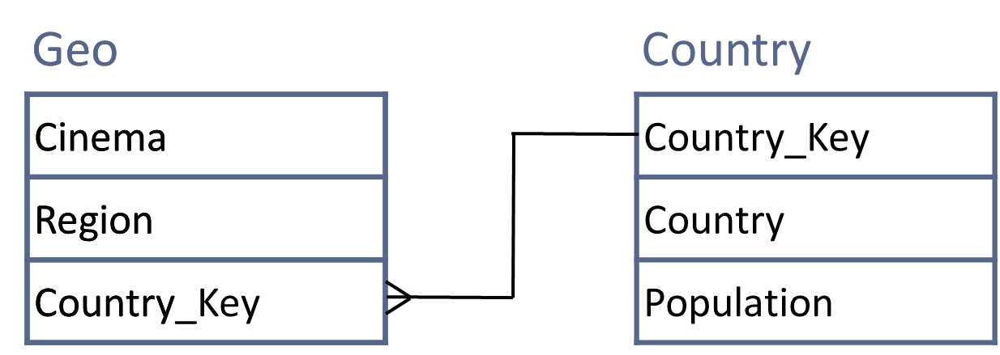

# New Model
Exercise 1 – Create a country CSV file including the country key and population, depending on an international standard, then create a separate country table and update the schema as follows:
  
Exercise 2 – Create a new schema and reload everything we’ve done so far. This will help you to understand the overall SQL material.

```sql
CREATE TABLE brookes.country (
    Country_Key VARCHAR(20) PRIMARY KEY,  -- 国家唯一编码（主表主键）
    Country VARCHAR(50) NOT NULL,         -- 国家名称
    Population BIGINT NOT NULL            -- 人口数量（来自之前的CSV数据）
);
SET GLOBAL local_infile = 1;
LOAD DATA local INFILE '/Users/anka/Documents/成都理工大学/2025-2026/Databases/Week10/country_data.csv'
INTO TABLE brookes.country
CHARACTER SET latin1
FIELDS TERMINATED BY ','
ENCLOSED BY '"'
LINES TERMINATED BY '\n'
IGNORE 1 LINES;

ALTER TABLE geo
ADD COLUMN Country_Key VARCHAR(20);
desc geo;
desc country;

-- 由于使用csv导入时，值的末尾可能有多余的不可见字符，导致 UPDATE 的条件匹配不上，需要删除多余字符
-- set sql_safe_updates=0;
update geo set country ='England' where country like 'England%' and geo.id>0;
update geo set country ='Wales' where country like 'Wales%' and geo.id>0;
update geo set country ='Scotland' where country like 'Scotland%' and geo.id>0;

UPDATE geo g, country c
set g.Country_Key = c.Country_Key  -- 名称完全匹配（关键条件）
where g.country = c.Country  -- 把主表的编码同步到从表
-- where g.Country like concat(c.country,'%')  -- 可以部分匹配
and g.id > 0;

-- 用JOIN匹配名称，更新geo表的Country_Key
-- UPDATE geo g
-- INNER JOIN country c 
-- ON g.country = c.Country  -- 名称完全匹配（关键条件）
-- SET g.Country_Key = c.Country_Key  -- 把主表的编码同步到从表
-- WHERE g.id > 0;

-- 验证填充结果（应无NULL，除非geo表有country表不存在的国家名称）
SELECT DISTINCT country, Country_Key FROM geo;
```
