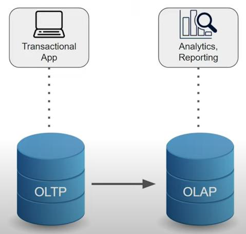
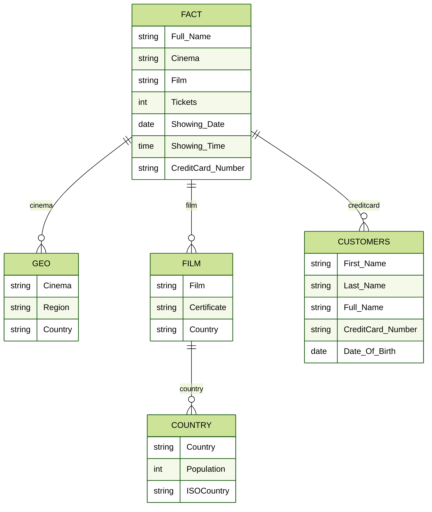
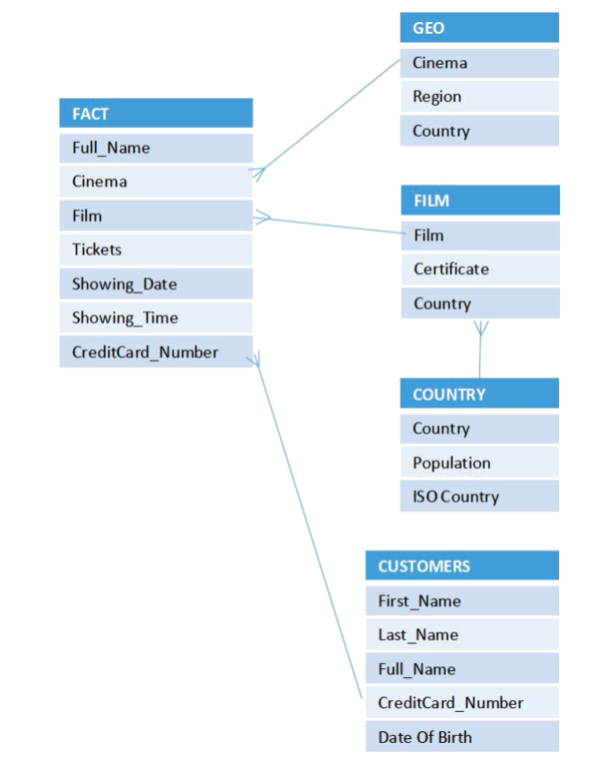
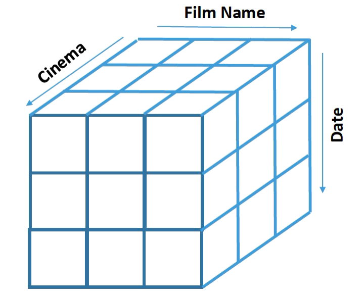

# Analytical Schemas
## Table of content
- Review Week10 Tutorial.
- OLTP Transactional Schemas.
- OLAP Analytical Schemas.

## Online Transaction Processing (OLTP)  Vs Online Analytical Processing (OLAP)

## OLTP vs OLAP

<table>
    <tr>
        <td>- OLTP (Online Transactional Processing Schemas). - High volume of transactions. - Normalized data. - Many tables.</td>
        <td>- OLAP (Online Analytical Processing Schemas). - High volume of data. - Denormalized data. - Fewer tables.</td>
    </tr>
</table>

## Online Analytical Processing Schemas
- ROLAP
- MOLAP
- HOLAP

### ROLAP
- Relational online analytical processing.
- used for handling large amount of data.
- Can be stored efficiently.
- Performance of ROLAP can be slow.

### MOLAP
- Multidimensional online analytical processing.
- Data is arranged in the form of data cubes.
- Designed to be faster than ROLAP.
- Used for complex calculations.
- Limited size and less flexibility.
- Excel pivot tables as an example.

### HOLAP
- Hybrid Online Analytical Processing.
- Uses ROLAP for large, complex, uncommon analytics.
- Uses MOLAP for small, fast common analytics and complex mathematical calculations
