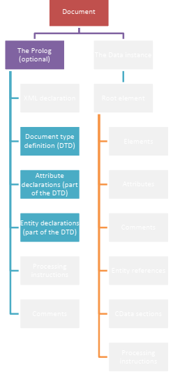
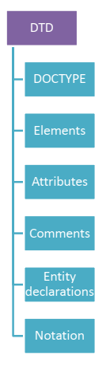
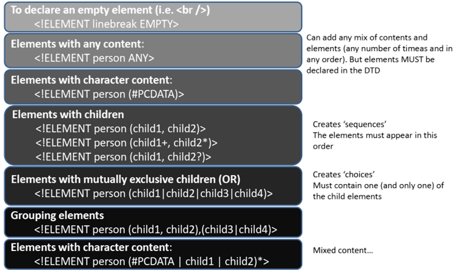
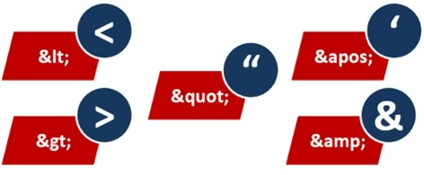
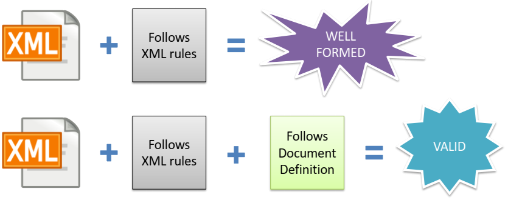

## Table of content
- Review Week 1 Tutorial.
- Review XML structure.
- Review XML rules.
- Explain what an XML schema is.
- Explain what a document definition is.
- Create a DTD document definition.
- Understand the main elements of DTD.
## XML Schema?
- The schema describes the structure. 
    - What data is allowed.
    - What data is required.
    - How data is organized.
- Example: maged#zy.cdut
## Well Formed and Valid XML
XML document is well-formed:
- structurally and syntactically correct.
- Adheres to the general XML rules.
- Not necessarily valid.
XML document is valid:
- Satisfies the schema document.
- Validity can vary between schema documents.
- XML documents that fail validation are considered invalid.
## XML Schema Types
The XML schema has two types:
- DTD: Document Type Definition.
- XSD: XML Schema Definition.
## DTDs

## Document Type Definition (DTD)
DTD is a structure (standard)
- A DTD is a set of markup declarations that define the document structure.
- Uses a list of validated elements and attributes.
- What elements can/must appear.
- What order they must be in.
## DTD basics
DTD determines:
- What the root element is.
- Number of instances of elements.
DTD does not determine:
- Data types.
- Meaning of an element.
## Is DTD also an XML file?
No, DTDs are NOT xml
## DTD location
Internal: declared inside the XML document.
- Appears after the XML declaration, and before the document body.
External: declared outside the XML document (as an external reference).
## DOCTYPE
- internal
```xml
<!DOCTYPE Name [
    Document definition
]>
```
- external
```xml
<!DOCTYPE events SYSTEM "xxx.dtd">
```
## The contents of a DTD

DTD Elements:
- Elements are the allowed/required tags.
- Created with an Element declaration.
- ElementName = XML Tag.
- Type = Tag Type
### Internal DTD Example
```xml
<?xml version="1.0" standalone="yes"?>
<!DOCTYPE Foods [
    <!ELEMENT Foods (Food)*>
    <!ELEMENT Food (Fruits,Vegetables,Meat,Fish)>
    <!-- 上面的元素定义了食品的结构（Food内的标签及其顺序，即Fruits,Vegetables,Meat,Fish） -->
    <!ELEMENT Fruits (#PCDATA)>
    <!ELEMENT Vegetables (#PCDATA)>
    <!ELEMENT Meat (#PCDATA)>
    <!ELEMENT Fish (#PCDATA)>
]>
<!-- 在浏览器中查看XML文件时，DOCTYPE部分并不会显示 -->
<Foods>
    <Food>
        <Fruits>Apple</Fruits>
        <Vegetables>Carrot</Vegetables>
        <Meat>Lamb</Meat>
        <Fish>Salmon</Fish>
    </Food>
    <Food>
        <Fruits>Orange</Fruits>
        <Vegetables>Cucumber</Vegetables>
        <Meat>Mutton</Meat>
        <Fish>Cod</Fish>
    </Food>
</Foods>
```
### External DTD Example
Foods.xml
```xml
<?xml version="1.0" standalone="no"?>
<!DOCTYPE Foods SYSTEM “FoodsDTD.dtd">
<Foods>
    <Food>
        <Fruits>Apple</Fruits>
        <Vegetables>Carrot</Vegetables>
        <Meat>Lamb</Meat>
        <Fish>Salmon</Fish>
    </Food>
    <Food>
        <Fruits>Orange</Fruits>
        <Vegetables>Cucumber</Vegetables>
        <Meat>Mutton</Meat>
        <Fish>Cod</Fish>
    </Food>
</Foods>
```
FoodsDTD.dtd
```xml
<!ELEMENT Foods (Food)*>
<!ELEMENT Food (Fruits,Vegetables,Meat,Fish)>
<!ELEMENT Fruits (#PCDATA)>
<!ELEMENT Vegetables (#PCDATA)>
<!ELEMENT Meat (#PCDATA)>
<!ELEMENT Fish (#PCDATA)>
```
- Private external DTD: `<!DOCTYPE name SYSTEM “pathToFile”>`
- External DTD on a website: `<!DOCTYPE name SYSTEM “URL”>`
## Element type declarations

Mixed content需要把#PCDATA写在最前面  
- (#PCDATA): The content can be only character data.
    - e.g., 
        - DTD: `<!ELEMENT first (#PCDATA)>`
        - XML: `<first> John </first>`
- EMPTY: The element is declared to be an empty one - no content allowed.
    - e.g., 
        - DTD: `<!ELEMENT empty_element EMPTY>`
        - XML: `<empty_element></empty_element>` or `<empty_element />`
- ANY: The element can have any element or character data.
    - e.g.,
        - DTD: `<!ELEMENT any_element ANY>`
        - XML:
```xml
<any_element>
    This is a line of characters
    <other_element> ... </other_element>
</any_element>
```
- Child elements: The content can only contain the child elements (no character data). The sequence, alternative, and cardinality can be expressed using commas(,) Ors (|).
    - e.g. DTD: `<!ELEMENT a (x,y,z)>`
        Element a must have an element x, followed by y, followed by z.
    - e.g. DTD: `<!ELEMENT b (x|y|z)>`
        Element b must have an element x, or y, or z
- Mixed content
    - Must use OR | to separate elements
    - \#PCDATA must come first
    - \* Must appear at the end if there are child elements
    - e.g., DTD: `<!ELEMENT mix_element (#PCDATA | first | last)*>`
```xml
<mix_element>
    My first name is
    <first>John</first>
    and my last name is
    <last>smith </last>
</mix_element>
```
## DTD Element Options (modifiers)
- `<!ELEMENT Foods (Food)*>`
    - \*: zero or more times.
    - +: one or more times.
    - ?: zero or one time.
    - <u>No symbol means the element must appear only once.</u>
    - e.g. DTD: `<!ELEMENT c (x*, y+, z?) >`
## DTD Element Options
Elements with children
```xml
<!ELEMENT person (child1,child2)>
<!ELEMENT person (child1+,child2)>
<!ELEMENT person (child1*,child2)>
<!ELEMENT person (child1?,child2)>
<!ELEMENT person (child1|(child2,child3))*>
```
## DTD Attributes
`<!ATTLIST ElementName AttributeName AttType DefaultValue>`
- Some common attribute data types:
    - CDATA: Character data (text values).
    - ID: unique key.
    - Enumerator: list of values (value1 | value2 | value3).
        e.g. DTD: `<!ATTLIST event cancelled (y|n) #REQUIRED>`
- Some common default values:
    - \#REQUIRED: `<!ATTLIST Food orderNo CDATA #REQUIRED>`
    - \#IMPLIED: the attribute is optional
    - “default character data” `<!ATTLIST person sex CDATA “male">`
    - \#FIXED: `<!ATTLIST Form language CDATA #FIXED “EN”>`
### DTD Attributes Example
```xml
<?xml version="1.0" standalone=“yes"?>
<!DOCTYPE Foods [
    <!ELEMENT Foods (Food)*>
    <!ELEMENT Food (Fruits,Vegetables,Meat,Fish)>
    <!ATTLIST Food orderNo CDATA "1">
    <!ELEMENT Fruits (#PCDATA)>
    <!ELEMENT Vegetables (#PCDATA)>
    <!ELEMENT Meat (#PCDATA)>
    <!ELEMENT Fish (#PCDATA)>
]>
<Foods>
    <Food orderNo ="1">
        <Fruits>Apple</Fruits>
        <Vegetables>Carrot</Vegetables>
        <Meat>Lamb</Meat>
        <Fish>Salmon</Fish>
    </Food>
    <Food orderNo ="2">
        <Fruits>Orange</Fruits>
        <Vegetables>Cucumber</Vegetables>
        <Meat>Mutton</Meat>
        <Fish>Cod</Fish>
    </Food>
</Foods>
```
## Structure: CDATA
CDATA / PCDATA sections can be declared in both DTD and XML files
- Attributes can be defined in DTD using CDATA
- Elements can be defined in DTD using \#PCDATA
- You can also declare a CDATA section directly in an XML file with the following processing instruction : `<![CDATA[<tags>content</tags>]]>`
## Entity declarations
To declare in DTD: `<!ENTITY entityName "Long string or other character">`  
To display: `&entityName;`  
Predefined entities:


---
```xml
<?xml version="1.0" standalone="yes"?>
<!DOCTYPE Universities [
    <!ELEMENT Universities (University)*>
    <!ELEMENT University (#PCDATA)>
    <!ENTITY CDUT "Chengdu University of Technology">
    <!ENTITY OBU "Oxford Brookes University">
]>
<Universities>
    <University>&CDUT;</University>
    <University>&OBU;</University>
</Universities>
```
Result:
```xml
<Universities>
    <University>Chengdu University of Technology </University>
    <University>Oxford Brookes University </University>
</Universities>
```
## Comments
```html
<!-- comments are written in the same way as XML and HTML comments-->
```
## Issues with Document definitions
- If your document contains a link to a definition and the definition changes your document may break.
- If you link to a document definition and the link breaks your XML will not work.
## Remember

## XML Validation
Check the validity of your XML 
- Is it well formed?
- Is it valid?
## Useful Information
Once NP++ and XML tools are installed, go to: Plugins > XML Tools > Options  
Set "Prohibit DTD" to FALSE. This allows the use of internal DTDs in your XML files. By default, these are disabled.
