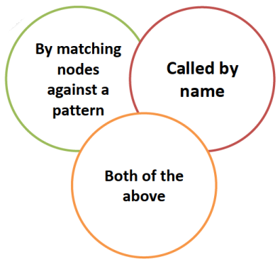
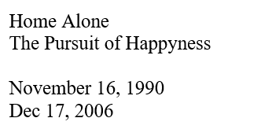
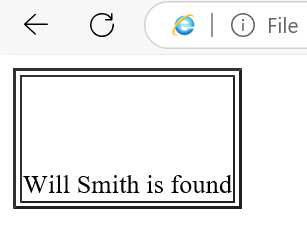
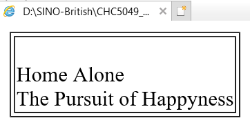

# XSLT
## Table of content
- Review Week3 Tutorial.
- Introduce XSLT
- Look at how XSLT is processed
- Look at some common XSLT elements.
    - Templates.
    - Functions.
    - Expressions.

## XML TRANSFORMS
- XSL (eXtensible Stylesheet Language) is a styling language for XML.
- XSLT stands for XSL Transformations.
- XSL / XSLT allows us to convert one XML structured document into another (data formatting).
- XSL / XSLT are XML based languages.
- XSLT is the most common part and it is supported in most web browsers.

## What is XSL(T)?


## XSLT Basics
- XSLT processes nodes of XML document.
    - Uses pattern matching to identify the nodes.
    - Performs transformation on those nodes.
    - Creates a new document.

## Types of XSLT nodes


## Creating XSLT Stylesheets


## XSLT templates


---

- Describe the output based on the matched pattern.
- Templates can be invoked:

Template for creating an output  
Can be called by name or by matching nodes against a pattern  
It is a declaration, so appears asa child mode of the stylesheet element  
```xml
<xsl:template match="nodePattern">
<xsl:template name="templateName">
```

### Comparison
By matching patterns:
```xml
<xsl:apply-templates select='Movies/Movie/Name’/>
...
<xsl:template match='Movies/Movie/Name'>
```
By names:
```xml
<xsl:call-template name='temp1’/>
...
<xsl:template name='temp1'>
```

> [!IMPORTANT]
> ⚠️请注意 apply-template<span style="color: red">s</span> 和 call-template

### XSLT apply-templates element
```xml
<xsl:apply-templates select='nodePattern'>
```
With no attributes the apply templates element means "select all of the children of the current node in the source tree, find the matching template rule for each node and evaluate it"

#### XSLT apply-templates Example



### XSLT call-template element
```xml
<xsl:call-template name='templateName'>
```


## Warmer Part 1
- Discuss which type of calling templates would work best in different scenarios?

## XSLT Functions
- Template construct (What to do)
    - `xsl: value-of`
    - `xsl: for-each`
    - `xsl: if`
    - `xsl: choose`

### `value-of` Function
`<xsl:value-of>` Displays the content of an element.


Note that if multiple values are returned, value of only returns the first node value

---

- Issue example:


### `for-each` Function
`<xsl:for-each select="nodePattern"/>` selects every XML element of a specified node-set:


### `if` Function
- `<xsl:if test="condition">`
- Adds additional conditions.
- Useful inside the `<xsl:for-each>`
- (Example 1)


---

- (Example 2)



### `choose` Function
```xml
<xsl:choose>
    <xsl:when test="condition"> <xsl:when>
    <xsl:otherwise> </xsl:otherwise>
</xsl:choose>
```


## XSLT Patterns
- `/` Document Root
- `..` Parent node
- `.` Current node
- `//` Child node

### XSLT Patterns Examples
- `..` Parent node (Example 1)


---

- `..` Parent node (Example 2)


---

- `.` current node


## XSLT Expressions
- `=` equal
- `!=` not equal
- `&lt;` less than
- `&gt;` greater than
- `and`
- `or`

### XSLT Expressions Examples
- `or` expression



## XSLT Math Functions
- `ceiling()` round decimal up to the nearest integer.
- `floor()` round decimal down to the nearest integer.
- `count()` determine the quantity in a set.
- `sum()` add numbers together.

### XSLT Math Functions Examples
- `Count()`


---

- `sum()`


## XSLT Attributes
When you want to select an attribute in an XPath expression, you use the `@` symbol.


## XSLT Sorting (ascending | descending)
The XSL "sort" element goes inside an element at the beginning of the sequence constructor to determine the order that the elements will be output in.


