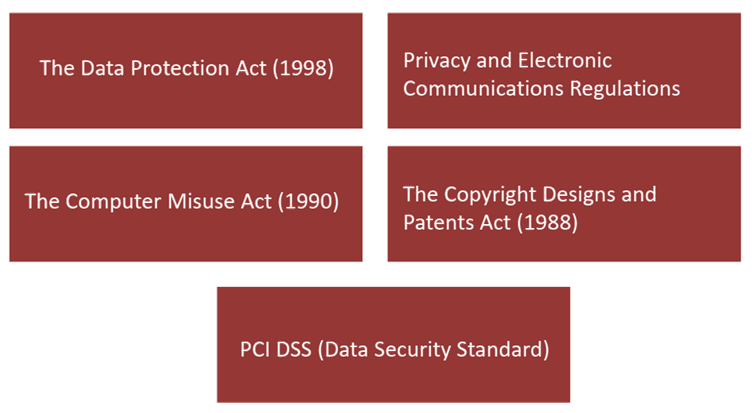
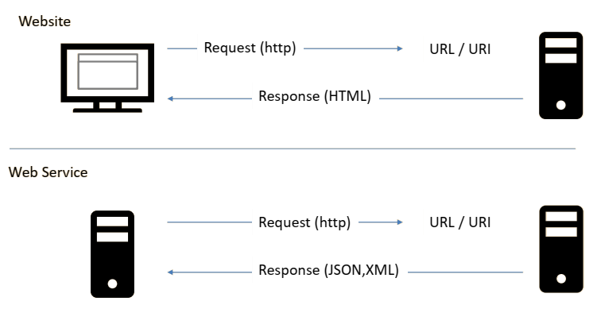
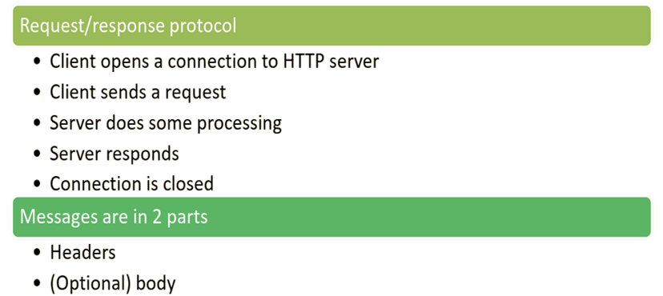
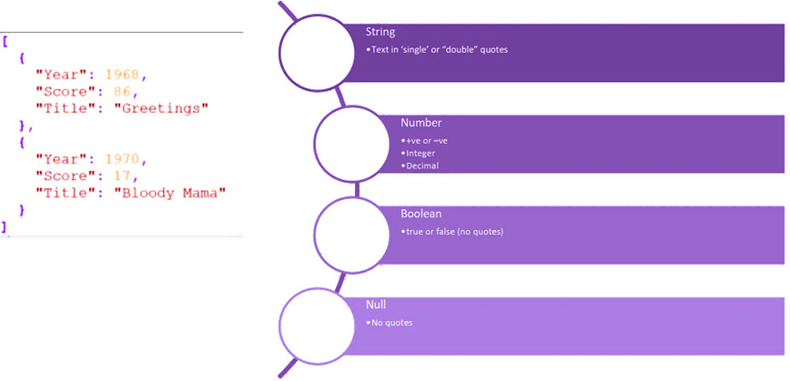
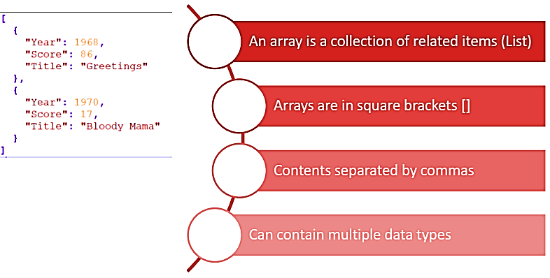
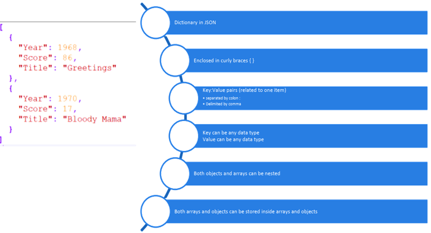
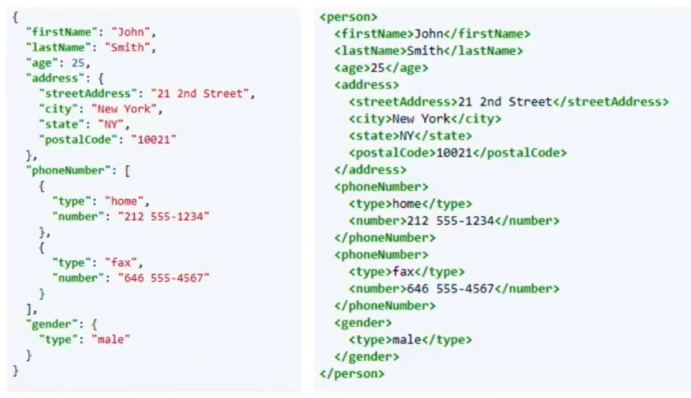

# Legal Issues and Web Services
## Table of content
- Review Week4 Tutorial.
- Look at some:
- Legal issues
- Company policies
- Standards.
- Introduce Web services.
- Introduce JSON.

## Where can we use XML
XML files can be used for:
- Storing data
- Transforming data
- Describing data
- Representing data
- Transferring data
- Displaying data

## Languages
- Most languages contain tools to create and consume XML
    - Java
    - Php
    - .Net (ado.net)
    - Javascript (AJAX)

## LEGAL ISSUES, <br>COMPANY POLICIES <br>AND STANDARDS
### Legal Issues
- Can staff / developers access the XML data?
- What volume of data will you be processing?
- Different countries have different rules that may be applicable.
- Company policies: You need to tell people how to use your data (Be aware of the use of 3rd parties.)

### The Main Acts


### The Data Protection Act (1998)
- Protects people’s information held by others.
- Any data you collect must be :
    - Obtained and used for a specific (lawful) purpose.
    - Adequate, relevant and not excessive.
    - Accurate and up to date.
    - Kept only for as long as necessary.
    - Processed in accordance with a person’s rights.
    - Protected from unauthorized processing and accidental loss or destruction.
    - Kept in the EEA (European Economic Area)

### Privacy and Electronic Communications Regulations
- **“The Cookie Law”:**
    - Designed to protect online privacy.
    - Aims to make consumers aware of how their information is being collected and used.
    - Websites must get permission to collect, store and retrieve data about site visitors.
    - Covers all methods of storage and retrieval, not just cookies.
    - Also covers marketing communications (such as calls and emails) and customer privacy (i.e. location services and identification).

### The Computer Misuse Act (1990)
- **The act creates the following offenses:**
    - Unauthorized access / modification of computer materials.
    - Unauthorized access with intent to commit or facilitate a crime.
    - Making, supplying or obtaining anything which can be used in an offense under the Act.

### The Copyright Designs and Patents Act (1988)
- Protects original works, recordings and their presentation from unauthorized copying and distribution.
- Defines authorship and ownership.
- Sets out the duration of copyright for different media types.
- Sets out the rights of copyright owners.

### PCI DSS (Payment Card Industry Data Security Standard)
- Developed to enhance the cardholder data security.
- Applies to merchants and service providers that process, transmit or store card holders data.
- Began In 2004 as the payment Processing rules from major credit card brands: Visa, Mastercard, Amex (American Express), Discover, and JCB.
- Consists of 12 regulations.

<table>
	<thead>
		<tr>
			<th>Control objectives</th>
			<th>Requirements</th>
		</tr>
	</thead>
	<tbody>
		<tr>
			<td class="objective-cell" rowspan="2">Build and maintain a secure network</td>
			<td class="requirement-cell">1. Install and maintain a firewall configuration to protect cardholder data</td>
		</tr>
		<tr>
			<td class="requirement-cell">2. Do not use vendor supplied defaults for system passwords and other security parameters</td>
		</tr>
		<tr>
			<td class="objective-cell" rowspan="2">Protect cardholder data</td>
			<td class="requirement-cell">3. Protect stored cardholder data</td>
		</tr>
		<tr>
			<td class="requirement-cell">4. Encrypt transmission of cardholder data across open, public networks</td>
		</tr>
		<tr>
			<td class="objective-cell" rowspan="2">Maintain a vulnerability management program</td>
			<td class="requirement-cell">5. Use and regularly update anti-virus software on all systems commonly affected by malware</td>
		</tr>
		<tr>
			<td class="requirement-cell">6. Develop and maintain secure systems and applications</td>
		</tr>
		<tr>
			<td class="objective-cell" rowspan="3">Implement strong access control measures</td>
			<td class="requirement-cell">7. Restrict access to cardholder data by business need-to-know</td>
		</tr>
		<tr>
			<td class="requirement-cell">8. Assign a unique ID to each person with computer access</td>
		</tr>
		<tr>
			<td class="requirement-cell">9. Restrict physical access to cardholder data</td>
		</tr>
		<tr>
			<td class="objective-cell" rowspan="2">Regularly monitor and test networks</td>
			<td class="requirement-cell">10. Track and monitor all access to network resources and cardholder data</td>
		</tr>
		<tr>
			<td class="requirement-cell">11. Regularly test security systems and processes.</td>
		</tr>
		<tr>
			<td class="objective-cell">Maintain an information security policy</td>
			<td class="requirement-cell">12. Maintain a policy that addresses information security</td>
		</tr>
	</tbody>
</table>

## Web Services
### What is a Web service?
- “A Web service is a software system designed to support interoperable machine-to-machine interaction over a network.

#### Web Services


### URL or URI ?


### HTTP (Hypertext Transfer Protocol)


### 3rd Party Web Services
When using 3rd party web services bear in mind:
- **Legal issues.**
    - Do you have a license to use the data as intended?
- **Data governance.**
    - Where are the servers located?
    - Can you share personal data with the service if needed?
- **Security.**
    - Is the service going to properly protect your data?
*Will need to abide by terms and conditions – may include requirements such as displaying their logo.*


## JSN
- JSON (JavaScript Object Notation).
- Commonly used to create dynamic screen elements on websites, or transfer data over the web.
- The syntax is taken from JavaScript but JSON is portable with other languages.
- It is easy for humans to read and write.
- It is easy for machines to parse and generate.

### JSON Data Types


### JSON Data Array


### JSON Objects


### JSON Types Examples
- Object
```json
{ "key": "value" }
```
```json
{ "name": "John" }
{ "age": 35 }
```
- Arrays
```json
[1, 2, 3]
["Apples", "Oranges"]
```
- Strings
```json
"Raghav"
"Paris"
```
- Numbers
```json
1
10
1.5
-10
4.5e70
```
- Boolean
```json
true
false
```
- Null
```json
null
```

### JSON Pros and Cons

| Pros                               | Cons                                |
| ---------------------------------- | ----------------------------------- |
| Very small                         | Limited data types                  |
| Easy to parse                      | No comment syntax                   |
| Widely supported                   | Not self describing                 |
| Tightly integrated with JavaScript | No JSON schema\*<br>(No validation) |
> [!TIP]
> self describing  
> e.g., the attribute in xml  
> `<actor prefix="Mr.">Macauley Culkin</actor>`  
>   
> schema  
> e.g., DTD  
>   
> if you are asked to validate json, you just need to check if there are any errors in the json, because json doesn't have DTD

### JSON Vs. XML


### JSON Syntax Rules
- Data is in name / value pairs separated by a colon `:`
- Data is separated by commas.
- Curly braces hold objects.
- Square braces hold arrays.

### JSON Testing and Validation
- **Creating your JSON file**
    - Notepad++ can be used.
    - Make sure your document follows the Key JSON specification rules.
- **Testing your file**
    - JSON codes should be validated – i.e., we should be able to automatically check its structure and syntax.
- Validate your JSON code at https://jsonlint.com/

## Warmer Part 1
Convert the Scholars XML code into an identical JSON file and validate your answer.


## For CourseWork1
- DTD
- XML
- XSLT
- JSON
