# Introduction to SQL & Install Database
## Table of content
- Review Week5 Tutorial.
- Introduction to Databases.
- Introduce SQL.
- Downloading MySQL.

## Introduction
- **What is a Database?**
    - A collection of related and organized data designed to meet the information needs of an organization.
- **Database is a structured object.**
    - Data is the actual stored descriptive information.
    - Metadata is the structured part (table definition).
> [!NOTE]
> In XML, metadata is something like attribute

## Examples of Using Database Systems
- Scientific Data Collection.
- Purchases from the supermarket.
- Purchases using credit card, generation of monthly statements.
- Using the local library.
- Taking out insurance.
- At universities.
- Booking a holiday at the travel agents.

## Components of a Database System
- The components of a database system are:
    - Users.
    - Database Application.
    - Database Management System (DBMS).
    - Database.
    - Data.
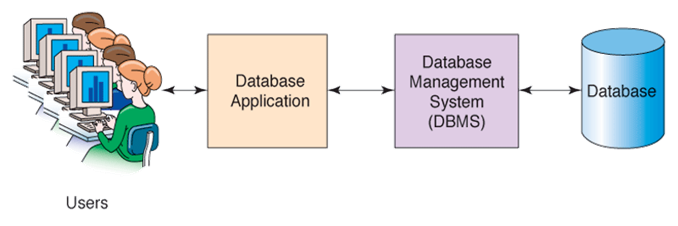

---

**Users:** A user of a database system will
- Use a database application to track things.
- Use forms to enter, read, delete and query data.
- Produce reports.

**Database Application:**
- A set of one or more computer programs that serves as an intermediary between the users and the DBMS.
- Application program read or modify database data by sending SQL statements to DBMS.
- Application program present data and processes quires to users in the format of forms and reports.

---

- Database management systems (DBMS) relate to information stored in tabular formats.
- The DBMS manages the interaction between the end user and the database.
- DBMS receives request encoded in SQL and translates these requests into actions on the database.
- Companies almost never write their own DBMS program.
- They rather use licensed softwares.

## DBMS
- Why is DBMS needed?
    - Improves decision making.
    - Increases end-user productivity.
    - Minimizes data redundancy.
    - Enforces standards.
    - Maintains the privacy/confidentiality.
    - Reduces program maintenance.

## Types of Database Systems
- **Number of Users**
    - Single-user: Desktop database.
    - Multiuser: Workgroup database, Enterprise database.
- **Scope/limitation**:
    - Desktop, Workgroup, Enterprise.
- **Location**:
    - Centralized database, distributed database.

## The Database Administrator (DBA)
- Works with programmers and analysts to design and implement the database.
- Works with users and managers to establish database policies.
- Implements security features and establishes database permissions

## Relational Database Model
- Relational algebra allows us to use mathematical logic to create a relationship between a few tables.
    - So we can retrieve data efficiently.
    - Any table can be accessed directly without having to access all parent objects.
    - Any tables can be linked together, regardless of their hierarchical position.

## Major Database Concepts
- **Data**: Raw facts about things and events.
- **Information**: Processed data or transformed data that has value for decision making.
- **Metadata**: Data about data, or the database definition or descriptive information.
- **The instance**: The collection of information stored in the database at a particular moment is called an instance of the database.
- **Database Schema**: The overall design of the database.

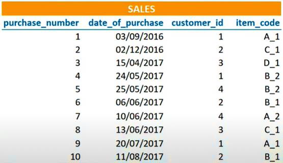

### Table contents – Data values
- Entity: the smallest unit that can contain a meaningful set of data.

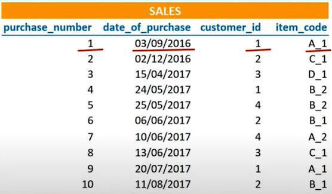

### Table contents – Records

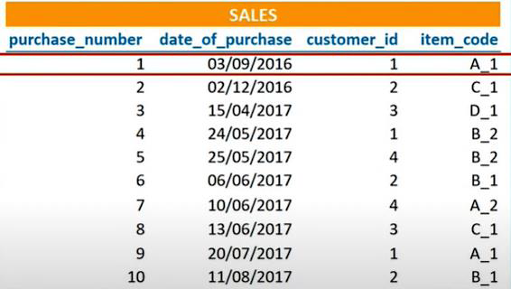

### Table contents – Fields

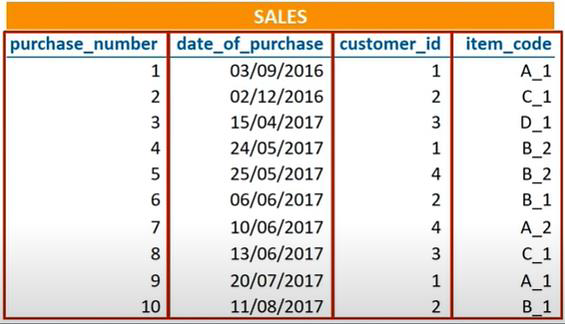

### Tables relationships

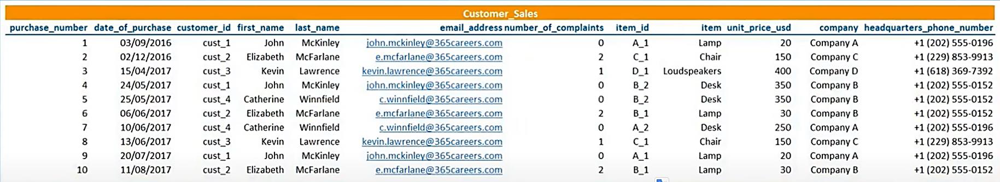

---

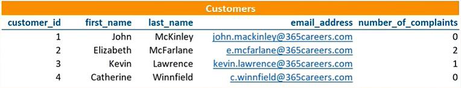
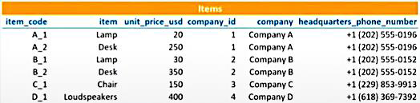

### Entity relationships
- **Relationships:**
    - An entity does not exist in isolation, but it is associated with other entities by means of relationships.
- **Types of relationships:**
    - One-to-one.
    - One-to-many.
    - Many-to-many.

#### One-to-one
- Refers to the relationship between two entities, A and B, in which one element of A may only be linked to one element of B, and vice versa.
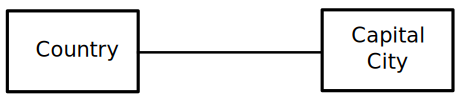
> A country has only one capital city, and a capital city is the capital of only one country. (Not valid for [some countries](https://en.wikipedia.org/wiki/List_of_countries_with_multiple_capitals "List of countries with multiple capitals")).

#### One-to-many
- Refers to the relationship between two entities, A and B, in which an element of A may be linked to many elements of B, but a member of B is linked to only one element of A. 
- For instance, think of A as books, and B as pages. A book can have many pages, but a page can only be in one book.

#### Many-to-many
- Refers to the relationship between two entities, A and B, where A may contain a parent instance for which there are many children in B and vice versa.

> An Author can write several Books, and a Book can be written by several Authors

## SQL
- SQL (Structured Query Language).
- Is a domain-specific language used in programming and managing data held in a relational database management system (RDBMS).
- SQL is a declarative programming language.

### SQL Keys
- **Primary key**.
- used as an identifier to quickly parse data within the table.
    - Unique.
    - Not null.
    - Should never change.
- **Foreign key**.
    - a column or group of columns in a relational database table that provides a link between data in two tables.
    - It references the primary key of another table, thereby establishing a link between them.

---

<table> <thead> <tr style="background-color: yellow;"> <th>Prof#</th> <th>Name</th> <th>Office#</th> </tr> </thead> <tbody> <tr> <td style="background-color: magenta;">J13</td> <td>Jones</td> <td>SB312</td> </tr> <tr> <td>M7</td> <td>Morgen</td> <td>BA218</td> </tr> <tr> <td>D23</td> <td>Davis</td> <td>SB 106</td> </tr> </tbody> </table>

<table><thead><tr style="background-color: yellow;"><th colspan="4" style="text-align: center;">Class</th></tr><tr style="background-color: yellow;"><th>Stud#</th><th>S_name</th><th>Class Standing</th><th>Prof#</th></tr></thead><tbody><tr><td>1234</td><td>Smith</td><td>Fr</td><td>M7</td></tr><tr><td>4678</td><td>Davis</td><td>So</td><td>D23</td></tr><tr><td>2943</td><td>Evans</td><td>Fr</td><td>M7</td></tr><tr><td>1874</td><td>Allen</td><td>Jr</td><td style="background-color: magenta;">J13</td></tr><tr><td>4017</td><td>Lloyd</td><td>Fr</td><td>D23</td></tr><tr><td>2318</td><td>Marx</td><td>Sr</td><td style="background-color: magenta;">J13</td></tr><tr><td>6021</td><td>Keen</td><td>So</td><td>M7</td></tr><tr><td>5503</td><td>Watts</td><td>Jr</td><td style="background-color: magenta;">J13</td></tr></tbody></table>

### What is MySQL®
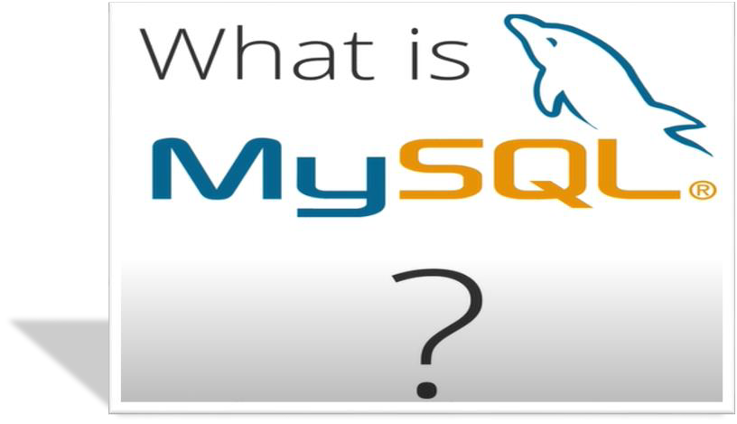
#### MySQL
- MySQL is an open-source relational database management system (RDBMS).

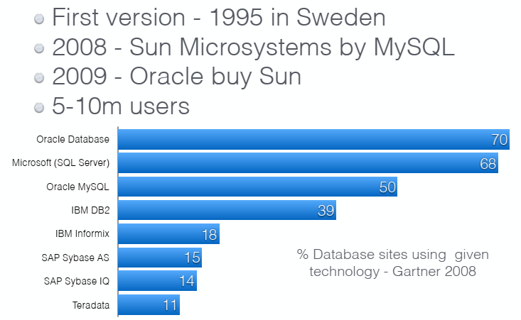

#### MySQL Workbench
- MySQL Workbench is a visual database design tool that integrates SQL development, administration, database design, creation and maintenance.
- Using Workbench we can: Add, remove, modify, search and join tables in a database.

#### Installing MySQL
- Download MySQL form the link:
- https://dev.mysql.com/downloads/file/?id=510038
- Refer to the installation guide [chc5049databasesmysql-installation-guide.pdf](https://vle.zycdut.net/sites/student.zy.cdut.edu.cn/files/attachments/chc5049databasesmysql-installation-guide_4.pdf).

## Data types
- Some strings
    - Char(10)
    - Varchar(50)
- Date types
    - Date
    - Time
    - Datetime
- Some Numerics
    - TinyInt
    - SmallInt
    - MediumInt
    - Int
    - BigInt
    - Float (5,2)
    - Decimal (5,2)
    - Signed
    - Unsigned
