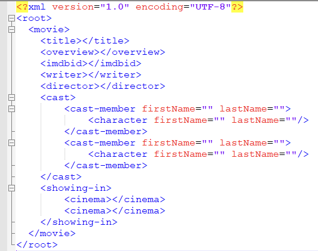

# XSLT application
Exercise 1 – Merge two documents  
Download the practical files from the student website. You should have a single folder containing the following.  
```
Films sample.xml
OMDB_data.xml
Initial file.xsl
```
Open the `initial file.xsl` and `films sample.xml` (It’s best to have all files in the same folder), and run a transform. You should end up with an initial results file containing a line repetition.  
It means that the output is correct. However, this is the XML structure we want to create:  

```xml
<?xml version="1.0" encoding="UTF-8"?>
<root>
    <movie>
        <title></title>
        <overview></overview>
        <imdbid></imdbid>
        <writer></writer>
        <director></director>
        <cast>
            <cast-member firstName="" lastName="">
                <character firstName="" lastName=""/>
            </cast-member>
            <cast-member firstName="" lastName="">
                <character firstName="" lastName=""/>
            </cast-member>
        </cast>
        <showing-in>
            <cinema></cinema>
            <cinema></cinema>
        </showing-in>
    </movie>
</root>
```
You will see that some of the information is in the films `sample.xml` and `OMDB_data.xml` files.  
**Hint**: In the '`Initial file.xsl`' transform, you will find some comments in the file to guide you in creating the final transform.  
Note: the output may not be a byte-for-byte copy of the source, but it will be equivalent in XML terms.  
(i.e., `<element></element>` may be output as `<element />`, but they are equivalent since both are ways of describing the same empty element).  

```xml
<?xml version="1.0" ?>
<xsl:stylesheet version="1.0" xmlns:xsl="http://www.w3.org/1999/XSL/Transform">
    <xsl:output omit-xml-declaration="no" method="xml" encoding="UTF-8" indent="yes"/>
    <!-- remove whitespace-only text nodes from input so copies won't include blank lines -->
    <xsl:strip-space elements="*"/>

    <xsl:template match="root">
        <root>
            <xsl:apply-templates select="results"/>
        </root>
    </xsl:template>

    <xsl:template match="results">
        <!-- For each results node in the films sample.xml create a movie element
             and pull matching data from OMDB_data.xml (by title) -->
        <movie>
            <!-- title and overview from the films sample.xml -->
            <title><xsl:value-of select="normalize-space(title)"/></title>
            <overview><xsl:value-of select="normalize-space(overview)"/></overview>

            <!-- find matching movie in OMDB_data.xml by title attribute -->
            <xsl:variable name="curTitle" select="normalize-space(title)"/>
            <xsl:variable name="omdb" select="document('OMDB_data.xml')/root/movie[normalize-space(@title) = $curTitle]"/>

            <!-- imdbid, writer and director from OMDB_data.xml -->
            <imdbid><xsl:value-of select="$omdb/@imdbID"/></imdbid>
            <writer><xsl:value-of select="$omdb/@writer"/></writer>
            <director><xsl:value-of select="$omdb/@director"/></director>

            <!-- build cast explicitly: copy only cast-member attributes and element children (no text nodes) -->
            <cast>
                <xsl:for-each select="cast/cast-member">
                    <xsl:element name="cast-member">
                        <xsl:copy-of select="@*"/>
                        <!-- copy only element children (e.g., character) to avoid whitespace-only text nodes -->
                        <xsl:copy-of select="*"/>
                    </xsl:element>
                </xsl:for-each>
            </cast>

            <xsl:copy-of select="showing-in"/>
        </movie>
    </xsl:template>

</xsl:stylesheet>

```
