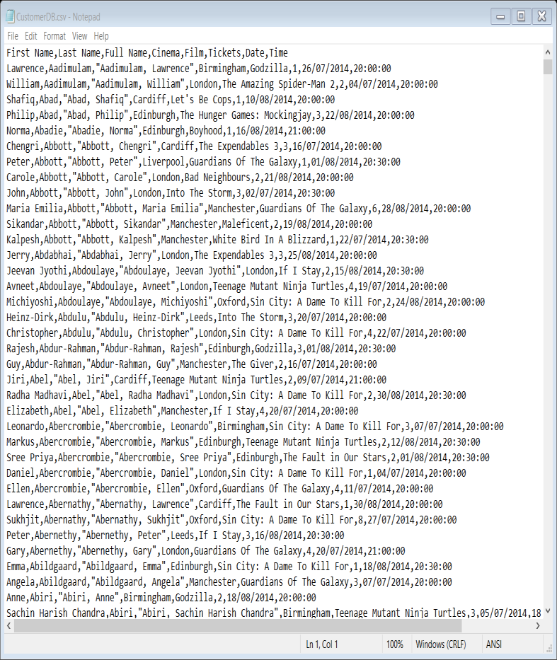
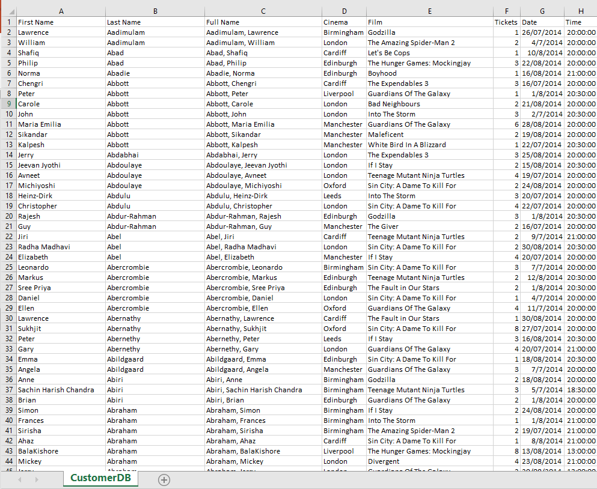
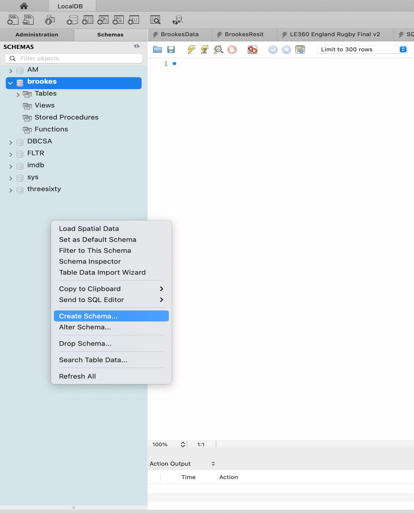
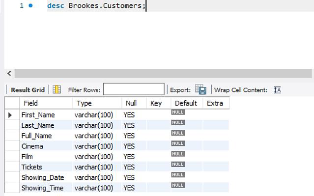
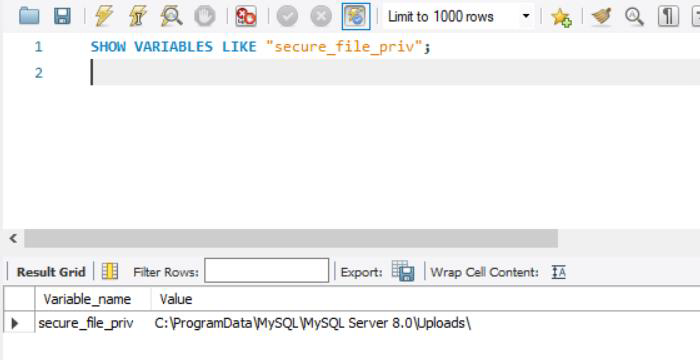
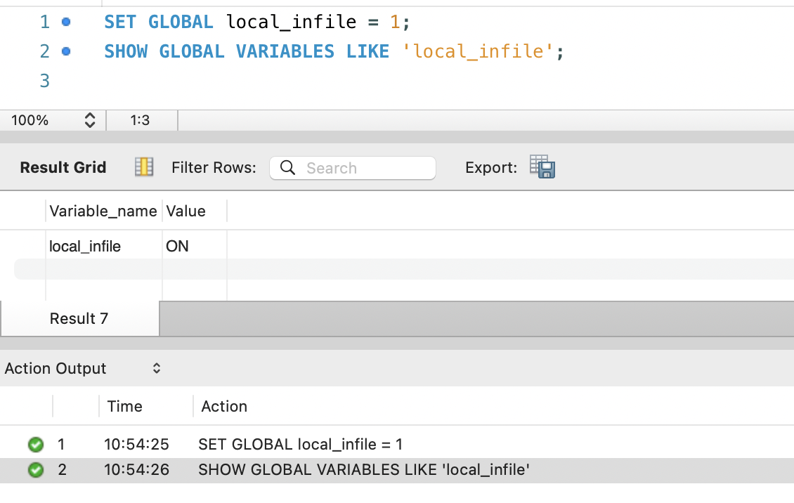
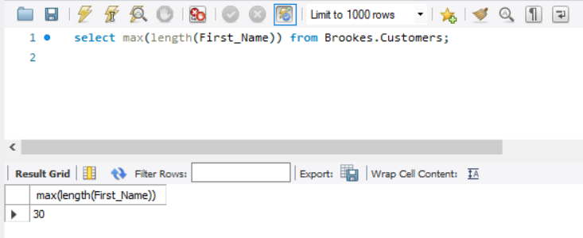
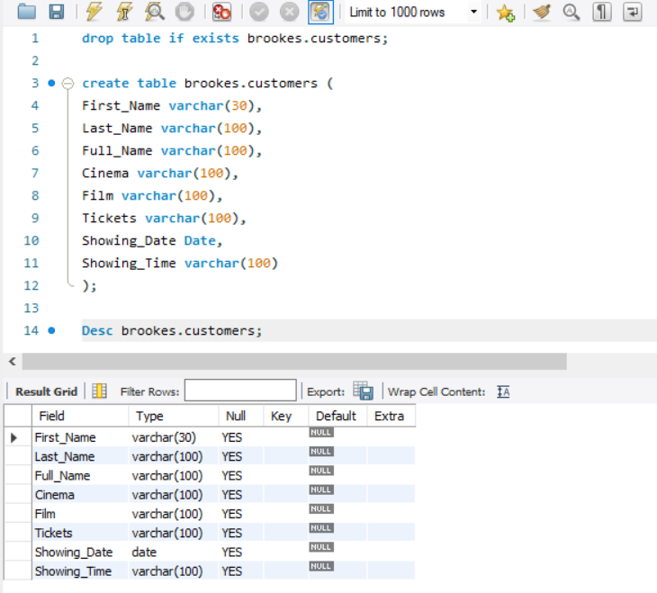
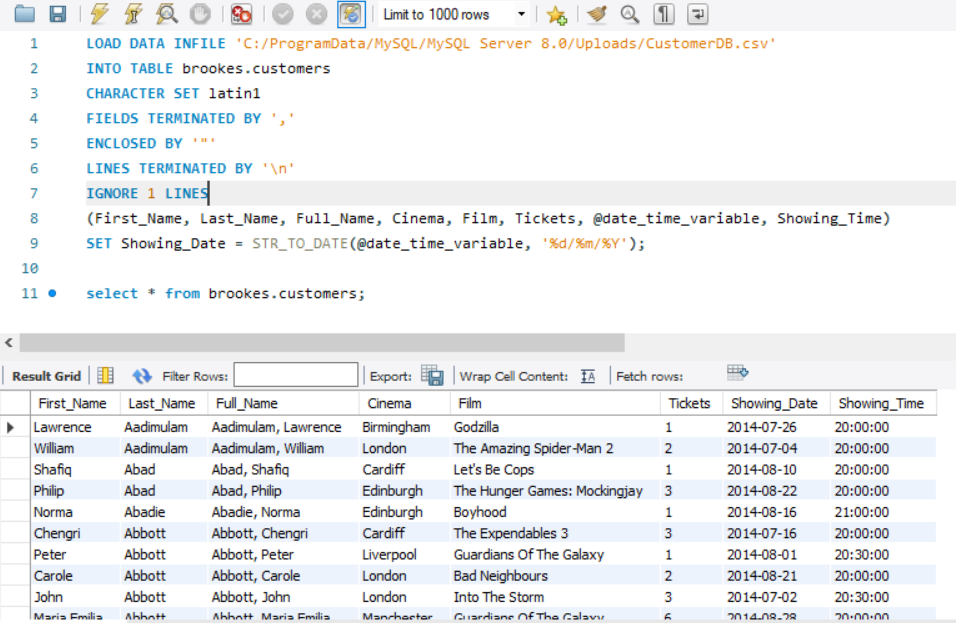

# Modelling and Loading

| XML   | SQL  |
| ----- | ---- |
| .csv  | .csv |
| .DTD  | .sql |
| .XSLT |      |
| .html |      |
| .json |      |

## Table of content
- Review Week6 Tutorial.

- Dealing with databases:
    - Modelling
    - Data types
    - Creation
    - Loading
    - Testing

## Create a Database
- Look at the problem
- Create a logical model
- Create a physical model
- Get some data
- Create a physical space - schema
- Load the data
- Play with the data
- Test the data
- Refine and repeat

## Problem Description
Car Maker
Car Reg
Year
Owners
VIN
Mileage
MOT
Colour
First Name
Surname
Tax Price
Purchase Price
Full Sales Price
Final Sales Price
Insurance
Gearbox
Doors

## Modelling
### CAR INFORMATION

| Maker | Reg | Year | Owners | VIN | Mileage | MOT | Colour | Tax | Purchase | Full Sales | Final Price | Gearbox |
| ----- | --- | ---- | ------ | --- | ------- | --- | ------ | --- | -------- | ---------- | ----------- | ------- |
|       |     |      |        |     |         |     |        |     |          |            |             |         |
|       |     |      |        |     |         |     |        |     |          |            |             |         |
|       |     |      |        |     |         |     |        |     |          |            |             |         |

### OWNER INFO

| First Name | Surname |
| ---------- | ------- |
|            |         |
|            |         |
|            |         |

### MODEL INFO

| Doors | Insurance |
| ----- | --------- |
|       |           |
|       |           |
|       |           |


## Data types
  
- Some strings
    - Char(10)
    - Varchar(50)
- Date types
    - Date
    - Time
    - Datetime
- Some Numerics
    - TinyInt
    - SmallInt
    - MediumInt
    - Int
    - BigInt
    - Float (5,2)
    - Decimal (5,2)
    - Signed
    - Unsigned


## Load The Data
### CAR INFORMATION

| Maker | Reg     | Year | Owners | VIN    | Mileage | MOT | Colour | Tax | Purchase | Full Sales | Final Price | Gearbox |
| ----- | ------- | ---- | ------ | ------ | ------- | --- | ------ | --- | -------- | ---------- | ----------- | ------- |
| Ford  | XYZ 123 | 2009 | 2      | 12345  | 12000   | Y   | Green  | 200 | 5000     | 6000       |             | Manual  |
| Fiat  | 123 REG | 2019 | 1      | 344564 | 5000    | Y   | Red    | 100 | 6000     | 7000       | 6500        | Auto    |
| Tesla | 234 TYR | 2018 | 3      | 764538 | 20000   | Y   | Blue   | 0   | 25000    | 30000      | 26000       | N/A     |

### OWNER INFO

| VIN | First Name | Surname |
| ------- | -------------- | ----------- |
| 12345   | John           | Smith       |
| 344564  | Jane           | Doe         |
| 764538  | Rocket         | Racoon      |

### MODEL INFO

| Maker | Doors | Insurance |
| --------- | --------- | ------------- |
| Ford      | 4         | 8             |
| Fiat      | 2         | 6             |
| Tesla     | 4         | 14            |


## Validate The Data
### CAR INFORMATION

| Maker | Reg     | Year | Owners | VIN    | Mileage | MOT | Colour | Tax | Purchase | Full Sales | Final Price | Gearbox |
| ----- | ------- | ---- | ------ | ------ | ------- | --- | ------ | --- | -------- | ---------- | ----------- | ------- |
| Ford  | XYZ 123 | 2009 | 2      | 12345  | 12000   | Y   | Green  | 200 | 5000     | 6000       |             | Manual  |
| Fiat  | 123 REG | 2019 | 1      | 344564 | 5000    | Y   | Red    | 100 | 6000     | 7000       | 6500        | Auto    |
| Tesla | 234 TYR | 2018 | 3      | 764538 | 20000   | Y   | Blue   | 0   | 25000    | 30000      | 26000       | N/A     |

```sql
SELECT column1, column2 FROM table1, table2 WHERE column2='value';
Select count(*) from car_information where final_price is null
Select sum (final_price – purchase) from car_information
```
> [!IMPORTANT]
> ⚠️注意：第一行的Final Price值为null，无法进行final_price – purchase运算，将被忽略


## Example 2
- CustomerDB.csv


### Get some data
- CustomerDB.csv (<span style="color: red">21340 rows</span>)


> [!TIP]
> 表的第一行叫表头（header）

> [!IMPORTANT]
> Do not use Navicat's wizard to import csv file, we need code to import.

### Create a Schema (brookes)



#### Create a Table in The Schema 1
```sql
create table brookes.customers (
First_Name datatype?,
Last_Name datatype?,
Full_Name datatype?,
Cinema datatype?,
Film datatype?,
Tickets datatype?,
Showing_Date datatype?,
Showing_Time datatype?
);
```


#### Create a Table in The Schema 2
```sql
create table customers (
First_Name varchar(100),
Last_Name varchar(100),
Full_Name varchar(100),
Cinema varchar(100),
Film varchar(100),
Tickets varchar(100),
Showing_Date varchar(100),
Showing_Time varchar(100)
);
```


### Show The Table Structure


### Default path
- The directory you can load files from, can be retrieved by using the command:
```sql
SHOW VARIABLES LIKE "secure_file_priv";
```


### Default path (Mac)
- You have to set the following variable:
```sql
SET GLOBAL local_infile = 1;
SHOW GLOBAL VARIABLES LIKE 'local_infile';
```


### Load The Data
```sql
LOAD DATA INFILE '<LOCATION>/CustomerDB.csv'
INTO TABLE <TABLE NAME>
CHARACTER SET latin1
FIELDS TERMINATED BY ','
ENCLOSED BY '"'
LINES TERMINATED BY '\n'
IGNORE 1 LINES;
```


---

```sql
LOAD DATA INFILE 'C:/ProgramData/MySQL/MySQL Server 8.0/Uploads/CustomerDB.csv'
INTO TABLE brookes.customers
CHARACTER SET latin1
FIELDS TERMINATED BY ','
ENCLOSED BY '"'
LINES TERMINATED BY '\n'
IGNORE 1 LINES;
```

### Load The Data (Mac)
```sql
LOAD DATA local INFILE '/Users/magedrefat/Uploads/CustomerDB.csv'
INTO TABLE brookes.customers
CHARACTER SET latin1
FIELDS TERMINATED BY ','
ENCLOSED BY '"'
LINES TERMINATED BY '\n'
IGNORE 1 LINES;
```

> [!NOTE]
> 如果设置了 `SET GLOBAL local_infile = 1;` 仍然报错  
> `ERROR 2068 (HY000): LOAD DATA LOCAL INFILE file request rejected due to restrictions on access.`  
> 参考解决方案（命令行）：[ERROR 2068 (HY000): LOAD DATA LOCAL INFILE file request rejected due to restrictions on access.-CSDN博客](https://blog.csdn.net/JayneLee/article/details/136045454)  
> 省流：`mysql -h localhost -u root --local-infile=1 -p`  
> 参考解决方案（MySQLWorkbench）：[MYSQL 8.0 WORKBENCH使用LOAD DATA LOCAL INFILE报错解决方案_load data local infile说找不到文件路径-CSDN博客](https://blog.csdn.net/weixin_44296768/article/details/122568056)  
> 省流：右键数据库连接，选择【Edit Connection...】，里边有一个Advanced选项卡，点进去在Others框里最后一行添加`OPT_LOCAL_INFILE=1

### Validate The Data
```sql
select * from brookes.customers;
select count(*) from brookes.customers;
select cinema from brookes.customers;
select distinct cinema from brookes.customers;
select distinct cinema from brookes.customers order by 1 asc;
select distinct cinema from brookes.customers order by 1 desc;
select sum(tickets) from brookes.customers;
select cinema, sum(tickets) from brookes.customers group by cinema;
select sum(tickets) from brookes.customers where cinema='Birmingham';
```
> [!TIP]
> `distinct`可以筛选掉重复的值  
> `asc`升序排序  
> `desc`降序排序  


#### Exercise
1. How many customers?
2. How many tickets sold?
3. Most popular cinema?
4. Most popular film?
5. Most popular date?
6. Most popular day of the week?

### Refine and Repeat
```sql
select max(length(First_Name)) from brookes.customers;
```
- And so on.. Then change your load script to get the best possible performance and tuning - and run it again.



---



## Change Load Script to Make The Data Better
Dates are being loaded in as varchar – which is clearly wrong, and if you just change the value to "Date" then you’ll get an error. Something like this:  

So we need to change the load script
```sql
LOAD DATA INFILE 'C:/ProgramData/MySQL/MySQL Server 8.0/Uploads/CustomerDB.csv'
INTO TABLE brookes.customers
CHARACTER SET latin1
FIELDS TERMINATED BY ','
ENCLOSED BY '"'
LINES TERMINATED BY '\n'
IGNORE 1 LINES
(First_Name, Last_Name, Full_Name, Cinema, Film, Tickets, @date_time_variable, Showing_Time)
SET Showing_Date = STR_TO_DATE(@date_time_variable, '%d/%m/%Y');
```


## Exercise
- Create another table “Geo”.
- Go through the same steps as with “Customers”.
- Check the data.
