# Query and validate
## Table of content
- Review Week7 Tutorial.
- SQL Operators.
- Table Operations.
- SQL Functions.
- SQL Aliases

## SQL Operators
- The main operators are: `AND`, `OR`, `NOT`, `LIKE`, `IN`, `BETWEEN`
- Examples:
```sql
select * from customers where cinema='Cardiff' and Film='As Above, So Below';
```
```sql
select * from customers where cinema='Cardiff' or cinema='London'
```
```sql
select * from geo where not Region='Midlands';
```

> [!TIP]
> “不等于”除了用 `not` 还可以用 != 和 <> 来表示

### SQL Like 1
```sql
select * from geo where Region like 'N%';
```
```sql
select * from geo where Region like '%h';
```
```sql
select * from geo where Region like 'N%h';
```
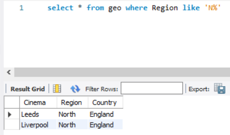
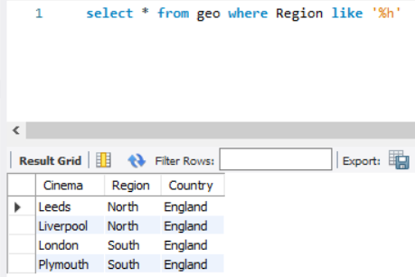

### SQL Like 2
```sql
select * from geo where Region like '_o%';
```
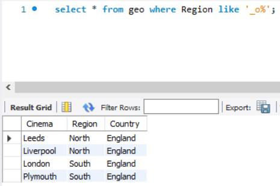
```sql
select * from geo where Region like '__l__%';
```
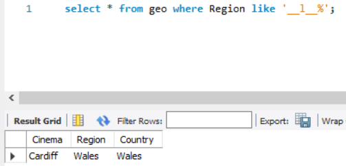

### SQL in 1
- Allows stating multiple values in the `WHERE` clause.
- Equivalent to using multiple `OR`s
- Statement Structure:
```sql
SELECT column_name FROM table_name
WHERE column_name IN (value1, value2, ...);
```

> [!TIP]
> `(value1, value2, ...)` is an array

- Another way
```sql
SELECT column_name FROM table_name
WHERE column_name IN (SELECT STATEMENT);
```

> [!TIP]
> This is a nested select.

### SQL in 2
```sql
select * from geo where Region in ('North', 'Wales');
```
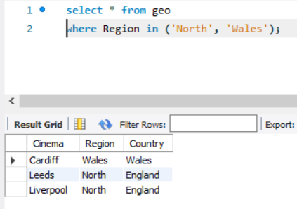
```sql
select * from geo where Cinema in (select Cinema from customers);
```
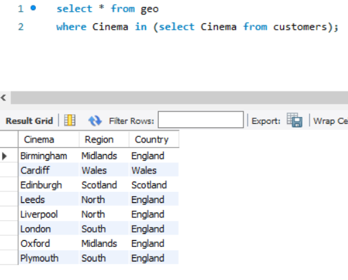
> [!TIP]
> `select distinct cinema from brookes.customers2 where cinema in (select cinema from brookes.geo);`  
> `select distinct cinema from brookes.geo where cinema in (select cinema from brookes.customers2);`  
> 两条语句的查询结果**一定相同**，因为它们本质上都是查询两个表中`cinema`字段的交集（去重后），而集合的交集运算满足交换律（A∩B = B∩A）。  
> 注：在我的数据库里， `brookes.geo` 表中的cinema字段名实际为city  
> `select distinct city from brookes.geo where city in (select cinema from brookes.customers2);`

### SQL Between
- Returns the values that fall between the specific range.
- The begin and end values are included.
- Statement Structure:
```sql
SELECT column_name FROM table_name WHERE 
column_name [BETWEEN / NOT BETWEEN] value1 AND value2;
```

#### SQL Between: Example
```sql
select * from customers where showing_date between '2014-07-02' AND '2014-07-04';
```
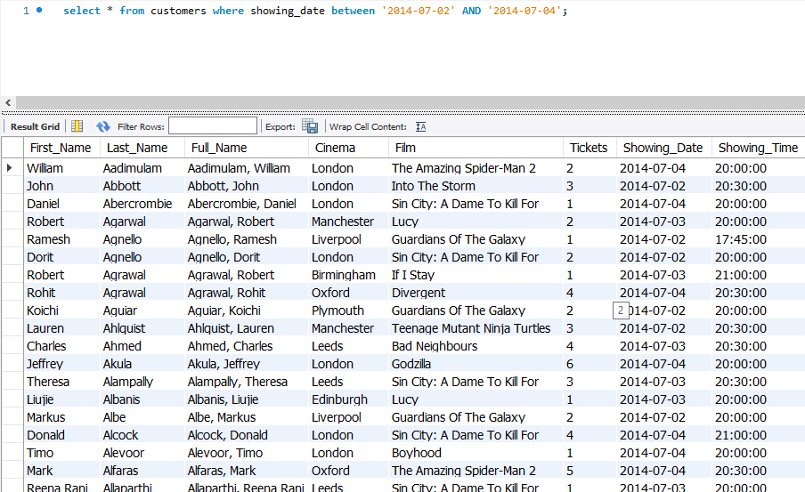

## Tables Operations
- `ALTER`
- `INSERT`
- `UPDATE`
- `DELETE`

> [!TIP]
> Do you know?  
> Delete、Drop  
> `DROP`: Remove the whole table (or some structure)  
> `drop table <table_name>;`  
> `DELETE`: Remove some records (information)  
> Update、Alter  
> `ALTER`: Operations of fields (including add field(s), change field name/datatype)  
> `UPDATE`: Change some records (values)

### Alter statement
- The `ALTER` statement is used to change the table structure.
- It can be used to add a column, modify a column, rename a column, or drop a column.

#### Alter statement (ADD)
- **Add a column in the table:**
```sql
ALTER TABLE table_name ADD new_column_name column_definition [ FIRST | AFTER column_name ];
```
- Example
```sql
ALTER TABLE geo ADD notes varchar(50) AFTER country;
```
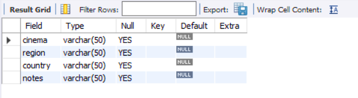

#### Alter statement (MODIFY)
- **Modify a column in the table**
```sql
ALTER TABLE table_name
MODIFY column_name column_definition [ FIRST | AFTER column_name ],
MODIFY column_name column_definition [ FIRST | AFTER column_name ],
... ;
```
- Example
```sql
ALTER table geo MODIFY Cinema varchar(15), MODIFY Region varchar(15), MODIFY Country varchar(15);
```
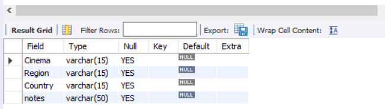

#### Alter statement (RENAME)
- **Rename a column name**
```sql
ALTER TABLE table_name RENAME column_name to new_ column_name;
```
- Example
```sql
ALTER table GEO rename column notes to More_details;
```
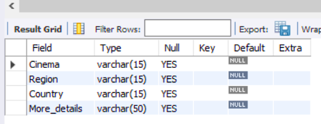

#### Alter statement (DROP)
- **Drop a column from the table**
```sql
ALTER TABLE table_name DROP column_name, DROP column_name, ... ;
```
- Example
```sql
ALTER table geo drop column notes;
```
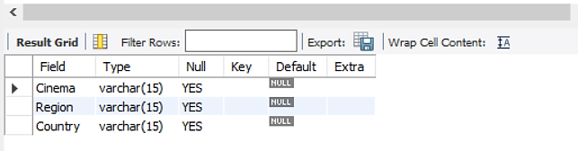

### Insert statement
- The `INSERT` statement is used to insert new records in the table.
- Statement Structure:
```sql
INSERTINTOtable_name(column1,column2,column3, ...) VALUES(value1,value2,value3, ...);
```
- Another way
```sql
INSERT INTO table_name VALUES (value1, value2, value3, ...);
```

> [!NOTE]
> 注意：以上两种操作效果相同，均为从左往右顺序填充数据  
> 第一种可以跳过部分字段，字段与值一一对应  
> 字段数量与值的数量不同时会报错

#### Insert statement: Example 1
- Inserting a new record into the table.
```sql
INSERT INTO Geo VALUES (value1, value2, value3, ...);
```
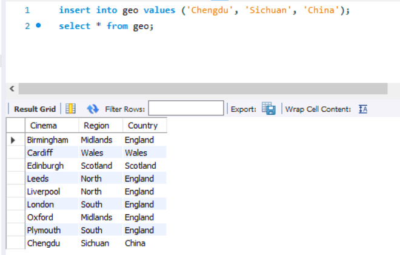

#### Insert statement: Example 2
- Inserting specified columns only.
```sql
INSERT into geo (Cinema, Region) values ('Yibin', 'Sichuan’);
```
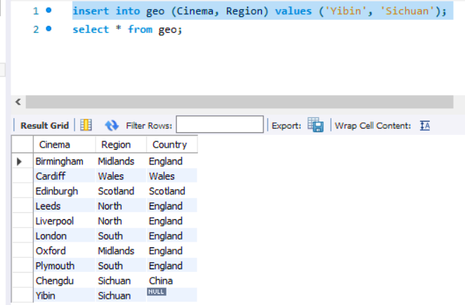

### Null values
- Null represents a field with an empty value.
- A field with a `NULL` value is one that has been left blank during record creation
- A `NULL` value is different from a zero value.
- Example:
```sql
Select * from geo where country is [null / not null].
```
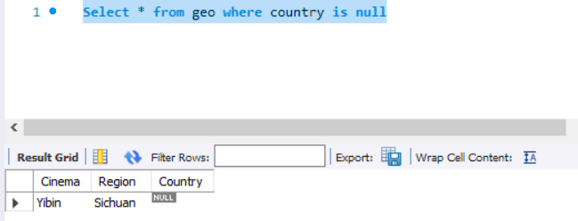
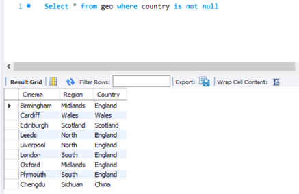

### Update statement
- Disable update protections:
```sql
set SQL_SAFE_UPDATES = 0;
```
- Updating specified records in the table.
```sql
UPDATE table_name SET column1 = value1, column2 = value2, ...
WHERE condition;
```
- Example:
```sql
update geo set country = 'China' where country is Null;
```
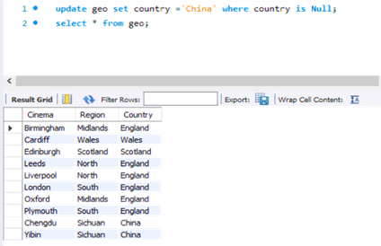

### Delete statement 1
- Deleting specified columns from a table.
```sql
DELETE FROM table_name WHERE condition;
```
- Example:
```sql
DELETE from geo where country = 'China';
```
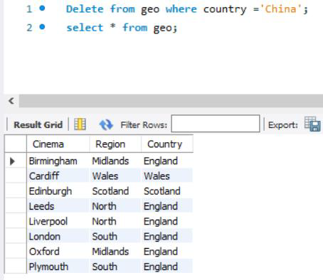

### Delete statement 2
- Delete all records :
```sql
DELETE FROM table_name;
```
- Example:
```sql
DELETE from geo;
```
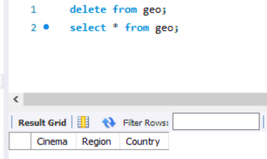

## SQL functions
- `MIN()` returns the smallest value from a specific field.
- `MAX()` returns the largest value from a specific field.
- `COUNT()` determines the number of records that satisfy specific criteria.
- `SUM()` returns the total summation of numeric values.
- `AVG()` returns the average of numeric values.

## SQL Aliases 1
- Gives a temporary name for tables or columns.
- Facilitates reading tables or columns names.
- Temporary means it only exists while performing the query.
- Statement Structure:
```sql
SELECT column_name AS alias_name FROM table_name;
```

## SQL Aliases 2
```sql
select showing_date as theDate, showing_time as theTime
from customers;
```

> [!TIP]
> 可以省略 `as`

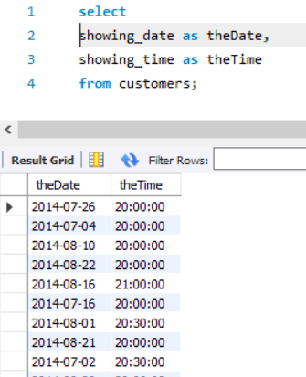
```sql
select C.Film, G.Country from customers as c, geo as g where c.cinema = g.cinema;
```
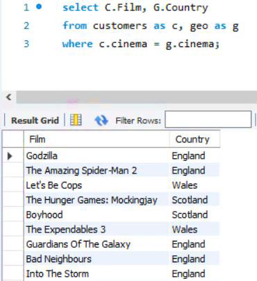
