# Refine and Refresh
## Table of content
- Review Week8 Tutorial
- Tables Joins
- Inner Join
- Outer Join
- Joining three tables

## Tables Joins
- Joins in SQL are used to combine the contents of different tables.
- You can specify how you want the data from tables to be joined in many ways.
- There are two main types of joins: inner join and outer join.

## Inner joins Vs. Outer joins
- The major difference between inner and outer joins is that inner joins result in the intersection of two tables, whereas outer joins result in the union of two tables.

### Inner Join
- For an inner join, only the rows that both tables have in common are returned.
- The results of an inner join will contain only the yellow section where Table_1 and Table_2 overlap.


#### Inner Join: Example 1
> [!TIP]
> `on` 表示条件

```sql
select * from customers JOIN geo ON
customers.cinema=geo.cinema
```
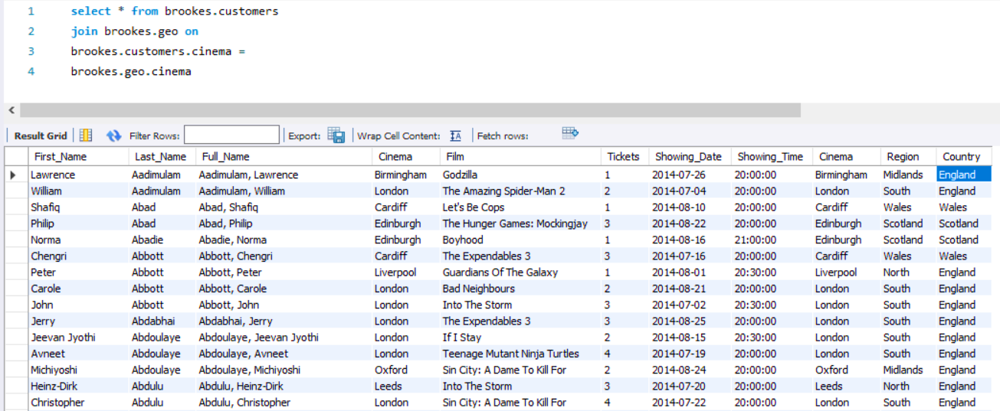

#### Inner Join: Example 2
```sql
select count(*) from customers JOIN geo ON
customers.cinema=geo.cinema
```
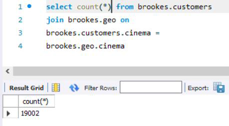

### Outer Join
- It has tree types:
    - Left outer joins,
    - Right outer joins,
    - Full outer joins.

#### Left Outer Join
- To find out which information are in the first table and they are missing from the second table, we would join the first table and the second table using a left outer join.
- Note that if the information is not available in the second table, NULL will represent values.
- The results of a left outer join will contain the yellow section where Table_1 and Table_2 overlap, plus the yellow section that contains the rest of Table_1
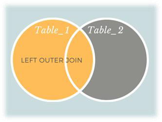

##### Left Outer Join: Example 1
```sql
select * from customers LEFT OUTER JOIN geo ON
customers.cinema = geo.cinema
```
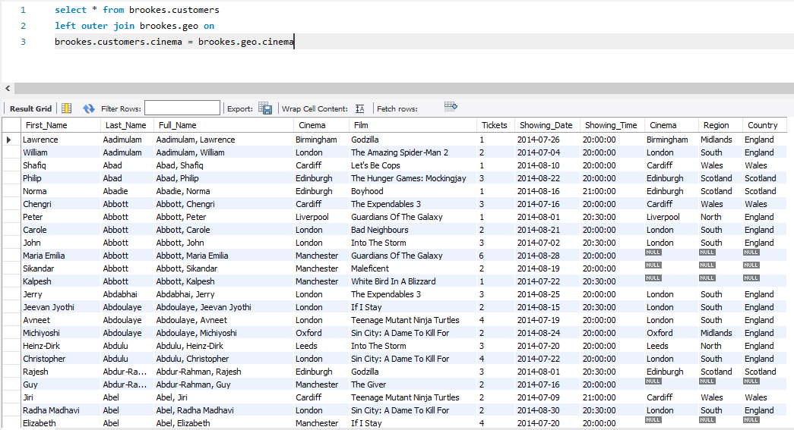

##### Left Outer Join: Example 2
```sql
select count(*) from customers LEFT OUTER JOIN geo ON
customers.cinema = geo.cinema
```
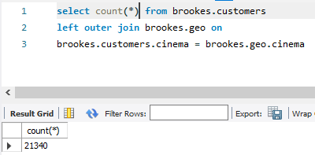

#### Right Outer Join
- To find out which information are in the second table and they are missing from the first table, we would join the first table and the second table using a right outer join.
- Note that if the information is not available in the first table, NULL will represent the values.
- The results of a right outer join will contain the yellow section where Table_1 and Table_2 overlap, plus the yellow section that contains the rest of Table_2
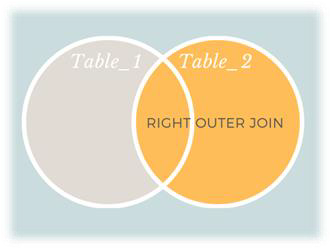

##### Right Outer Join: Example 1
```sql
select * from customers RIGHT OUTER JOIN geo ON
customers.cinema = geo.cinema;
```
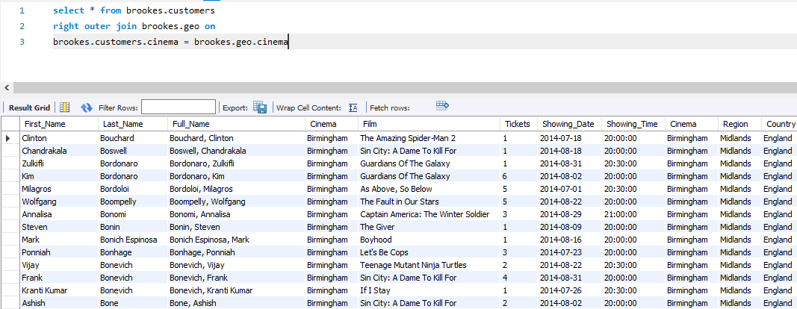

##### Right Outer Join: Example 2
```sql
select count(*) from customers RIGHT OUTER JOIN geo ON
customers.cinema = geo.cinema;
```
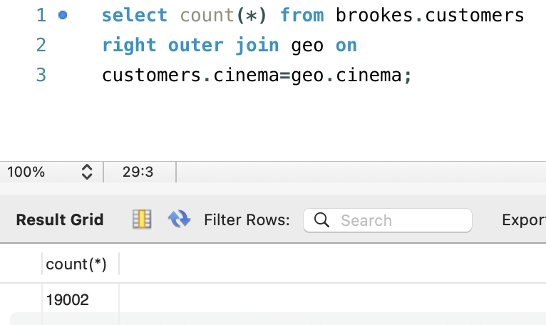

#### Full Outer Join
- This join returns the rows that occur either in the first or second table.
- If some information is missing from the first table, values will be represented by NULL.
- Similarly if some information is missing from the second table, values will be NULL.
- The results of an outer join will contain all the yellow sections including the entirety of Table_1 and Table_2, not just where the two circles overlap.
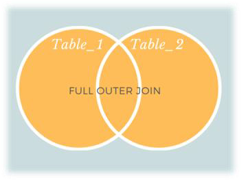

##### Full Outer Join: Example 1
```sql
select * from customers LEFT OUTER JOIN geo ON customers.cinema=geo.cinema
UNION
select * from customers RIGHT OUTER JOIN geo ON customers.cinema=geo.cinema
```
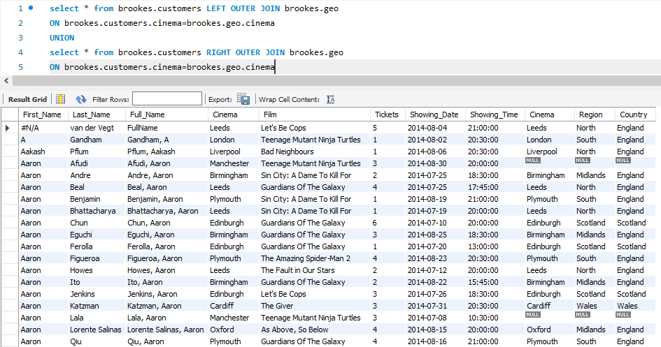

##### Full Outer Join: Example 2 (Issue)
```sql
select count(*) from customers LEFT OUTER JOIN geo ON customers.cinema=geo.cinema
UNION
select count(*) from customers RIGHT OUTER JOIN geo ON customers.cinema=geo.cinema
```
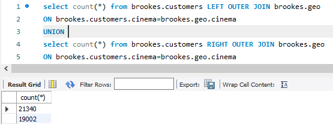

##### Full Outer Join: Example 2 (Solution)
```sql
select count(*) from customers LEFT OUTER JOIN geo ON customers.cinema=geo.cinema
UNION
select count(*) from customers RIGHT OUTER JOIN geo ON customers.cinema=geo.cinema where customers.cinema is NUll
```
> [!TIP]
> `where customers.cinema is NUll`的作用是筛选掉两个表共有的数据，避免重复显示，只显示`geo`表中有且`customers`表中没有的。

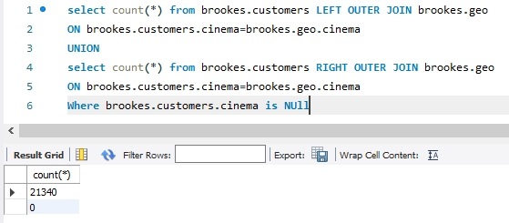

## Question
How to get the full number of rows and avoid getting the Null value?


## Missing Data
- Either ask for a CSV file with more data
- Or try
```sql
insert into geo values 
("Manchester","North","England");
```
- Full version
```sql
insert into geo (cinema, region, country) values 
("Manchester", "North", "England");
```

## Check the Answer
- Apply the right join again.
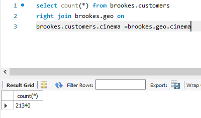

---

- Apply the full outer join again.
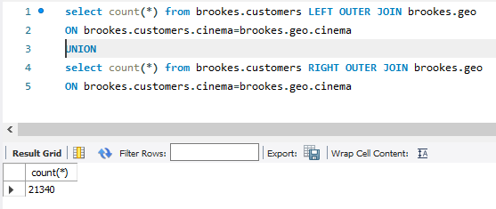
> `UNION ALL`

## Getting Additional Tables
- Film.csv
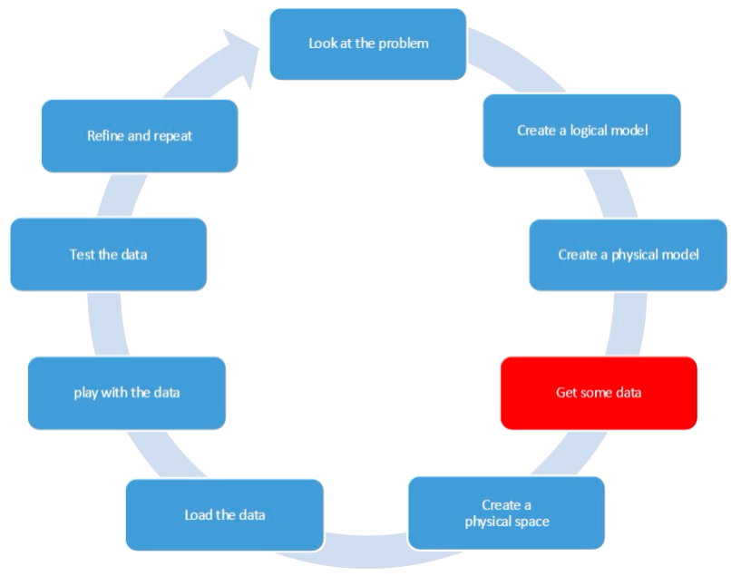

## Get Some Data

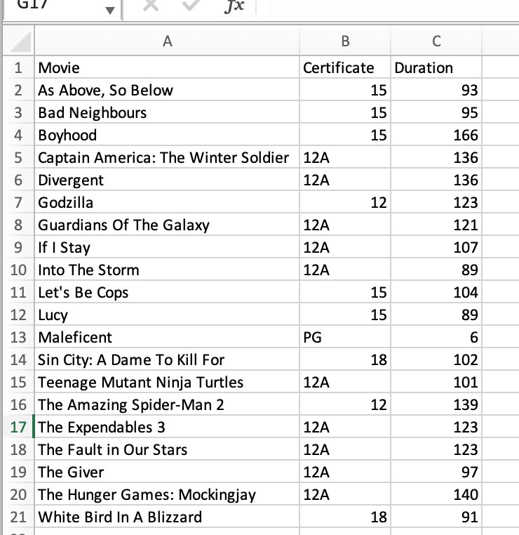

## Create a Table in Brookes
```sql
Create table Films 
(Movie varchar(40),
Certificate varchar(5),
Duration int);
```
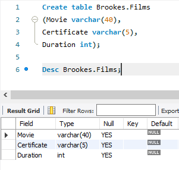

## Load The Data
```sql
LOAD DATA INFILE 'C:/ProgramData/MySQL/MySQL Server 8.0/Uploads/Films.csv'
INTO TABLE brookes.Films
CHARACTER SET latin1
FIELDS TERMINATED BY ','
ENCLOSED BY '"'
LINES TERMINATED BY '\n'
IGNORE 1 LINES;
```
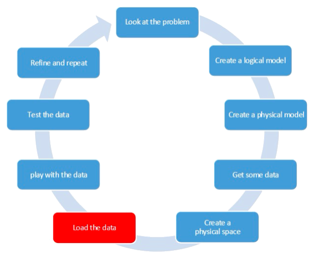

## Join All three tables
```sql
select * from Customers JOIN Geo ON Customers.cinema = Geo.cinema JOIN Films ON Customers.film = Films.movie;
```
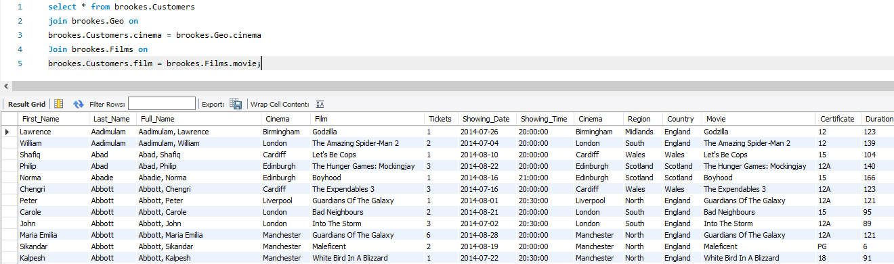
> 21340
