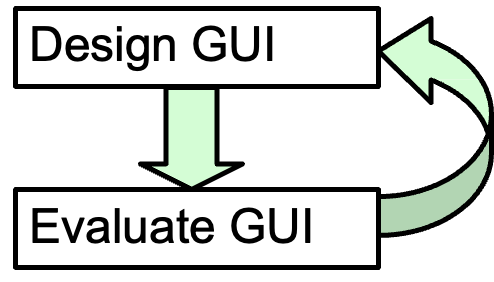
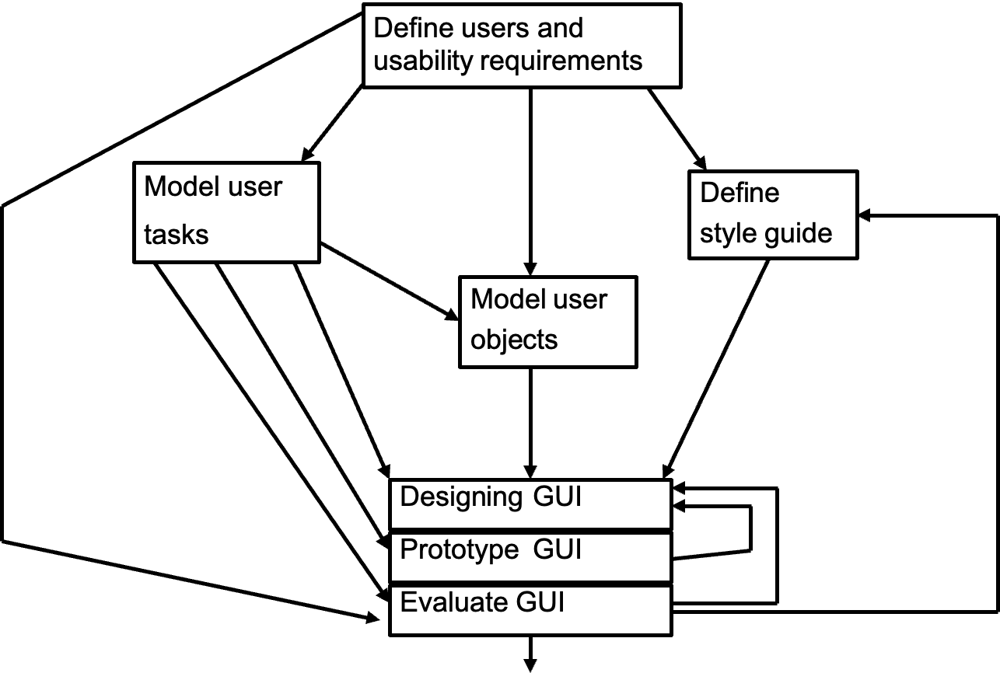
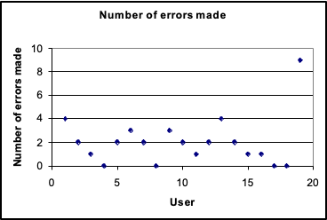
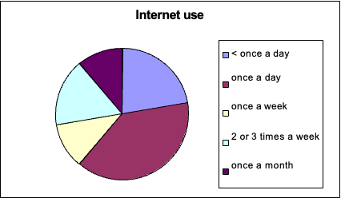
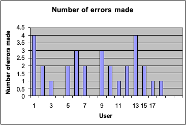

# The GUIDE Method
## This Week
- Overview of GUIDE
- Initial stages of the GUIDE method:
    - User classes
    - User requirements
- Data gathering and analysis
## Coursework Experience
The purpose of the coursework is for you to  experience the process of User-Centred Design.  
It involves
- specification
- design
- build
- evaluation
## Iterative Design
Basic idea:

The GUIDE process offers more guidance -> ->
## The GUIDE Method

### The GUIDE user-centred design process
- Starts with identifying the end-users and their  usability requirements;  
- Continues with analyzing users’ tasks and mental models;  
- Involves end-users participating in analysis,  design and prototyping;  
- Concludes with end-user evaluation of the  usability prototypes.
### User-Centered Design Theory
1. *Early and continual focus on users*
- Define a major group of potential users (if you can)
- Talk to them about good and bad points of their present job and/or system.
- Watch them doing their present job.
- Ask them to think aloud as they work. Try their jobs (if possible)
- Do a formal task analysis
- Develop testable behavioral goals *(Specific, Measurable, Achievable, Relevant, Time-bound)* for proposed systems. 
#### Define Users and Usability Requirements
- Who are the users? Describe the users in each class
    - e.g. characteristics, skills, knowledge?
- Identify user classes
- What usability requirements are critical?
- How can the usability requirements be measured?
    - e.g. performance levels, criteria
#### User Classes
- A user class is a subset of the total population of end-users who are similar in terms of their system usage and relevant personal characteristics.
- E.g. in a hotel room booking system an  important user role might be to maintain room  bookings. We might separate 3 user classes:
    - Reception desk staff
    - Management
    - Trainees
Users can be:
1. **primary** – those who interact directly with the system. *E.g. Account Holders*
2. **secondary** – those who will occasionally use it or use it through an intermediary. *E.g. Customer Service Representatives*
3. **tertiary** – those who will be affected by the systems use or who make decisions about its purchase. *E.g. Bank Managers, Data Analysts*
#### Examples of User Class Characteristics
- Type of user (direct/indirect/remote etc)
- Experience level (novice, intermediate, expert etc)
- Frequency of use
- Mandatory/optional use
- Educational ability
- Tasks performed
- General characteristics (e.g. age/sex if relevant)
- Language issues
- Learning style
### Usability Requirements
- ***Efficiency***: speed of performance
- ***Simplicity***: incidence of errors
- ***Satisfaction***: eg ability to recover from errors
- ***Learnability***: ease in learning the system
- ***Memorability***: ease of retention of learned skills
- ***Personalization***: ability to customize
- ***Effectiveness***: Ease with which users can achieve tasks
- ***Cognitive Load***: Mental demand
### Examples of Measurement
- Satisfaction:
SUS questionnaire - The System Usability Scale (SUS) provides a , reliable tool for measuring the usability.   It consists of a 10 item questionnaire with five response options for respondents; from Strongly agree to Strongly disagree.  Originally created by John Brooke in 1986, it allows you to evaluate a wide variety of products and services, including hardware, software, mobile devices, websites and applications.  
[http://www.usability.gov/how-to-and-tools/methods/system-usability-scale.html](http://www.usability.gov/how-to-and-tools/methods/)  
- Cognitive Load:
### A Quick Example to illustrate
> Calendar software

We will look at this to understand how GUIDE works.  
However, note that systems are so complex  that it would take longer than this lecture to document  and design. We will look at just some aspects of the  systems and design.  
#### Calendar

| Who are the users?                                                     | User classes?                                         | Usability requirements?                                                                                                                 | Measuring usability requirements?                                                                                                                                                                                                                                                                                                                                                                                                                                                                                                                                                                           |
| ---------------------------------------------------------------------- | ----------------------------------------------------- | --------------------------------------------------------------------------------------------------------------------------------------- | ----------------------------------------------------------------------------------------------------------------------------------------------------------------------------------------------------------------------------------------------------------------------------------------------------------------------------------------------------------------------------------------------------------------------------------------------------------------------------------------------------------------------------------------------------------------------------------------------------------- |
| •Business Professionals •Students •Families •Event Organizers | •Primary Users •Secondary Users •Tertiary Users | •Efficiency •Simplicity •Satisfaction •Learnability •Personalisation •Effectiveness •Cognitive Load •Accessibility | •**User Testing**: Observe their interactions with the software, note challenges faced, and gather feedback on perception and efficiency. •**Analytics**: identify frequently used features, and detect areas where users commonly encounter issues. •**Error Logs**: Monitor error logs to identify patterns related to user errors. This can help in pinpointing specific areas of the software that might need improvement to prevent user mistakes •**Surveys and Questionnaires**: Ask questions related to customization options, accessibility, and overall satisfaction with the software. |
##### Data Gathering
- Different kinds of requirements, e.g.
    - Functional (**specific behavior** or **functions**) It includes: login/logout, File uploading and downloading, managing accounts or transactions, generating reports and sending notifications
    - non-functional (**constraints** and **quality**) It includes: performance, usability, security, reliability, and scalability
- Data gathering methods, e.g.
    - Interviews
    - Questionnaires
    - Observation
- Data recording methods
##### Interviews
- Unstructured - are not directed by a script.  Rich but not replicable.
- Structured - are tightly scripted, often like a  questionnaire. Replicable but may lack  richness.
- Semi-structured - guided by a script but  interesting issues can be explored in more  depth. Can provide a good balance between  richness and replicability.
It can sometimes be useful to use props to  enrich the interview process, eg prototypes
###### Interview questions
- Two types:
    - `closed questions` have a predetermined answer format,  e.g., `yes` or `no`
    - `open questions` do not have a predetermined format
- Closed questions are easier to analyze
- Avoid:
    - Long questions
    - Compound sentences - split them into two
    - Jargon and language that the interviewee may not understand
    - Leading questions that make assumptions e.g., why do you like …?
    - Unconscious biases e.g., gender stereotypes
##### Questionnaires
- Questions can be closed or open
- Closed questions are easier to analyze, and may be done by computer
- Can be administered to large populations
- Paper, email and the web used for dissemination
- Sampling can be a problem when the size of a  population is unknown as is common online
###### Questionnaire Design
- The impact of a question can be influenced by  question order.
- Do you need different versions of the  questionnaire for different user classes?
- Provide clear instructions on how to complete  the questionnaire.
- Strike a balance between using white space  and keeping the questionnaire compact.
- Decide on whether phrases will all be positive,  all negative or mixed.
###### Response Format
- Question Type e.g.
    - Multiple Choice
    - Scale
    - Grid
##### Questionnaires
- Advantages
    - Responses are usually received quickly
    - No copying and postage costs
    - Data can be collected in database for analysis
    - Time required for data analysis is reduced
    - Errors can be corrected easily
- Disadvantages
    - Sampling is problematic if population size is  unknown
    - Preventing individuals from responding more than once
##### Observation
- Direct observation in the field
    - Eg at work, on the move
- Direct observation in controlled environments
    - Eg labs, think aloud
- Indirect observation: tracking users’ activities
    - Diaries
    - Interaction logging
    - Web analytics
##### Data Recording
- Notes, audio, video, photographs
- Notes plus photographs
- Audio plus photographs
- Video
##### Data gathering: Summary
- Three main data gathering methods:  interviews, questionnaires, observation
- Interviews may be structured, semi-structured  or unstructured
- Questionnaires may be on paper, online or  telephone
- Observation may be direct or indirect, in the  field or in controlled setting
- Techniques can be combined depending on  study focus, participants, nature of technique  and available resources
##### Data Analysis
- Quantitative data – expressed as numbers
- Qualitative data – difficult to measure sensibly as numbers, e.g. count number of words to measure dissatisfaction
- Quantitative analysis – numerical methods to ascertain size, magnitude, amount
- Qualitative analysis – expresses the nature of elements and is represented as themes, patterns, stories
##### Simple Quantitative Analysis
- Simple statistical measures, eg
    - Mean(平均数): add up values and divide by number of data points
    - Median(中位数): middle value of data when ranked
    - Mode(众数): figure that appears most often in the data
- Percentages
- Graphical representations give overview of data

- Recurring patterns or themes
    - Emergent from data, dependent on observation  framework if used
- Categorizing data
    - Categorization scheme may be emergent or pre-  specified
- Looking for critical incidents
    - Helps to focus in on key events
- Theoretical frameworks, eg:
    - Grounded Theory
    - Distributed Cognition
    - Activity Theory
Table reproduced from Interface Design by Preece, Sharp and Rogers
<table border="1" cellspacing="0" cellpadding="6">
  <thead>
    <tr>
      <th></th>
      <th>Usual raw data</th>
      <th>Example qualitative data</th>
      <th>Example quantitative data</th>
      <th>Initial processing steps</th>
    </tr>
  </thead>
  <tbody>
    <tr>
      <td><b>Interviews</b></td>
      <td>Audio recordings. Interviewer notes. Video recordings.</td>
      <td>Responses to open questions. Video pictures. Respondent's opinions.</td>
      <td>Age, job role, years of experience. Responses to closed questions.</td>
      <td>Transcription of recordings. Expansion of notes.</td>
    </tr>
    <tr>
      <td><b>Questionnaire</b></td>
      <td>Written responses. Online spreadsheet.</td>
      <td>Responses to open questions and ‘further comments’. Respondent's opinions.</td>
      <td>Age, job role, years of experience. Responses to closed questions.</td>
      <td>Clean up data. Filter into different datasets.</td>
    </tr>
    <tr>
      <td><b>Observation</b></td>
      <td>Observer's notes. Photographs. Audio and video recordings. Data logs. Think-aloud.</td>
      <td>Records of behaviour. Description of a task as it is undertaken. Copies of informal procedures.</td>
      <td>Demographics of participants. Time spent on a task. The number of people involved in an activity.</td>
      <td>Expansion of notes. Transcription of recordings. Synchronization between data recordings.</td>
    </tr>
  </tbody>
</table>

## What we have learnt in Week 2?
- Initial stages of the GUIDE method:
    - User classes
    - User requirements
- Data gathering and analysis
## Next Week 3
- Task Analysis
- Mental Models
