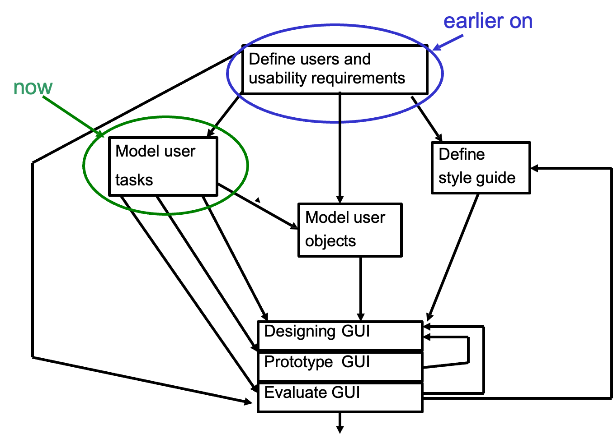
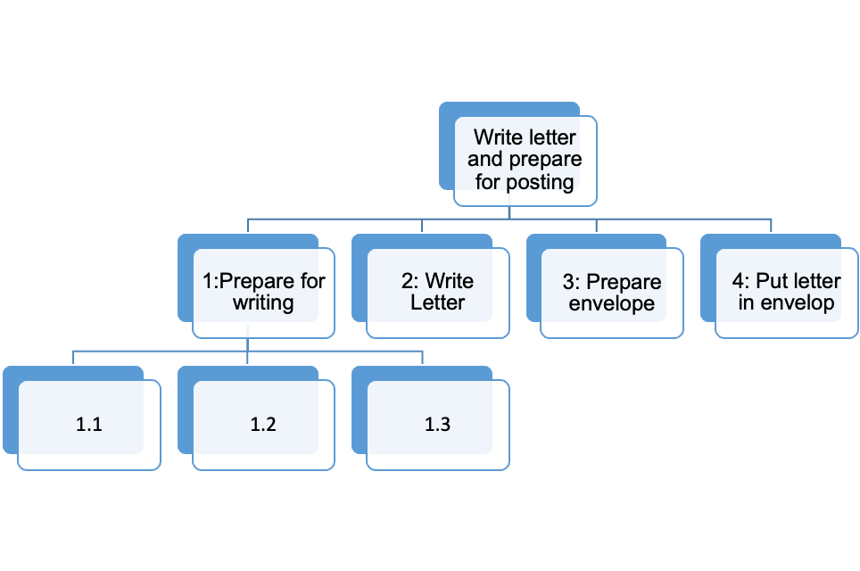
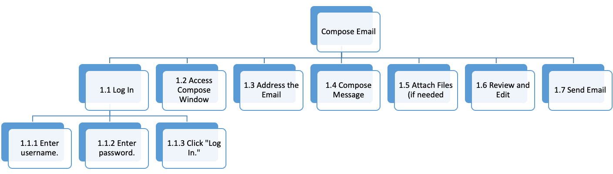
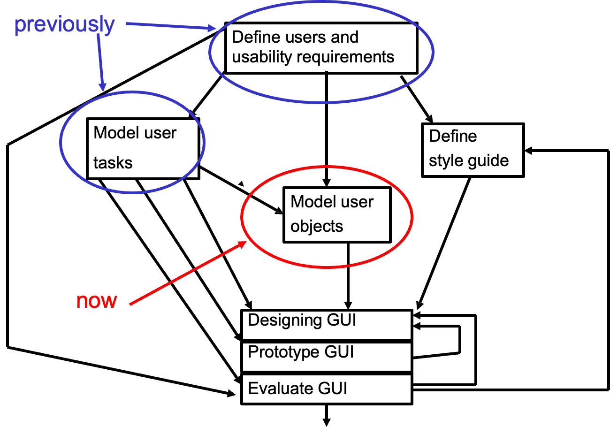
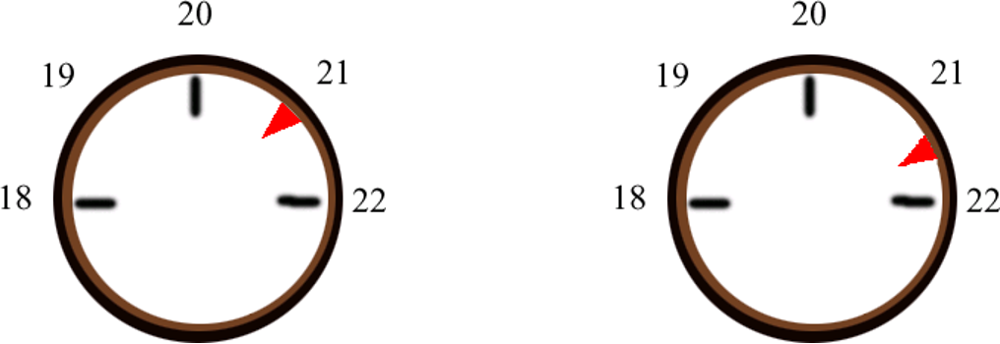
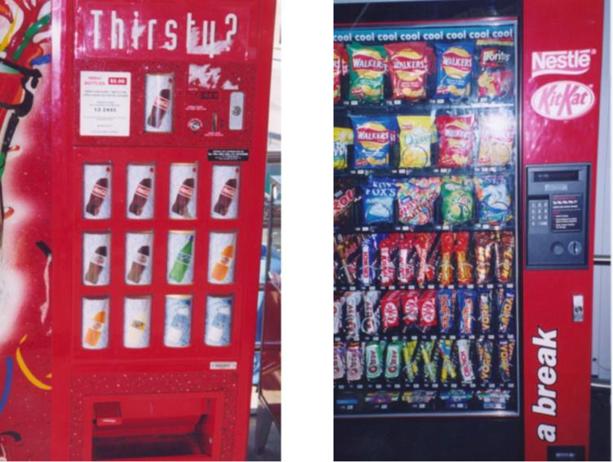

# Task Analysis, User Object Modeling
## This Week
- User Task analysis
- User Object Modeling
- Mental Models
> Further reading:  
> Redmond-Pyle & Moore, Sections 3.3, Chapters 6, 7

## The Guide Method

## What is a user task and Modeling?
Example of a task (Send a message)
- Modeling (Processes of sending message)
    - Use mobile
    - Open message application
    - Type a message
    - Send it
- To accomplish goal, Each Task should be
    - Meaning full
    - Associated with a goal
    - Identifiable by a user

## The Aim of Modeling User Tasks

Modeling user tasks enable us to analyze the tasks and conceptual objects; this then provides useful information for the design of the interface.

## The Objectives of Task Analysis
- **Understand User Goals**: helps in identifying and understanding the goals users want to achieve while interacting with a system
- **Analyze User Tasks**: involves breaking down complex tasks into smaller, manageable steps
- **Create Task Models**: forms the basis for creating task models, which are graphical representations of tasks, actions, and interactions
- **Develop Task Scenarios**: Task scenarios are detailed narratives describing specific situations in which users interact with a system to accomplish tasks.

## Task Scenarios
Task scenarios are detailed descriptions of a specific situation or context in which a user might interact with a product, service, or system (initial circumstances, input, subtasks).  

- A scenario could include typical data; it may, include exceptions. It can be thought of as a test case for a task, including
    - a situation or set of circumstances for a task
    - a script describing how a user performs a task

### Task Scenarios-Example
**Scenario: Online Grocery Shopping Task Analysis**  
**Background**: Sarah, a working professional, wants to buy groceries online due to her busy schedule. She has limited time and wants to efficiently complete her grocery shopping without any hassle.

## Task Analysis
- Task Analysis is
    - the study of what a user will want to do with the system
    - documentation of the information and control facilities used to carry out a task
    - a methodology to help the analyst collect and organize information then use it to make design decisions.
- Relevant information about each task may include:
    - who performs it
    - frequency
    - average performance time
    - user error frequency
    - notes about the context in which the task is performed

## Task Models
This an abstract model of the structure of the tasks that users carry out. Two well-known task models are  
GOMS 
    &emsp;&emsp;&nbsp;<strong>G</strong>oals, <strong>O</strong>perators, <strong>M</strong>ethods, <strong>S</strong>election Rules
      
<strong>Task Hierarchy Diagram</strong> 
    &emsp;&emsp;&nbsp;- goals, tasks, operations, plans 
    &emsp;&emsp;&nbsp;- hierarchies, redescription, stopping rules
    

Both models  
    &emsp;&emsp;&nbsp;- have different ways of breaking large tasks down into smaller tasks  
    &emsp;&emsp;&nbsp;- ultimately identify the conceptual actions and conceptual objects of the system

## Task Hierarchy Diagrams
Notes:
- The structure of the tree indicates how one task is  broken up into subtasks
- There are notations for indivisible sub-tasks, and for indicating which sub-task has its own diagram.
- The diagrams can be added to indicate the order of  tasks (if not obvious from the diagram) or conditions under which the tasks are performed

## Hierarchy Task Analysis
### Example 1
Write letter and prepare for posting (Main Task)  
1: Prepare for writing  
    &emsp;&emsp;&nbsp;1.1 Get paper  
    &emsp;&emsp;&nbsp;1.2 Get envelop  
    &emsp;&emsp;&nbsp;1.3 Get pen  
    &emsp;&emsp;&nbsp;1.4 Get address Book  
2: Write Letter  
    &emsp;&emsp;&nbsp;2.1 Write own address  
    &emsp;&emsp;&nbsp;2.2 Write addressee’s address  
    &emsp;&emsp;&nbsp;2.3 Write date  
    &emsp;&emsp;&nbsp;2.4 Write body text of letter  
3: Prepare envelope  
    &emsp;&emsp;&nbsp;3.1 Write name on envelope  
    &emsp;&emsp;&nbsp;3.2 Write address on envelope  
4: Put letter in envelop  
    &emsp;&emsp;&nbsp;4.1 Fold letter  
    &emsp;&emsp;&nbsp;4.2 Place letter into envelop  
    &emsp;&emsp;&nbsp;4.3 Seal envelop  

### Example 2
Compose Email (Main Task)  
1.1 Log In  
    &emsp;&emsp;&nbsp;1.1.1 Enter username.  
    &emsp;&emsp;&nbsp;1.1.2 Enter password.  
    &emsp;&emsp;&nbsp;1.1.3 Click "Log In."  
1.2 Access Compose Window  
    &emsp;&emsp;&nbsp;1.2.1 Click "Compose" or "New Email" button.  
1.3 Address the Email  
    &emsp;&emsp;&nbsp;1.3.1 Enter recipient's email address.  
    &emsp;&emsp;&nbsp;1.3.2 Enter a subject for the email (optional).  
1.4 Compose Message  
    &emsp;&emsp;&nbsp;1.4.1 Type the email message in the message body.  
    &emsp;&emsp;&nbsp;1.4.2 Format text (e.g., bold, italicize, bullet points).  
1.5 Attach Files (if needed)  
    &emsp;&emsp;&nbsp;1.5.1 Click "Attach" or "Insert" button.  
    &emsp;&emsp;&nbsp;1.5.2 Select files from local storage.  
1.6 Review and Edit  
    &emsp;&emsp;&nbsp;1.6.1 Proofread the email for errors.  
    &emsp;&emsp;&nbsp;1.6.2 Make edits if necessary.  
1.7 Send Email  
    &emsp;&emsp;&nbsp;1.7.1 Click "Send" or "Send Email" button.  
    &emsp;&emsp;&nbsp;1.7.2 Confirm the email is sent successfully.  

## Task Analysis-Example
**Scenario: Online Grocery Shopping Task Analysis**
**Background**: Sarah, a working professional, wants to buy groceries online due to her busy schedule. She has limited time and wants to efficiently complete her grocery shopping without any hassle

Task Analysis:

| Task 1: Create a Shopping list                                                                                                                                                                                                                                                                                                                                        | Task 2: Place an Order                                                                                                                                                                                                                                                                                                                                                                              |
| --------------------------------------------------------------------------------------------------------------------------------------------------------------------------------------------------------------------------------------------------------------------------------------------------------------------------------------------------------------------- | --------------------------------------------------------------------------------------------------------------------------------------------------------------------------------------------------------------------------------------------------------------------------------------------------------------------------------------------------------------------------------------------------- |
| Subtask **1**: Access the grocery shopping app. Subtask **2**: Browse categories or search for specific items. Subtask **3**: Add desired items to the shopping list. Subtask **4**: Review the list for accuracy. **Usability Insights**: Check if Sarah can easily find items, add them to the list, and review the list before finalizing her choices. | Subtask **1**: Navigate to the cart. Subtask **2**: Review items in the cart. Subtask **3**: Confirm the delivery address and payment method. Subtask **4**: Place the order and wait for confirmation. **Usability Insights**: Ensure the checkout process is straightforward, with clear instructions for verifying the order, entering payment details, and confirming the purchase. |

## Why use Task Analysis?
- To ensure efficient and effective integration of the human element into system design
- To more clearly establish the relationship between
    - human requirements & limitations
    - design preferences & constraints
- To avoid the design of sub-optimal systems

## The process of Task Analysis
1. Define the Task
- Identify the task
- Understand the context

2. Identify the Users
- Define the user demographics:
- Identify user goals

3. Observe and Document
- Observe users
- Take notes

4. Decompose the Task
- Break down the task
- Hierarchical breakdown

5. Create Task Flow Diagrams
- Visual representation
- Annotate the diagram

6. Analyze Pain Points
- Identify challenges
- Determine causes

7. Validate with Users
- Usability testing
- Iterative process

8. Document Findings
- Create a task analysis report
- Visual aids

9. Iterate and Improve

## We have learnt….
✅What is User Task?  
✅User Task Analysis?  
✅Task Analysis Models?  
✅Examples of Task Analysis?  
✅Processes of Task Analysis  

## The Guide Method

## User Object-User object Modeling
✅What is a User Object?  
✅Characteristics of User object?  
✅User Object Modeling?  
✅Benefits of User Object Modeling?  

## What is a User Object?
Examples of user objects in different software:
- A **business system object** (Invoice, Customer)
- A **computer system object** (Printer) .
- A **container object** (folder/directory, list)
- **In LMS** (student, student number, timetable,  module, module registration etc.)
- **In Calendar software** (day, week, month,  meeting, etc.)

## Identifying User Objects
User objects can be identified from
- discussion with users
- models and scenarios
- (optionally if one is available) a data model
Identify objects from users by asking them!
- what objects do they perform the tasks on?
- what other objects are used in the task, i.e. what  objects are used as containers, tools, devices, inputs, reference sources?
- what additional objects would be useful if they  were available or feasible?

## Characteristics of a User Object
- **contain** other objects 
    - useful when the user needs to manipulate collections of objects
    - e.g. in the calendar, Years contain Months contain  Weeks et. Days contain time slots.
- exist in a **relationship** with other objects 
    - a relationship between objects may indicate that the related objects can be regarded as a single entity, at some level

---

- have **attributes** - describe characteristics of an object,
    - e.g., name, size, no. of objects in collection.
- have **actions** - the processes which can affect the object
    - e.g., delete, create, rename, sort
- have **subtype** - a subtype inherits the  attributes, actions etc. of its parent object type, but may well have additional attributes, actions etc. of its own.

## User Object Modeling
- To understand and define the user's concepts of  the objects in the system
- To express required system behavior in terms of objects in the system, and actions that the  user can perform on them.

> For more detail: Chapter 3-Interaction Design(Beyond human computer interaction)

## User object model for a Calendar
This includes (amongst other things):  
Types of objects  
    &emsp;&emsp;&nbsp;Days, weeks, months  Meetings, birthdays  
Actions the user can perform on (or with) an object of a particular type (user object actions)  
    &emsp;&emsp;&nbsp;Birthday – Add, remove, change 
    &emsp;&emsp;&nbsp;Meeting – Add, remove, change 
    &emsp;&emsp;&nbsp;(etc.)

## Benefits of User Object Modeling
- Promotes the usability of the GUI by ensuring that  serious thought is given to how the end-user will conceptualize and comprehend the objects in the system.
- Promotes an object-action style of user interface
- Promotes an object-based GUI design
- Helps the user to form a <i>mental model</i> of what is going on ->->->

## We have learnt…
✅What is a User Object?  
✅Characteristics of User object?  
✅User Object Modeling?  
✅Benefits of User Object Modeling?  

## Mental (or Conceptual) Models
To design for the Human Computer Interface we need to know how users approach a new interface:  
When using a computer system, users have a mental model of what they hope to achieve: their **goals and intentions**  
<i>People don’t actually know everything about the interface but just work out what will be useful to them. 
People try things out and look for patterns and consistencies - they are building a conceptual model of how the interface works  
</i>

### When a mental model goes wrong
Which thermostat setting should be chosen to warm up the room more quickly?

### Mental Models
Mental models are:
- used all the time to work out how the world will behave
- built up using different areas of our knowledge
- usually get better with more knowledge

### Example: which vending machine is easiest, and why?

## Errors
**Definition**: Errors occur when there is a mismatch between the mental model a person has and the actual system or situation. These deviations lead to incorrect actions or decisions.  
**Example**: Emma tries to close an application on her computer by clicking the red "X" button in the corner. However, the application doesn't close because her mental model of the system is based on Mac OS, but she is using a Windows computer.  

## Slips vs. Mistakes
***Slip***: you have the right mental model but  accidentally do the wrong thing  
**Example**: James, who is familiar to his old car, turns the key in his new car's ignition and realizes he has turned on the windshield wipers instead of the engine. His muscle memory is based on his old car's setup.  
***Mistake***: you have the wrong mental model  
**Example**: Sarah mistakenly believes that all smartphones have the same operating system interface. When she tries to use gestures on her friend's phone, it doesn't work as expected because she applied the wrong mental model to a different system  
- Improved design will reduce the chances of slips
- Improved affordance and feedback will reduce the chances of mistakes

## Two Characteristics of Mental Models
> Help individuals understand and interact with systems  

**Structural models** emphasize the system’s architecture (the “what”), while  
**Functional models** focus on its behavior or operation (the “how”). Both models are crucial for understanding complex systems from different perspectives.  

## Uses of mental models
The model will only help <mark>IF</mark> the users mental model is a true reflection of what is really the case!!  

This is why we want interfaces to help construct <mark>good</mark> mental models.  

## Next week
✅Paper Prototypes  
✅Design Principles  
✅Usability Testing  
