# Prototypes, Design Principles, Usability Testing
## This Week
- Prototyping
- Design Principles
- Style guide
- Gulfs of evaluation and execution
- Usability Testing 

## Prototyping
<video src="/l5-hci-week4-lecture-assets/YTDown.com_YouTube_What-Is-A-Prototype_Media_WZpv4eBcHik_001_1080p.mp4" type="video/mp4" controls="controls" preload="meta"></video>

### Types of Prototyping and processes
1. Low-Fidelity Prototypes (Lo-Fi)
2. Mid-Fidelity Prototypes
3. High-Fidelity Prototypes (Hi-Fi)
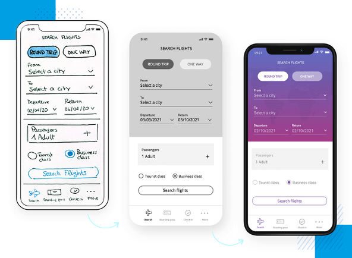

#### 1. Low-Fidelity Prototypes (Lo-Fi)
These are simple, rough representations of a design concept. They help in exploring ideas quickly without focusing on visuals or details.  
Examples:
- **Paper sketches or wireframes**
Purpose:
- Visualize structure and layout
- Explore multiple ideas quickly
- Gather early feedback on flow and usability
- Quick and cheap
- Saves implementation time

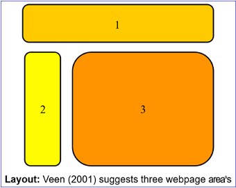
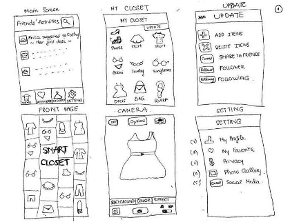
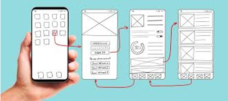

#### 2. Mid-Fidelity Prototypes
These add more detail and structure than low-fidelity ones but are still not fully polished.  
Characteristics:
- Basic UI elements (buttons, menus, icons)
- Partial content and limited colors
- Some interactivity (clickable navigation)
Tools:
- Figma, Adobe XD, Sketch, Axure
Purpose:
- Refine navigation flow
- Test functionality and layout clarity
- Communicate design direction to stakeholders

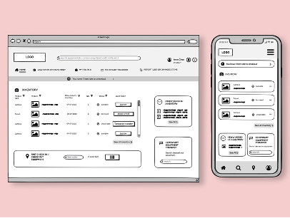
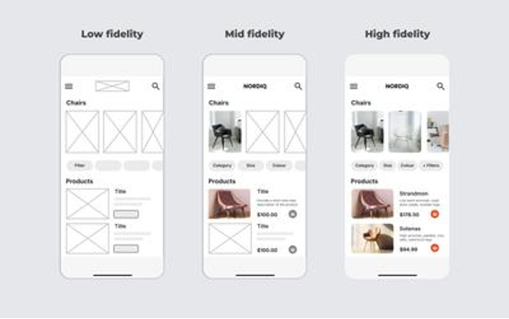

#### 3. High-Fidelity Prototypes (Hi-Fi)
These are close to the final product in terms of visuals, interaction, and user experience.
Characteristics:
- Real images, icons, fonts, and colors
- Interactive animations and transitions
- Functional components mimicking real app behavior
Tools:
- Figma, Adobe XD, InVision, ProtoPie, Framer
Purpose:
- Conduct realistic usability testing
- Get stakeholder approval
- Serve as a reference for developers

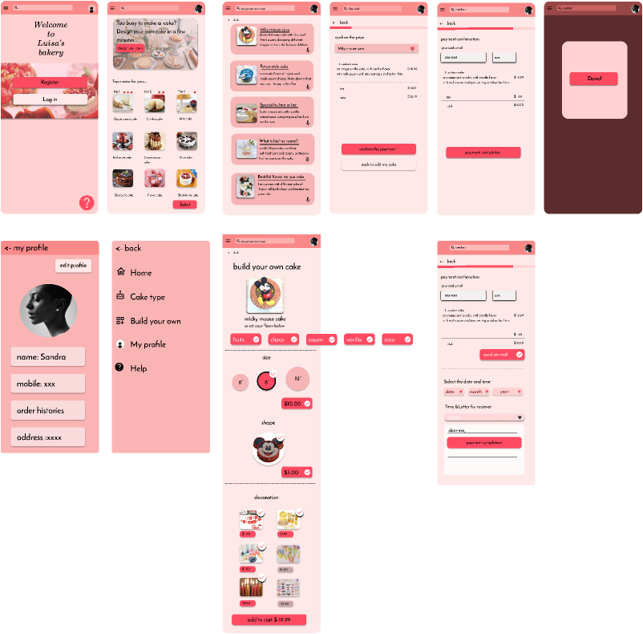

## The Guide Method
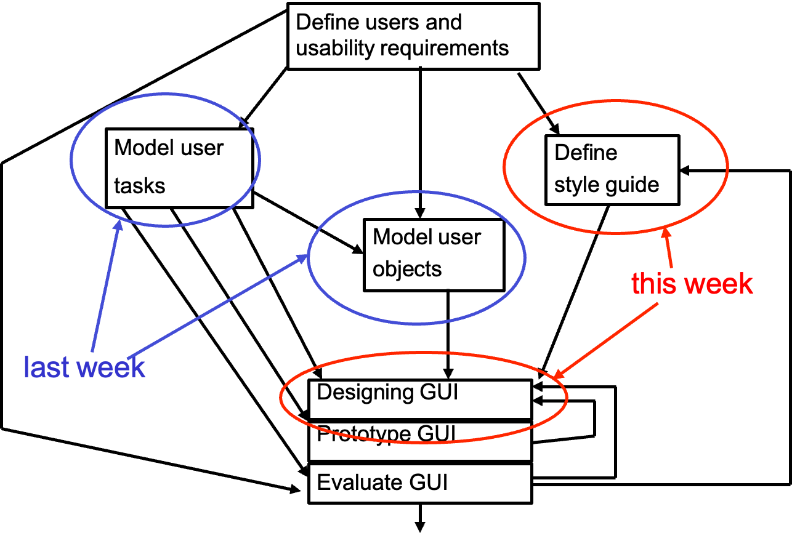

## Guidelines for interface design
ways to present general interface design guidelines  

**General guidelines for interface design** is a crucial part of communicating standards that ensure usability, consistency, and accessibility across digital products.

## General guidelines for interface design
1. Design Principles Document
This is a **written set of high-level rules** that guide design decisions across projects.
2. Design System / Style Guide
A **design system** or **style guide** is a comprehensive visual and functional library that defines how UI elements should look and behave.
3. Heuristic Checklists
Heuristic checklists are **evaluation tools** based on established usability principles (like Nielsen’s 10 heuristics
4. Storyboards and Personas
These **visual storytelling tools** communicate design guidelines through user scenarios.
5. Interactive Prototypes and Demonstrations
Instead of static documents, guidelines can be **shown in action** through prototypes.
6. Training Workshops and Presentations
Sometimes, guidelines are best introduced through **live sessions** or **team workshops**.

---

There are several ways of presenting general guidelines  for interface design. We will have a look at two:  

Shneiderman's Guidelines (Shneiderman, 1999) Microsoft Windows Style Guidelines.

### Shneiderman's Guidelines
Ben Shneiderman, a leading expert in (HCI), developed a set of principles to guide designers in creating user-friendly, efficient, and error-tolerant interfaces.  
**key principles-** form the foundation for effective interface design
- *Know Thy User,* 
- *Follow the Eight Golden Rules,*
- *Prevent Errors*

#### Principle 1: “Know Thy User”
- Designers must have a **deep understanding of their users** — their goals, abilities, limitations, preferences, and working environments. Knowing your user helps ensure the system is intuitive, accessible, and aligned with real user needs.
- Conduct user research (interviews, surveys, observations).
- Create user personas and user journey maps to understand motivations and pain points.
- Design with empathy — consider different user skill levels, including beginners, intermediates, and experts.
- Provide customization or flexibility (e.g., shortcut keys for expert users, guided tutorials for novices).

#### Principle 2: Follow the Eight Golden Rules
Classic set of usability heuristics that guide the structure and behavior of interactive systems.
1. **Strive for consistency**
Use consistent terminology, layout, colors, and behavior throughout the interface.
2. **Enable frequent users to use shortcuts**
Allow experienced users to work faster with keyboard shortcuts or command customization.
3. **Offer informative feedback**
The system should always keep users informed about what’s going on (e.g., “File uploaded successfully”).
4. **Design dialogs to yield closure**
Organize interactions into clear sequences with a beginning, middle, and end (e.g., confirmation messages after completing a task).
5. **Offer simple error handling**
Design the interface to prevent errors when possible and provide clear instructions to recover when they occur.
6. **Permit easy reversal of actions**
Support undo, redo, or back functions so users can explore without fear.
7. **Support internal locus of control**
Let users feel in control of the system — avoid unexpected actions or interruptions.
8. **Reduce short-term memory load**
Keep information visible and minimize the need to remember data between screens or steps.

#### Principle 3: Prevent Errors
A well-designed interface should **minimize the possibility of user errors** and help users **recover gracefully** if mistakes occur. Error prevention is more effective than error correction.  
**Application in UX/UI Design:**
- Use **constraints** to prevent invalid inputs (e.g., date pickers, drop-down lists).
- Provide **real-time validation** (e.g., “Password must include at least 8 characters”).
- Use **confirmation dialogs** for critical actions (e.g., deleting files).
- Highlight potential mistakes before they happen (e.g., warning icons or tooltips).
- Design **clear error messages** that explain what went wrong and how to fix it.

### Microsoft Windows Style Guidelines
- **Clarity and Affordance**
Buttons and interactive elements should clearly appear clickable or tappable.
- **Navigation**
Use a clear, consistent, and easy-to-follow menu structure.
- **Commands and Actions**
Label buttons with clear action verbs (e.g., Save, Submit, Cancel).
- **Layout and Alignment**
Align icons, buttons, and text to maintain a clean, balanced interface.
- **Typography**
Use legible fonts (e.g., Arial, Segoe UI) for comfortable on-screen reading.
- **Color and Contrast**
Apply colors purposefully
- **Feedback**
Provide clear responses to user actions (e.g., confirmation after submitting a form).
- **Responsiveness**
Ensure quick and smooth reactions to user inputs without noticeable delay.
- **Accessibility**
Design interfaces usable by all, including users with disabilities

## Application Style Guide
- An <strong>application style guide</strong> is a set of rules that defines how a user interface (UI) should look and behave. It helps ensure that all parts of an application have a <strong>consistent design and user experience</strong>.
    - Defines a standard interface style
    - Focuses on the surface (appearance)
    - Creates a uniform “look and feel”
        - “Look” means the visual appearance — colors, typography, and layout.
        - “Feel” means how users interact with it — the behavior when clicking buttons, navigating menus, or getting feedback.

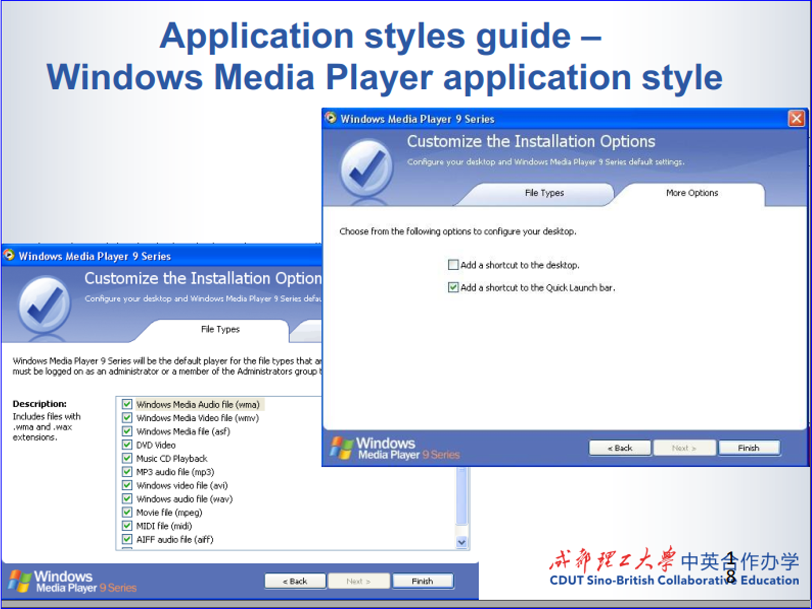
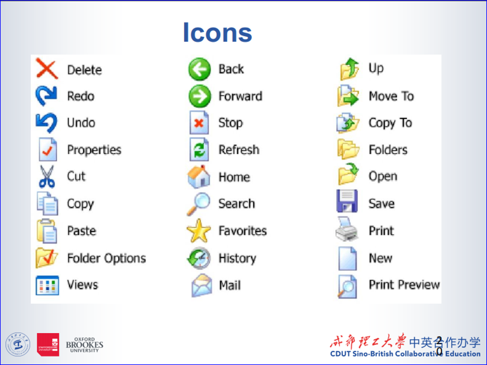

### Application style guide: benefits
A more consistent user interface
- Increased user productivity, because a consistent style reduces what users need to learn and remember, resulting, in shorter training time and fewer user errors.
- Reduction in the huge range of choices offered to GUI designers in color, font sizes and styles, window controls, etc.
- Increased developer productivity, because developers are applying and specializing standard formats rather than re-inventing new ones.
- Enhances collaboration among team members. Designers, developers, and other stakeholders can refer to the style guide
- Facilitates rapid/fast prototyping and wire framing  

## Contents of a style guide
1. Introduction: 
   **Overview:** Explanation of the purpose and scope of the style guide. 
   **Target Audience:** Information about who the style guide is intended for (e.g., designers, developers, writers). 
   **Revision History:** Details about updates and revisions made to the style guide over time. 
2. Product Identity: 
   **Mission and Values:** The core principles and beliefs of the brand. 
   **Logo Usage:** Guidelines on how the logo should be used, including size, color variations, and clear space requirements. 
   **Color Palette:** Primary and secondary colors 
   **Typography:** Fonts, sizes, and styles to be used in various contexts (headings, body text, etc.). 
   **Imagery:** Guidelines for selecting and using images, illustrations, and graphics that align with the brand's visual identity.  
3. UI Design:
   - **Layout Grid:** Information about the grid system used for the layout, specifying column widths, gutters, and margins.
   - **Interactive Elements:** Styling and behavior guidelines for buttons, links, form fields, etc.
   - **Navigation:** Design principles for menus, navigation bars, and other navigation elements.
   - **Iconography:** Guidelines for icon design, including size, style, and context of use.
   - **Forms:** Best practices for form design, including input fields, labels, and error messages.
   - **Feedback and Animation:** Guidelines for providing feedback to users and using animations/transitions
4. Content Guidelines: 
   **Tone of Voice:** Describes the brand's tone, whether it's formal, casual, technical, etc. 
   **Writing Style:** Guidelines for grammar, punctuation, and style preferences (e.g., Oxford comma usage). 
   **Content Structure:** How content should be organized, including headings, subheadings, and bullet points. 
5. Development Guidelines: 
   **Coding Standards:** Best practices for writing clean and maintainable code in various programming languages. Responsive 
   **Design:** Guidelines for ensuring the application's responsiveness on different devices and screen sizes. 
   **Accessibility:** Techniques and best practices for making the application accessible to users with disabilities. 
6. Usage Examples: 
   **Real-life Examples:** Demonstrations of correct and incorrect usage of design elements and content. 
   **Case Studies:** In-depth analyses of successful design implementations 
7. Glossary: 
   **Key Terminology:** Definitions of terms and jargon used within the context of the brand or industry. 
8. Resources: 
   **Tools and Software:** Information about software tools used for design, development, and collaboration. 
   **Assets:** Access to downloadable assets, such as logo files, templates, and design elements. 
9. Contacts: 
   **Support:** Contact information for individuals or teams providing support for design, development, or content-related queries.  

## Problems with the Design of Interfaces
<strong>Gulfs of Execution and Evaluation</strong>  
When a user is trying to carry out tasks using an interface, there are two very common types of problem they can encounter:  
<i>gaps in the interaction between users and systems</i>  

Gulf of Execution refers to the gap between a user’s intentions (what they want to do) and the actions available to them in the system (what they can actually do).  
**Example:** Imagine a user wants to print a document but struggles to find the "Print“ button in a new software interface.  

Gulf of Evaluation refers to the gap between the system’s response and the user’s ability to interpret that response to determine whether their action was successful."  
**Example:** Suppose the user clicks "Print" on a document. After clicking, nothing seems to happen, and there's no feedback from the system  

## Reducing the Gulfs
To reduce the gulfs, provide:
- Visibility (affordances)
- Feedback
- Consistency
- Non-destructive operations
- Discoverability
- Reliability
> Donald A. Norman and Jakob Nielsen. 2010. Gestural interfaces:a step backward in usability. Interactions 17, 5 (September 2010), 46-49.

## Usability
<video src="/l5-hci-week4-lecture-assets/YTDown.com_YouTube_User-Experience-Design-What-is-Usability_Media_UnaxPVbBYiE_001_720p.mp4" type="video/mp4" controls="controls" preload="meta"></video>

---

**Usability** refers to how easy and effective it is for users to interact with a system, product, or service. Usability measures how well a system supports users in achieving their goals with efficiency, satisfaction, and minimal errors.

### Examples of usability questions
- Will the design of this ATM prevent people from leaving their bank cards behind?
- Is this button on the screen too small to press accurately? 
- And if the user accidentally presses the button, will he/she manage to undo the effects?  
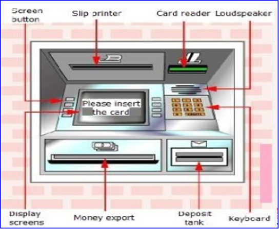

### General Categories of Usability
See Redmond-Pyle & Moore, Section 1.2: 
- <i>Effectiveness:</i> 
    - How effectively and/or quickly can the users perform their tasks using the interface? 
- <i>Learnability:</i> 
    - How much training time and practice do users require to be effective with the system?
    - If users only use the system intermittently, how long does it take to relearn the system each time they use it?  
- <i>Flexibility:</i> 
    - Is the interface still effective if there are changes in the task or environment?
- <i>Attitude/Satisfaction:</i> 
    - Do people experience using the system as frustrating, or rewarding?
    - Do users like the system?  

### The need to measure usability
We need to be able to measure usability, to get feedback about our designs (and thus improve them) (Dumas & Redish p184).  
a lot of valuable information can be gained, which can improve a design greatly. This is the whole point of measuring usability.

### Measuring Usability
- Useful terminology: 
    - A measurement is <i>formative</i> if it gives back information that provides input into a design (helps form the design)
    - A measurement method is <i>summative</i> if it gives information about whether a design meets a standard or not, with no feedback into the design

#### Usability Measuring Methods
According to Preece, there are **two main types of evaluation methods** used in design: **theoretical** and **practical**.
1. Analysis (Theoretical Method)
- This method focuses on **thinking and reasoning** about how users will interact with the design, not actually building or testing it.
- You create a **model of the user’s activities** (how they would use the system), and then you **analyze** that model to predict problems or improvements.
- It doesn’t require a working prototype or implementation, just a detailed description of the design.
- It’s **low-cost** and can be done early in the design process.
- It also needs **very little advance planning** compared to real user testing.
2. Evaluation (Practical Method)
- In this method, the design must be **built or implemented**, at least as a **prototype** (a working model).
- The prototype is then **tested with real users** to see how well it works and how people actually use it.
- It is **more expensive** than theoretical analysis because it takes **time, planning, and resources** to build and test the system.
- There are **many ways to test**, such as usability testing, user observation, interviews, or surveys but it’s important to **observe users** while they interact with the design.

## Evaluation (formative)
- Formative evaluation means **testing and improving the design while it’s still being developed** so that each new version is better than the last.

## Evaluation (summative)
- Summative evaluation means **testing the complete product at the end** to see how well it works, and using the results to **improve the next version**.

## Key Takeaways from Today
- Prototyping
- Design Principles
- Style guide
- Gulfs of evaluation and execution
- Usability Testing

## Next Week
- Evaluation

