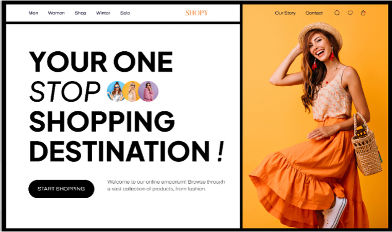
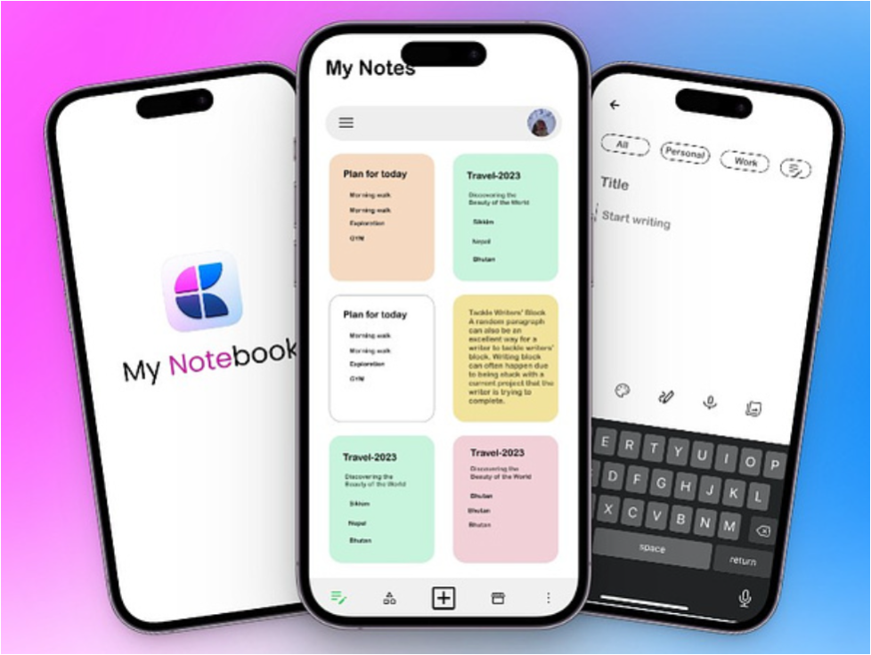
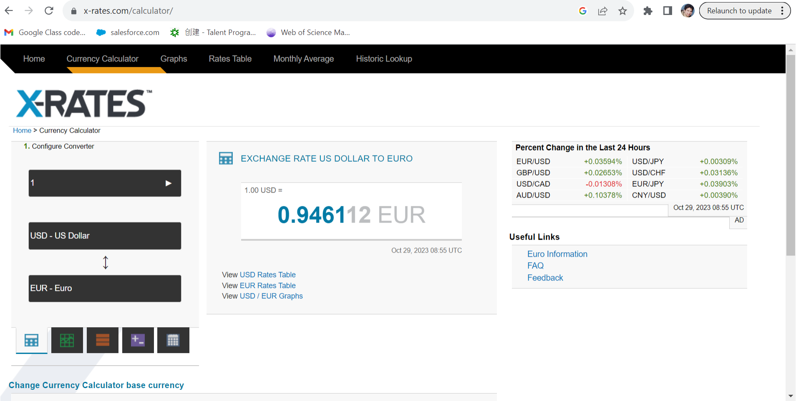

# Evaluation
## Today's Lecture
- Usability Evaluation 
    - Analytical Methods 
        - GOMS analysis
        - Cognitive Walkthroughs
        - Heuristic Evaluation
        - User Observation
        - Beyond Testing
    - Empirical (User-Based) Methods
        - Observations
        - Think Aloud

## Reminder: what is usability?
Usability refers to the **ease of use** and **learnability** of a product or system, typically in the context of **user experience design**. It measures how **effective**, **efficient**, and **satisfactory** a product is for users.

### Example 1: website for online shopping
- **Website Navigation**: Consider a website for online shopping. A highly usable website will have easy navigation, clear menu options, and a simple layout that allows users to find products easily. It will have a search functionality that provides relevant results, filters for refining searches, and a straightforward checkout process.

- A lack of usability in this context might involve **confusing menus**, **broken links**, or a **complicated checkout process with too many steps**, leading to **frustrated users** and **abandoned shopping carts**.

### Example 2: Smartphone App Interface
- Imagine a mobile app for a note-taking service. A usable app will have a clean and intuitive interface, allowing users to create, edit, and organize notes with minimal effort. It might feature easily accessible buttons, and logical grouping of functions.

- An app with poor usability might have **messy screens**, **unclear icons**, or **complex gestures**, making it difficult for users to create or manage their notes efficiently.

## General Categories of Usability
- ***Effectiveness***:  
  How effectively and/or quickly can the users perform their tasks using the interface
- ***Learnability***:  
  How much training time and practice do users require to be effective with the system?  
  If users only use the system occasionally, how long does it take to relearn the system each time they use it?
- ***Flexibility***:  
  Is the interface still effective if there are   changes in the task or environment?  
- ***Attitude/Satisfaction***:  
  Do people experience using the system as   frustrating, or rewarding?  Do users like the system?

## How to get good usability?
Good usability makes for a better system, but *how*?  
- Designers are biased: easy to produce a design that is personally pleasing, but very difficult to see how other people are going to view the design!  
- Experienced designers may produce designs with fewer usability problems than inexperienced designers, but there WILL still be problems.  
- This means that every designer needs to be humble! (Yes, you too!)

## The need to measure usability
We need to be able to <i>measure</i> usability, to get feedback about our designs (and thus improve them) (Dumas & Redish p184).  
No quick and easy answers, when measuring usability.  
No clear scale of measurement, no one right answer.  
This does *not* mean it is useless to attempt to measure usability!

## Evaluating Usability
We need to be able to *measure* usability, to get feedback about our designs (and thus improve them).

Usability evaluation is the process of **assessing the usability** of a product or system by evaluating it against specific **usability criteria or guidelines**. It helps identify usability issues and provides insights into how users interact with the product.

Formative usability measurement and summative usability measurement are two approaches to evaluating the usability of a product or system, and they serve different purposes during the design and development process.

### Formative Usability Evaluation
Formative usability evaluation is conducted <strong>during the design and development phases</strong> of a product. Its primary goal is to identify usability problems and challenges early in the process, allowing designers and developers to make iterative improvements. Formative evaluation is highly focused on <strong>qualitative feedback</strong> and is often iterative, meaning it is conducted multiple times as the design evolves.  
**Methods**:
- Users are observed while they perform specific tasks related to the product. Observers note user behaviors, comments, and struggles, providing valuable qualitative insights.
    - **GOMS analysis**: GOMS analysis provides a structured way to predict and evaluate the time it takes for a user to perform specific tasks.
    - **Heuristic Evaluation**: Usability experts evaluate the product interface against a set of established usability heuristics or guidelines. They identify potential issues and provide recommendations for improvement.
    - **Cognitive Walkthrough**: Evaluators simulate users' thought processes, step by step, while they interact with the product. This method helps identify potential usability problems in the user's decision-making process.
    - **Prototyping**: Low-fidelity prototypes or wireframes are created and tested with users. Feedback from users helps refine the design before the final product is developed.

### Summative Usability Evaluation
- Summative usability evaluation is <strong>conducted after the product is developed</strong>, with the goal of assessing the product's <strong>overall usability</strong> against <strong>specific criteria</strong> or <strong>benchmarks</strong>. It provides a <strong>final assessment of the product's user-friendliness</strong> and effectiveness.
**Methods**:
- Similar to formative usability testing, but with a focus on quantitative data. Metrics such as task completion rates, time taken to complete tasks, and error rates are measured to provide quantifiable insights into usability.
    - **Surveys/Questionnaires**: Structured questionnaires are administered to users to collect quantitative data on their satisfaction, ease of use, and overall experience with the product.
    - **System Usability Scale (SUS)**: A standardized questionnaire comprising a set of questions is used to measure users' perceptions of the product's usability quantitatively.
    - **Task Analysis**: A detailed analysis of user tasks and interactions is conducted to identify bottlenecks and areas for improvement in the system.

## GOMS
<video src="/l5-hci-week5-lecture-assets/YTDown.com_YouTube_GOMS-model-in-HCI_Media_Iq0TGM7cxfE_001_720p(1).mp4" type="video/mp4" controls="controls" preload="meta"></video>

- GOMS, which stands for Goals, Operators, Methods, and Selection rules, is a model used for analyzing the usability of a system by breaking down user tasks into their fundamental components.
- **Goals**: Tasks are defined in terms of the overall objectives the user wants to achieve.
- **Operators**: Basic cognitive, perceptual, and motor actions that users perform. These are the fundamental building blocks of a task.
- **Methods**: Sequences of operators that accomplish subgoals within a task.
- **Selection Rules**: Conditions that determine which methods to use based on the context or user input.
         \*Can also be used in **Task Analysis**

### GOMS Analysis Steps
- **Task Decomposition**: Break down the task into subgoals, operators, methods, and selection rules. This involves analyzing each step the user takes to accomplish the task.
- **Time Estimation**: Assign time values to each operator based on empirical data or established guidelines. These values represent the time it takes to execute each basic operation.
- **Calculate Task Time**: Use the assigned time values to calculate the total time it would take for a skilled user to perform the task using the GOMS formula:
    - Time (in seconds)=∑(Number of Operators of a type)×(Time to Execute an Operator of that type)

#### GOMS example: currency conversion

Let us consider an example task scenario (**GOAL**): Convert  £40 to Singapore Dollars (SGD), then convert 100 SGD to £ from https://www.x-rates.com/calculator.html

#### GOMS example

| Methods                                                                                                                                                                                                                               | Operators                                                                                                                                                                                                                                                                                |
| ------------------------------------------------------------------------------------------------------------------------------------------------------------------------------------------------------------------------------------- | ---------------------------------------------------------------------------------------------------------------------------------------------------------------------------------------------------------------------------------------------------------------------------------------- |
| 1. choose the amount to convert   2. choose the currency to convert from, using the dropdown menu   3. choose the currency to convert to, using the dropdown menu   4. Select a different method for the opposite conversion | • Click on the top box   • Type 40   • Press   • Click on the middle box   • Scroll down alphabetical list to GBP   • Click the bottom box   • Type ‘si’ in the search box   • Click on SGD   • Click on   • Click on the top box   • Type 100, then Enter |

---

- After forming the GOMS model, it is possible to analyze methods, selection and operators and ask questions of the model.  
    For example:  
    – How long is it estimated that users will take to perform the task?  
    – Are there some methods which are unnecessarily lengthy which we can make more efficient?  
    – Is this system better than the old design?

### GOMS modeling exercise
- <strong><u>Goal</u></strong>: deleting a section of text in MS Word  
- What different ways <strong><u>(methods)</u></strong> are there to delete text?  
- Can you think of different scenarios when the user might <strong><u>select</u></strong> one <strong><u>method</u></strong> rather than another?  
- The mouse movements, key presses etc. are the <strong><u>operators</u></strong> used

### Keystroke level model
- GOMS has also been developed to provide a quantitative model - the keystroke level model.  
    - The keystroke model allows predictions to be made about how long it takes an expert user to perform a task.

### Response times for keystroke level operators (Card et al., 1983)

| Operator | Description                                                                                                                                                                       | Time (sec)                   |
| -------- | --------------------------------------------------------------------------------------------------------------------------------------------------------------------------------- | ---------------------------- |
| K        | Pressing a single key or button Average skilled typist (55 wpm) Average non-skilled typist (40 wpm) Pressing shift or control key Typist unfamiliar with the keyboard | 0.22 0.28 0.08 1.20 |
| P        | Pointing with a mouse or other device on a display to select an object. This value is derived from Fitts' Law                                                                     | 0.40                         |
| P1       | Clicking the mouse or similar device                                                                                                                                              | 0.20                         |
| H        | Bring 'home' hands on the keyboard or other device                                                                                                                                | 0.40                         |
| D        | Draw a line using the mouse                                                                                                                                                       | Variable                     |
| M        | Mentally prepare to do something                                                                                                                                                  | 1.35                         |
| R(t)     | The response time is counted only if it causes the user to wait when carrying out a task.                                                                                         | t                            |

#### Summing together

<i>T</i>

$$
execute = TK + TP + TH + TD +TM + TR
$$

## Cognitive Walkthroughs
<video src="/l5-hci-week5-lecture-assets/YTDown.com_YouTube_How-to-Conduct-a-Cognitive-Walktrough_Media_2-57etXWx5Q_003_360p.mp4" type="video/mp4" controls="controls" preload="meta"></video>

**Cognitive Walkthrough** is a usability evaluation method that involves evaluators <strong>simulating the thought processes of users</strong> as they approach and complete tasks in a system.  
The evaluators systematically step through the tasks a user might perform (<strong>putting themselves in users shoes</strong>), considering the actions, feedback, and mental processes required at each step. This method is particularly useful in identifying potential usability issues, especially for users <strong>who are new to the system</strong>.  
**Cognitive Walkthroughs provide valuable insights into how users might approach tasks and where they might face challenges**

### How to conduct Cognitive Walkthrouh
<video src="/l5-hci-week5-lecture-assets/YTDown.com_YouTube_Sample-Cognitive-Walkthrough_Media_Edqjao4mmxM_002_360p(1).mp4" type="video/mp4" controls="controls" preload="meta"></video>

### Process of Cognitive Walkthrough:
- Consider the task "Create a new account" on a website.
- <strong>Evaluators Put Themselves in Users' Shoes</strong>: The evaluators, often usability experts or designers, imagine themselves as users who are trying to accomplish the chosen task. They focus on understanding the user's goals, knowledge, and expectations at each step.
- **Step through the Task**:
    - **Step 1**: Evaluator begins at the starting point of the task **(e.g., the homepage of a website)**.
    - **Step 2**: Evaluator considers the available options and chooses the next action, simulating what a user might do. For example, the evaluator might **click on the "Sign Up" button**.
    - **Step 3**: Evaluator assesses the system's response. This includes examining the feedback provided by the system (**e.g., a registration form appears)**.
    - **Step 4**: Evaluator evaluates whether the feedback is sufficient for the user to recognize that they are making progress toward their goal **(e.g., clear form fields and a prominent "Submit" button)**.
    - **Step 5**: If the feedback is not sufficient, the evaluator considers whether users would be able to identify and recover from the problem. **For example, if there's a vague error message during form submission, would users know how to correct the error?**
    - **Step 6**: **Evaluator continues this process, step by step**, until the task is completed or **until potential usability issues are identified**.

#### Example: Cognitive Walkthrough for Creating a New Account on a Website
- **Task**: Create a new account on an e-commerce website.
- **Cognitive Walkthrough**:
    - **Step 1**: Start on the website's homepage.
    - **Step 2**: Click on "Sign Up."
    - **Step 3**: Registration form appears.
    - **Step 4**: Check if form fields are clearly labeled and user-friendly. Ensure the purpose of each field (e.g., name, email, password) is obvious.
    - **Step 5**: If there's an error in filling out the form, evaluate the error message clarity. Can users easily understand what went wrong and how to fix it?
    - **Step 6**: Complete the form, submit it, and see if there's a clear confirmation message. Ensure users know that their registration was successful

### Heuristic Evaluation
<video src="/l5-hci-week5-lecture-assets/YTDown.com_YouTube_Heuristic-Evaluation_Media_sa5lswRd7Q8_002_360p.mp4" type="video/mp4" controls="controls" preload="meta"></video>

This method involves identifying usability issues by assessing them against established principles that make interfaces user-friendly.

Heuristic evaluation requires the use of a team of evaluators, along with a set of design guidelines (**heuristics**). Heuristics **guide the analysis** that the evaluators apply:  
The evaluators carefully **systematically examine the interface**, and assess how the design does or doesn't meet the guidelines.  
Typically the interface is examined by performing walkthroughs of the interface.  
https://www.useit.com/papers/heuristic/

#### 10 Usability Heuristics for User Interface Design by [Jakob Nielsen](https://www.nngroup.com/articles/author/jakob-nielsen/), updated- Nov, 2020
- **#1: Visibility of system status**: The design should always keep users informed about what is going on, through appropriate feedback within a reasonable amount of time.
- **#2: Match between system and the real world**: The <strong>design should speak the users' language</strong>. Use words, phrases, and concepts familiar to the user, rather than internal jargon. Follow real-world conventions, making information appear in a natural and logical order.
- **#3: User control and freedom**: Users often perform actions by mistake. They need a clearly marked "**emergency exit**" to leave the unwanted action without having to go through an extended process.
- **#4: Consistency and standards**: Users **should not have to wonder whether different words, situations, or actions** mean the same thing. Follow platform and industry conventions.
- **#5: Error prevention**: Good error messages are important, but the best designs carefully prevent problems from occurring in the first place. Either eliminate error-prone conditions, or check for them and present users with a confirmation option before they commit to the action.

> Other possible sets of heuristics can be obtained from design guidelines,e.g. - Microsoft Style Guidelines- Shneiderman's Guidelines 

- **#6: Recognition rather than recall**:  **Minimize the user's memory load by making elements, actions, and options visible**. The user should not have to remember information from one part of the interface to another. Information required to use the design (e.g. field labels or menu items) should be visible or easily retrievable when needed.
- **#7: Flexibility and efficiency of use**: Shortcuts — hidden from novice users — may speed up the interaction for the expert user so that the design can cater to both inexperienced and experienced users. Allow users to tailor frequent actions.
- **#8: Aesthetic and minimalist design**: Interfaces should not contain information that is **irrelevant** or rarely needed. Every extra unit of information in an interface competes with the relevant units of information and diminishes their relative visibility.
- **#9: Help users recognize, diagnose, and recover from errors**: Error messages should be expressed in plain language (no error codes), precisely indicate the problem, and constructively suggest a solution.
- **#10: Help and documentation**: It’s best if the system doesn’t need any additional explanation. However, it may be necessary to provide documentation to help users understand how to complete their tasks.

### Heuristic Evaluation
- Notes:  
    - This type of evaluation can be done with prototype, or before (provided a sufficient detailed description of the design is available)  
    - Better to use external experts for the evaluators, not the designers.  
    - Useful for analyzing a variety of user situations (e.g. where the user is not a novice).  

- Examples on Moodle: Nationwide Heuristic Instrument & Sample Google Form

---

- Advantages:  
    - Relatively low cost  
    - Intuitive to perform  
    - Doesn't necessarily require advance planning  
    - Suitable for use in all stages of development process

- Disadvantages:  
    - Focuses on problems rather than solutions  
    - Encourages designers to repair existing designs rather than think up new designs  
    - Not an exact science - two evaluators might give different results  
https://usabilitybok.org/heuristic-evaluation

## Which Analysis to Perform?
We have looked at three methods (more exist).  
- <strong>GOMS</strong>
–  good at analyzing precise sequences of user actions
- <strong>Cognitive Walkthroughs</strong>  
–  good for assessing how novice users will cope  
- <strong>Heuristic Evaluation</strong>  
–  can look at a wide range of issues and user situations

## Evaluation by Usability Testing
**User Observation**  
– Think-aloud protocol  
– Performance measurements  
– Usability Laboratories  
– Computer logging  
Beyond Usability Testing  
– Questionnaires/Interviews  
– Focus groups

## User Observation
Very simply, user observation involves getting users to use the software, observing what they do, and recording this in some way  
- **Direct observation**
– The investigator is present, maybe taking notes  
– The investigator can direct attention to areas of interest  
- **Indirect observation**
– Recording is done mechanically, e.g. **by use of a video recorder**
– More useful for **discovering** otherwise unnoticed activity
User observation is **useful for obtaining qualitative data** (data that can't be precisely measured)

---

User observation tests need careful planning, e.g.  
– What is/are the objective(s) of your testing  
– What tasks are you going to get the user to do?  
One very useful tool is the **Thinking Aloud Protocol**:  
- Literally, the user "thinks aloud" whilst going through tasks with the interface, and their thoughts are recorded.  
- Designers can then see what the user was thinking at the time of having problems.  
- Reveals not only *what* the problems are, but *why*.  
- Subjective, but one of the most valuable methods in usability engineering.

---

Bear in mind the following!  
- **Give your users sufficient information about the testing**, including reassurance that **it is the design being tested, not them**.  
- When observing users in person, your presence can change events.  
- **Explain that you can't provide help/answers during the testing**, but that if they do have questions about how to do things, they should ask the questions anyway, because this provides valuable information about the design.  
- **Don't blame participants for making mistakes**, that is the wrong focus. Attribute problems to faulty design, not the users!

## Performance Measurements
Examples:
- The time users take to complete a specific task (*efficiency*)
- The ratio between successful interactions and errors (*effectiveness*)
- The number of user errors (and the time spent recovering from them) (*simplicity*)
- The number of times the user expresses clear frustration
- The ratio between positive comments and criticisms Preece p646 Cognitive load (NASA TLX)

## Usability Laboratories
These can be simple or sophisticated, cheap or expensive.  
Must include:  
– desks, chairs, computers  
May include:  
– audio/visual recording equipment  
– two-way mirrors  
– computer logging  
– intercom  
– good lighting and nice decor  
– wheelchair accessible

## Automated User Observation
There are ways to record user interactions for later analysis without needing a usability lab or direct user Testing.  
- Screen captures, along with eye tracking devices  
- Computer Logging  
– software can have built-in statistics collecting of usage patterns  
– e.g. web server logs can reveal useful information about which pages are more visited, which links are more used

## Beyond Usability Testing
- Questionnaires & Interviews  
    – Useful for measuring subjective satisfaction (eg SUS)  
    – Useful for assessing which features users like  
    – Users can identify which features are disliked, but don't (usually) offer any suggestions for fixing them!
  
Preece p308, and Section 7.5
- Focus groups  
    – a small group of users formed especially to discuss the system

