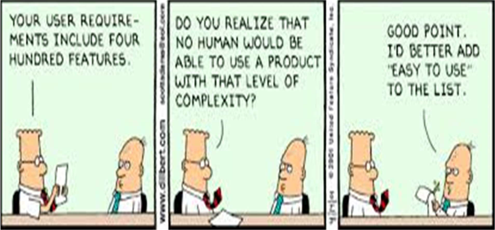
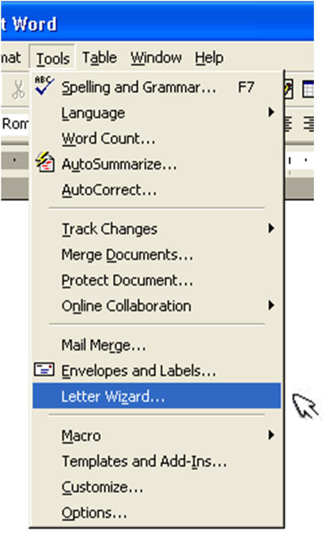
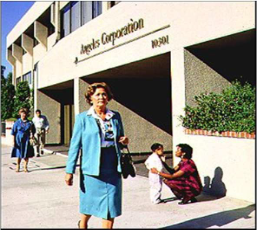
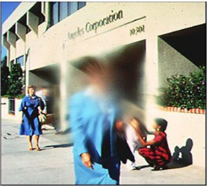
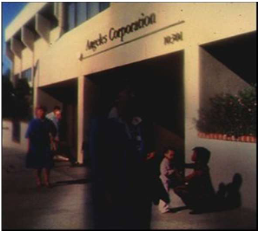

# Know Thy User, User Abilities and Accessibility
## Topics in today's lecture
Culture  
Accessibility
- Its importance
- The four main groups of barriers to access
- Examples in design
- Accessibility issues for the coursework

---

Have you seen people from different places act or talk differently?  
Why do some people like rules while others prefer freedom?  
How do you feel when a boss or teacher makes all the decisions?  
Are men and women treated the same everywhere?  
Do you prefer working alone or in a team?  

## The Designer's Dilemma
Humans are very individual and their differences  span a wide range. So, how can a designer  provide well-designed systems, usable for both  the majority of the population and minorities?  
Question:  
How can an interface designer design for everybody?  

---

*Question*: How can an interface designer design for all users.  
*Answer*: Design for the "average" human, but also  bear in mind human diversity

## Culture
You might investigate the following:
- The way dates and numbers are formatted.
- The use of colors
- The use of icons
- Is anything offensive?
- Is the alphabet the same as in the UK? 
- Is text written from left to right, top to bottom? Etc.

---

Ecommerce websites are intended to appeal to a wider cross section of a national  population and might be very sensitive to the nuances of a national culture. If you get the  symbols, metaphors or values wrong, this could have a bad effect.

---

Hofstede introduced 4 indices: introduced four cultural dimensions or indices that help to understand and compare **cultural behaviors and values across different countries**

- <strong>Power distance (PD).</strong> *“Power gap”* - In a culture with high PD, people feel comfortable with power being invested in an elite. "High rank High authority”
- <strong>Individualism (IND).</strong> Personal goal(“I”)- In a culture which rates highly on IND, freedom of the individual is valued over the interests of the group.
- <strong>Masculinity–femininity (MAS).</strong> In a culture which rates highly on **MAS** people tend to be  competitive and assertive, and differences  between gender roles are marked. Different rules for male and female.
- <strong>Uncertainty avoidance (UA).</strong> In a culture  which rates highly on **UA**, uncertainty is  avoided as much as possible and rules, plans  and frameworks are valued. Some follow rules some take risks.

## Activity
Close their eyes and try to use their phone or laptop for 30 seconds.  
Then discuss how that felt and what could make it easier.  

---

Have you ever used a website or app that was hard to use? What made it difficult?  
https://padlet.com/qr-code/taal77iyxvztqgaz?source=pdf  

---

How do you think a person who can’t see well might use a smartphone?  
https://padlet.com/qr-code/taal77iyxvztqgaz?source=pdf  

---

What if your mouse stopped working — could you still use your computer? How?  
https://padlet.com/qr-code/taal77iyxvztqgaz?source=pdf  

---

Can you name some features that make technology easier for everyone to use?  
https://padlet.com/qr-code/taal77iyxvztqgaz?source=pdf  

## Access for all
- Accessibility means designing computer systems so **everyone** can use them easily, not just people with perfect vision, quick reflexes, or strong memory.
- Many designers create interfaces assuming that all users can **see clearly, use a mouse, press keys accurately**, and **learn new things fast**. But this isn’t true for everyone.
- People such as **children, older adults**, and **those with disabilities** may find it hard to use computers if they aren’t designed with accessibility in mind.

## Brief Overview of Disabilities
Designers need to understand what sorts of  disabilities there are and what issues are  involved, in order to design inclusively.  
Four main types of disabilities:  
- Mental/Language Impairments
- Physical Impairments
- Hearing Impairments
- Visual Impairments

## Cognitive Impairments
Human behavior as it relates to human-computer interfaces is mainly concerned with  <i>cognitive psychology</i>.   
Cognitive psychology tries to understand mental processes and how this affects behavior.
Includes topics such as:  
- thinking
- perception
- memory
- knowledge representation
- language

## Cognitive Psychology Theory
Theories which are generally  useful for HCI tend to fall into  three basic categories:
- Explanatory Theories
- Empirical Laws
- Dynamic Models

## Explanatory Theories
These can be useful in initial stages of studying users and analyzing their needs.  
The purpose of theories is to **explain things**. In particular,  **if a system doesn't work as expected**, theories can be  useful in analyzing and explaining what went wrong.

Examples:
- Mental models
- Technology Acceptance Model
- Characteristics of human memory

## Technology Acceptance Model (TAM)
Example of an explanatory theory in HCI is the **Technology Acceptance Model (TAM)**.  
TAM is a psychological model that explains **how users come to accept and use a technology**. It suggests that users' behavioral intention to use a system is determined by their **perceived usefulness and perceived ease of use**.

## Explanatory Theories
Another example is the **Cognitive Load Theory (CLT)**, In the context of HCI, CLT helps designers understand **how to present information and tasks in a way that minimizes cognitive load**, leading to better user experiences and task performance.
- memory deteriorates (decline) over time
- frequently-used information is easier to remember than  seldom-used information
- recognition of something familiar is easier than recalling  something from scratch

## Security should take account of HCI factors
Helping users create strong and memorable passwords is crucial for ensuring security while minimizing user frustration and cognitive load.  
**Password Strength Meters**: (weak, medium, strong)  
**Guided Password Creation**: Offer step-by-step guidance during the password creation process. (uppercase letters, numbers, special characters)  
**User-Friendly Error Messages**: Provide clear and user-friendly error messages when users create weak passwords.  

## Empirical Laws
These laws are based on observed human behavior and interactions with technology.  
Empirical laws in HCI provide valuable insights into how users perceive, interact with, and respond to computer interfaces  
- time taken to make choices
- number of items that can be memorized
These are used to make quick estimates of  human performance when designing interfaces  
Examples:
- Hick's Law
- Fitts' Law

### Hick's Law
<video src="/l5-hci-week6-lecture-assets/Hick_s_Law.mp4" type="video/mp4" controls="controls" preload="meta"></video>

---

Hick's Law states that the time it takes for a person to make a decision increases with the number of choices (options) they have
$$
T = K \log_2 (n + 1)
$$
where  
**T** is the time taken to make a selection,  
**k** is a constant, and  
**n** is the number of options on offer  

#### Application of Hick’s Law
Imagine you walk into an ice cream parlor, and you're faced with two scenarios:  
**Scenario 1:** There are only three flavors available - vanilla, chocolate, and strawberry.  
**Scenario 2:** There are twenty flavors available, ranging from classic choices like mint chocolate chip to unique ones like lavender honey.  
- Designing a travel booking website with limited destination options per page allows users to make quicker decisions.
- A menu with fewer food items in a restaurant app helps customers choose their meals faster.
- An e-commerce website displaying a limited number of products per category page reduces decision-making time for shoppers

### Fitts' Law
<video src="/l5-hci-week6-lecture-assets/Fitt_s_Law_Explained.mp4" type="video/mp4" controls="controls" preload="meta"></video>

---

$$
T = 100 \log_2 (A/W + 1)
$$

where  
**T** is the time taken to reach a target (in milliseconds),  
**A** is the initial distance from the target and  
**W** is the width of the target  

“predicts the time required to move to a target area based on its size and distance”  

#### Size of a Target Icon: Using Fitts' Law

| *Target of width 0.5cm* Time taken to reach  target from 10 cm away:                                                                   | *Target of width 0.2cm* Time taken to reach  target from 10 cm away:                                                                   |
| ----------------------------------------------------------------------------------------------------------------------------------------- | ----------------------------------------------------------------------------------------------------------------------------------------- |
| $$T = 100 \log_2 (10/0.5 + 1)$$ &nbsp;&emsp;$$= 100 \log_2 21$$ &nbsp;&emsp;$$= 100 \times 4.39 \ \text{ms}$$ &nbsp;&emsp;$$= 0.439 \ \text{s}$$ | $$T = 100 \log_2 (10/0.2 + 1)$$ &nbsp;&emsp;$$= 100 \log_2 51$$ &nbsp;&emsp;$$= 100 \times 5.67 \ \text{ms}$$ &nbsp;&emsp;$$= 0.567 \ \text{s}$$ |

Thus the choice of the larger target will save approximately 0.130 seconds each time.  
Fitts’s Law establishes that **the further away a target is and the smaller the size of the target, the longer it takes for a user to acquire**.

## Keystroke-level Model
This model is a more sophisticated version of GOMS analysis: Goals are achieved by selecting between methods, and each method has a sequence of operations to perform it.  
In the keystroke-level model we look at the **sequence of operations**.  
It measures speed by estimating the time to type characters, and allowing some time for mental  preparation for the next section of the command.  

#### Example
**Sending an Email using Keystroke-Level Model**
- Let's consider the task of composing and sending an email using an email application:
- **Mentally Prepare (M):** Decide to compose an email (1.2 seconds).
- **Keystrokes to Open Compose Window (K):** Press "Ctrl + N" to open a new email compose window (0.2 seconds).
- **Keystrokes to Address the Email (K):** Type the recipient's email address (assume 20 keystrokes at 0.2 seconds each, i.e., 4 seconds).
- **Mentally Prepare for Message (M):** Think about the content of the email (1.2 seconds).
- **Keystrokes to Compose Message (K):** Type the message (assume 100 keystrokes at 0.2 seconds each, i.e., 20 seconds).
- **Mentally Prepare to Send (M):** Decide to send the email (1.2 seconds).
- **Keystrokes and Mouse Click to Send (K + P):** Click the send button (assume 5 keystrokes and 1 mouse click, i.e., 2.3 seconds).
- Using KLM, Individual times for each action: Total Time = M(1.2s) + K(4.2s) + M(1.2s) + K(20s) + M(1.2s) + K(2.3s) = 30.1 seconds

## Accessible Systems
Two main approaches:  
✓ Adapt standard interfaces to make them accessible  
✓ Produce specially-designed accessible systems  
Advantages/disadvantages:  
- Standard interfaces that are more accessible can have benefits for all users, not just disabled people
- "Adapting" existing interfaces is not as good as  designing systems to be accessible
- Sometimes specialized systems are required and are  much better than the "one size fits all" approach

## Mental/Language Impairments
Many different types of impairments:
- Language/Learning Difficulties
    - e.g. Dyslexia, Aphasia, Dyscalculia
- Age-related
    - e.g. Alzheimer's Disease, Dementia

### Dyslexia
Dyslexia a **learning disorder** that **affects reading, spelling, and comprehension skills**.
- Dyslexia has nothing to do with intelligence
- Dyslexia describes a group of related factors  concerning the **brain's processing of written information**

**Solution**:
- Use **sans-serif fonts** like **Arial or Verdana**, as they are generally **easier to read for people with dyslexia**
- Limit the line length to **50-75 characters per line to prevent eye strain**
- **Use dark text on a light background** or vice versa to enhance visibility and reduce visual stress for users with dyslexia

### Physical Impairments
Common mobility problems:
- poor muscle control, fatigue,
- difficulties with: walking, speaking, reaching,  grasping, complex maneouvres (such as push-and-turn)

Wide range of assistive devices for computing, e.g.
- alternatives to mouse
- pointing and typing aids (mouth/head sticks)
- voice recognition software

#### Designing for Physical Impairments
Some of the more common things for designers to remember:
- creating interfaces **accessible to users with limited mobility**
- **Designers should prioritize large and well-spaced interactive elements**, allowing easy touch or click targets.
- Implement **keyboard shortcuts for navigation**, ensuring users can **operate the interface without precise mouse control**.
- **Incorporate voice commands and gesture controls** to offer alternative interaction pathways for users with motor impairments.

### Hearing Impairments
Hearing impairment covers a broad range  from mild to severe  
Definition of deafness:
- inability to use hearing for communication
Definition of hard of hearing:
- a lesser degree of impairment than deafness
  
Suggest some requirements for people with hearing impairments using interactive devices.

#### Designing for Hearing Impairments
Information should be provided in visual or touchable form.  
However, much of the information on a computer system is visual, so computer use is not generally too problematic.  
- **Offering visual alternatives** to sound is a must
- **Provide visual cues like icons or animations** for important auditory alerts,
- Allowing users to **understand system feedback visually**

### Visual Impairments
"Visual impairment" covers a very varied range,  from **poor vision**, to **being able to see light but no shapes**, to **no vision at all**
1. **Dimness**: Reduced brightness in vision.
*Solution*: Use high-contrast color schemes, bright colors, and larger text to enhance visibility and readability for users with dimness.

2. **Foggy Vision**: Blurred or unclear vision, akin to looking through fog.
*Solution*: clear, uncluttered interfaces with distinct fonts and high contrast to aid users with foggy vision in understanding digital content.

3. **Spots Before the Eyes**: Seeing spots, floaters, or shadows in the visual field.
*Solution*: Design layouts with minimal distractions, ensuring important content is easily distinguishable from the background to help users focus on relevant information.

4. **Distortion**: Objects appear warped, misshapen, or distorted.
*Solution*: Maintain consistent design elements and use simple, easily recognizable graphics to prevent confusion caused by distorted vision.

5. **Color Distortions**: Difficulty perceiving specific colors accurately.
*Solution*: Combine color coding with unique symbols or patterns to convey information,

## Design example:  Euro bank notes
The view taken was that "a good design for the blind and  partially sighted is a good design for everybody".  
The notes were designed in cooperation with the  European Blind Union. Some of their design features:
- Each of the banknotes is a different size
- Each has a dominant color
- Strong color contrasts have been chosen between each consecutive pair of notes
- The numerals on the front are large and in bold
- These numerals are also printed in relief and can be perceived by touch

## Web Access Initiative
www.w3.org/WAI/  
World Wide Web Consortium  (W3C) (http://www.w3.org/)  
Dedicated to **promoting web accessibility**, ensuring that **people with disabilities** can use the web effectively. The initiative develops **guidelines** and **resources** to help **designers**, **developers**, and **policymakers** create accessible websites and web applications– technology, guidelines, tools, education & outreach, and research & development.  

## Summary
**Culture**-Understanding cultural differences is crucial in HCI to design interfaces that are culturally sensitive and inclusive  
**Accessibility**-Accessible design ensures that everyone, regardless of their physical or cognitive limitations, can access and interact with online content and services independently and effectively  
- **Its importance**: ensures equal access to information, services, and opportunities, promoting social inclusion and eliminating barriers to digital participation for people with disabilities
- **Main groups of barriers to access**: Physical barriers include limitations in motor skills, sensory barriers involve impairments in vision or hearing, cognitive barriers pertain to difficulties in understanding information
- **Examples in design**: providing alternative text for images, captions for videos, keyboard shortcuts for navigation, ensuring color contrast for readability, and creating intuitive, straightforward navigation

## Next Lecture
Week 7 - Multimedia and Web Usability
