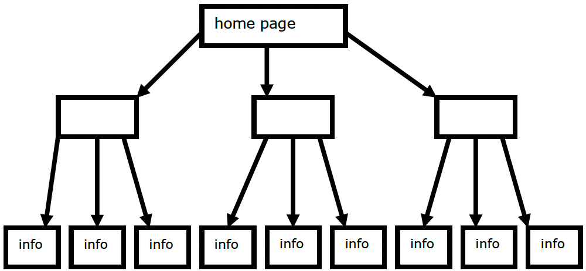
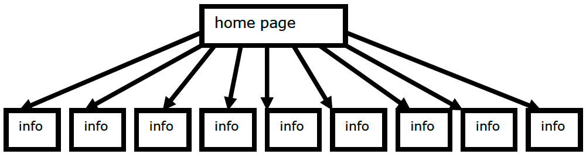

# Know Thy User
This practical has various exercises on some topics and als- pointers t- reading material on other topics. Be sure t- finish off during the week what you don’t manage t- cover during this practical. Today’s topics:
- Cognitive Psychology:
    - Hick’s Law (exercise)
    - Fitts’ Law (exercise & reading)
    - Human memory limitations (reading)
    - Mental models (reading)
- Accessibility
    - Web Accessibility Tools (reading)
    - Keyboard shortcuts (exercise)
    - Colour-blindness (exercise)
    - Low Vision (exercise)

 Today’s practical involves several internet resources for you to explore. If some of the sites are down, then try them later on in the week. In any case, there is probably here more than you can do in one hour, and you should ensure that you complete these practical exercises during the rest of the week.
   
## Exercise 1 – Hick’s Law
Recall from lectures that Hick’s Law is  
$$
T = K \log_2 (n + 1)
$$
Consider a website, where the designer of the site is deciding how to structure the pages of the site, hierarchically. Use Hick’s Law to work out which of the following structures would be better, (a) or (b), in terms of the speed of reaching the desired information page, for frequent visitors of the website (the rectangles represent pages, the lines are links, and you assume a visitor is equally likely to want to reach any of the nine information pages):  
(a)

(b)

The structure with faster access is.....................................................................
Why is Hick’s Law not applicable if the website visitor is new to the site?

## Exercise 2 – Fitts’ Law
Recall from lectures that Fitts’ Law is
$$
T = 100 \log_2 (D/W + 1)
$$
where D is the distance from the mouse pointer to the target, W is the width of the target, and T is the time to reach the target.  

## Exercise 3 – Web Accessibility Tools
There are a number of tools provided to help designers evaluate the accessibility of web pages and to help make them more accessible. Many of these tools are freely
available.  
Check out the following webpage, and look at the range of different tools that exist.  
(If any seem like they would be particularly useful for your coursework, then make a note of them!)  
http://www.w3.org/WAI/ER/tools/complete.html

---

One general tool that is useful is the *WAVE* tool  
http://wave.webaim.org/  
Try it out on a web page. For example, take one of the web pages you have created for previous practical exercises, and see how accessible it is.  
Then try to fix any errors. If you are not sure how to do this, then ask your practical tutor for assistance.  
find constructive advice on creating accessible interfaces, note that the W3C accessibility guidelines do provide good guidelines for the web, and much of the advice is applicable to other interfaces too:  
https://www.w3.org/TR/WCAG20/  
Another good site for information about web accessibility is  
http://webaim.org  
Have a look at the articles and resources it provides. NOTE: there are some simulations listed but these are quite old or not available.  

## Exercise 4 – Color-blind Simulations
One of the tools available is VisCheck. It provides excellent information and simulations for color blindness:  
http://www.vischeck.com/
Read the explanations on the site, and look at the sample images.
If you are **not** color blind, try using the simulator (under the **Vischeck** link on a web page of your choice.

## Exercise 5 – Keyboard Shortcuts
Recall from lectures that for some people, a mouse is difficult to manoeuvre. So providing keyboard shortcuts is an important alternative to provide when designing an interface.  
If you are a habitual mouse user, try out the keyboard shortcuts that your web browser provides. Load up a web browser (if you haven’t got one open already), then, having clicked your mouse in the window so that your browser “has the focus” TUCK YOUR MOUSE AWAY AT THE BACK OF THE DESK. No cheating!  
These are some of the keyboard shortcuts you can typically use to navigate around web pages:

<table> <tr> <th>TAB key</th> <td>Next Link</td> </tr> <tr> <th>SHIFT+TAB key</th> <td>Previous Link</td> </tr> <tr> <th>ENTER</th> <td>Follow Link</td> </tr> <tr> <th>ALT+ left arrow key</th> <td>Back</td> </tr> </table>

Try doing some browsing! Start from one of the further reading pages from the previous exercise, if you like. Follow some links, see if you can get around ok without using the mouse!  
