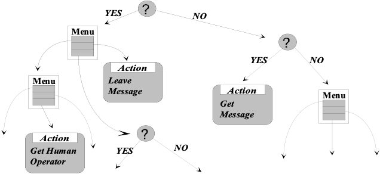
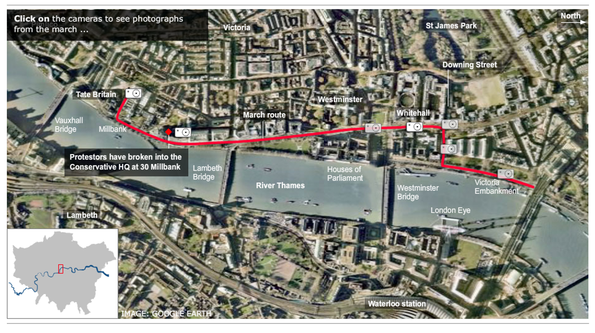
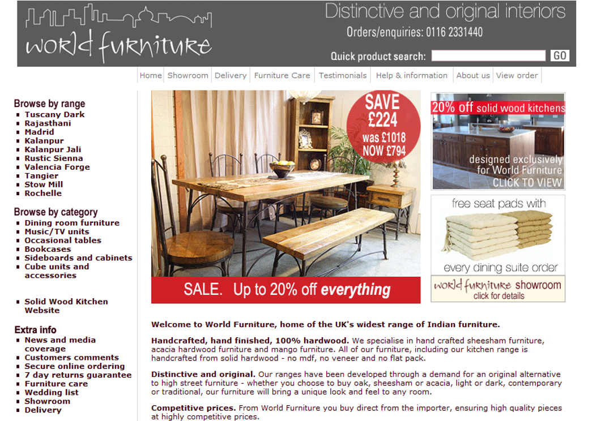
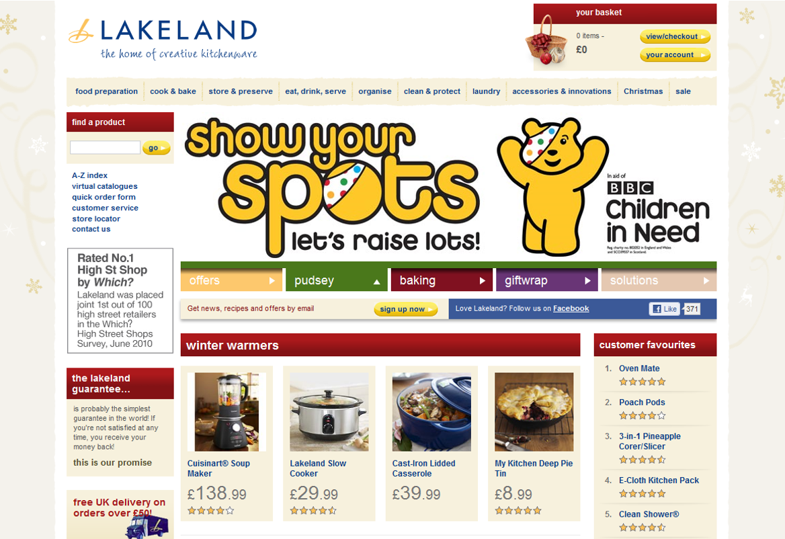
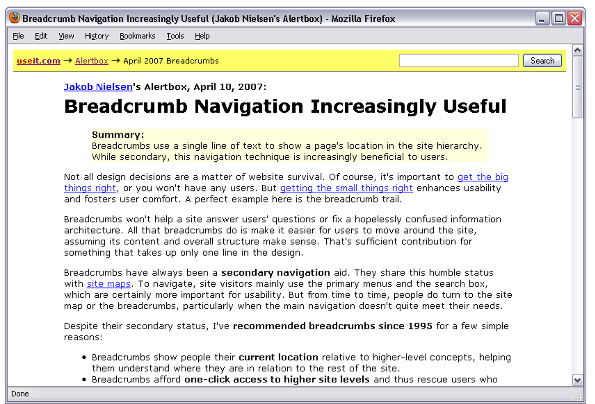

# Multimedia and Web Usability
## Today's Topics
Classification of different types of computer systems:
- Multimodal
- Multisensory
- Multimedia, Hypermedia
HCI issues in these varied systems:
- Design Issues (similarities and differences)
- Particular Strengths 
    - that can be used to enhance usability issues for different types of interfaces

---

1. Think of a website or app you use frequently. What is one thing that makes it really easy to use, and one thing that frustrates you?  
2. Which multimedia element (video, audio, animation) on a website do you find most helpful or most distracting?

[Multimedia and Web Usability - HCI-L7](https://padlet.com/yashaorana/multimedia-and-web-usability-hci-l7-taal77iyxvztqgaz)

## Types of Systems
1. Multimedia Systems  
Use multiple **media types**: text, sound, graphics, animation, video  
📝🔊🖼️🎞️📹
2. Multisensory Systems  
Engage multiple **human senses**: sight, hearing, touch, smell, taste  
👀👂✋👃👅
3. Multimodal Systems  
Use multiple **interaction modes** — different media, senses, or communication channels  
**Example**: A smart home device combining **voice recognition, touch interface**, and **visual feedback** (e.g., search by voice or typing)  
🎙️ + 👆 + 👁️

## Multi-Media/Modal/Sensory Systems and Good Design
- The issues are still:
    - Users want good usability
    - Users come in all varieties
- Apply the same usability engineering methods
- Maintain a strong focus on users and their tasks
- Follow a user-centred design approach
- Also:
    - Choose the most suitable media or mode for each interactione.g., text, voice, visuals, touch
    - Address HCI issues specific to the system typee.g., accessibility, sensory overload, interaction consistency

### Example: Telephone Answering System
The caller is routed through a call using pre-recorded speech messages. User input can be given through
- a speech driven menu system, or
- tone signals from a touch keypad, e.g. ↓
> Hello. Welcome to ElectriGas.  
> If you want a HomeCare brochure, please press 1.  
> For enquiries about your latest bill, please press 2.  
> For servicing and repairs, please press 3.  
> For all other enquiries, please hold.  
> 		\*2\*  
> For enquiries about your gas bill, please press 1.  
> For enquiries about your electricity bill, please press 2.  
> 		\*1\*  
> 		\*ring ring\*

### Touch-driven Telephone Answering System
Is the system...
- multimodal? 
- Yes, it uses speech to inform the user, and the user uses the touchpad to provide input

- multisensory? 
- Yes, hearing/speaking and touch input

- multimedia? 
- No, information is only represented by sound

### Speech-driven Telephone Answering Systems
Some voicemail systems are speech-driven(e.g.Telephone Help line) 
**Is such a system ...**
- multimodal?
- No, uses speech only

- multisensory? 
- No, only auditory sense used

- multimedia? 
- No, information is only represented by sound

## Dialogue Design for Telephone Answering Systems

crafting the interaction flow and conversation structure to create a seamless and effective communication experience between users and the system.
> Note: Interface designer has to think carefully while designing dialogue

### Example Dialogue Design
1. Greeting:
- System: "Thank you for calling XYZ Telecom. This is the automated service. Please say or press 1 for billing inquiries, 2 for technical support, or 3 for account information."
2. User Input:
- User: "Technical support."
3. Confirmation and Instruction:
- System: "You've selected technical support. Please briefly describe the issue you're experiencing, or say 'representative' to speak with a live agent."
4. User Input:
- User: "My internet is not working."
5. System Response and Troubleshooting:
- System: "I'm sorry to hear about the issue with your internet. Let's try to troubleshoot. Have you tried rebooting your modem? Say 'yes' or 'no.'"
6. User Input:
- User: "No."
- System: "Thank you for choosing XYZ Telecom. Have a great day!"
7. Further Assistance:
- System: "Okay. Please unplug your modem, wait for 30 seconds, and then plug it back in. Once done, say 'done' or press 1."
8. User Input:
- User: "Done."
9. Resolution or Escalation:
- System: "Thank you. We've initiated a reset for your connection. If the issue persists, a support ticket will be created, and our team will contact you shortly. Is there anything else I can help you with?"
10. User Input:
- User: "No, thank you."
11. Closing: System: "Thank you for choosing XYZ Telecom. Have a great day!"

## Usability Issues: Telephone Answering Systems
**The dialogue must be usable by novices** 
- it should be self-explanatory and easy to follow.
The system assumes callers understand typical human phone conversations (e.g., greetings, turn-taking).
Options are sequential - **users must listen to all the options before the one they want** ⇨ ?
**choose option order carefully**
- If the system doesn’t include an option for what the user wants, they can’t do it.
- They must follow the menu and prompts exactly as designed. Systems should have a default choice  
    - e.g.  "For all other options please hold"  
- Include a default or backup option 
- For example: “For all other enquiries, please hold to speak with an operator.”

## Speech Driven Systems (1)
These systems use speech recognition technology to convert spoken words into text. Enable users to interact with devices or applications using spoken language.  
**Examples of Speech-Driven Systems:**  
**Virtual Assistants:**  
Input: Microphone  
Output: Speech  
Example: Amazon Alexa, Google Assistant, Apple Siri  
**Voice Dictation Software:**  
Input: Microphone  
Output: Text  
Example: Dragon NaturallySpeaking, Docs Voice Typing  
**Interactive Voice Response (IVR) Systems:**  
Input: Telephony  
Output: Speech  
Example: Automated customer service lines, phone-based surveys  

### Usability Issues with Speech-Driven Systems
- **Speech Recognition Accuracy**: Variations in accents, background noise, and speech patterns can lead to inaccuracies in speech recognition.
- **Limited Vocabulary and Commands**: Some systems may struggle to understand uncommon words, technical terms, or specific commands that are outside their standard vocabulary.
- **Context Understanding**: Understanding context in a conversation can be challenging, leading to misinterpretations of user intent.
- **Privacy Concerns**: Users may have concerns about the privacy and security of their voice data, especially if it is transmitted to servers for processing.
- **Lack of Visual Feedback**: Unlike traditional interfaces, speech-driven systems may lack visual cues, making it challenging for users to confirm whether the system accurately understood their input.

### How to address the usability issues
- **Improve Speech Recognition Accuracy:**
    - Provide options for users to train the system to better understand their unique speech patterns and accents.
    - Regularly update and refine the system based on user feedback and new data.
- **Expand Vocabulary and Commands:**
    - Regularly update the system's vocabulary to include new words, phrases, and industry-specific terminology.
    - Provide users with documentation or training materials.
- **Enhance Context Understanding:**
    - Provide prompts or cues to guide users toward more explicit and clear communication.
- **Address Privacy Concerns:**
    - Clearly communicate the system's privacy policies to users and provide options for controlling data sharing.
- **Provide Visual Feedback:**
    - Integrate visual cues or responses where possible, especially in systems with display capabilities.

## Multimedia Systems
Multimedia systems integrate different types of media elements, such as text, sound, graphics, animation, video, and interactive elements, to provide a richer and more engaging user experience.  
There are usability issues with each type of media, For best usability, <i>choose the most suitable media</i>  
- Particular plus points of multimedia systems:
    - Interaction
    - Animation
    - Information visualisation

## Usability Issues: Text
**Clarity and Readability:** Well-designed text enhances clarity and readability, making information easily accessible to users.  
**Search ability:** Text content allows users to quickly search and find specific information, contributing to efficient navigation.  
**Compatibility:** Text-based content is widely compatible across different devices and platforms.  
**Issues:**  
**Cluttered Text:** Too much text or poorly organized text can overwhelm users.  
- **Font and Readability:** Poor font choice or small font sizes can impact readability.
- **Language and Jargon:** Use of complex language or jargon may hinder understanding.

## Usability Issues: Sound
- **Enhanced Engagement:** Sound can enhance user engagement by providing audio feedback, ambient sounds, or music.
- **Accessibility Features:** Sound can be an alternative means of communication, benefiting users with visual impairments.
- **Emotional Impact:** Well-designed sound elements can evoke emotions and create a more immersive user experience.
**Issues**
- **Audio Quality:** Poor audio quality or low volume levels can be frustrating.
- **Lack of Transcripts:** Users with hearing impairments may face difficulties without transcripts.
- **Unexpected Sound:** Unexpected or loud sounds can be jarring.

## Usability Issues: Video
- **Rich Content:** Video allows for the presentation of rich and dynamic content, providing users with a comprehensive understanding of a topic.
- **Demonstration:** Video is effective for demonstrating product features, tutorials, or real-world scenarios.
- **Emotional Connection:** Video can create a stronger emotional connection with users through visual and auditory elements.
Issues
- **Buffering Issues:** Slow buffering or constant pauses can disrupt the viewing experience.
- **Ineffective Use of Visuals:** Overuse of visuals or unclear video content can confuse users.
- **Compatibility:** Compatibility issues with different devices or browsers may arise.

## Usability Issues: Animation
- **Visual Guidance:** Animated elements can guide users through processes or highlight important information, improving navigation.
- **Engagement:** Thoughtfully designed animations can increase user engagement and contribute to a more enjoyable experience.
- **Storytelling:** Animation is effective for storytelling, helping to convey narratives in an engaging and dynamic way.
Issues
- **Excessive Animation:** Too much animation can be distracting and lead to cognitive overload.
- **Motion Sickness:** Rapid or excessive motion can cause discomfort for some users.
- **Disorientation:** Poorly implemented animations may confuse users about the navigation or functionality.

## Usability Issues: Graphics
- **Visual Appeal:** High-quality graphics enhance the visual appeal of a multimedia system, making it more engaging for users.
- **Illustrative Content:** Graphics can effectively convey complex information or concepts through visual representation.
- **Brand Identity:** Well-designed graphics contribute to establishing and reinforcing brand identity.
Issues
- **Complexity and Overuse:** Overuse of complex graphics can distract and confuse users.
- **Loading Time:** Large graphic files may slow down page loading times.
- **Compatibility:** Compatibility issues with different devices or browsers may arise.
 
## Interaction
- Multimedia systems are frequently interactive
- An interactive interface can allow the user to better explore the information presented
- Interactive multimedia can involve displays of information that are static or dynamic
	- e.g. [A Maps](https://maps.google.co.uk/maps?f=q&source=s_q&hl=en&geocode=&q=headington&sll=53.800651,-4.064941&sspn=12.605358,28.256836&ie=UTF8&hq=&hnear=Headington,+Oxford,+United+Kingdom&ll=51.755449,-1.225126&spn=0.003248,0.006899&t=h&z=17), <u>Baidu Map</u> 

## Hypertext Systems
What is <i>hypertext</i>?
- Pages/cards/forms/documents linked using <i>hyperlinks</i>, also known as links
- A hypertext system allows navigation between different sections of the system by following links
Why use hypertext?
- allows the user to choose which link to follow
- gives the user more control  
- Which design guideline is this? 
- User Control

## Hypermedia Systems
Most systems with hyperlinks usually involve graphics and other media too, so systems with hypertext are called <i>hypermedia systems</i>.

Examples of hypermedia systems:
- [HyperCard](https://en.wikipedia.org/wiki/HyperCard) (and modern variants)
- PDF/Word and other documents with embedded links
- The World-Wide Web

### Structure of Hypermedia Systems
- A hypermedia system has a network-like structure
    - e.g. structure of a website may look like:  

## WWW: a hypermedia system
allows the integration of various types of media, such as text, images, audio, video, and links, to create a rich and interactive user experience..  
Usability issues for hypermedia:  
**Printing documents:**
- Hypertext doesn't have a notion of "page order"
**Navigation:**
 - Hypermedia systems with complex navigation structures can confuse users and make it difficult for them to find relevant information.
**Unclear Call-to-Action:**
- Users may be unsure about what actions to take next

## An important usability issue: Navigation
- Assorted common solutions:  
    - Since the structure of the information is complex, it is possible for the user to miss seeing some pages so:  
        - Use consistent navigation patterns throughout the system
        - the designer should let the user easily tell which pages have/haven't been visited.
        - Search box
        - Some hypertext systems, have a "guided tour" feature, allowing the user to be certain that they haven't missed anything
        - Structuring the information in a hierarchy so that the user can choose which section they want to view

### Navigation by "Guided tour"

###  Providing Navigation: Menus of Links

#### Menus of Links
Points to Note:
- Standard (consistent) positions for navigation menus are 
    - horizontally across the top of a page
    - vertically down the left-hand side
- Note where [users’ eye gaze](http://www.useit.com/alertbox/reading_pattern.html)\* goes and position important content/navigation accordingly
- Left-justified vertically-arranged menus are quicker to read than right-justified ones
- Make the text for the links clearly different 
- Don't use 
    - ALL CAPITALS for links: it slows readability
\* http://www.nngroup.com/articles/f-shaped-pattern-reading-web-content/

### Providing Navigation: Tabs with Links

From: [Yahoo! Finance](http://finance.yahoo.com/)

#### Tabbed Navigation
**Good things:**
- **Clear Labelling:** Ensure that tab labels are concise, descriptive, and easily understood by users
- **Logical Order:** Arrange tabs in a logical order based on user priorities or the natural flow of information.
- **Consistent Design:** Maintain a consistent design for tabs throughout the website or application.
- **Limit the Number of Tabs:** Avoid overwhelming users with too many tabs. Limit the number of tabs to a manageable amount.
**Bad things:**
- Not suitable if the user will need to swap back and forth between views

### Providing Navigation: Drop-down Menus

#### Drop-Down Navigation Menus
Points to Note:
- Can fit more links into a smaller space
- Generally slower to navigate
- Not so accessible by search engines (meaning users can’t find your content so easily)
- Overly long lists can be annoying as well as slow
- Large menus can be helpful, because the options can be structured better
    - e.g. see [foodnetwork.com](http://www.foodnetwork.com/)

### Where am I?: Navigation by breadcrumb trails

From: [http://www.useit.com/alertbox/breadcrumbs.html](http://www.useit.com/alertbox/breadcrumbs.html)

#### Breadcrumb Navigation
It’s a visual trail or path of the pages they have navigated to reach the current page.  
Points to Note:  
- Useful for secondary navigation information
- A breadcrumb trail takes up very little space
- Easy to use; users rarely get confused by them
- Shows the user where they are in the site's page structure
- Gives easy access to pages further up the hierarchy – important if users "jumped" direct to that page from a search engine

## Some Other Web-specific Design Guidelines
1. Keep pages short, concise and dedicated to one topic (users are not keen on scrolling)
2. Every page should contain information to identify itself, and link back to the home page (typically by a linked logo in the top-left corner)
3. Pages should link to related pages
4. Be consistent and provide a common interface and method for navigation
5. Longer pages: consider using a table of contents at the top of the page.
6. Use whitespace effectively

## Further Reading
- Chapter 14: Graphics, Images, and Multimedia of *Research-Based Web Design & Usability Guidelines*  https://www.usability.gov/sites/default/files/documents/guidelines_book.pdf
- Yale Style Guide http://webstyleguide.com/wsg2/ Jakob Nielsen’s [Alertbox column](http://www.useit.com/alertbox/20000319.html)
- [A List Apart](http://www.alistapart.com/) - in-depth articles about technical and usability aspects of the web http://alistapart.com/

