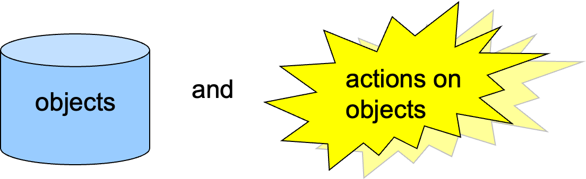
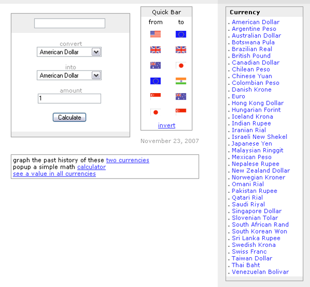
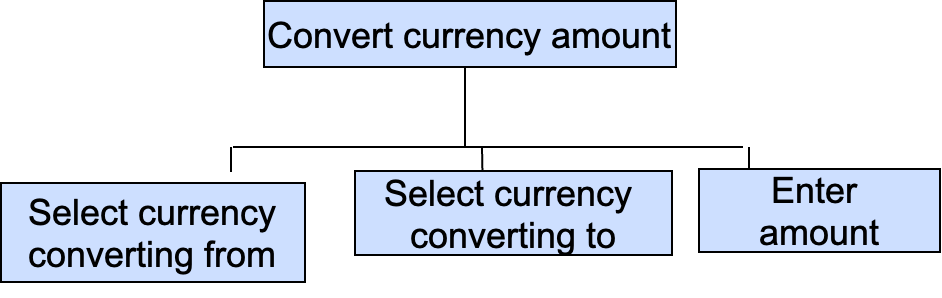
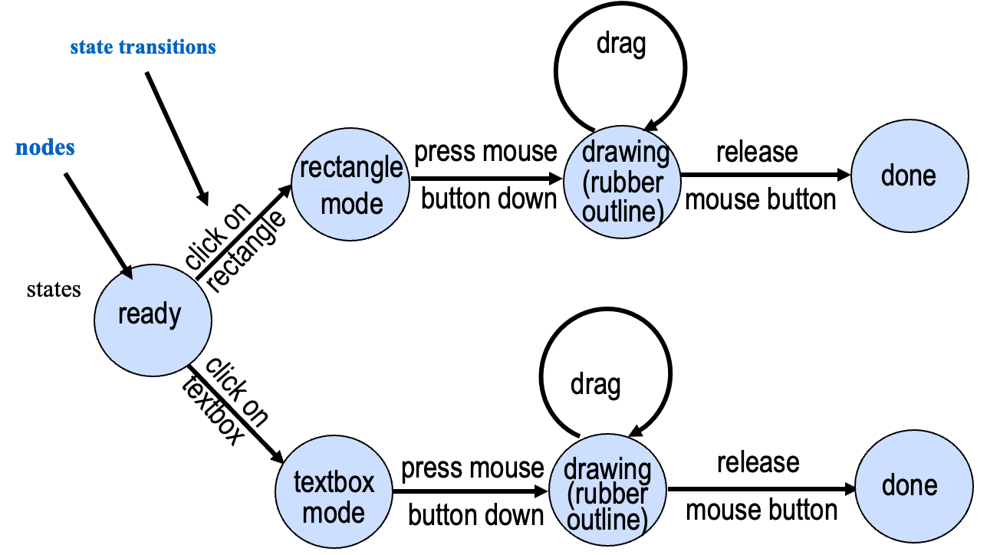
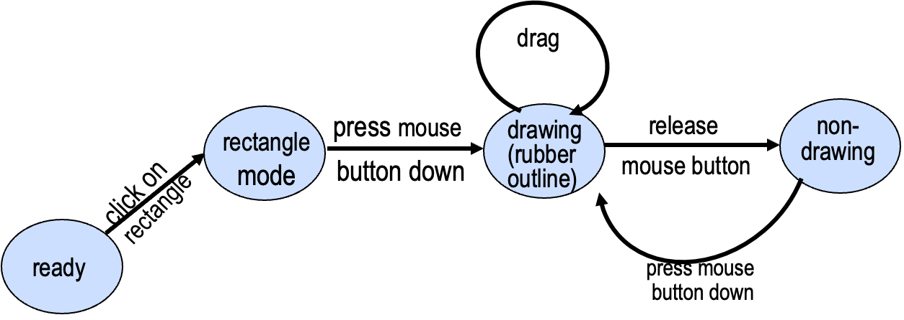
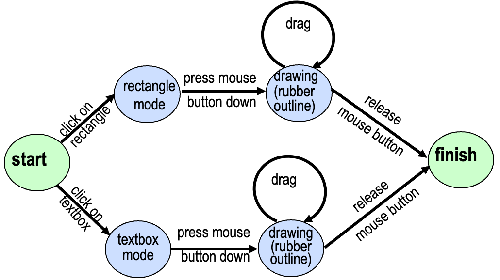
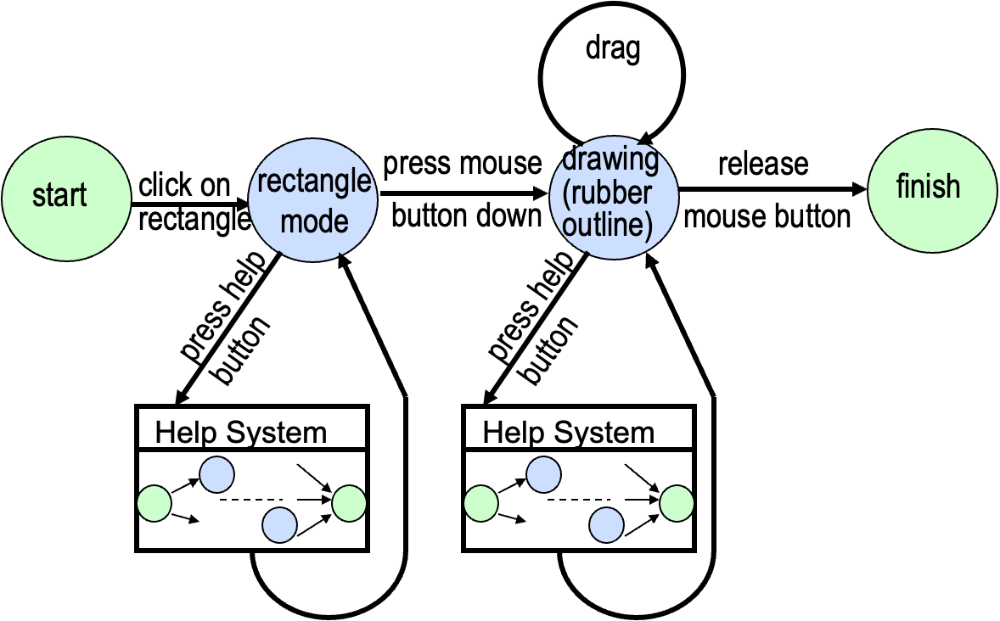
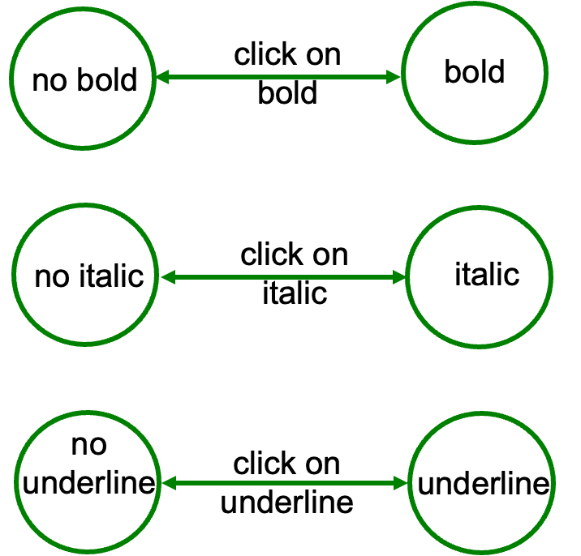
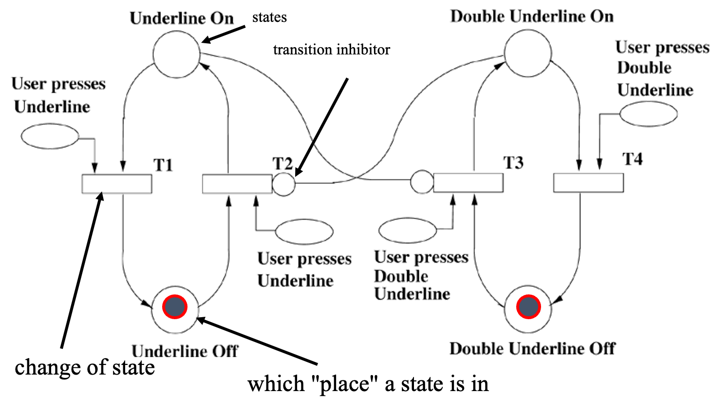
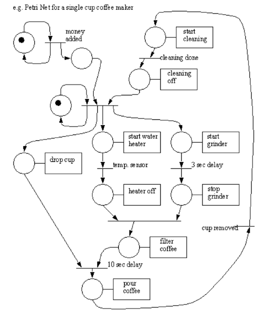

# Formalization of Interface Design
## Recall the Lecture 7
Classification of different types of computer systems:
- Multimodal
- Multi-sensory
- Multimedia, Hypermedia
HCI issues in these varied systems:
- Design Issues (similarities and differences)
- Particular Strengths 
    - that can be used to enhance usability issues for different types of interfaces

## Today Topics
- <i>Why</i> is formalizing interface design useful?
- <i>What</i> needs to be formalized:
    - the interface's appearance
    - the functionality of the design
    - the dynamics of the design
- <i>How</i>: we shall look at several different ways to formalize the dynamics (Behavior, Interactions, How things change, What the system does when users act) of a design:
    - Flowchart
    - State Transition Networks (STN)
    - Petri Nets

## Reading
Sharp, Helen, Yvonne Rogers, and Jenny Preece. "Interaction design: beyond human-computer interaction." West Sussex, England: John Wiley & Sons (2011).

Chapters 11 and 12

## Have you ever used an app or website that behaved in a completely unexpected way? What happened?
"one time the 'Submit' button didn’t show any message or feedback. I didn’t know if the form was sent or not."

## Think of your favorite app. What makes it feel 'easy' to use?
"It always reacts the way I expect. The buttons and screens behave predictably"

## Why formalize interface design?
- The designers of the interface may not be the programmers.
- The interface may be designed by graphic designers / psychologists / HCI experts
- The programmers require a detailed spec of the interface so that they know what to implement.
- Verbal description can leave room for ambiguity
- Need to be precise
Formalization helps to ensure that the interface meets the intended requirements, is consistent, and can be effectively communicated to developers and other stakeholders.

## What aspects of the interface are formalized?
1. The <strong>appearance</strong> of the system in terms of screen layout, colors, fonts, topology etc. - the structure and salient features of the information. 

2. The <strong>functions</strong> provided by the interface and their mapping onto the underlying application.
> The "what"

3. The <strong>events</strong> which can occur, and the interleaved sequences (obtained by merging two sequences) in which they occur. These are the 'words' and 'sentences' that make up the <i>dialogue of interaction</i>.
> The "how"

### 1. Formalization of the appearance of the interface
specifying the visual design elements that make up a user Interface  
this involves creating a structured and detailed representation of the interface's visual aspects to guide the design and implementation phases. **aligns with the overall design principles** and user experience goals  
- **Storyboarding**: Exact replicas of screens are produced to scale  
- **Detailed drawings or screenshots** could be used.
- **Tools** can help the designer to quickly create mock-ups to show the visual display of the interface, e.g. Sketch, or Figma 
- **Image manipulation software** or diagram drawing packages

### 2. Formalization of the functions of the interface
The **function** of the interface is about what tasks the user can carry out. 
This is formalized during **Task Analysis**.
Tasks can be analyzed and broken down hierarchically (this is the semantic level of the language of interaction) until they are supported by

(object modeling, see Weeks 3 & 4).

#### Task: Convert £20 to euros

#### Formalization of the functions of the interface
Inspect the list of actions on objects to identify how:
- the **objects** are linked to the **underlying data structures**

**actions** are linked to **procedures and functions**.  
For a login screen:  
**Interface element** → **Formalized function**
- **Email field** → User types their email
- **Password field** → User types their password
- **Login button** → Sends the information to the system for checking
- **Register link** → Takes the user to the registration page
- **Error message area** → Shows a message if login fails

#### What is a <i>dialogue</i>?
A <i>dialogue</i> is a period of interaction between the user and the computer.  
The interaction consists of a sequence of events. These events could include **user actions, system responses**, and **other elements that contribute to the flow of the interaction**. The user follows through the dialogue to achieve some task.  
**Like the script of a play**, with two characters: the **user, and the computer**.

#### Specifying Dialogue
- <strong>Semantic</strong>
    - Semantic specification focuses on the meaning or interpretation of user inputs and system outputs during a dialogue or interaction. the semantic specification might describe that when a user enters a search query, the system should understand the user's intent and return relevant results.
- Example:
- User types a question into the search bar → System understands the user wants information and shows relevant results.

---

- <strong>Syntactic</strong>
    - The order and structure of inputs and outputs in dialogue. 
- Example (login):
1. User enters username
2. User enters password
3. User clicks "Login"
4. System checks information
5. System gives access or shows an error

---

- <strong>Lexical</strong>
    - deals with the lowest level of interaction, focusing on the representation of text and images on the screen, as well as the actual keys pressed or input methods used
- Example:
- User presses letter keys on the keyboard
- User taps a blue “Login” button
- The screen displays a red error message

### 3. Formalization of dialogue design
Good dialogue design is challenging.  
Using clear and structured formats for dialogue can be helpful.  
For design:
- to express ideas
- to separate the elements of the interface
- to assist with prototyping
For analysis:
- e.g. analysis for inconsistent actions, for missing items and potential user errors (e.g. wrong key presses)

#### Symbols for Describing Conversations?
Formal symbols used for dialogue description can be  
- <strong>diagrammatic</strong>: easy to read at a glance, or 
- <strong>textual</strong>: easier for formal analysis 
    - e.g. CSP (Communicating Sequential Processes)
common diagrammatic representations:
- Flowcharts
- State Transition Networks
- Petri nets

## Example dialogue in flowchart notation

#### Can you think of a daily routine that works like a ‘state machine’?
- “A morning routine—Wake Up → Get Ready → Have Breakfast → Leave House. Each step depends on finishing the previous one.”

## STN
（视频）

### State Transition Networks
A <i>state transition network</i> represents how states can be changed by actions.  

Circles are <strong>nodes</strong> and represent <strong>states</strong>.  

Every state is labelled.  

Arrows represent <strong>state transitions</strong> as a result of actions  

#### STN example: rectangle drawing

#### STN example: rectangle resizing

#### Hierarchical State Transition Networks
STNs can get very large and can be split into pieces. We end up with a hierarchical diagram.  
To glue STNs together, first we need an artificial "Start" and "Finish" state on each STN, e.g.

#### Portion of STN with a help system

#### Concurrent dialogues...
situations where a user engages in multiple interactions or conversations simultaneously within a computer system  
Text styles:

## Petri nets
（视频）

Is a kind of graphical modeling tool that we can use for modeling and simulation of physical system. In the context of Petri nets consist of places, transitions, and arcs that represent states, events, and transitions between states, respectively.
Notation: 
- Circles represent <i>places</i> (states).
- <i>Tokens</i> (or <i>counters</i>) represent which "place" a state is in. token can move from one place to another.
- Rectangles represent <i>transitions</i> (change of state).
- Arrows indicate which way the transitions happen.
- If there are tokens in all places leading to a transition, then the transition can <i>fire</i>  
- A small circle is a transition (T) <i>inhibitor</i>.

### Petri net example

#### Petri net modeling a simple coffee vending machine
**Places:**  
**Idle:** Represents the initial state when the machine is waiting for a user.  
***Money Inserted:*** Represents the state after the user inserts money.  
***Coffee Selected:*** Represents the state when the user selects the type of coffee.  
***Coffee Ready:*** Represents the state when the coffee is prepared and ready to be dispensed.  
**Transitions:**  
**Insert Money:** Represents the action of a user inserting money.  
***Select Coffee Type:*** Represents the action of a user selecting the type of coffee.  
***Dispense Coffee:*** Represents the action of dispensing coffee.  
**Tokens:**  
A token in the Idle place represents the availability of the machine.  
A token in the Money Inserted place indicates that money has been inserted.  
A token in the Coffee Selected place signifies that the user has chosen a coffee type.  

### More Petri net resources
[Petri Net World](http://www.informatik.uni-hamburg.de/TGI/PetriNets/)
- from the University of Hamburg has a lot of resources.
http://www.informatik.uni-hamburg.de/TGI/PetriNets/introductions/aalst/
