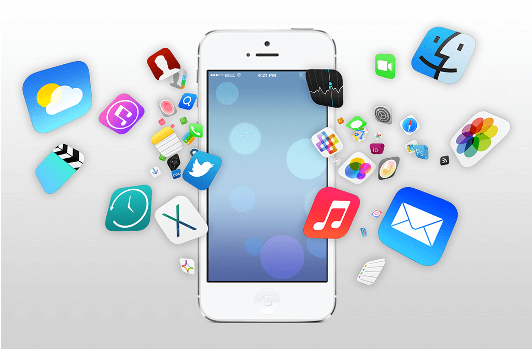
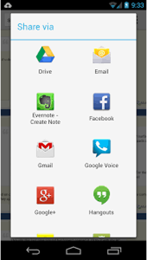
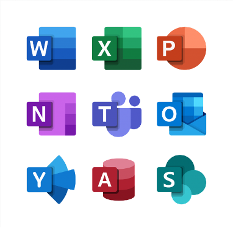
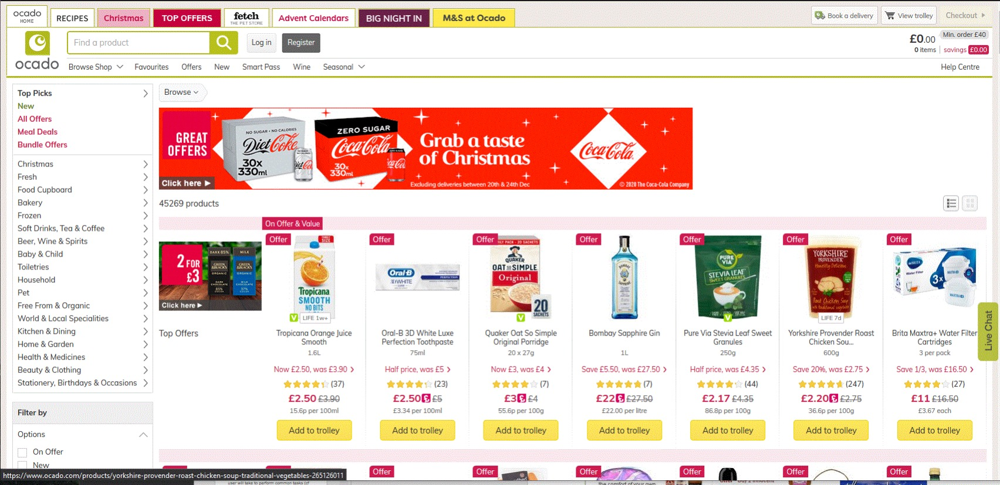
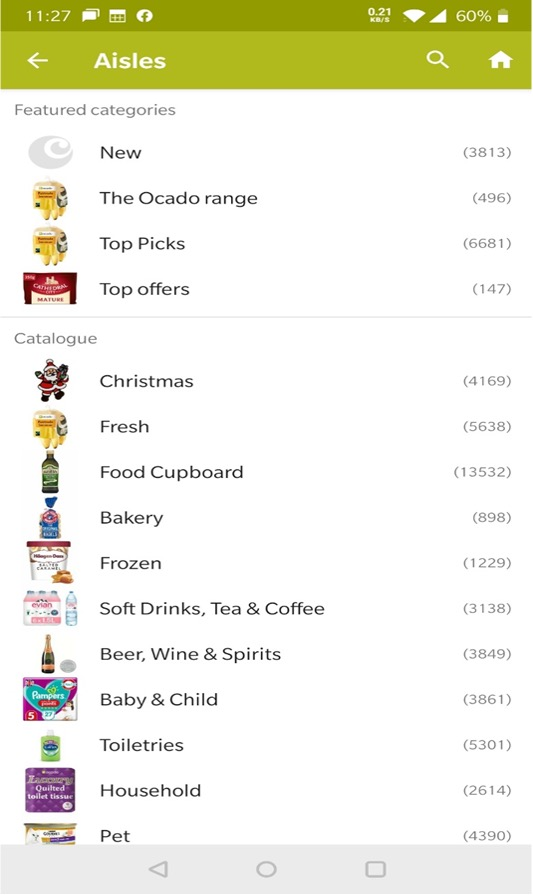
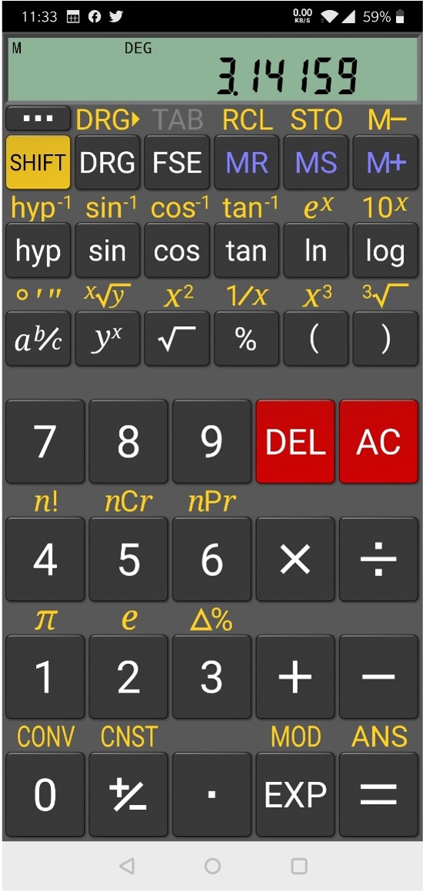
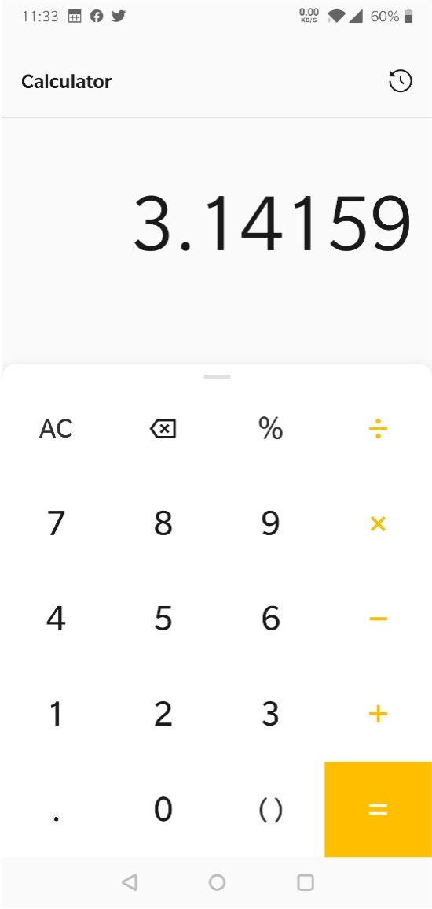

# Usability for mobile devices and other non-desktop computer systems
## Today's Lecture
- Ubiquitous computing
- Mobile phone computing
    - Types of application style
    - Mobile application design
        - Limitations
        - Apple/Android Human Interface Principles
        - Context
        - Information architecture
        - Visual design
    - Usability evaluation
        - Mobile GOMS/KLM
        - Mobile heuristics

## Definitions
Ubiquitous computing refers to the concept of **integrating computing capabilities** seamlessly into **everyday objects and environments**, making them **intelligent**, **interactive**, and **omnipresent**. The goal is to create a computing environment that is always available and blends seamlessly with our daily activities without requiring explicit user interaction.  
Examples: Smartphones and Wearable devices, Smart Homes: Internet of Things (IoT) Smart Cities, Augmented Reality (AR) and Virtual Reality, Wearable Health Devices

## History
Mark Weiser was a chief scientist at Xerox Parc, US, and coined the phrase ***ubiquitous computing*** in 1988. His principles were:
- The purpose of a computer is to help you to do  something.
- The best computer is a quiet, invisible servant.
- The more you can do by intuition the smarter you are;  the computer should extend your unconscious.
- Technology should create calm.

## Forms for ubiquitous systems devices
Mark Weiser proposed three:
- **Tabs**: wearable, centimeter sized devices, e.g., smartphones, smart cards
- **Pads**: hand held decimeter-sized devices, e.g. laptops, tablet
- **Boards**: meter sized interactive display devices, e.g. interactive white boards

### Mobile Phone Computing
- Types of application
    - Native apps
    - Mobile web apps
    - Hybrid apps
- Three application styles
- Mobile application design
- Usability evaluation

#### Native applications
Native apps are applications developed specifically for a **particular operating system** (OS) or platform.  
**iOS (Apple devices)** - Safari, **Messages**, Mail
**Android** - Chrome, Gmail , Google Maps
**Windows** - Microsoft Office Suite (Word, Excel, PowerPoint),

---

**Pros**
- The best user experience: a rich interface design and can  use device features and be **used offline**.
- Relatively **simple to develop** for a **single platform**.
- Applications **can earn revenue**.
- Can use phone features like camera, accelerometer, GPS.
- Do not necessarily require connectivity.  
**Cons**
- **Not easy to port to multiple mobile platforms.**
- They have to conform to strict standards which are out of  your control.
- You have to share revenue.

#### Mobile Web application
Mobile web applications are web applications that are **designed to be accessed and used on mobile devices through web browsers**. Unlike native mobile applications, which are installed on a device, mobile web apps run within a mobile browser. Example: **WeChat**, **Alipay**, **Baidu**, Weibo, QQ, Taobao, JD.com, Youku Tencent Video Zhihu Twitter, Trello, Salesforce, Asana, Netflix, GitHub, Zoom,
Guidelines
These are from the W3c
1. Mobile Web Application Best Practices
Best Practice, Sec 3.5: http://www.w3.org/TR/mwabp/
2. Mobile Accessibility
https://www.w3.org/WAI/standards-guidelines/mobile/

---

**Pros**
- They are easy to create, using basic HTML5
- Simple to deploy across multiple platforms.
- They offer a better user experience than web pages that don’t scale and conform to certain display guidelines.
- Content is accessible on any mobile web browser.  
**Cons**
- They can be challenging to support across multiple devices.
- They can’t use native app features, like GPS, accelerometer, camera etc
- Require connectivity

#### Hybrid applications
- Hybrid applications are **part native apps, part web apps**.
- Like native apps, they live in an app store.
- Hybrid apps can be deployed across different platforms, like native apps, but they also share a significant portion of their codebase, simplifying development and maintenance
Adv: cross-platform development, app store presence
- Examples: Amazon, Instagram

## Application Styles
Application styles refer to different design and interaction approaches that developers and designers use when creating software applications. These styles influence the overall look, feel, and functionality of the application
- Productivity Applications
- Utility Applications
- Immersive Applications

### Productivity Applications
These designed to help individuals and organizations **enhance efficiency** and **effectiveness** in various tasks and work-related activities.  
**Examples: word processors, spreadsheets**, project management software, and communication tools. They are essential for tasks such as **document creation, data analysis**, collaboration, **project planning**, and **time management**

### Utility Applications
Utility applications, often referred to as utility software or system utilities, are programs designed to perform specific tasks related to the **maintenance**, **optimization**, and **security** of computer systems or devices.  
**Examples**:  
- Antivirus Software (e.g., Norton Antivirus, McAfee, Windows Defender)
- Disk Cleanup Tools (e.g., CCleaner, Windows Disk Cleanup)
- System Optimizers (e.g., Advanced SystemCare)
- Backup Software (e.g., Acronis True Image, Macrium Reflect)
- Disk Defragmenters (e.g., Windows Disk Defragmenter)
- Firewall Software (e.g., Windows Firewall, ZoneAlarm, Norton Internet Security)
- Password Managers (e.g., LastPass, 1Password, Dashlane) e.g. Weather app

### Immersive Applications
Immersive applications are software applications designed to provide users with an **engaging and immersive experience**, often leveraging technologies such as virtual reality (VR), augmented reality (AR), or mixed reality (MR).  
**Example**:  
**Virtual Reality (VR) Games**:  
- Example: "Beat Saber," a rhythm-based VR game where players use lightsabers to slash through oncoming blocks to the beat of the music.
**Augmented Reality (AR) Apps**:  
- Example: "Pokemon GO," an AR game that overlays digital Pokemon characters onto the real-world environment using the smartphone's camera.
**Mixed Reality (MR) Applications**:  
- Example: "Microsoft HoloLens," a mixed reality headset that blends holographic images with the physical world, allowing users to interact with both.
**Virtual Tours**:  
- Example: “Wall of China VR," which provides a virtual reality experience allowing users to visit the great wall of China.
 

## Mobile Design: Some Limitations
- Small screen size
- People see one screen at a time
- People interact with one application at a time
- Limited memory
- Navigation
- Speed/Connectivity
- Broken/Compressed pages
- Onscreen user help is minimal
- Battery life
- Cognitive load
- Data entry methods
- Different Display Resolution

### Mobile Design: Some Principles (Apple)
Apple emphasizes several key principles in mobile design to create intuitive, user-friendly, and aesthetically pleasing experiences. While the specific guidelines may evolve with new iOS versions, as of my last knowledge update in January 2022, here are some enduring principles.
- **Clarity-Conciseness**: Keep content concise and focused, avoiding unnecessary elements that might clutter the interface.
- **Intuitive Navigation**: Prioritize content and make navigation intuitive. Users should understand where they are and how to get where they want to go
- **Consistency**: Maintain a consistent visual style and layout throughout the app for a cohesive experience. 
- **Visual Feedback**: Provide visual cues and feedback to confirm user actions, ensuring they understand the outcomes of their interactions. 
- **Empower Users**: Allow users to control the app and customize their experience. Provide settings and preferences for personalization User Control
- **Transparent Policies**: Clearly communicate privacy and security policies to users. Build trust through transparent practices.

#### Examples of Proprietary UI Guidelines
- iOS
https://developer.apple.com/library/ios/documentation/userexperience/conceptual/mobilehig/
- Android
https://developer.android.com/design/handhelds/

## Mobile Design: Components
### 1. Context
- It is essential to think about context when designing mobile applications, and this also applies to usability testing
    - Example: distracted drivers
Context is the mode, medium or environment in  which we perform a task. For example:
- The current location
    - Maps, sat nav, speedometer

#### Designing for Context
Things you know about your users:
- They’re mobile
- They want the app to start immediately
- They need to be able to use it with a few taps  
Some questions to ask:
- Who is your audience? (Know Thy User)
- When will they use the application?
- What is happening?
- Where are they?
- How are they holding it?
- What functionality do you want to deliver?

### 2. Mobile Information Architecture
Mobile information architecture defines not just how the information is structured, but also how people will interact with it. It includes:
- Data organization
- Interaction design
- Information design
- Navigation design
- Interface design

#### Mobile applications with promising Information Architecture
- **WeChat**:
    - **Super App**: Integrates messaging, social networking, payments, and various services within a single app.
    - **Clear Navigation**: Utilizes a bottom tab bar for quick access to key features, including Chat, Discover, Contacts, and Me.
- **Alipay**:
    - **Financial Services Hub**: Offers a comprehensive platform for mobile payments, financial management, and various services.
    - **Task-Oriented Design**: Organizes features based on user tasks, such as payments, transfers, and financial insights.
- **Pinduoduo**:
	- **Social Commerce**: Combines social interaction with e-commerce, offering group buying and discounted deals.
	- **Gamified Experience**: Incorporates gamification elements to enhance user engagement.

#### Mobile Information Architecture
**Site maps**: Diagrams outlining the structure and hierarchy of a mobile app's pages or sections.
**Clickstreams**: Sequences of user interactions, illustrating the path users take through a mobile app.
**Wireframes**: Basic visual representations outlining the layout and structure of mobile app screens.
**Paper prototypes**: Hand-drawn or printed representations of mobile app interfaces for early-stage testing and feedback.

##### Site map example: Ocado APP
**Site maps**: Diagrams outlining the structure and hierarchy of a mobile app's pages or sections.

##### Site map example: Ocado Website

##### Clickstreams
- Clickstreams map the different paths that the  user will take to perform common tasks When you see all the paths next to each other  and take a step back, you can see shortcuts  to help users get to their goal faster or easier, gradually drilling down for more information
- Example: Recipes shortcut on Ocado Tab bar

##### Wireframes
- Wireframes separate layout from visual design
- How do we lay out our navigation?
- Which visual or interaction metaphors will we use to evoke action?
- There are many free tools available to help  build wireframes e.g. Balsamiq
- Beware of different screen sizes, even on same platform

##### Paper prototypes
- Wireframes cannot be used to test interaction
- Paper prototyping uses sequences of  wireframes to model interaction (these could  be printed on cards.)
- To test the paper prototype create a list of  tasks and use the cards to indicate different  screens

## Visual Design
- Context
- Message
- Look & feel
- Layout
- Colour
- Typography
- Graphics eg icon
- Human Interface Guides: e.g. iOS, Android, Blackberry

### Visual Design: Some Apple Guidelines of good characteristics to incorporate
- Simplicity and Ease of Use
- Focus on the Primary Task
- Communicate Effectively
- Support Gestures Appropriately
- Use Standard Controls

#### Simplicity and Ease of Use
**Guideline**: Keep the design simple and easy to understand, reducing complexity.  
**Example**: The iOS home screen features clean and straightforward app icons, emphasizing simplicity for users.

#### Focus on the Primary Task
**Guideline**: Prioritize the main user task, avoiding unnecessary distractions.  
**Example**: In the Camera app, the primary focus is on capturing photos, with minimal interface elements.  
- Determine what’s important in each context
- For each screen, ask whether this is critical information or functionality that users need at  this moment.
- Decide if the information or functionality is critical in a different context, and therefore not needed here.
- For example, an app for counting calories  wouldn’t need to display all nutritional info

#### Communicate Effectively
**Guideline**: Use clear visuals and text to convey information efficiently.  
**Example**: App notifications on the lock screen provide concise information, ensuring effective communication.  

- Users need to know when their requests are  being processed
- Don’t overdo it e.g. asking for confirmation too  often
- Animation can be useful if it doesn’t slow things  down
- Avoid technical jargon

#### Support Gestures Appropriately
**Guideline**: Implement gestures intuitively to enhance user interactions.
**Example**: In Safari, users can pinch to zoom on a webpage, supporting a common gesture for zooming.

- For touch-screen devices, make sure your layout accommodates the size of an actual fingertip
- Don’t confuse users by using gestures in unusual ways
- Try to stick to the more familiar gestures

#### iPhone Gestures

| Gesture        | Action                                                                                                                                                |
| -------------- | ----------------------------------------------------------------------------------------------------------------------------------------------------- |
| Tap            | To select an item (like a mouse click)                                                                                                                |
| Drag           | Scroll                                                                                                                                                |
| Flick          | Scroll or pan quickly                                                                                                                                 |
| Swipe          | With one finger, to return to the previous  screen, to reveal the hidden view in a split view  controller, or the Delete button in a table-view  row. |
| Double tap     | Zoom in/out                                                                                                                                           |
| Pinch open     | Zoom in                                                                                                                                               |
| Pinch close    | Zoom out                                                                                                                                              |
| Touch and hold | In editable or selectable text, to display a  magnified view for cursor positioning.                                                                  |

#### Android Guidelines
- The same principles apply to Android, but  there are some extra guidelines, eg
    - Icon Design
    - App Widget Design
    - Activity and Task Design
    - Menu Design
Android icon guidelines:  https://developer.android.com/google-play/resources/icon-design-specifications?hl=nl

## Usability Testing
- Same principles as before but some  more issues to take into consideration

- *Effectiveness*: can a user complete a task in a given context?
- *Efficiency*: can a user to complete their task  with speed and accuracy?
- *Satisfaction*: what is the perceived level of  comfort and pleasantness?
- *Learnability*: how easy is it to learn?
- *Memorability*: how easy is it to remember how  to use it?
- *Simplicity*: does the user make mistakes?
- *Cognitive load*: what else is going on?

## Measuring Efficiency: eg GOMS/KLM
- Traditional KLM includes predicted times for standard desktop  operators eg
    - Keypress
    - Mouse click
    - Move cursor to target
- Mobile platforms have a lot of new interaction mechanisms eg
    - Pickers, sliders
    - Menu button
> Holleis, Paul, et al. "Keystroke-level model for advanced mobile  phone interaction." Proceedings of the SIGCHI conference on  Human factors in computing systems. ACM, 2007.

## Heuristic Evaluation: Mobile

| Heuristic | Description                                                           |
| --------- | --------------------------------------------------------------------- |
| A         | Visibility of system status and losability/findability  of the device |
| B         | Match between system and the real world                               |
| C         | Consistency and mapping                                               |
| D         | Good ergonomics and minimalist design                                 |
| E         | Ease of input, screen readability and glancability                    |
| F         | Flexibility, efficiency of use and personalization                    |
| G         | Aesthetic, privacy and social conventions                             |
| H         | Realistic error management                                            |
> E. Bertini, et al., Appropriating Heuristic Evaluation for Mobile Computing International Journal of Mobile Human Computer Interaction (IJMHCI), 2009. 1(1): p. 20-41.

### Heuristic Subdivisions

<table> <tbody> <tr> <td rowspan="4">A</td> <td>A1</td> <td>The battery status is visible</td> </tr> <tr> <td>A2</td> <td>The network status is visible when transmitting data</td> </tr> <tr> <td>A3</td> <td>The time is visible when entering data</td> </tr> <tr> <td>A4</td> <td>The previously logged data and personal settings can be recovered if the device is lost</td> </tr> <tr> <td rowspan="3">B</td> <td>B1</td> <td>The information is presented in a clear and logical order</td> </tr> <tr> <td>B2</td> <td>The information appears naturally</td> </tr> <tr> <td>B3</td> <td>You can see where everything is that you might need</td> </tr> <tr> <td rowspan="2">C</td> <td>C1</td> <td>There are no howtos on the tasks like entering blood glucose and carbohydrates</td> </tr> <tr> <td>C2</td> <td>It is easy to see what to do immediately that you would not expect to see</td> </tr> <tr> <td>D</td> <td>D1</td> <td>The screens are well-contained and clear that is irrelevant or rarely used</td> </tr> <tr> <td rowspan="5">E</td> <td>E1</td> <td>The dialogues do not display information</td> </tr> <tr> <td>E2</td> <td>It is easy to input the numbers</td> </tr> <tr> <td>E3</td> <td>It is easy to see what the information on each screen means</td> </tr> <tr> <td>E4</td> <td>The screens have a 'back' button</td> </tr> <tr> <td>E5</td> <td>The user can get crucial information 'at a glance'</td> </tr> <tr> <td rowspan="2">F</td> <td>F1</td> <td>The user can personalise the system sufficiently</td> </tr> <tr> <td>F2</td> <td>The system allows efficient input of data</td> </tr> <tr> <td rowspan="2">G</td> <td>G1</td> <td>The design looks good</td> </tr> <tr> <td>G2</td> <td>There are suitable provisions for security and privacy</td> </tr> <tr> <td rowspan="3">H</td> <td>H1</td> <td>Users can recover from errors easily</td> </tr> <tr> <td>H2</td> <td>If there is input incorrectly, it can be edited</td> </tr> <tr> <td>H3</td> <td>Data can be Undo button, where appropriate</td> </tr> </tbody> </table>

## Summary
- Ubiquitous computing
- Mobile phone computing
    - Types of application
    - Three application styles
    - Mobile application design
        - Limitations
        - Apple, Android Human Interface Guides
        - Context
        - Information architecture
        - Visual design
- Usability evaluation for mobile
