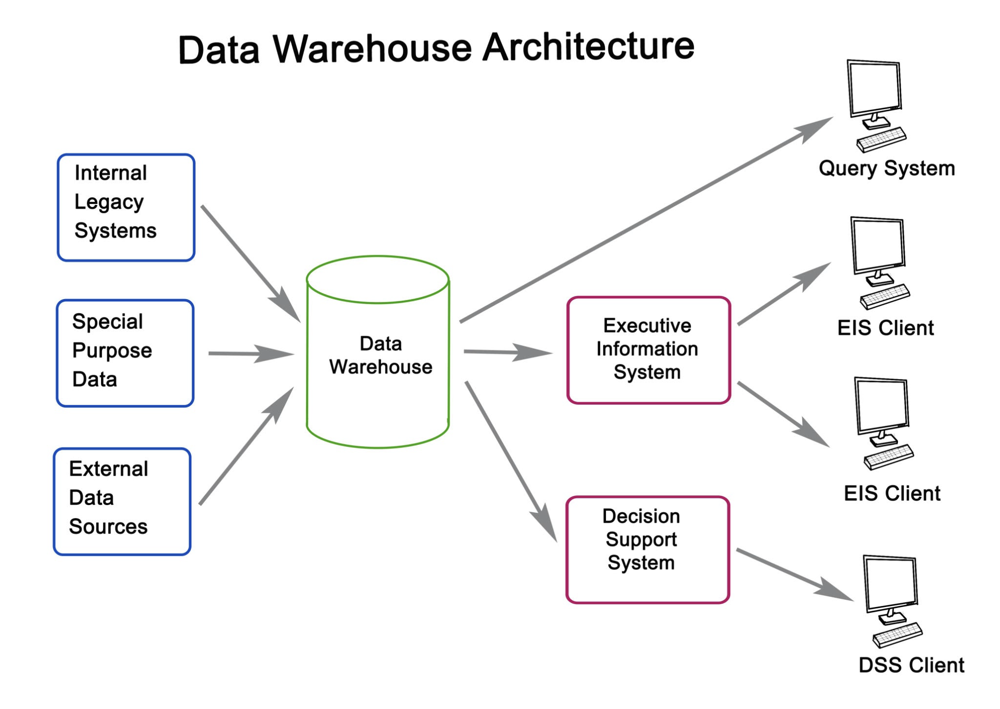

# Sprint 2: Technical Design
---
## Topic: Technical Design
**Focus:** Students will define the **technical backbone** of their projects, focusing on architecture, data models, and integration strategies.  
**重点：** 学生将定义他们项目的**技术框架**，重点关注架构、数据模型和集成策略。  

---

### Deliverables (Week 11-12)
1. Sprint Documentation 冲刺文档
    - Sprint 2 Product Backlog board  
    - Sprint 2 产品待办板
    - Technical User Stories  
    - 技术用户故事
    - Acceptance Criteria  
    - 验收标准
    - Tasks breakdown
    - 任务分解

2. Working Results 工作成果
    - Product demo  
    - 产品演示
    - Product demo code files  
    - 产品演示代码文件
    - **High-Level Architecture Diagrams (Boilerplate)\* (See note below)**  
    - **高级架构图（模板）\*（见下文说明）**
    - Team technical research conclusion
    - 团队技术研究结论

**Note on "High-Level Architecture Diagrams":** This deliverable requires a **Boilerplate Application** built with your chosen technology stack.  
**关于“高级架构图”的说明：** 本成果要求使用您选择的技术栈构建的**模板应用程序**。  

- **Functionality:** It does *not* need specific business logic yet.  
- **功能：** 目前*不*需要特定的业务逻辑。
- **Requirement:** It **must** enable bi-directional data exchange between the Frontend and the Database.  
- **需求：** **必须**能够实现前端和数据库之间的双向数据交换。
- **Goal:** Prove that the user can retrieve information from the database and write information into the database via the frontend.
- **目标：** 证明用户可以通过前端从数据库中检索信息并将信息写入数据库。

---

## Guidelines & Examples
### Defining Acceptance Criteria
Good acceptance criteria are specific and testable.  
好的验收标准是具体且可测试的。  

#### For Database Schema:
- The schema supports queries for performance data within **100ms**.  
- 架构支持在 **100 毫秒**内查询性能数据。
- Tables and relationships adhere to the proposed data model.
- 表和关系遵循提出的数据模型。

#### For API Integration:
- OAuth authentication is implemented and tested with **3 platforms**.  
- OAuth 身份验证已在 **3 个平台**上实施并测试。
- Error handling returns user-friendly messages for failed logins.
- 错误处理返回用户友好的错误信息以处理失败的登录。

### High-Level Architecture Design
Your architecture design should focus on:  
您的架构设计应关注：  
1. **Key Components:** (e.g., Frontend, Backend, Database)   **关键组件：** （例如，前端、后端、数据库）
2. **Interactions:** (e.g., APIs, Authentication flow)   **交互：** （例如，API、认证流程）
3. **Scalability & Modularity:** How the system grows and separates concerns. **可扩展性与模块化：** 系统如何增长和分离关注点。

##### Example: Game Data Analytics Platform
- **Frontend:** React-based dashboard.  
- **前端：** 基于 React 的仪表板。
- **Backend:** Node.js API handling user data.  
- **后端：** Node.js API 处理用户数据。
- **Database:** PostgreSQL storing performance and inventory data.
- **数据库：** PostgreSQL 存储性能和库存数据。

---

## Product Ideas Selection
### Option 1: Mobile Application - HabitHive
**Description:** A mobile app designed to help users build and maintain healthy habits. HabitHive combines habit tracking with motivational gamification, including streaks, rewards, and social accountability.  
**描述：** 一款旨在帮助用户建立和维护健康习惯的移动应用程序。HabitHive 将习惯跟踪与激励游戏化相结合，包括连续性、奖励和社交问责制。  

#### Key Features:
1. **Habit Creation and Tracking:** Create custom habits (e.g., "Drink water 3x daily") and track daily/weekly/monthly progress.   **习惯创建与追踪：** 创建自定义习惯（例如，“每天喝三次水”）并追踪每日/每周/每月进度。
2. **Gamification:** Earn points for streaks; redeem points for badges or avatars.   **游戏化：** 连续完成习惯获得积分；用积分兑换徽章或头像。
3. **Social Sharing:** Join habit groups for accountability and compete with friends.   **社交分享：** 加入习惯小组以增强责任感并与朋友竞争。
4. **Analytics:** View progress charts and receive improvement suggestions.   **数据分析：** 查看进度图表并接收改进建议。
5. **Integration (Optional):** Sync with Apple Health or other apps. **集成（可选）：** 与 Apple Health 或其他应用同步。

#### Technical Challenges:
- **Data Modeling:** Designing for habits, profiles, and logs.  
- **数据建模：** 为习惯、配置文件和日志设计。
- **Scalability:** Supporting real-time updates for thousands of users.  
- **可扩展性：** 支持数千用户的实时更新。
- **Integration:** Implementing APIs for health app syncing.
- **集成：** 实现健康应用同步的 API。

\*\*Technology Stack Suggestions:\*\*  
\*\*技术栈建议：\*\*  
- **Frontend:** React Native (Cross-platform).  
- **前端：** React Native（跨平台）。
- **Backend:** Node.js with Express.  
- **后端：** Node.js 配合 Express。
- **Database:** Firebase or PostgreSQL.
- **数据库：** Firebase 或 PostgreSQL。

### Option 2: Website - EventSphere
**Description:** A web platform connecting users to local events (concerts, workshops, sports) based on interests and location.  
**描述：** 一个连接用户与本地活动（音乐会、研讨会、运动）的在线平台，基于兴趣和位置。

#### Key Features:
1. **Event Discovery:** Filter by category/date; personalized recommendations.   **活动发现：** 按类别/日期筛选；个性化推荐。
2. **Event Management:** Create/host events; manage RSVPs and ticketing.   **活动管理：** 创建/举办活动；管理回复和票务。
3. **Map Integration:** Interactive map display and Google Maps directions.   **地图集成：** 交互式地图显示和谷歌地图导航。
4. **Social Features:** Follow hosts, join groups, and share via social media.   **社交功能：** 关注主办方，加入群组，并通过社交媒体分享。
5. **Host Analytics (Optional):** Insights on ticket sales and demographics. **Host Analytics（可选）：** 关于票务销售和人口统计的洞察。

#### Technical Challenges:
- **Data Modeling:** Handling events, locations, users, and ticketing logic.  
- **数据建模：** 处理事件、地点、用户和票务逻辑。
- **API Integration:** Google Maps API for location services.  
- **API 集成：** 用于位置服务的谷歌地图 API。
- **Real-Time:** Notifications for event changes.
- **实时：** 事件变更通知。

\*\*Technology Stack Suggestions:\*\*  
\*\*技术栈建议：\*\*
- **Frontend:** React.js with Material-UI.  
- **前端：** React.js 配合 Material-UI。
- **Backend:** Python (Flask or Django).  
- **后端：** Python（Flask 或 Django）。
- **Database:** PostgreSQL (Relational) + Redis (Caching).  
- **数据库：** PostgreSQL（关系型）+ Redis（缓存）。
- **3rd Party APIs:** Baidu Maps API / Google Maps, Stripe (Payments).
- **第三方 API：** 百度地图 API / Google Maps，Stripe（支付）。

---

## Example Technical User Stories
Below are examples of how to write technical user stories for the projects above.  
以下是上述项目编写技术用户故事的示例。  

### For HabitHive (Mobile App)
#### Story 1: Database Design
> As a developer, I want to design a database schema for storing user habits and progress so that the data can be queried efficiently.  
> 作为一名开发者，我希望设计一个数据库架构来存储用户习惯和进度，以便数据可以高效查询。

##### Acceptance Criteria:
1. The database contains tables for `users`, `habits`, `progress_logs`, and `achievements`.   数据库包含 `users` 、 `habits` 、 `progress_logs` 和 `achievements` 的表格。
2. Relationships (e.g., one-to-many between users and habits) are properly implemented.   关系（例如用户和习惯之间的一对多关系）得到正确实现。
3. Queries to fetch weekly habit progress take less than **100ms**. 查询获取每周习惯进度的时间少于 **100 毫秒**。

#### Story 2: Push Notification System
> As a developer, I want to implement a push notification service so that users are reminded to complete their habits.  
> 作为一名开发者，我希望实现一个推送通知服务，以便提醒用户完成他们的习惯。

##### Acceptance Criteria:
1. Notifications are sent at the user-specified time.   通知将在用户指定的时间发送。
2. The service retries failed messages up to **3 times**.   服务将重试失败的消息最多 **3 次**。
3. Users can toggle notifications on or off. 用户可以开启或关闭通知。

### For EventSphere (Website)
#### Story 1: Search API
> As a developer, I want to build an API endpoint for event search so that users can filter events by location, category, and date.  
> 作为一名开发者，我希望构建一个用于事件搜索的 API 端点，以便用户可以根据位置、类别和日期筛选事件。

##### Acceptance Criteria:
1. The API supports `GET` requests with query parameters for `location`, `category`, and `date range`.   该 API 支持带有查询参数的 `GET` 请求，用于 `location` 、 `category` 和 `date range` 。
2. The results are sorted by relevance.   结果按相关性排序。
3. The API can handle **100 simultaneous requests** without degrading performance. API 可以处理 100 个并发请求而不会降低性能。
