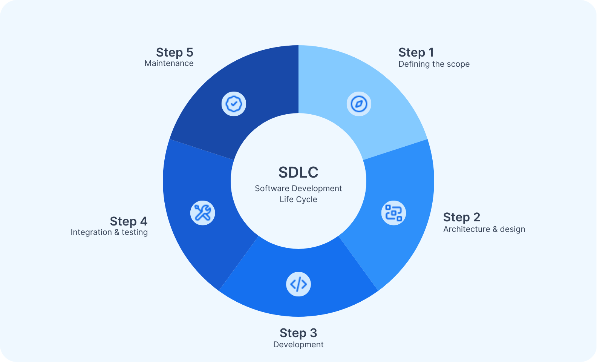

# Agile Testing & Building Quality In
A comprehensive approach to quality assurance in agile development  
敏捷开发中质量保证的全面方法  
> This presentation explores the shift from traditional quality assurance to building quality into the development process, covering agile testing strategies, the test pyramid model, Definition of Done, and quality-building practices.  
> 本演示探讨了从传统质量保证到将质量构建到开发过程中的转变，涵盖了敏捷测试策略、测试金字塔模型、完成定义以及质量构建实践。

## Learning Objectives
1. Understand the core differences between agile testing and traditional testing, and grasp the strategies and practices of agile testing. 了解敏捷测试与传统测试之间的核心差异，并掌握敏捷测试的策略和实践。
2. Master the test pyramid model and be able to explain the purpose and function of different testing levels. 掌握测试金字塔模型，并能够解释不同测试级别的目的和功能。
3. Deeply understand the meaning, components, and critical role of the "Definition of Done - DoD" in ensuring delivery quality. 深入理解“完成定义 - DoD”在确保交付质量中的意义、组成部分和关键作用。
4. Master the core concept and methods of "Build Quality In" during the development process. 掌握在开发过程中“构建质量”的核心概念和方法。
5. Connect agile quality practices with PMBOK's quality principles and delivery performance domains. 将敏捷质量实践与 PMBOK 的质量原则和交付绩效领域相联系。

In traditional software development, testing is often the final stage, acting like a 'gatekeeper.' 在传统的软件开发中，测试通常是最后的阶段，就像一个“守门人”。
  

What are the problems with this model? 这种模式存在哪些问题？

## Design in Software Development Life Cycle

## From "Quality Assurance" to "Building Quality In"

| Traditional Testing                                                                                                                  | Agile Approach                                                                                                                        |
| ------------------------------------------------------------------------------------------------------------------------------------ | ------------------------------------------------------------------------------------------------------------------------------------- |
| Testing as the final "goalkeeper" stage 测试作为最后的“守门员”阶段                                                                            | Quality is built in throughout development 质量贯穿于整个开发过程                                          |
| - Problems found late   - 晚期发现的问题   - High cost of fixes   - 修复成本高昂   - Developers vs testers mentality   - 开发者与测试者心态 | - Continuous quality focus   - 持续关注质量   - Early problem detection   - 早期问题检测   - Collaborative responsibility   - 协作责任 |

Building on last week's lesson on transforming requirements into design, we now focus on ensuring high-quality implementation of those designs.  
在上周关于将需求转化为设计的课程基础上，我们现在关注确保这些设计的高质量实施。

## Agile Testing Strategy
#### Core Principles

<table>
    <tr>
        <td><h4>Test Early, Test Often: </h4><h4>尽早测试，经常测试：</h4>From requirements through delivery 从需求到交付</td>
        <td><h4>Whole-Team Approach: </h4><h4>全员参与的方法</h4>Shared quality responsibility 共享质量责任</td>
        <td><h4>Prevention over Detection</h4><h4>预防胜于检测</h4>Pair programming, code reviews, TDD/BDD 结对编程、代码审查、TDD/BDD</td>
        <td><h4>Automation is Key</h4><h4>自动化是关键</h4>Fast feedback, supports CI/CD 快速反馈，支持 CI/CD</td>
    </tr>
</table>

---

**The Test Pyramid Model**  
**测试金字塔模型**  
The test pyramid is a classic model for agile testing strategy. It guides us on how to rationally allocate testing efforts across different levels.  
测试金字塔是敏捷测试策略的经典模型。它指导我们如何在不同的层级上合理分配测试工作量。  

### Base Level: Unit Tests - Widest Foundation
- **Purpose:** To test whether individual functions, methods, or classes work as expected.
- **目的：** 测试单个函数、方法或类是否按预期工作。
- **Characteristics:** Fast, low-cost, and the most numerous. Written by developers.
- **特点：** 快速、低成本，数量最多。由开发者编写。
- **Analogy:** Checking if every individual part of a car (screws, engine pistons) is qualified.
- **类比：** 检查汽车（螺丝、发动机活塞）的每个部件是否合格。

### Middle Level: Integration Tests / Service Tests
- **Purpose:** To test whether multiple modules or services work together in coordination.
- **目的：** 测试多个模块或服务是否协同工作。
- **Characteristics:** Moderate speed and cost, with a moderate number of tests.
- **特点：** 速度和成本适中，测试数量适中。
- **Analogy:** Checking if the engine, transmission, and driveshaft can operate correctly once assembled.
- **类比：** 检查发动机、变速箱和传动轴组装后能否正确运行。

### Top Level: End-to-End Tests / UI Tests - Narrowest Top
- **Purpose:** To simulate real user scenarios and test the complete system workflows.
- **目的：** 模拟真实用户场景并测试整个系统的工作流程。
- **Characteristics:** Slow, high-cost, and fragile (prone to failure due to UI changes); the quantity should be minimal.
- **特点：** 速度慢、成本高、易碎（由于 UI 变化而容易失败）；数量应尽量少。
- **Analogy:** A driver gets into the complete car, starts it, shifts gears, and steps on the accelerator to see if the car can drive off smoothly.
- **类比：** 一个司机坐进完整的汽车，启动它，换挡，然后踩下油门，看看汽车是否能平稳地开走。

### Anti-patterns
The "test ice cream cone" (heavy reliance on manual and UI tests with few unit tests), which leads to slow feedback and high costs.  
“测试冰淇淋锥”（过度依赖手动和 UI 测试，单元测试很少），这导致反馈慢和成本高。

## Definition of Done (DoD)
### A Shared Quality Commitment
A shared, clear checklist defining all conditions a user story or product increment must meet to be considered "complete".  
一个共享的、清晰的清单，定义了用户故事或产品增量必须满足的所有条件，才能被认为是“完成”。

<table>
    <tr>
        <td><h4>Why DoD Matters: </h4><h4>DoD 的重要性：</h4>- Establishes transparency and shared understanding - 建立透明度和共同理解 - Embeds quality standards into the development process - 将质量标准嵌入到开发过程中 - Ensures delivery of truly usable, high-quality increments - 确保交付真正可用、高质量的功能增量</td>
        <td><h4>Sample DoD for User Stories</h4><h4>用户故事的示例 DoD</h4>- Code written and committed to repository - 编写的代码已提交到代码库 - Unit tests written and passed (>80% coverage) - 编写的单元测试已通过（覆盖率>80%） - Code reviewed by another team member - 代码已由另一位团队成员审查 - Integration tests passed - 集成测试通过 - Product Owner acceptance - 产品负责人验收 - Documentation updated - 文档已更新</td>
    </tr>
</table>

DoD is a dynamic, living document that teams continuously improve during Sprint retrospectives. DoD 是一个动态的、活着的文档，团队在冲刺回顾中持续改进。

## Building Quality In: Core Practices
"DoD is our quality 'contract', these practices are our 'actions' to fulfill it."  
"DoD是我们的质量‘合同’，这些实践是我们的‘行动’来履行它。"

<table> <tr> <th>Test-Driven Development (TDD) 测试驱动开发（TDD）</th> <th>Behaviour-Driven Development (BDD) 行为驱动开发（BDD）</th> </tr> <tr> <td>- Red-Green-Refactor cycle: Write failing test → Write minimal code to pass → Refactor - 红绿重构周期：编写失败的测试 → 编写最小化代码以通过 → 重构 - Benefits: Ensures test coverage, drives cleaner, maintainable design - 优点：确保测试覆盖率，推动更干净、可维护的设计 </td> <td>- Uses natural language (Given-When-Then) to describe system behaviour - 使用自然语言（给定-当-然后）来描述系统行为 - Benefits: User-focused development, executable acceptance tests - 优点：以用户为中心的开发，可执行的验收测试 </td> </tr> <tr> <th colspan="2">Pair Programming & Continuous Integration 结对编程 & 持续集成</th> </tr> <tr> <td colspan="2">- Real-time code review & frequent integration with automated verification - 实时代码审查 & 与自动化验证的频繁集成 - Benefits: Knowledge sharing, early problem detection, rapid feedback - 优点：知识共享、早期问题发现、快速反馈 </td> </tr> </table>

## Connection to PMBOK Quality Principles

| PMI Quality Principles PMI 质量原则                                                                                                                                                                                                                                                                                                                                      | Delivery Performance Domain 交付绩效领域                                                                                                                                                                                                                                                                             |
| ----------------------------------------------------------------------------------------------------------------------------------------------------------------------------------------------------------------------------------------------------------------------------------------------------------------------------------------------------------------------- | ----------------------------------------------------------------------------------------------------------------------------------------------------------------------------------------------------------------------------------------------------------------------------------------------------------------- |
| - <strong>Build Quality In: </strong> Core concept of this lecture, implemented through TDD, BDD, DoD - <strong>在构建中融入质量：</strong>本讲座的核心概念，通过 TDD、BDD、DoD 实现 - **Everyone is Responsible for Quality**: Reflected in agile testing's whole-team approach - **每个人都对质量负责：** 体现在敏捷测试的全团队方法中 | PMBOK emphasizes delivering features that meet quality requirements PMBOK 强调交付满足质量要求的功能  - DoD defines quality standards   - DoD定义质量标准   - Test Pyramid and CI/CD provide technical assurance   - 测试金字塔和 CI/CD 提供技术保证   - Agile "test plan" is dynamic, not static   - 敏捷“测试计划”是动态的，不是静态的 |
> PBI: Product Backlog Item  
> PBI：产品待办事项

> "In the agile world, speed and quality are not opposing forces but complementary ones. By building quality into every aspect of development, we achieve sustainable, rapid value delivery. Quality isn't someone's job—it's the team's culture."  
> 在敏捷世界中，速度和质量不是对立的力量，而是相辅相成的。通过将质量融入开发的每个方面，我们实现可持续的快速价值交付。质量不是某人的工作——它是团队的文化。

