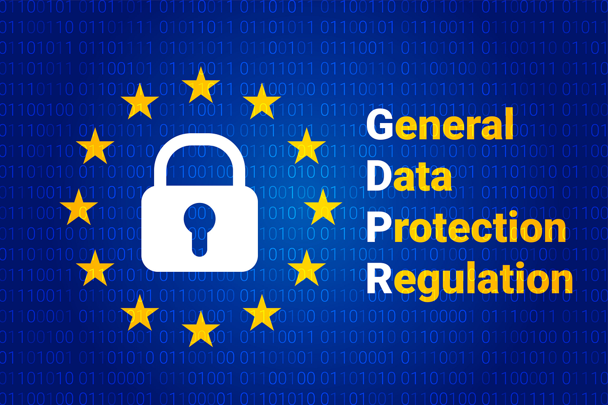

# Social, Legal, Ethical & Professional Issues
Balancing Power and Responsibility in Technology  
在技术中平衡权力与责任

## Learning Objectives

<table>
    <tr>
        <td><h4>Critical Analysis</h4><h4>批判性分析</h4>Critically analyse the dual impact (risks and benefits) of information and computing technology on society 批判性地分析信息技术和计算技术对社会产生的双重影响（风险和益处）</td>
        <td><h4>Legal Understanding</h4><h4>法律理解</h4>Understand and identify core legal frameworks related to software development, especially data protection and intellectual property 理解和识别与软件开发相关的核心法律框架，特别是数据保护和知识产权</td>
        <td><h4>Ethical Principles</h4><h4>伦理原则</h4>Master core principles of professional ethics and apply codes of conduct to guide decision-making 掌握专业伦理的核心原则，并将行为准则应用于指导决策</td>
    </tr>
    <tr>
        <td><h4>Security Standards</h4><h4>安全标准</h4>Gain preliminary understanding of the seriousness of security-related system development and relevant standards 初步了解与安全相关系统开发及相关标准的严重性</td>
        <td><h4>PMBOK Connection</h4><h4>PMBOK 联系</h4>Connect these issues with PMBOK's stewardship principles and ethical standards, understanding deeper responsibilities as project professionals 将这些问题与 PMBOK 的治理原则和道德标准联系起来，理解作为项目专业人士的更深层次责任</td>
    </tr>
</table>

---

## In the past 10 weeks, we learned **how** to build.
在过去 10 周里，我们学习了**如何**构建。
## Today, we ask **what** we should build, and **who** is responsible.
今天，我们探讨我们应该构建**什么**，以及**谁**负责。

---

## The Power and Responsibility of Technology
This lesson explores the 'boundaries of responsibility' for technology practitioners through four dimensions:  
本课通过四个维度探讨了技术实践者的“责任边界”：
- **Social**
- **Legal**
- **Ethical**
- **Professional**

## Legal Frameworks & Privacy
Data Protection: **GDPR (EU General Data Protection Regulation)**  
数据保护：**欧盟通用数据保护条例（GDPR）**  
**Core Principles:**  
**核心原则：**  
1. Legality, Fairness, and Transparency: Clearly inform users why their data is being collected. 合法性、公正性和透明度：明确告知用户为何收集其数据。
2. Purpose Limitation: Data used for purpose A cannot be used for purpose B. 目的限制：用于目的 A 的数据不能用于目的 B。
3. Data Minimization: Collect only the data absolutely necessary. 数据最小化：仅收集绝对必要的数据。
4. User Rights: Users have the right to access, correct, and delete their data (“Right to be forgotten”). 用户权利：用户有权访问、更正和删除他们的数据（“被遗忘权”）。

## The Red Lines: Legal Frameworks and Compliance
"Legal boundaries define the limits of our innovation. Ignoring them not only risks massive fines but destroys user trust."  
“法律边界定义了我们的创新极限。忽视它们不仅会面临巨额罚款，还会破坏用户信任。”  

<table>
    <tr>
        <td><h4>Data Protection</h4><h4>数据保护</h4><strong>Core Regulation:</strong> GDPR (EU General Data Protection Regulation) as global benchmark <strong>核心法规：</strong>GDPR（欧盟通用数据保护条例）作为全球基准 <strong>Key Principles:</strong> <strong>关键原则：</strong> - Lawful, fair, transparent: Clearly inform users why data is collected - 合法、公平、透明：明确告知用户为何收集数据 - Purpose limitation: Data collected for purpose A cannot be used for purpose B - 目的限定：为目的 A 收集的数据不能用于目的 B - Data minimisation: Collect only absolutely necessary data - 数据最小化：仅收集绝对必要的数据 - User rights: Access, correct, delete their data ("right to be forgotten") - 用户权利：访问、更正、删除他们的数据（"被遗忘权"）</td>
        <td><h4>Intellectual Property (IP)</h4><h4>知识产权（IP）</h4>- <strong>Copyright:</strong> Protects the "expression form" of code. Emphasizes open source software licenses (MIT, GPL, Apache) - <strong>著作权：</strong>保护代码的"表达形式"。强调开源软件许可（MIT、GPL、Apache） - <strong>Patents:</strong> Protects "technical solutions" or "inventions" - <strong>专利：</strong>保护"技术解决方案"或"发明" - <strong>Trade Secrets:</strong> Protects company's core algorithms, architecture, etc. - <strong>保密信息：</strong>保护公司的核心算法、架构等</td>
    </tr>
</table>

"Compliance is not just IT department's responsibility, but every engineer's and product manager's duty."
  

"合规不仅仅是 IT 部门的职责，而是每一位工程师和产品经理的义务。"

## Cambridge Analytica and Facebook Data Scandal
### "Your data is shaping the world you see, and even yourself."
**Event Recap:** In 2018, a scandal that shocked the world was exposed. A British political consulting firm named "Cambridge Analytica" was revealed to have illegally obtained personal data from up to 87 million Facebook users without their explicit consent. They accomplished this through a personality test app disguised as academic research, named "thisisyourdigitallife".  
**活动回顾：** 2018 年，一起震惊世界的丑闻被揭露。一家名为“剑桥分析”的英国政治咨询公司被曝光非法获取了高达 8700 万 Facebook 用户的个人信息，而这些用户并未明确同意。他们通过一个伪装成学术研究的性格测试应用“thisisyourdigitallife”实现了这一目的。  
This app not only collected data from its respondents but also exploited vulnerabilities in Facebook's platform at the time to scrape data from all of their friends. Cambridge Analytica used this massive dataset to create detailed "psychographic profiles" of users. Based on these profiles, they conducted targeted, highly personalized, and powerfully persuasive (even misleading) political advertising campaigns during political events such as the 2016 US presidential election, attempting to influence voting behavior.  
此应用不仅收集了其受访者的数据，还利用了当时 Facebook 平台上的漏洞，从他们的所有朋友那里抓取数据。剑桥分析公司利用这个庞大的数据集创建了用户的详细“心理画像”。基于这些画像，他们在 2016 年美国总统选举等政治事件期间进行了有针对性的、高度个性化的、极具说服力（甚至误导性）的政治广告活动，试图影响投票行为。  

## Often, Something may be legal, but it may not be ethical.
Suppose a software company develops a social networking application. Under local law, the company only needs to state in small print in its user agreement that it will collect user data.  
假设一家软件公司开发了一款社交网络应用。根据当地法律，该公司只需在其用户协议的细小字体中声明将收集用户数据。  
This is legal. However, if the company knowingly allows this data to be used to unethically manipulate user emotions or to create "user profiles" and sell them to third parties at high prices, without clearly and transparently informing users, then ethical issues arise.  
这是合法的。然而，如果公司明知故犯，允许使用这些数据不道德地操纵用户情绪或创建“用户档案”并将其高价卖给第三方，而不向用户明确透明地告知，那么就会引发道德问题。  

## Social Impact & Fairness
- **The Double-Edged Sword**: Efficiency vs. Inequality.
- **双刃剑：** 效率与不平等。
- **Case Study**: Amazon's AI Recruitment Tool (Gender Bias).
- **案例研究：** 亚马逊的人工智能招聘工具（性别偏见）。
- **Key Quote**: "Algorithms are opinions embedded in code."
- **关键引言：** “算法是嵌入代码中的观点。”

## The Double-Edged Sword: ICT's Impact on Society
<table>
    <tr>
        <td><h4>The Promise</h4><h4>承诺</h4>- <strong>Connection & Empowerment:</strong> Global communication, knowledge sharing (Wikipedia), inclusive finance - <strong>连接与赋权：</strong>全球通信、知识共享（维基百科）、包容性金融 - <strong>Efficiency & Innovation:</strong> Automated production, supply chain optimization, scientific research advancement - <strong>效率与创新：</strong>自动化生产、供应链优化、科学研究进步 - <strong>Convenience:</strong> E-commerce, online education, telemedicine - <strong>便利：</strong>电子商务、在线教育、远程医疗</td>
        <td><h4>The Peril</h4><h4>危险</h4><strong>- Privacy Erosion:</strong> Surveillance capitalism, massive data breaches <strong>- 隐私侵蚀：</strong>监控资本主义、大规模数据泄露 <strong>- Algorithmic Bias:</strong> Reinforcing social prejudices in recruitment, credit, judicial systems <strong>算法偏见：</strong>在招聘、信贷、司法系统中强化社会偏见 <strong>- Information Bubbles:</strong> Personalized algorithms potentially intensifying social division <strong>- 信息泡沫：</strong>个性化算法可能加剧社会分裂 <strong>- Labour Market Disruption:</strong> Automation and AI's substitution effect on employment <strong>- 劳动市场颠覆：</strong>自动化和人工智能对就业的替代效应 <strong>- Digital Divide:</strong> Exacerbating information and opportunity inequality <strong>- 数字鸿沟：</strong>加剧信息和机会的不平等</td>
    </tr>
</table>

## AI Bias
### "Algorithms don't have bias, but the people and data that create them do."
**Event Recap:** The issue of AI bias has emerged in multiple fields. Let's examine two typical examples:  
**活动回顾：** AI 偏见的问题在多个领域出现。让我们考察两个典型例子：  
**Amazon's Recruiting AI:** Amazon developed an AI tool to screen resumes in order to improve hiring efficiency. However, they discovered that the system exhibited clear discrimination against female candidates. The reason was that the AI was trained on resume data from the past decade, which came from a tech industry historically dominated by men. As a result, the AI learned to "penalize" candidates whose resumes included terms associated with women (such as "women's chess club captain") and favored resumes that used masculine-coded language. Amazon ultimately abandoned the project.  
**亚马逊的招聘 AI：** 亚马逊开发了一个 AI 工具来筛选简历，以提高招聘效率。然而，他们发现该系统对女性候选人存在明显的歧视。原因是 AI 是在过去十年简历数据上训练的，这些数据来自历史上由男性主导的技术行业。因此，AI 学会了“惩罚”简历中包含与女性相关的术语（如“女子象棋俱乐部队长”）的候选人，并偏爱使用男性化语言的简历。亚马逊最终放弃了这个项目。  
**COMPAS Algorithm in the US Judicial System:** COMPAS is an AI tool used to predict a defendant's risk of reoffending, with scores influencing judges' decisions on bail and sentencing. However, an in-depth investigation revealed that the algorithm had significant racial bias: it was twice as likely to incorrectly label Black defendants as "high-risk" compared to white defendants, while white defendants were more likely to be erroneously labeled as "low-risk."  
**美国司法系统中的 COMPAS 算法：** COMPAS 是一种 AI 工具，用于预测被告再犯的风险，其评分会影响法官对保释和判决的决定。然而，一项深入调查揭示了该算法存在显著的种族偏见：它将黑人被告错误标记为“高风险”的可能性是白人被告的两倍，而白人被告更有可能被错误地标记为“低风险”。  

## The Myth of Neutrality
"Algorithms are opinions embedded in code."  
“算法是嵌入代码中的观点。”  
**Critical Thinking**:  
**批判性思维：**  
- Bias In -> Bias Out
- 偏见输入 -> 偏见输出
- Data reflects historical injustice.
- 数据反映历史不公。

## Tesla Autopilot Fatal Accidents
"What role should the human behind the wheel play when the machine makes a mistake?"  
人在驾驶时，当机器出错时，应该扮演什么角色？  
**Event Recap:** Tesla's Autopilot is an advanced driver assistance system (ADAS), but not full self-driving. Over the years, there have been several fatal accidents involving Autopilot.  
**事件回顾：** 特斯拉的自动驾驶仪是一种高级驾驶辅助系统（ADAS），但并非完全自动驾驶。多年来，已经发生了几起涉及自动驾驶仪的致命事故。  
The most notorious of these occurred in 2016 when a driver using Autopilot was caught off guard when the vehicle failed to recognize a white semi-trailer truck crossing the road (due to the bright sky in the background), causing the vehicle to run directly under the truck, killing the driver instantly. The investigation found that the driver had placed excessive trust in the system before the accident and had not kept his hands on the steering wheel for an extended period.  
其中最臭名昭著的是 2016 年发生的一起事故，一名使用自动驾驶仪的驾驶员在车辆未能识别正在过马路的白色半挂卡车（由于背景中明亮的天气）时被吓了一跳，导致车辆直接撞到卡车下，驾驶员当场死亡。调查发现，在事故发生前，驾驶员过度信任了该系统，并且长时间没有握住方向盘。  

---

## Professional Ethics (ACM/IEEE)
**Rule #1**: Public Interest > Employer Interest  
**规则 \#1：** 公共利益 > 雇主利益  
**Professional Judgment**:  
**专业判断：**  
- "Saying **NO** to unsafe features is a skill."
- "**拒绝**不安全功能是一项技能。"

## PMBOK Connection: Professional Stewardship
"Responsible planning and management of resources entrusted to us" "对我们托付的资源进行负责任的规划和管理工作"  
- **Diligence:** Ensuring product safety, reliability, professional standards
- **勤奋：** 确保产品安全、可靠性、专业标准
- **Compliance:** Ensuring project activities follow laws and regulations
- **合规：** 确保项目活动遵循法律法规
- **Trust:** Protecting user data, respecting privacy
- **信任：** 保护用户数据，尊重隐私
- **Care:** Considering long-term impact on society, environment, stakeholders
- **关心：** 考虑到对社会、环境、利益相关者的长期影响
#### PMI Code of Ethics and Professional Conduct
PMI's four core values—<strong>Responsibility, Respect, Fairness, Honesty</strong>—provide ultimate behavioral guidance for all issues discussed.
PMI 的四个核心价值观——<strong>责任、尊重、公平、诚实</strong>——为所有讨论的问题提供最终的行为指导。

---
## You are not just coders.
你们不仅仅是程序员。
## You are the **stewards** of the digital future.
你是数字未来的**守护者**。
## **Build Responsibly.**
**负责任地构建。**
