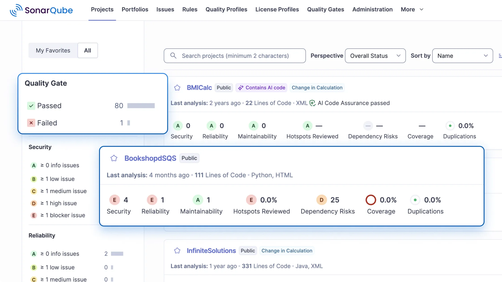
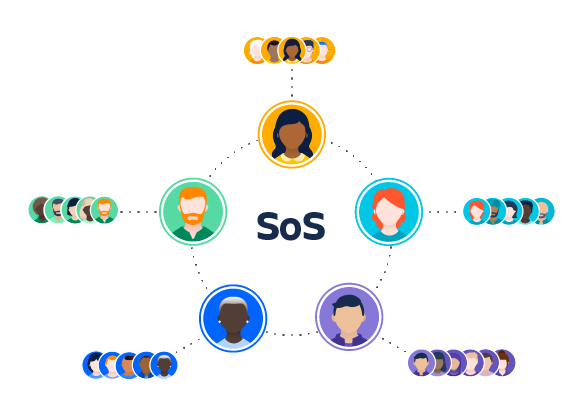
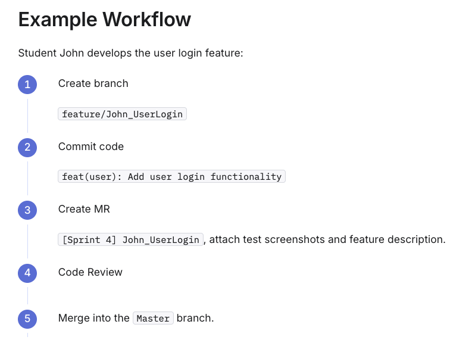
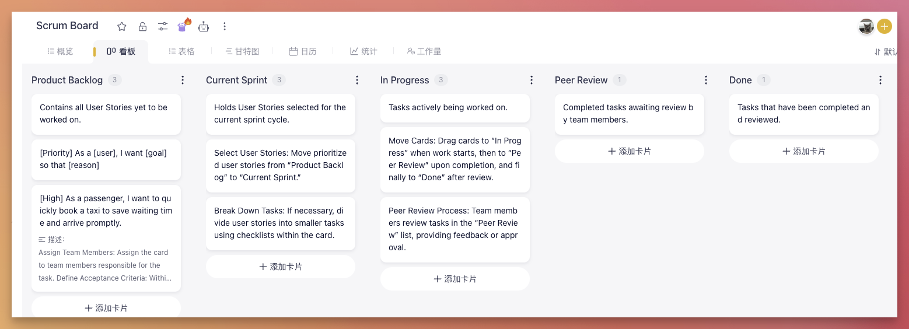

# Advanced Project Management Tools and Techniques
## Learning Objectives
By the end of this session, students will be able to:  
在本节课结束时，学生将能够：
1. **Differentiate** between basic Agile tracking (e.g., Burndown charts) and advanced monitoring techniques (e.g., Agile Earned Value Management). **区分**基本敏捷跟踪（例如，燃尽图）和高级监控技术（例如，敏捷挣值管理）。
2. **Apply** advanced dependency management strategies for scaling products (referencing PMBOK "Schedule Management" principles). **应用**高级依赖管理策略以扩展产品（参考 PMBOK“进度管理”原则）。
3. **Execute** a formal Sprint Review, demonstrating the "Working System" to the Product Owner for sign-off. **执行**正式的冲刺评审，向产品负责人展示“可工作的系统”以获得批准。
4. **Synthesize** technical research and design diagrams into a coherent business presentation (Coursework Part B). 将技术研究和设计图**合成**一个连贯的商业演示（课程作业 B 部分）。

## Theoretical Framework
### 1. Beyond the Burndown: Advanced Metrics
**PMP Integration (Earned Value Management - EVM):**  
**PMP 整合（挣值管理 - EVM）：**
- Traditional EVM uses **_Schedule Performance Index (SPI)_** and **_Cost Performance Index (CPI)_**.
- 传统 EVM 使用***进度绩效指数(SPI)*** 和***成本绩效指数(CPI)***。
- **Agile EVM:** We adapt this. Instead of hours, we use Story Points.
- **敏捷 EVM：** 我们对此进行了调整。我们用故事点代替了小时。

$$SPI = \frac{\text{Completed Story Points}}{\text{Planned Story Points}}$$

_Insight:_ If **SPI<1.0**, your project is behind schedule. This is a vital "Early Warning System" for your upcoming Semester 2 deliverables.  
*见解：* 如果 **SPI<1.0**，你的项目进度落后。这是你即将到来的第二学期交付成果的重要“早期预警系统”。

### 2. Managing Technical Debt & Code Complexity
- **The Concept:** "Technical Debt" is the implied cost of additional rework caused by choosing an easy solution now instead of using a better approach that would take longer.
- **概念：**“技术债务”是指由于现在选择了一个简单的解决方案，而没有使用一个更耗时但更好的方法，从而产生的额外返工的隐含成本。
- **Tools for Management:** **管理工具：**
    - **Static Code Analysis Tools (e.g., SonarQube):** Automating the detection of "spaghetti code" before it becomes unmanageable.
    - **静态代码分析工具（例如，SonarQube）：** 在代码变得难以管理之前自动化检测“面条代码”。
    - **Refactoring Sprints:** Allocating specific capacity in future sprints solely for architectural cleanup.
    - **重构冲刺：** 在未来的冲刺中分配特定容量，仅用于架构清理。

#### Core concept: Technical Debt
> _"Technical Debt is the implied cost of additional rework..."_  
> _技术债务是额外返工的隐含成本..._

This metaphor was proposed by Ward Cunningham.  
这个隐喻是由沃德·坎宁安提出的。  

Just like financial debt, taking on debt (writing bad code) allows you to buy something in the short term (quickly passing the Sprint 2 demo), but you must pay interest (future code changes become extremely painful).  
就像财务债务一样，承担债务（编写糟糕的代码）让你能在短期内购买某物（快速通过 Sprint 2 演示），但你必须支付利息（未来的代码更改变得极其痛苦）。  

If you only borrow and never repay, the entire project will eventually go “bankrupt” (the code becomes impossible to extend, leading to project failure).  
如果你只借不还，整个项目最终会破产（代码变得无法扩展，导致项目失败）。  

#### Static Code Analysis
> _"Automating the detection of 'spaghetti code'..."_  
> _"自动化检测'面条代码'..."_

#### Refactoring Sprints
> _"Allocating specific capacity in future sprints..."_  
> _"在未来的迭代中分配特定容量..."_

This is a type of risk response strategy in agile management (**Risk Response Strategy**).  
When to do it? Usually between **Week 1-2 or Week 5 (Sprint 4 Plan) of Semester 2.**  
这是敏捷管理中的一种风险应对策略（**风险应对策略**）。何时进行？通常在第二学期的**第 1-2 周或第 5 周（第 4 个迭代的计划）**。

**How to explain it to the Product Owner (mentor)?**  
**如何向产品负责人（导师）解释？**
- Incorrect way: “Teacher, we won’t write new features next week because the previous code is too bad and needs to be rewritten.” (Sounds like making excuses for incompetence)
- 不正确的方式：“老师，我们下周不会写新功能，因为之前的代码太糟糕了，需要重写。”（听起来像是在为无能找借口）
- PMP professional way: “In order to ensure that Semester 2 can support more complex AI feature integrations, we plan to allocate 20% of the Story Points in Sprint 3 for architectural optimization (Architectural Cleanup) to repay the technical debt generated in Sprint 1/2. This will improve our future development speed (Velocity).”
- PMP 专业方式：“为了确保第二学期能够支持更复杂的 AI 功能集成，我们计划在第三轮迭代中分配 20%的 Story Points 用于架构优化（架构清理），以偿还第一轮/第二轮迭代中产生的技术债务。这将提高我们未来的开发速度（Velocity）。”

### 3. Scaling Agile: Scrum of Scrums
- **Scenario:** When multiple teams work on a single product (relevant as you look toward Level 6 projects).
- **场景**：当多个团队共同开发一个产品时（当你看向第 6 级项目时适用）。
- **Technique:** A tiered meeting structure where ambassadors from each Scrum team meet to discuss dependencies and integration risks.
- **技术**：一种分层会议结构，其中每个 Scrum 团队的代表会面讨论依赖关系和集成风险。

**Key Takeaways**  
**关键要点**
- Scrum of Scrums is a scaled Agile technique for coordinating multiple teams working toward a common goal.
- Scrum of Scrums 是一种用于协调多个团队共同实现目标的敏捷扩展技术。
- It involves representatives from each team meeting regularly to address dependencies, risks, and integration challenges.
- 它涉及每个团队的代表定期会面，以解决依赖关系、风险和集成挑战。
- Key roles include the chief product owner and Scrum of Scrum master, supporting alignment and delivery at scale.
- 关键角色包括首席产品负责人和 Scrum of Scrum 大师，支持大规模的对齐和交付。
- Use Scrum of Scrums to synchronize large projects, resolve cross-team blockers, and deliver integrated solutions.
- 使用 Scrum of Scrums 来同步大型项目，解决跨团队障碍，并交付集成解决方案。

## What is Scrum of Scrums?

Scrum of Scrums is a scaled agile technique that offers a way to connect multiple teams who need to work together to deliver complex solutions.  
Scrum of Scrums 是一种扩展型敏捷技术，为需要协作以交付复杂解决方案的多个团队提供了一种连接方式。  

It helps teams develop and deliver complex products through transparency, inspection, and adaptation, at scale. It’s particularly successful when all high-performing scrum team members work towards a common goal, have trust, respect, and are completely aligned.  
它帮助团队通过透明度、检查和适应性，以规模化的方式开发和交付复杂产品。当所有表现优异的敏捷团队成员共同追求一个目标，拥有信任、尊重并完全一致时，它尤其成功。  

To support this, team sizing is critical. Research from **Hackman and Vidmar** suggests 4.6 people is the “perfect team size”, theoretically. Teams that are too small or large might struggle with the delivery of complex products.  
为了支持这一点，团队规模至关重要。**Hackman 和 Vidmar** 的研究表明，4.6 人是“理想的团队规模”，从理论上讲。团队规模过小或过大可能会在复杂产品的交付上遇到困难。  

---

The larger a team size, the greater lines of communication between team members, making it harder to create trust and a common purpose.
  

团队规模越大，团队成员之间的沟通线路就越多，这使得建立信任和共同目标变得更加困难。

$$\frac{n×(n-1)}{2}$$

## The purpose of Scrum of Scrums

## III. Practical Application: The Assessment

Event: **Coursework Part B – Group Presentation (Sprint 2 Review)**  
活动：**课程作业 B 部分 - 团队展示（第二冲刺回顾）**  
Mandatory Activity: **Team presentations taking place in the usual practical slots.**  
强制活动：**团队展示将在常规实践时段进行。**  

**Preparation & Setup**  
**准备与设置**
- Critical Reminder: "The key objective for the review is to demonstrate your working system."
- 重要提醒：“回顾的关键目标是展示你们的工作系统。”
- Artifact Check: Ensure you have your Sprint Backlog and Refinement meeting notes ready.
- 工件检查：确保您已准备好冲刺待办事项和细化会议的笔记。
- The Goal: **You need the Product Owner (your tutor) to 'sign off' on User Stories. If they are not signed off, they return to the Product Backlog.**
- 目标：**您需要产品负责人（您的导师）对用户故事进行“批准”。如果未获批准，它们将返回到产品待办事项。**

**Presentation Structure (The "Defense")**  
**演示结构（“辩护”）**
- Part 1: The Product Backlog: Briefly introduce your team plan in Sprint 2.
- 第一部分：产品待办事项：简要介绍您团队在冲刺 2 的计划。
- Part 2: The Build (Demo): Live demonstration of the software. Focus on functionality, not just UI.
- 第二部分：构建（演示）：软件的现场演示。重点在于功能，而不仅仅是用户界面。
- Part 3: The Architecture: Display your design diagrams (E.g. UML, ERD, Wireframes).
- 第三部分：架构：展示你的设计图（例如 UML、ERD、线框图）。
- Part 4: Team Technical Research Conclusion: Briefly explain the team technical research summary.
- 第四部分：团队技术研究结论：简要解释团队技术研究摘要。

## Standardized Gitee Workflow

## Expected Product Backlog
1. Product Backlog 产品待办事项
2. Current Sprint 当前冲刺
3. In Progress 进行中
4. Peer Review 同行评审
5. Done 完成

