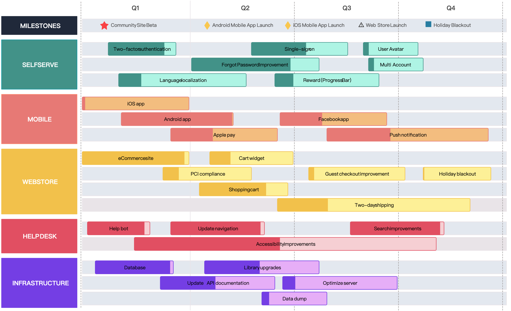
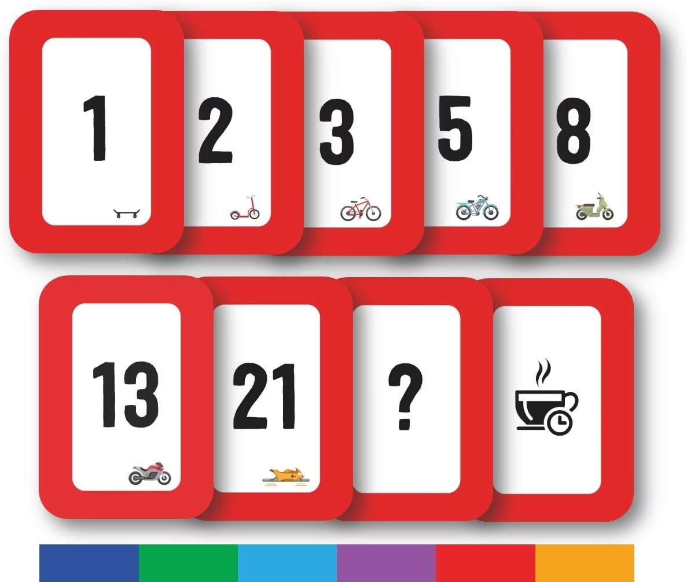

# Agile Project Roadmap and Release Plan
## Learning Objectives
### Knowledge
**Knowledge Level:**
1. Understand the definitions, purposes, and differences between **Product Roadmap and Release Plan**  理解产品路线图和发布计划的定义、目的和区别
2. Understand the characteristics of Agile estimation and the concept of **Story Points**  理解敏捷估算的特点和故事点的概念
3. Recognize the core differences between **Agile planning and traditional planning**  识别敏捷规划和传统规划之间的核心差异

### Skills
**Skills Level:**
1. Be able to create a basic product roadmap, including themes, timeframes, and key milestones  能够创建一个基本的产品路线图，包括主题、时间框架和关键里程碑
2. Be able to plan a release plan, determining release scope, goals, and dependencies  能够制定发布计划，确定发布范围、目标和依赖关系
3. Be able to use **Planning Poker** for story point estimation  能够使用规划扑克进行故事点估算

### Application
**Application Level:**
1. Be able to transform product vision into executable roadmaps and release plans  能够将产品愿景转化为可执行的路线图和发布计划
2. Be able to apply the Velocity concept to predict team delivery capacity  能够应用速度概念来预测团队交付能力
3. Be able to map Agile planning practices to PMBOK knowledge areas  能够将敏捷规划实践映射到 PMBOK 知识领域

## Agile Project Planning Concepts

| Core Concepts 核心概念                                        | Different from traditional planning 不同于传统规划                                                                                                                      | Planning Goals 规划的目标                                                                             |
| ------------------------------------------------------------ | ------------------------------------------------------------------------------------------------------------------------------------------------------------------- | --------------------------------------------------------------------------------------------------- |
| Adaptability, iteration, and progressiveness. 适应性、迭代和进步性。 | Traditional planning emphasizes detail and fixedness, while Agile planning emphasizes flexibility and responsiveness to change. 传统的计划强调细节和固定性，而敏捷计划强调灵活性和对变化的响应。 | Provide direction in uncertainty and allow for adjustment in learning. 在不确定的情况下提供方向，并允许在学习中进行调整。 |

## Definition and Purpose of a Product Roadmap
> A product roadmap is a high-level view of how a product will evolve over time, communicating its future direction, key milestones, and the value to be delivered.  
> 产品路线图是产品如何随时间发展的高级视图，传达其未来方向、关键里程碑和要交付的价值。

It is not a detailed Gantt-chart-style plan, but a strategic document that answers  
它不是一个详细的甘特图式的计划，而是一个回答问题的战略文件  

"Where are we going in the future?" “我们未来将走向何方？”

## Key Components of Product Roadmap
#### Vision
The fundamental drivers of the roadmap  
路线图的基本驱动因素  
#### Themes/Goals
Key business objectives or strategic priorities driving product development  
推动产品开发的关键业务目标或战略优先级  
#### Timeframes
Usually quarterly or monthly, rather than a specific date  
通常是每季度或每月，而不是特定的日期  
#### Key Outcomes/Milestones
Key results or deliverables expected in each time period  
在每个时间段内预期的关键结果或可交付成果  

## Creation Methods
- Start from the **Product Vision**.  从产品愿景开始。
- Combine with "slices" (**Release Versions**) from the User Story map.  与用户故事地图中的“切片”（发布版本）相结合。
- Communicate with **stakeholders** to reach consensus.  与利益相关者沟通以达成共识。

Characteristics of Roadmaps: Strategic, high-level, flexible, continuously updated.  
路线图的特点：战略性的、高层次的、灵活的、持续更新的。  
Tools: Simple tables, PPT, dedicated roadmap tools (e.g., Productboard, Aha!).  
工具：简单的表格、PPT、专门的路线图工具（例如，Productboard、Aha!）。  

## Tesla Master Plan Part IV
[Master Plan Part IV | Tesla](https://www.tesla.com/master-plan-part-4)

## Definition and Purpose of Release Planning
> "A release plan is the next layer below the product roadmap; it more specifically describes what features will be delivered in a particular release and when."  
> “发布计划是产品路线图下一层；它更具体地描述了在特定版本中将交付哪些功能以及何时交付。”

**Difference from Roadmap:**
- The roadmap is strategic "where to go,"  路线图是战略性的“去哪里”，
- While the release plan is tactical "how to get there."  而发布计划是战术性的“如何到达那里”。

It translates high-level roadmap themes into executable feature sets.  
它将高级路线图主题转化为可执行的功能集。

## Key Components of a Release Plan

| Release Goal 发布目标                             | Release Scope 发布范围                                                                          | Release Date 发布日期               | Dependencies 依赖项                            | Risks 风险                                      |
| ------------------------------------------------ | ---------------------------------------------------------------------------------------------- | ---------------------------------- | ---------------------------------------------- | ------------------------------------------------ |
| The core purpose of this release. 本发布版本的核心目的。 | Key features included in this release (from the Product Backlog). 本发布版本包含的关键特性（来自产品待办事项列表）。 | Expected delivery time. 预期交付时间。 | Internal or external dependencies. 内部或外部依赖。 | Risks that may impact the release. 可能影响发布的风险。 |

## Creation Methods
- Select high-priority, high-value features from the Product Backlog.  从产品待办事项中选取高优先级、高价值的功能。
- Plan based on the team's capacity (Velocity).  基于团队容量（速度）制定计划。
- Work closely with the development team to make joint commitments.  与开发团队紧密合作，共同做出承诺。

Release Cadence: Emphasize Agile's recommendation for small, frequent releases to quickly gather feedback.  
发布节奏：强调敏捷推荐的小型、频繁发布，以快速收集反馈。

## Agile Estimation Techniques: Story Point Estimation

#### Why do we need estimates?

1. Help the team understand the workload  帮助团队理解工作量
2. Help product managers with release planning  帮助产品经理进行发布规划
3. Not used as a personal performance appraisal tool  不作为个人绩效评估工具使用

#### Characteristics of Agile Estimation

- **Relative Sizing:** Do not directly estimate hours, but compare with other stories.  相对估算：不要直接估算小时数，而是与其他故事进行比较。
- **Team estimation:** Enhances team understanding and commitment to the work.  团队估算：增强团队对工作的理解和承诺。
- **Uncertainty:** Acknowledge the imprecision of estimates, refining them as more information becomes available.  不确定性：承认估算的不精确性，随着更多信息的出现而细化。

#### Story Points
> An abstract unit of measurement representing the comprehensive embodiment of the effort, complexity, and uncertainty required to complete a user story.  
> 一个抽象的单位，代表完成用户故事所需的努力、复杂性和不确定性的综合体现。

Advantages: Avoids the pressure and inaccuracy of direct time estimation, focusing more on relative size.  
优点：避免了直接时间估计的压力和不准确性，更多地关注相对大小。

## Estimation Method: Planning Poker
> Team members participate together, each holding a set of Fibonacci sequence (1, 2, 3, 5, 8, 13, 21...) cards.  
> 团队成员一起参与，每人手持一套斐波那契数列（1，2，3，5，8，13，21...）卡片。

> Discuss a user story, then reveal cards simultaneously.  
> 讨论一个用户故事，然后同时出示卡片。

> If there are significant differences in estimates, discuss until reaching consensus or relative agreement.  
> 如果估计值存在显著差异，讨论直到达成共识或相对一致。

## Velocity
- "The sum of story points completed by the team within one iteration cycle."  "团队在一个迭代周期内完成的用户故事点总和。"
- Used to predict future iteration delivery capacity and assist in release planning.  用于预测未来迭代的交付能力和协助发布规划。
- Emphasis: Velocity is the team's own metric and should not be used as a comparison tool.  强调：速度是团队自己的指标，不应作为比较工具。

## Mapping to PMBOK Knowledge Areas

| Planning Performance Domain 规划性能领域                                                                                                                                                                                                                                                                                                                                                                                                                    | Development Approach and Life Cycle Performance Domain 开发方法和生命周期性能领域                                                                                                                                                                                                                                                                                                                                 | Estimation Methods (PMBOK Tools & Techniques) 估算方法（PMBOK 工具与技术）                                                                                                                                                                                                                                                                              |
| -------------------------------------------------------------------------------------------------------------------------------------------------------------------------------------------------------------------------------------------------------------------------------------------------------------------------------------------------------------------------------------------------------------------------------------------------------- | ------------------------------------------------------------------------------------------------------------------------------------------------------------------------------------------------------------------------------------------------------------------------------------------------------------------------------------------------------------------------------------------------------- | ----------------------------------------------------------------------------------------------------------------------------------------------------------------------------------------------------------------------------------------------------------------------------------------------------------------------------------------------- |
| - Agile roadmaps and release plans are concrete manifestations of "planning" under Agile methods. - 敏捷路线图和发布计划是敏捷方法下“规划”的具体体现。 - PMBOK emphasizes that planning is a progressive elaboration and iterative process, which is highly consistent with Agile planning philosophy. - PMBOK 强调，规划是一个逐步细化且迭代的进程，这与敏捷规划哲学高度一致。 - Estimation methods are also an important component of the Planning Performance Domain. - 估算方法也是规划绩效领域的一个重要组成部分。 | - "Delivery cadence" is a key focus of this performance domain. Agile roadmaps and release plans precisely define the delivery cadence and iteration cycles of the product. - “交付节奏”是本绩效领域的关键关注点。敏捷路线图和发布计划精确地定义了产品的交付节奏和迭代周期。 - The life cycle of Agile development methods (such as Scrum) consists of a series of iterations (Sprints) and releases. - 敏捷开发方法（如 Scrum）的生命周期由一系列迭代（冲刺）和发布组成。 | - PMBOK contains multiple estimation techniques; story point estimation in Agile is one type of relative estimation method. - PMBOK 包含多种估算技术；敏捷中的故事点估算是一种相对估算方法。 - Emphasize that the purpose of estimation is to better plan and manage expectations, not to provide absolutely precise numbers. - 强调估算的目的是为了更好地规划和管理预期，而不是提供绝对精确的数字。 |

