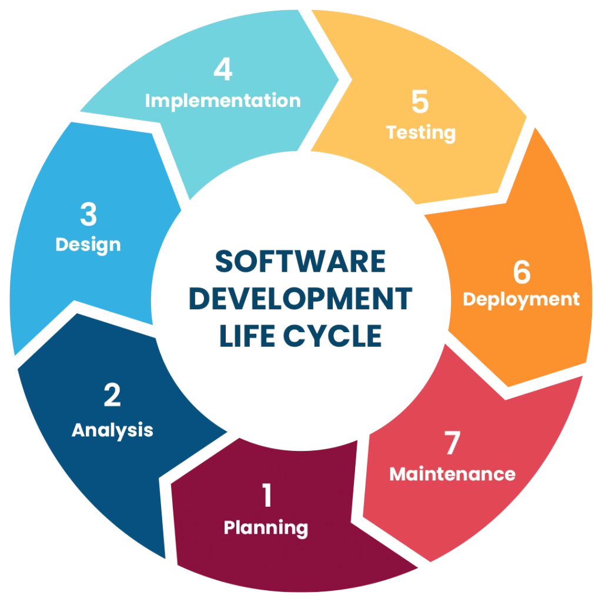
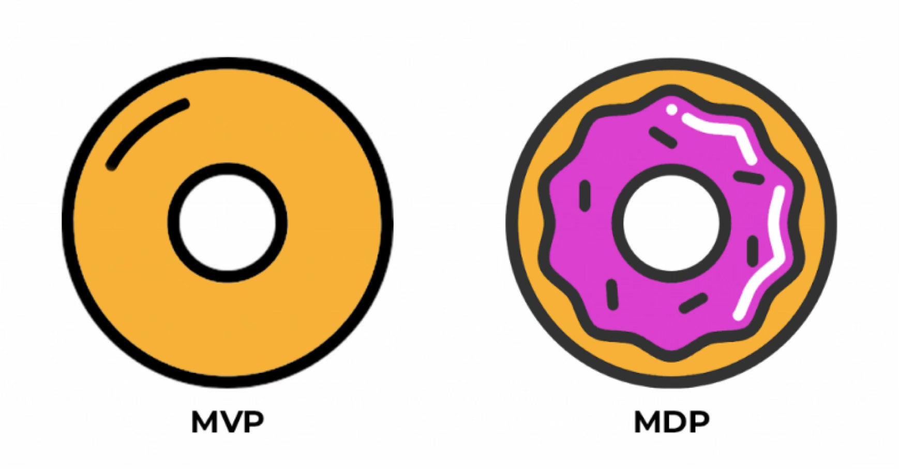
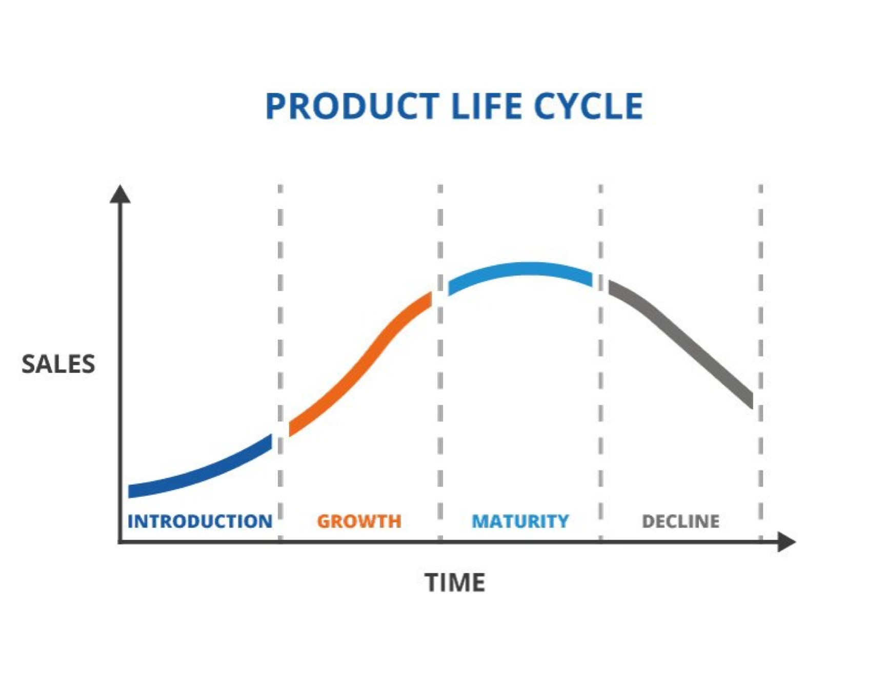

# Building the First Version  MVP/MDP Concepts and Practices
In a high-uncertainty, resource-limited startup environment, we cannot commit significant resources all at once to develop a "perfect" product.  
在高度不确定、资源有限的初创企业环境中，我们不能一次性投入大量资源来开发一个“完美”的产品。  
This course will explore how to build the first deliverable version of a product, which may not be the final complete product, but serves as a critical step for validating ideas and gathering user feedback.  
本课程将探讨如何构建产品的第一个可交付版本，这可能不是最终完整的产品，但它是验证想法和收集用户反馈的关键步骤。

## Learning objectives
- Concepts and significance of **Minimum Viable Product (MVP)** and **Minimum Delightful Product (MDP)**. MVP（最小可行产品）和 MDP（最小愉悦产品）的概念和意义。
- How to determine the scope and core features of an MVP. 如何确定 MVP 的范围和核心功能。
- Selecting work items for Sprint 1 from the Product Backlog. 从产品待办列表中选择 Sprint 1 的工作项。
- Connection to PMBOK: Delivery Performance Domain (value delivery), Planning Performance Domain (scope tailoring). 与 PMBOK 的联系：交付绩效领域（价值交付）、规划绩效领域（范围定制）。

## Software Development Life Cycle(SDLC)

## Introduction: From "Planning" to "First Version"
- "In the previous weeks, we discussed product vision, user story mapping, and product roadmap, progressively refining product ideas from a macro level. Now, it's time to turn these plans into reality." “在过去的几周里，我们讨论了产品愿景、用户故事映射和产品路线图，逐步从宏观层面完善产品想法。现在，是时候将这些计划变为现实了。”
- "This week, we will learn how to build the first deliverable version of the product. It may not be the final complete product, but it is a critical step in validating our ideas and gathering user feedback." “本周，我们将学习如何构建产品的第一个可交付版本。这可能不是最终完整的产品，但它是验证我们的想法和收集用户反馈的关键一步。”

## First Version as MVP or MDP?

### Introducing the Core Idea of MVP
In entrepreneurial environments with high uncertainty and limited resources, we cannot invest massive resources all at once to develop a 'perfect' product.  
在充满不确定性和资源有限的企业环境中，我们不能一次性投入大量资源来开发一个“完美”的产品。  

The core of MVP is: launch fast, learn fast, iterate fast.

MVP 的核心是：快速发布，快速学习，快速迭代。

### Concepts and Significance of Minimum Viable Product (MVP) and Minimum Delightful Product (MDP)  Minimum Viable Product (MVP)
<table>
    <tr>
        <td><strong>Definition:</strong> "MVP is a development technique that aims to develop a new product or website with the minimum set of features to satisfy early adopters and provide feedback for future product development." 定义：“MVP 是一种开发技术，旨在通过最小化功能集来开发新产品或网站，以满足早期采用者的需求，并为未来的产品开发提供反馈。”</td>
        <td><strong>Core Objective:</strong> Launch quickly, collect user feedback, validate assumptions, and iteratively improve the product. 核心目标：快速发布，收集用户反馈，验证假设，并迭代改进产品。</td>
    </tr>
</table>
<table>
    <tr>
        <td>Simplicity: Focus on solving one specific problem, without unnecessary features. 简洁性：专注于解决一个具体问题，不添加不必要的功能。</td>
        <td>Functionality: Must be usable, able to attract early adopters, and effectively solve the core problem. 功能性：必须可使用，能够吸引早期采用者，并有效解决核心问题。</td>
        <td>Flexibility: Allow for changes and adjustments based on user feedback. 灵活性：根据用户反馈进行更改和调整。</td>
    </tr>
</table>

### Importance
<table>
    <tr>
        <td>Cost-Effective: Build only necessary features, minimize development costs, and allocate resources elsewhere. 成本效益：仅构建必要的功能，最小化开发成本，并将资源分配到其他地方。</td>
        <td>Faster Time to Market: Shorten feedback cycles and bring products to market more quickly. 快速上市：缩短反馈周期，更快地将产品推向市场。</td>
    </tr>
    <tr>
        <td>User-Centric: Adjust product features based on actual needs rather than assumptions. 以用户为中心：根据实际需求调整产品功能，而不是基于假设。</td>
        <td>Risk Reduction: Validate market demand before full development, reducing the risk of investing in products that may not meet target audience needs. 风险降低：在全面开发之前验证市场需求，降低投资可能不符合目标受众需求的产品风险。</td>
    </tr>
</table>

> [!NOTE]
> An MVP is not equivalent to a low-quality or functionally deficient product. It should be a reliable product that effectively solves core problems.  
> 最小可行产品（MVP）不等同于低质量或功能不完善的产品。它应该是一个可靠的产品，能够有效解决核心问题。

### MDP - Minimum Delightful Product
<table>
    <tr>
        <td>Concept Introduction:  As the market becomes saturated with applications, users' tolerance for product experience decreases, giving rise to the MDP concept. It emphasizes that an MVP should not only be "viable" but also "delightful." 概念介绍： 随着市场上应用软件的饱和，用户对产品体验的容忍度下降，从而产生了 MDP 概念。它强调 MVP（最小可行产品）不仅应该是“可行的”，还应该是“令人愉悦的”。</td>
        <td>Difference from MVP:  MDP builds upon MVP by placing greater emphasis on user experience (UX) and user interface (UI) aesthetics and fluidity, ensuring that first contact leaves users with a "delightful" impression, thereby better attracting early adopters and gaining recognition. 与 MVP 的区别： MDP 在 MVP 的基础上，更加重视用户体验（UX）和用户界面（UI）的美观和流畅性，确保首次接触给用户留下“令人愉悦”的印象，从而更好地吸引早期采用者并获得认可。</td>
    </tr>
    <tr>
        <td>Core:  Even with limited functionality, the core experience must be delightful. For example, Helpkin (a parenting app) is considered a successful case of modern MDP, balancing design, security, and usability alongside core functionality. 核心： 即使功能有限，核心体验也必须令人愉悦。例如，Helpkin（一款育儿应用）被认为是现代 MDP 的成功案例，它在核心功能的同时，平衡了设计、安全和易用性。</td>
        <td>Why MDP is Needed:  In today's highly competitive app market, users no longer tolerate compromise. A product's appearance, functionality, security, usability, and everything else must coalesce into a delightful user experience to gain any attention. 为什么需要 MDP： 在当今竞争激烈的移动应用市场中，用户不再容忍妥协。一个产品的外观、功能、安全性、易用性以及所有其他方面都必须融合成一个令人愉悦的用户体验，才能引起任何关注。</td>
    </tr>
</table>

### How to Determine the Scope and Core Features of an MVP

<strong>Core Principle:</strong>
  

<strong>核心原则：</strong>
  

Focus on solving one core problem and delivering core value.

专注于解决一个核心问题并传递核心价值。

- Eric Ries emphasizes: "When you are considering building your own minimum viable product, follow this simple rule: remove any feature, process, or effort that does not contribute directly to the learning you seek." 艾瑞克·里斯强调：“当你考虑构建自己的最小可行产品时，请遵循这个简单的规则：移除任何不直接贡献于你寻求的学习的特性和努力。”

### Product Life Cycle

## MoSCoW Method (Must Have, Should Have, Could Have, Won't Have)
1. Must Have
Must Have: Non-negotiable critical features of the MVP; without these features, the product cannot achieve its intended purpose.  
必须有：MVP 的非协商性关键特性；没有这些特性，产品无法实现其预期目的。  

2. Should Have
Should Have: Important but not critical features that can enhance user experience and may be included if time and resources permit.  
应该有：重要但非关键特性，可以增强用户体验，如果时间和资源允许，可以考虑包括在内。  

3. Could Have
Could Have: Desirable but not essential features that can be considered for future iterations.  
可能有：理想但非必需的特性，可以考虑在未来迭代中考虑。  

4. Won't Have
Won't Have: Features agreed not to be included in the current MVP scope.  
不会包含：在当前最小可行产品（MVP）范围内同意不包含的功能。  

> **Implementation Steps:** Brainstorm features -> Categorize -> Regularly review and adjust.  
> 实施步骤：头脑风暴功能 -> 分类 -> 定期审查和调整。

## Selecting Work Items for Sprint 1 from the Product Backlog
<table>
    <tr>
        <td>1. Maximize Value: Prioritize user stories or features that provide maximum value to users and best validate core assumptions. 最大化价值：优先考虑为用户提供最大价值的故事或功能，并最好地验证核心假设。</td>
        <td>2. Minimize Risk: Include work items that help us identify and reduce major technical or market risks as early as possible. 最小化风险：包括有助于我们尽早识别和降低主要技术或市场风险的工作项。</td>
    </tr>
    <tr>
        <td>3. Deliverable: Ensure Sprint 1 work items represent a "minimum usable" increment that the team can complete and deliver within one Sprint cycle (typically 1-4 weeks). 可交付成果：确保 Sprint 1 的工作项代表一个“最小可用”增量，团队可以在一个 Sprint 周期（通常是 1-4 周）内完成并交付。</td>
        <td>4. Cross-Functional Collaboration: Ensure selected work items require collaboration among multiple roles such as development, design, and testing, promoting team collaboration. 跨职能协作：确保选定的工项需要开发、设计、测试等多个角色的协作，促进团队协作。</td>
    </tr>
</table>

## Connection to PMBOK Knowledge Areas

| Delivery Performance Domain - Value Delivery: 交付绩效领域 - 价值交付：                                                                                                                                                                                                                                                                                                                                                                                                                                                                                                                                                                                     | Planning Performance Domain - Scope Tailoring: 规划绩效领域 - 范围定制：                                                                                                                                                                                                                                                                                                                                                                                                                                                                                                                                                                                                                                            |
| --------------------------------------------------------------------------------------------------------------------------------------------------------------------------------------------------------------------------------------------------------------------------------------------------------------------------------------------------------------------------------------------------------------------------------------------------------------------------------------------------------------------------------------------------------------------------------------------------------------------------------------------------- | ----------------------------------------------------------------------------------------------------------------------------------------------------------------------------------------------------------------------------------------------------------------------------------------------------------------------------------------------------------------------------------------------------------------------------------------------------------------------------------------------------------------------------------------------------------------------------------------------------------------------------------------------------------------------------------------------------------- |
| The core of MVP/MDP is precisely "value delivery." It emphasizes delivering value to users quickly by releasing a minimum usable product and learning from actual use to guide subsequent iterations and development. This aligns highly with PMBOK's "Delivery Performance Domain" emphasis on continuously delivering valuable outcomes. MVP/MDP 的核心正是“价值交付”。它强调通过发布最小可用产品并从实际使用中学习来指导后续迭代和开发，从而快速向用户交付价值。这与 PMBOK 的“交付绩效领域”对持续交付有价值成果的强调高度一致。  MVP allows businesses to test product concepts at lower cost and risk, thereby delivering the value needed by the market more effectively. MVP 允许企业在较低的成本和风险下测试产品概念，从而更有效地向市场交付所需的价值。 | Determining the scope and core features of an MVP is essentially "tailoring" or "refining" the overall product scope. This reflects the adaptive adjustment of scope management in agile environments as emphasized in PMBOK's "Planning Performance Domain." 确定 MVP 的范围和核心功能本质上是对整体产品范围的“定制”或“精炼”。这反映了敏捷环境中范围管理的适应性调整，正如 PMBOK 的“规划绩效领域”所强调的。  Through tools such as the MoSCoW method, product managers consciously select "must have" features and exclude less important features from the initial version, which is an effective scope tailoring to achieve rapid market entry and value validation. 通过如 MoSCoW 方法等工具，产品经理有意识地选择“必须要有”的功能，并将不那么重要的功能排除在初始版本之外，这是一种有效的范围定制，旨在实现快速市场进入和价值验证。 |
