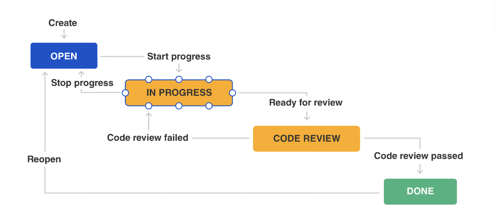
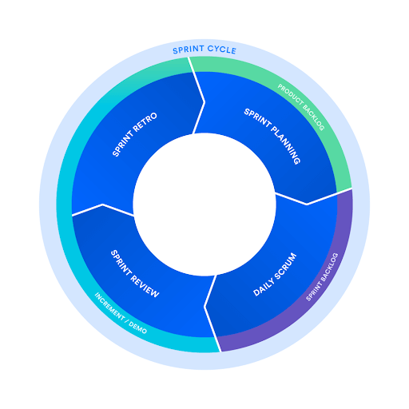

# Agile Methodology  The Scrum Framework and Roles
## Learning Objectives
**Knowledge Level:**
1. Understand the empirical nature of the Scrum framework, its Three Pillars, and Five Scrum Values 理解敏捷框架的经验性质、其三大支柱和五大敏捷价值观
2. Clearly identify the three core roles in the Scrum team and their responsibility boundaries 明确识别 Scrum 团队中的三个核心角色及其责任边界
3. Recognize the alignment between Scrum framework and PMBOK's Team Performance Domain and Development Approach and Life Cycle Performance Domain 认识到 Scrum 框架与 PMBOK 的团队绩效领域和开发方法以及生命周期绩效领域之间的关联

---

**Skills Level:**
1. Be able to differentiate the different focus areas and working methods of Product Owner, Scrum Master, and Developers 能够区分产品负责人、Scrum 大师和开发者的不同关注领域和工作方法
2. Be able to identify role conflicts in Scrum team collaboration and resolve them using Scrum values 能够识别 Scrum 团队协作中的角色冲突，并使用 Scrum 价值观解决它们
3. Be able to apply the Three Pillars of Scrum to real project scenarios 能够将 Scrum 的三个支柱应用于实际项目场景

---

**Application Level:**
1. Be able to assign appropriate Scrum roles to team members in real projects 能够在实际项目中为团队成员分配适当的 Scrum 角色
2. Be able to understand how Scrum Master's Servant Leadership is practiced in teams 能够理解 Scrum Master 的仆人式领导在团队中的实践
3. Be able to connect Scrum role design with PMBOK team management concepts 能够将 Scrum 角色设计与 PMBOK 团队管理概念联系起来

## Agile Methodology
### Brief History of Software Development Methodologies
#### 1. Early Software Development (1940s-1960s)
- No formal methodology 没有正式的方法
- "Code and fix" approach “编码和修复”方法
- Limited documentation 文档有限
- High maintenance costs 高维护成本

---

#### 2. Traditional Methodologies Evolution
- 1970: Waterfall model introduced by Winston Royce 1970 年：温斯顿·罗伊斯提出瀑布模型
- 1980s: Structured programming and documentation 1980 年代：结构化编程和文档
- 1990s: Rise of object-oriented methods 20 世纪 90 年代：面向对象方法的兴起
- 2000s: Emergence of lighter, more flexible approaches 21 世纪初：轻量级、更灵活方法的涌现

### Problems with Traditional Waterfall Approach
#### Key Issues
1. Difficult to go back and make changes 难以回溯进行修改
2. High cost of late-stage changes 后期修改成本高昂
3. Often outdated by implementation time 通常在实施时已经过时
4. Customer sees results only at end 客户只能在最后看到结果
5. Etc. 等等

### The Birth of Agile

February 2001, Snowbird, Utah

2001 年 2 月，犹他州雪鸟

17 Software Development Leaders met

17 位软件开发领导者相聚

<strong>Goal: Find better ways to develop software</strong>

<strong>目标：寻找更好的软件开发方法</strong>

Result: The Agile Manifesto

结果：《敏捷宣言》

<table>
    <tr>
        <td>Kent Beck
Mike Beedle
James Grenning
Jim Highsmith
Robert C. Martin
Steve Mellor
Arie van Bennekum
Alistair Cockburn
Ward Cunningham
Martin Fowler</td>
        <td>James Grenning
Jim Highsmith
Andrew Hunt
Ron Jeffries
Jon Kern
Brian Marick</td>
        <td>Robert C. Martin
Steve Mellor
Ken Schwaber
Jeff Sutherland
Dave Thomas</td>
    </tr>
</table>

### The Agile Manifesto
<table>
    <tr>
        <td>Individuals and interactions 个人和交互</td>
        <td>over 优于</td>
        <td>Processes and tools 进程和工具</td>
    </tr>
    <tr>
        <td>Working software 工作软件</td>
        <td>over 超过</td>
        <td>Comprehensive documentation 全面文档</td>
    </tr>
    <tr>
        <td>Customer collaboration 客户协作</td>
        <td>over 超过</td>
        <td>Contract negotiation 合同谈判</td>
    </tr>
    <tr>
        <td>Responding to change 应对变化</td>
        <td>over</td>
        <td>Following a plan 按照计划进行</td>
    </tr>
</table>

### Agile Workflows

## From "What to Build" to "How to Build It"

In a team without a traditional project manager, who handles priorities, ensures smooth processes, and completes the actual work?

在一个没有传统项目经理的团队中，谁负责处理优先级、确保流程顺畅以及完成实际工作？

## The Essence of Scrum: Empiricism
> "Scrum's foundation is empiricism, where knowledge comes from experience and decisions are based on known facts."  
> "敏捷的基石是经验主义，知识来源于经验，决策基于已知事实。"

Rather than following a rigid plan, Scrum teams learn through doing, inspecting results, and adapting their approach based on real evidence.  
敏捷团队不是遵循僵化的计划，而是通过实践、检查结果并根据实际证据调整方法来学习。

## The Three Pillars and Five Values of Scrum
#### Three Pillars
<table>
    <tr>
        <td><h5>Transparency 透明度</h5>Work and processes visible to all stakeholders (e.g., public Product Backlog, visual task boards) 工作流程对所有利益相关者可见（例如，公开的产品待办事项列表、可视化的任务板）</td>
        <td><h5>Inspection 检查</h5>Frequent examination of Scrum artifacts and progress to detect deviations 频繁检查 Scrum 工件和进度，以发现偏差</td>
        <td><h5>Adaptation 适应</h5>Quick adjustments when inspection reveals problems to minimize further deviation 当检查发现问题时，快速调整以最小化进一步的偏差</td>
    </tr>
</table>

---

#### Five Values
<table>
    <tr>
        <td>Commitment 承诺</td>
        <td>Courage 勇气</td>
        <td>Focus 聚焦</td>
        <td>Openness 开放</td>
        <td>Respect 尊重</td>
    </tr>
</table>
These values form the cultural foundation for successful Scrum implementation.  
这些价值观构成了成功实施 Scrum 的文化基础。

## Scrum Framework Overview

## The Scrum Team
> "A Scrum Team is a self-organizing, cross-functional small team (typically under 10 people), without hierarchy or sub-teams."  
> “Scrum 团队是一个自我组织、跨职能的小型团队（通常人数少于 10 人），没有等级或子团队。”

The Scrum Team consists of three distinct roles, each with specific responsibilities that complement one another to deliver maximum value.  
Scrum 团队由三个不同的角色组成，每个角色都有特定的职责，相互补充以实现最大价值。

## Product Owner (PO)
### Core Responsibility
- Maximize product value 最大化产品价值

### Focus
- "What" & "Why" “是什么”与“为什么”

### Key Point
- The PO is one person, not a committee. Their decisions must be respected throughout the organization. 产品负责人是一个人，不是一个委员会。他们的决定必须在整个组织中得到尊重。

### Specific Duties
- Define and communicate product goals 定义和传达产品目标
- Create and manage the Product Backlog 创建和管理产品待办事项
- Prioritize requirements to ensure maximum value 优先排序需求以确保最大价值
- Ensure the backlog is transparent, visible and understandable 确保待办事项透明、可见且易于理解
- Bridge between development team and stakeholders (customers, users, management) 连接开发团队和利益相关者（客户、用户、管理层）

## Scrum Master
The Scrum Master is a servant-leader who helps everyone improve the way they work.  
Scrum Master 是一个服务型领导者，帮助每个人改进他们的工作方式。

### Core Responsibility
- **Ensure Scrum is understood and executed correctly** **确保 Scrum 被正确理解和执行**

### Focus
- "How (the process)" “如何（这个过程）”

### Role Comparison
- A "coach," not a "project manager" or "boss" “教练”，而不是“项目经理”或“老板”

### Services Provided
<table>
    <tr>
        <td><h4>To Developers 面向开发者</h4>Remove obstacles, facilitate self-organization, protect from external interference 消除障碍，促进自我组织，抵御外部干扰</td>
        <td><h4>To Product Owner 面向产品负责人</h4>Help effectively manage backlog, ensure collaboration with team 帮助有效管理待办事项，确保团队协作</td>
        <td><h4>To Organisation 致组织</h4>Guide Scrum adoption, promote cross-team collaboration 指导 Scrum 采纳，促进跨团队协作</td>
    </tr>
</table>

## Development Team (Developers)
### Core Responsibility
- **Deliver a valuable, usable "Done" product increment each Sprint** **在每个冲刺中交付一个有价值、可用的“完成”产品增量**

### Focus
- "How (the work)" “如何（完成工作）”

### Key Point
- No titles within the team—everyone is a "Developer" 团队内无职位头衔——大家都是“开发者”

### Specific Duties
- Self-organize to transform backlog items into deliverable increments 自我组织，将待办事项转换为可交付的增量
- Function cross-functionally with all skills needed (development, testing, design) 与所有所需技能（开发、测试、设计）跨职能协作
- Create Sprint Backlog and commit to Sprint Goals 创建冲刺待办事项并承诺达成冲刺目标
- Synchronize progress in Daily Scrum meetings 在每日站会中同步进度
- Take responsibility for product quality 对产品质量负责

**Collaboration Summary:** PO decides "what to do," Developers decide "how to do it," and SM helps everyone "do it better"—a balanced, collaborative triangle.  
**协作总结**：产品负责人决定“做什么”，开发者决定“怎么做”，敏捷教练帮助大家“做得更好”——一个平衡的、协作的三角形。

## PMBOK Knowledge Areas Alignment
**Comparison:**

| Traditional Team Structure 传统团队结构                                                        | Scrum Team Structure 敏捷团队结构                                      |
| ------------------------------------------------------------------------------------------- | ------------------------------------------------------------------- |
| Divided by function (development, testing, design work separately) 按职能划分（开发、测试、设计工作分别进行） | Cross-functional team (all skills in one team) 跨职能团队（所有技能在一个团队中） |
| Project Manager controls 项目经理负责                                                          | Self-organizing, team decides 自我组织，团队决策                          |
| Hierarchical structure 层级结构                                                              | Flat structure, no hierarchy 扁平结构，无层级                            |
| Individual accountability 个人责任                                                           | Collective accountability 集体责任                                   |
