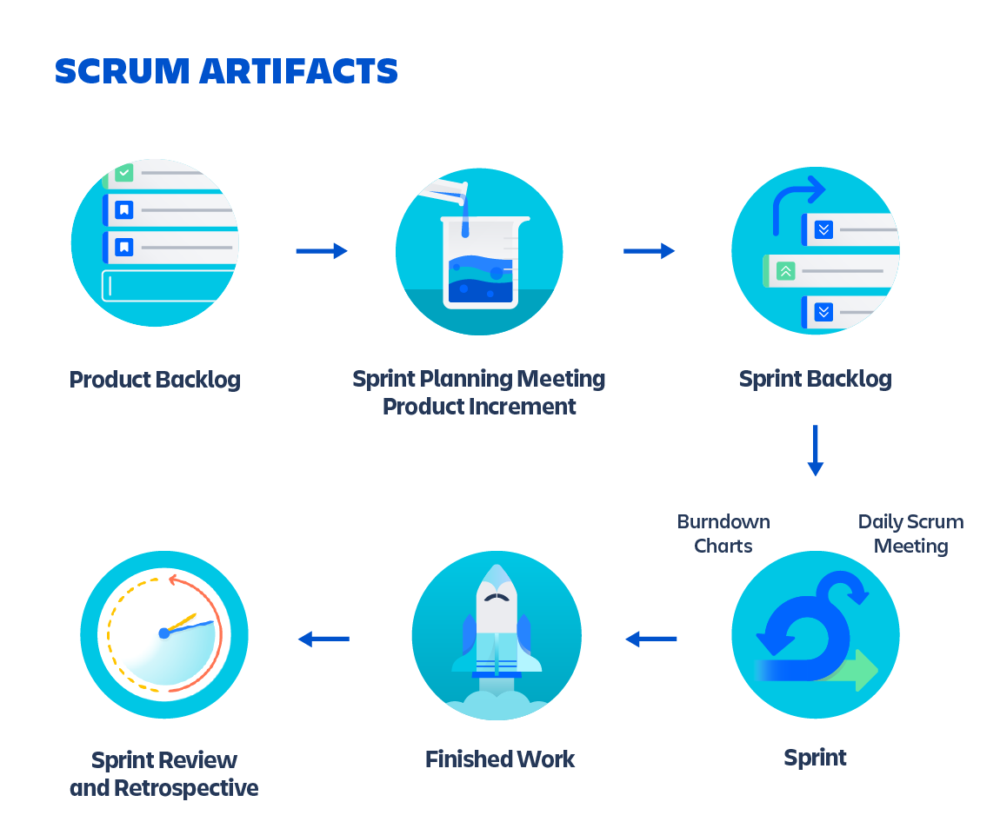
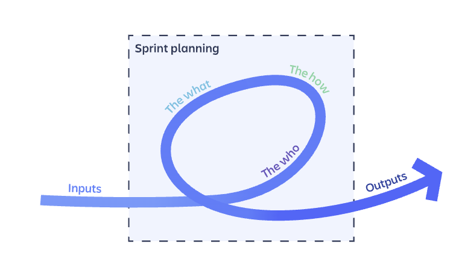
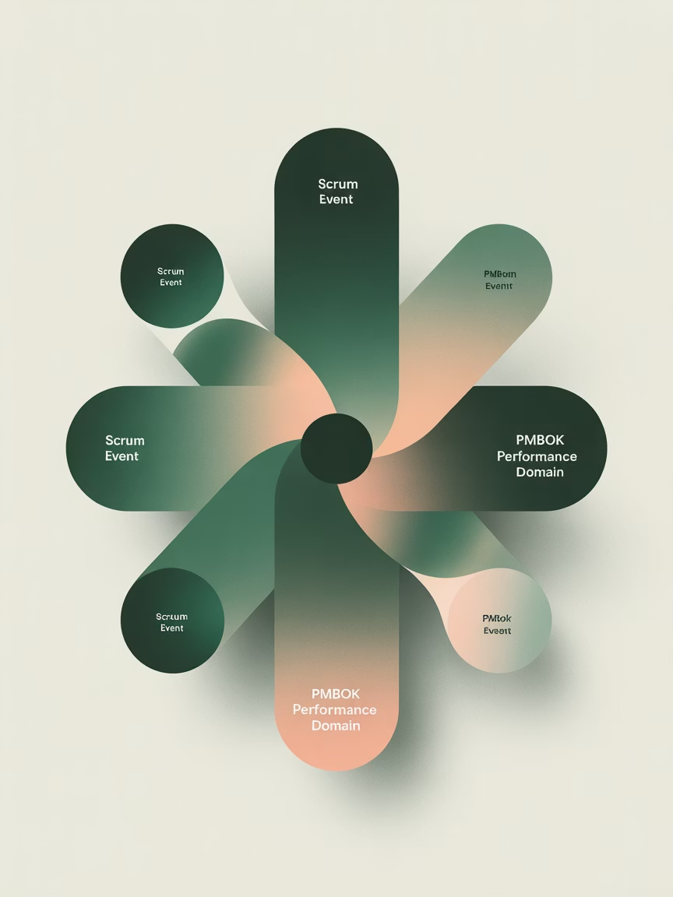

# Scrum Events (Part 1): Sprint Planning & Daily Scrum
This lecture explores how these events foster team self-organization and adaptation to uncertainty within the Scrum framework.  
本讲座探讨了这些事件如何在 Scrum 框架内促进团队自我组织和适应不确定性。

## Learning Objectives

| Knowledge & Understanding                                                                                                                                                                                                                                                              | Skills & Application                                                                                                                                                                                                                                | Thinking & Connection                                                                                                                                                                |
| -------------------------------------------------------------------------------------------------------------------------------------------------------------------------------------------------------------------------------------------------------------------------------------- | --------------------------------------------------------------------------------------------------------------------------------------------------------------------------------------------------------------------------------------------------- | ------------------------------------------------------------------------------------------------------------------------------------------------------------------------------------ |
| - Understand Sprint Planning's purpose, inputs, outputs, and process - 理解冲刺计划的宗旨、输入、输出和流程 - Define Sprint Goal and Sprint Backlog concepts and relationship - 定义冲刺目标和冲刺待办事项的概念及其关系 - Master Daily Scrum's core purpose and three classic questions - 掌握每日站会的核心宗旨和三个经典问题 | - Simulate creating an effective Sprint Goal - 模拟制定有效的冲刺目标 - Break down Product Backlog Items into Sprint Backlog tasks - 将产品待办项分解为冲刺待办任务 - Apply Daily Scrum principles for efficient progress synchronization - 应用每日站会原则以实现高效的进度同步 | - Connect Scrum events with PMBOK® Guide's Performance Domains - 将敏捷事件与 PMBOK® 指南的性能领域相联系 - Recognize how events foster self-organization and adaptation - 认识到事件如何促进自我组织和适应 |

## Scrum Values
Successful use of Scrum depends on people becoming more proficient in living five values:  
成功运用 Scrum 取决于人们是否能在以下五个价值观方面变得更加熟练：  

<strong><i>Commitment, Focus, Openness, Respect, and Courage</i></strong>
  

<strong><i>承诺、专注、开放、尊重和勇气</i></strong>

## Agile Scrum Artifacts
**Agile Scrum Artifacts** are information that a scrum team and stakeholders use to detail the product being developed, actions to produce it, and the actions performed during the project.  
敏捷 Scrum 工件是敏捷团队和利益相关者使用的信息，用于详细说明正在开发的产品、生产它的行动以及项目期间执行的行动。  

Scrum’s artifacts represent <strong>Work or Value</strong>.

Scrum 的工件代表工作或价值。

---

Each artifact contains a commitment to ensure it provides information that enhances transparency and focus against which progress can be measured:  
每个工件都包含一项承诺，确保它提供的信息可以增强透明度和专注度，以便可以据此衡量进度：  

- For the Product Backlog it is the **Product Goal**. 对于产品待办事项，它是产品目标。
- For the Sprint Backlog it is the **Sprint Goal**. 对于冲刺待办事项，它是冲刺目标。
- For the Increment it is the **Definition of Done**. 对于增量，它是完成标准。

> [!TIP]
> Product Backlog: Functionality and user stories  
> Sprint Backlog: Back list select user story from product backlog  
> Definition of done: How to determine the finish of job  

### DoD (Definition of Done)

- Code meets agreed coding standards 代码符合约定的编码标准
- Unit tests written and passing (minimum 80% coverage) 编写并通过单元测试（最低 80% 覆盖率）
- Integration tests completed 完成集成测试

## The Main Artifacts of Agile Scrum

The main agile scrum artifacts are product backlog, sprint backlog, and increments.  
敏捷 Scrum 的主要工件包括产品待办事项、冲刺待办事项和增量。
## Sprint Planning: Purpose & Key Information

| Purpose & Structure                                                                                                                                                                                                                                                                                               | Inputs                                                                                                                                                                                                                                                                                                |
| ----------------------------------------------------------------------------------------------------------------------------------------------------------------------------------------------------------------------------------------------------------------------------------------------------------------- | ----------------------------------------------------------------------------------------------------------------------------------------------------------------------------------------------------------------------------------------------------------------------------------------------------- |
| - Collaborative working session to plan the upcoming Sprint - 计划即将到来的 Sprint 的协作工作坊 - Timebox: 8 hours max for one-month Sprint; 4 hours for two-week Sprint - 时间限制：一个月 Sprint 最多 8 小时；两周 Sprint 最多 4 小时 - Attendees: Entire Scrum Team (PO, SM, Developers) - 参与者：整个 Scrum 团队（产品负责人、Scrum 大师、开发者） | - Product Backlog: PO-prioritized requirements - 产品待办事项：产品负责人优先级排序的需求 - Latest Product Increment: Completed work - 最新产品增量：已完成的工作 - Developers' capacity: Forecast of work possible - 开发者能力：可能完成的工作预测 - Past performance: Historical data (velocity: workload / time) - 过去表现：历史数据 |

> PO: Project Owner
> SM: Scrum Master

## Sprint Planning: Three Core Topics

| Why is this Sprint valuable?                                                                                                                                                                                                                                                                                                                                   | What can be Done this Sprint?                                                                                                                                                                                                                                                                   | How will the chosen work get done?                                                                                                                                                                                                                                                                                               |
| -------------------------------------------------------------------------------------------------------------------------------------------------------------------------------------------------------------------------------------------------------------------------------------------------------------------------------------------------------------- | ----------------------------------------------------------------------------------------------------------------------------------------------------------------------------------------------------------------------------------------------------------------------------------------------- | -------------------------------------------------------------------------------------------------------------------------------------------------------------------------------------------------------------------------------------------------------------------------------------------------------------------------------- |
| **Activity:** PO proposes business goals for the Sprint 活动：产品负责人（PO）为冲刺提出业务目标  **Output:** An inspiring Sprint Goal created collaboratively 输出：共同创建一个鼓舞人心的冲刺目标  **Example:** "Implement basic user login and registration functionality to allow the first batch of seed users to access the system." 示例：“实现基本的用户登录和注册功能，以便首批种子用户能够访问系统。” | **Activity:** Developers negotiate with PO to select Product Backlog Items 活动：开发者与产品负责人（PO）协商，选择产品待办事项  **Key Point:** Only Developers decide how much work they can accomplish 关键点：只有开发者决定他们能完成多少工作  **Output:** Selected Product Backlog Items (PBIs) 输出：选定的产品待办事项（PBIs） | **Activity:** Developers break down PBIs into smaller, actionable tasks 活动：开发者将 PBIs 分解成更小、可执行的子任务  **Output:** Sprint Backlog = Sprint Goal + selected PBIs + execution plan 输出：迭代待办列表 = 迭代目标 + 选定的 PBIs + 执行计划  **Emphasis:** Sprint Backlog is a real-time plan owned by Developers 强调：冲刺待办事项是开发者拥有的实时计划 |

## How to Run a Sprint Planning Meeting?

### Step one: Prep for the sprint planning meeting (PO is responsible for this)
Running a great sprint planning meeting requires a bit of discipline.  
举办一场出色的冲刺规划会议需要一点纪律。  

The product owner must be prepared, combining the lessons from the previous sprint review, stakeholder feedback, and vision for the product, so they set the scene for the sprint.  
产品负责人必须做好准备，结合上一次冲刺评审的教训、利益相关者的反馈和产品的愿景，从而为冲刺做好准备。  

For transparency, the product backlog should be up-to-date and refined to provide clarity.  
为了提高透明度，产品待办事项列表应该是最新的并且经过细化的，以便提供清晰度。  

Backlog refinement is an optional event in scrum, because some backlogs don’t need it. However, for most teams, it’s better to get the team together to review and refine the backlog prior to sprint planning.  
待办事项细化是敏捷开发中的一个可选事件，因为并非所有待办事项都需要进行细化。然而，对于大多数团队来说，在冲刺计划会议之前，将团队聚集在一起审查和细化待办事项会更好。  

### Step two: Set a time limit for sprint planning
Sprint planning should be constrained no more than two hours for each week of the sprint.  
冲刺计划的时间不应超过每个冲刺周的两小时。  

So, for example, the sprint planning meeting for a two-week sprint would be no longer than four hours. This is called "timeboxing", or setting a maximum amount of time for the team to accomplish a task, in this case, planning the sprint.  
例如，对于两周的冲刺，冲刺计划会议不应超过四小时。这被称为“时间盒”，即为团队完成一项任务设定一个最大时间，在这种情况下，是规划冲刺。  

The scrum master is responsible for making sure the meeting happens the timebox is understood. If the team is happy before the timebox is finished, then the event is over. A timebox is a maximum time allowed; there is no minimum time allowed.  
Scrum Master 负责确保会议按时进行，并且时间盒被理解。如果团队在时间盒结束前感到满意，那么活动就结束了。时间盒是一个最大时间；没有最小时间限制。  

### Step three: Define the goals for the sprint
The sprint goal describes the objective of the sprint at a high level, but the backlog Items can also be written with an outcome in mind.  
冲刺目标从高层次描述了冲刺的目标，但待办事项也可以以结果为导向来编写。  

User stories are one great way of describing the work from a customer point of view. User stories, written like the one below, re-focus defects, issues, and improvements on the outcome the customer is seeking rather than the observed problem.  
用户故事是描述从客户角度工作的绝佳方式。像下面这样的用户故事，将缺陷、问题和改进重新聚焦于客户寻求的结果，而不是观察到的问题。  

As \< <u>type of user</u> \>, I want \< <u>a goal</u> \> so that \< <u>a reason</u> \>

### Step four: Estimate sprint effort (Story point)
> Story Points 遵循斐波那契数列  
> 参见Week4 Lecture

Sprint planning requires some level of estimation. The team needs to define what can or cannot be done in the sprint: estimated effort vs capacity. Estimation is often confused with commitments.  
冲刺规划需要一定程度的估算。团队需要定义在冲刺中能做什么或不能做什么：估算的精力与容量。估算常常被误解为承诺。  

Good estimation requires a trust-based environment where information is given freely, and assumptions are discussed in the pursuit of learning and improvement.  
良好的估算需要建立在信任的基础上，信息可以自由交流，假设在追求学习和改进的过程中被讨论。  

## Sprint Planning: Negotiation & Collaboration
> [!TIP]
> Classroom Discussion  
> "What should happen if the PO wants to include a very large feature in the Sprint, but the Developers estimate they cannot complete it?"  
> “如果产品负责人想要在冲刺中包含一个非常大的特性，但开发者估计无法完成，应该怎么办？”

> Very large user story: epic

<table>
    <tr>
        <td><h4>Negotiation</h4>PO and Developers must discuss priorities and possibilities openly  产品负责人和开发者必须公开讨论优先级和可能性</td>
    </tr>
    <tr>
        <td><h4>Respect Estimates</h4>Developer estimates should be respected as they understand the work complexity  开发者的估算应受到尊重，因为他们了解工作的复杂性</td>
    </tr>
    <tr>
        <td><h4>Feature Splitting</h4>Consider breaking the large feature into smaller, manageable pieces  考虑将大型功能拆分为更小、更易管理的部分</td>
    </tr>
    <tr>
        <td><h4>Scope Adjustment</h4>Adjust Sprint scope to maintain quality and team sustainability  调整冲刺范围以保持质量和团队可持续性</td>
    </tr>
</table>

## Daily Scrum

#### Purpose & Structure

- Inspect progress toward Sprint Goal 检查对冲刺目标的进展
- Adapt upcoming planned work 调整即将计划的工作
- 15-minute timebox, strictly enforced 15 分钟时间盒，严格执行
- Same time and place daily 每天同一时间和地点
- Primarily for Developers (SM ensures effectiveness, PO listens) 主要面向开发者（Scrum大师确保有效性，产品负责人倾听）

#### The Three Questions

1. What did I do yesterday that helped meet the Sprint Goal? 我昨天做了什么来帮助实现冲刺目标？
2. What will I do today to help meet the Sprint Goal? 我今天将做什么来帮助实现冲刺目标？
3. Do I see any impediments preventing us from meeting the Sprint Goal? 我是否看到了任何阻碍我们实现冲刺目标的障碍？

#### Common Pitfalls

Avoid turning it into a "status report" to SM or PO  
避免将其变成向Scrum大师或产品负责人的报告  

Raise impediments during meeting, resolve afterward  
在会议中提出障碍，之后解决  

## Connection to PMBOK® Guide
<table>
    <tr>
        <td><h4>Planning Performance Domain</h4>Sprint Planning exemplifies <strong>Iterative Planning</strong> - creating detailed plans for short cycles rather than planning everything at once 冲刺规划体现了迭代规划——为短期周期创建详细计划，而不是一次性规划所有内容 Demonstrates <strong>Progressive Elaboration</strong> - plans become more specific as more information becomes available 展示了渐进式细化——随着更多信息的可用，计划变得更加具体</td>
    </tr>
    <tr>
        <td><h4>Project Work Performance Domain</h4>Daily Scrum is key for managing <strong>Project Processes</strong> and maintaining <strong>Team Focus</strong> 每日站会对于管理项目流程和保持团队专注至关重要 Daily inspection and adaptation helps teams quickly identify deviations, align with Sprint Goals, and reduce waste 每日检查和调整有助于团队快速识别偏差，与冲刺目标保持一致，并减少浪费</td>
    </tr>
</table>

## Summary & After-class Thinking

| Core Takeaways                                                                                                                                                                                                                                                           | After-class Questions                                                                                                                                                                                                                                                                                                                                     |
| ------------------------------------------------------------------------------------------------------------------------------------------------------------------------------------------------------------------------------------------------------------------------ | --------------------------------------------------------------------------------------------------------------------------------------------------------------------------------------------------------------------------------------------------------------------------------------------------------------------------------------------------------- |
| - Sprint Planning answers **Why, What, How** - producing Sprint Goal and Sprint Backlog - 迭代计划回答了为什么、做什么、怎么做 - 产生迭代目标和迭代待办事项 - Daily Scrum is a 15-minute synchronization meeting to inspect progress and identify impediments - 每日站会是一个 15 分钟的同步会议，用于检查进度和识别障碍 | 1. What are the characteristics of a good Sprint Goal? Create a fictional Sprint Goal for your course project. 1. 一个好的冲刺目标有哪些特点？为你的课程项目创建一个虚构的冲刺目标。 2. If a team's Daily Scrum consistently runs overtime, what might be the reasons? How would you, as a Scrum Master, guide improvement? 2. 如果一个团队的每日站会经常超时，可能的原因是什么？作为 Scrum Master，你会如何引导改进？ |
