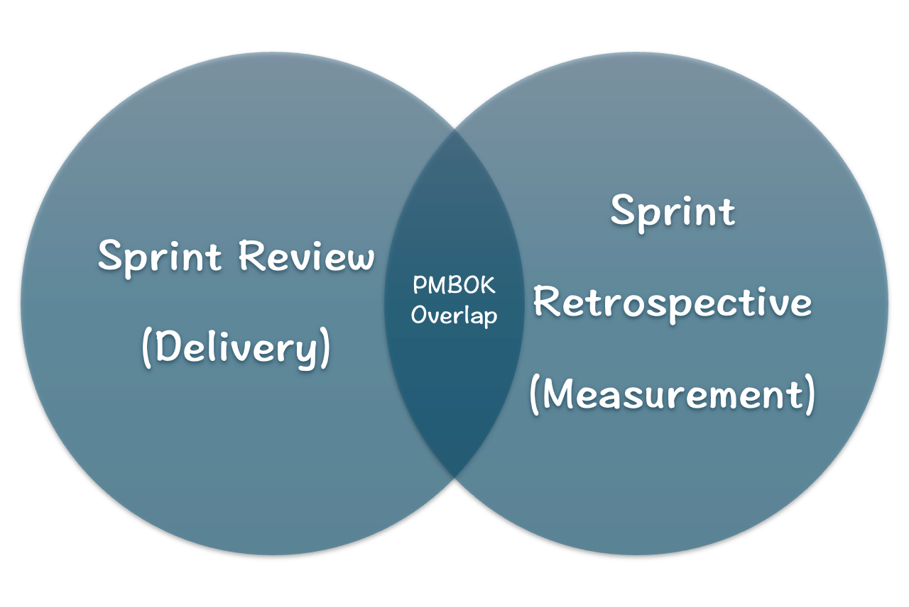
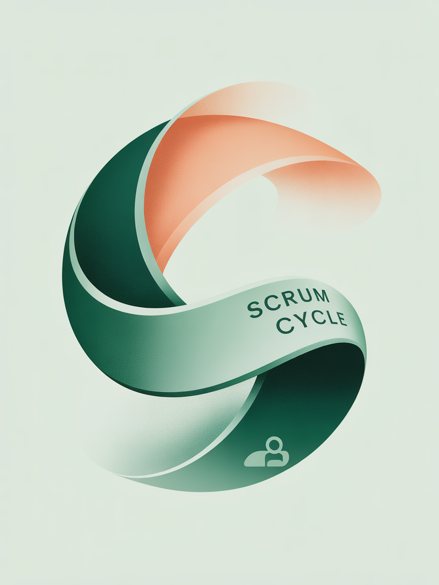

# Sprint Review & Sprint Retrospective
A comprehensive exploration of the final two Scrum ceremonies that complete the "Inspect & Adapt" cycle.  
全面探讨完成“检查与适应”周期的最后两个 Scrum 仪式。

## Learning Objectives

| Knowledge & Understanding 知识 & 理解                                                                                                                                                                                                                                                                  | Skills & Application 技能 & 应用                                                                                                                                                                                     | Thinking & Connection 思考与联系                                                                                                                                                                                                                                                           |
| ----------------------------------------------------------------------------------------------------------------------------------------------------------------------------------------------------------------------------------------------------------------------------------------------------- | ------------------------------------------------------------------------------------------------------------------------------------------------------------------------------------------------------------------- | ---------------------------------------------------------------------------------------------------------------------------------------------------------------------------------------------------------------------------------------------------------------------------------------- |
| - Understand Sprint Review purpose, activities, and participants   - 理解冲刺评审的目的、活动和参与者   - Master Sprint Retrospective purpose, key topics, and principles   - 掌握冲刺回顾的目的、关键主题和原则   - Differentiate between "Product Increment" and "Potentially Shippable"   - 区分“产品增量”和“可能可发货”   | - Simulate organizing effective Sprint Reviews   - 模拟组织有效的冲刺评审   - Facilitate simple Sprint Retrospectives   - 促进简单的冲刺回顾   - Transform improvement items into backlog items   - 将改进事项转化为待办事项   | - Connect Scrum's Inspect & Adapt with Deming Cycle (PDCA)   - 将敏捷的检查与适应与戴明循环（PDCA）联系起来   - Understand how Review and Retrospective focus on product vs process   - 理解评审和回顾如何关注产品与流程   - Link Scrum events to PMBOK® performance domains   - 将敏捷活动与 PMBOK®绩效领域相联系   |

## The Main Artifacts of Agile Scrum

The main agile scrum artifacts are product backlog, sprint backlog, and increments.
  

敏捷 Scrum 的主要工件包括产品待办列表、冲刺待办列表和增量。

## Sprint Review Meeting
Building on our previous session: The Sprint's goal is to produce a "Done," usable Product Increment.  
基于我们之前的课程：冲刺的目标是产生一个“完成”的、可用的产品增量。

<h3>But how do we know if it meets expectations?</h3>
  

<h3>但我们如何知道它是否符合预期？</h3>

## Sprint Review Meeting

| Purpose 目的                                                                                                                                                                           | Timebox 时间盒                                               | Attendees 参会者                                                                            |
| --------------------------------------------------------------------------------------------------------------------------------------------------------------------------------------- | ------------------------------------------------------------ | ------------------------------------------------------------------------------------------- |
| Inspect Sprint outcomes and collaborate with stakeholders on next steps.   检查冲刺成果并与利益相关者讨论下一步行动。      This is an informal meeting, not a status report.   这是一个非正式会议，不是状态报告。 | Maximum 4 hours for a one-month Sprint   一个月冲刺的最大时长为 4 小时 | Scrum Team and key stakeholders (customers, users, management)   敏捷团队和关键利益相关者（客户、用户、管理层） |

## Sprint Review Meeting
#### Core Activities
- PO explains which PBIs are "Done" and which aren't
- 产品负责人解释哪些 PBIs “完成”了，哪些没有
- Developers discuss Sprint progress, problems, and solutions
- 开发者讨论冲刺进度、问题和解决方案
- Developers demonstrate only "Done" increments that meet Definition of Done
- 开发者展示符合“完成标准”的“完成”增量
- Group collaborates on next steps
- 团队协作确定下一步行动

**Output:** A revised **Product Backlog** reflecting current market needs and opportunities  
**输出**：反映当前市场需求和机遇的修订版**产品待办事项列表**

## Sprint Retrospective
We've inspected "what" we did in the Review. Now we need to inspect "how" we did it.  
我们在评审中检查了“我们做了什么”。现在我们需要检查“我们是如何做的”。

<h3>How can we make the next Sprint more effective and enjoyable?</h3>
  

<h3>我们如何让下一个冲刺更加高效和愉快？</h3>

## Sprint Retrospective
### Purpose & Key Information
- **Purpose:** To plan ways to increase quality and effectiveness in the next Sprint. **This is a meeting focused on process improvement.**
- **目的**：规划在下一个 Sprint 中提高质量和效率的方法。**这是一个以流程改进为重点的会议。**
- **Topics of inspection:** Individuals, interactions, processes, and tools.
- **检查主题**：个人、交互、流程和工具。
- **Timebox:** For a one-month Sprint, it is a maximum of three hours.
- **时间限制**：对于一个为期一个月的 Sprint，最多为三小时。
- **Attendees:** Only the Scrum Team (PO, SM, Developers). This is a safe space for honest communication.
- **参会人员**：仅限 Scrum 团队（产品负责人、Scrum Master、开发者）。这是一个坦诚沟通的安全空间。

## Sprint Retrospective
### The Classic Three Questions

| 1. What went well in the Sprint? 在冲刺中哪些做得好？    | 2. What could be improved? 我们可以改进什么？                    | 3. What will we commit to try in the next Sprint? 在下一个 Sprint 中，我们将承诺尝试什么？                                                                             |
| ------------------------------------------------- | ---------------------------------------------------------- | --------------------------------------------------------------------------------------------------------------------------------------------------------- |
| Identify and maintain good practices 识别并维护良好实践 | Identify problems and challenges encountered 识别遇到的问题和挑战 | **Key Output:** Transform valuable improvement items into concrete, actionable plans for the next Sprint Backlog **关键输出**：将宝贵的改进事项转化为具体、可执行的下一迭代待办事项计划 |

## Connection to PMBOK® Guide

| Delivery Performance Domain 交付绩效领域                                                                                                                                                                                                                                                | Measurement Performance Domain 测量绩效领域                                                                                                                                                                                                                                                                                                                           |
| ------------------------------------------------------------------------------------------------------------------------------------------------------------------------------------------------------------------------------------------------------------------------------------ | ------------------------------------------------------------------------------------------------------------------------------------------------------------------------------------------------------------------------------------------------------------------------------------------------------------------------------------------------------------------ |
| The **Sprint Review** directly relates to **Delivering Value**. By demonstrating working software to stakeholders, the team gets direct feedback on value, ensuring deliverables align with business goals. **冲刺评审**与**交付价值**直接相关。通过向利益相关者展示可工作的软件，团队能够直接获得关于价值的反馈，确保交付成果与业务目标一致。 | The **Sprint Review** measures **product progress** (what we delivered). **冲刺评审**衡量**产品进度**（我们交付了什么）。  The **Sprint Retrospective** measures **team performance and process health** (how we delivered) and drives improvement, reflecting the "assess performance" and "take action" cycle. **冲刺回顾**衡量**团队绩效和流程健康**（我们如何交付）并推动改进，反映了“评估绩效”和“采取行动”的循环。 |

## Summary
<table>
    <tr>
        <td><h4>Sprint Review</h4>- Focuses on the <strong>Product</strong> - 专注于<strong>产品</strong> - Inspects the <strong>outcome (What)</strong> - 检查<strong>结果（什么）</strong> - Involves <strong>stakeholders</strong> - 涉及<strong>利益相关者</strong> - Output: <strong>Updated Product Backlog</strong> - 输出：<strong>更新后的产品待办事项</strong></td>
    </tr>
    <tr>
        <td><h4>Sprint Retrospective</h4>- Focuses on the <strong>Process</strong> - 专注于<strong>流程</strong> - Inspects the <strong>methods (How)</strong> - 检查<strong>方法（如何）</strong> - Limited to the <strong>Scrum Team</strong> - 仅限于 <strong>Scrum 团队</strong> - Output: <strong>Actionable improvement items</strong> - 输出：<strong>可操作改进事项</strong></td>
    </tr>
</table>
With this, we have completed our study of the five Scrum events, forming a complete "Plan-Do-Check-Act" loop.  
通过这一点，我们完成了对五个 Scrum 活动的学习，形成了一个完整的“计划-执行-检查-行动”循环。

## After-class Thinking

| Question 1                                                                                                                                                                                                                                                                       | Question 2                                                                                                                                                                                                                                                                                           |
| -------------------------------------------------------------------------------------------------------------------------------------------------------------------------------------------------------------------------------------------------------------------------------- | ---------------------------------------------------------------------------------------------------------------------------------------------------------------------------------------------------------------------------------------------------------------------------------------------------- |
| Why is the Sprint Retrospective strictly limited to the Scrum Team, while the Sprint Review encourages inviting external stakeholders? What are the respective purposes of these different participant settings? 为什么冲刺回顾严格限制在 Scrum 团队内部，而冲刺评审却鼓励邀请外部利益相关者？这些不同的参与者设置分别有什么目的？ | If a team repeatedly identifies the same problems in multiple Sprint Retrospectives without improvement, what, as a Scrum Master, do you think the root causes might be? How would you help the team break this cycle? 如果一个团队在多次冲刺回顾中反复发现相同的问题却未见改进，作为 Scrum Master，你认为可能存在哪些根本原因？你将如何帮助团队打破这个循环？ |

