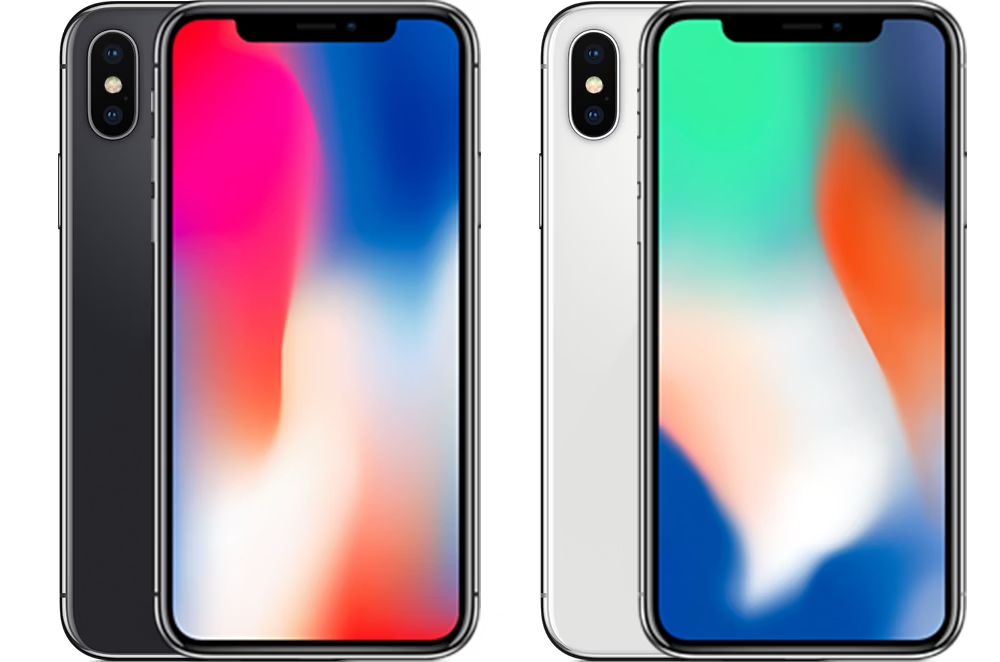
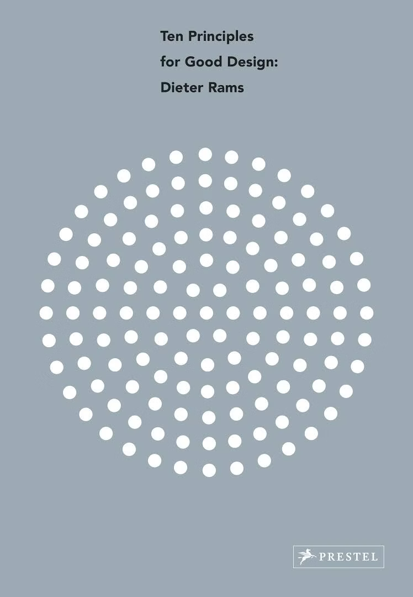
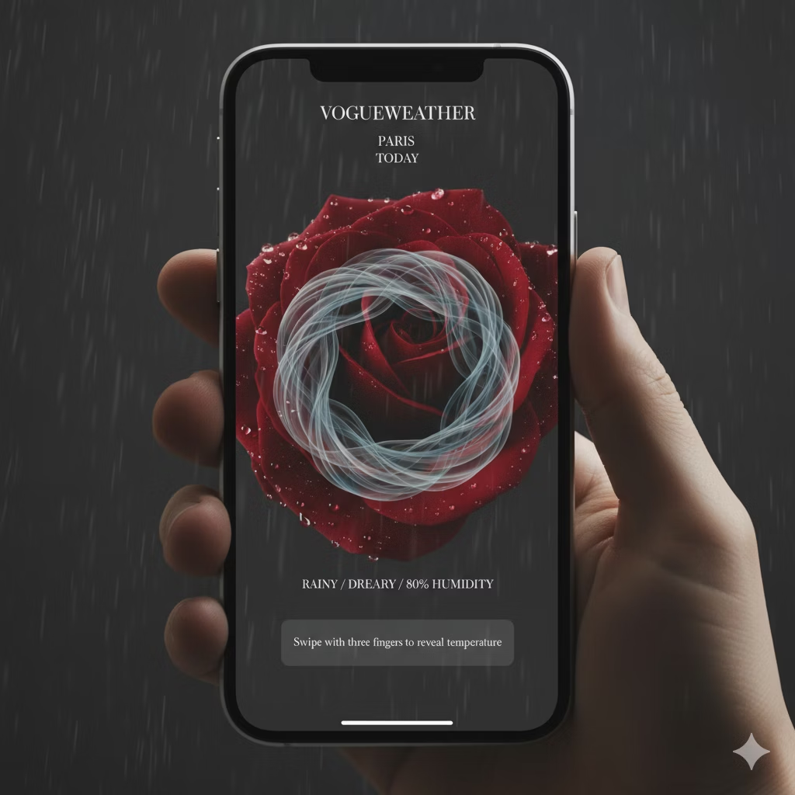
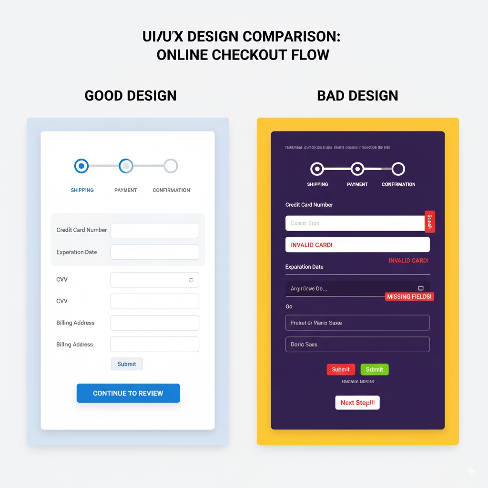
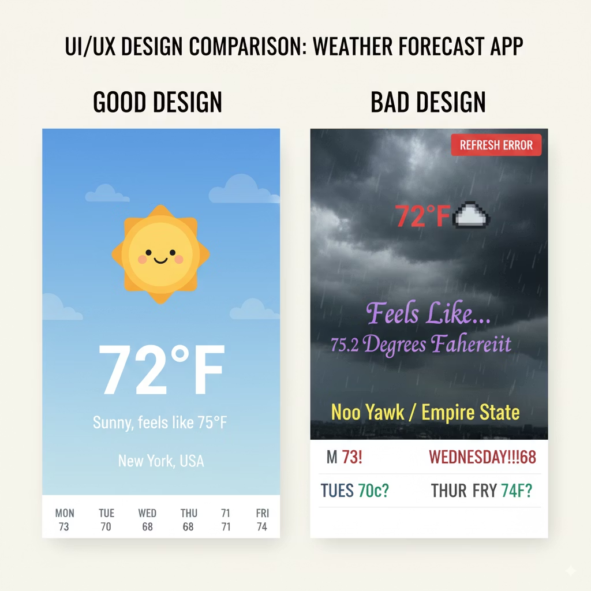
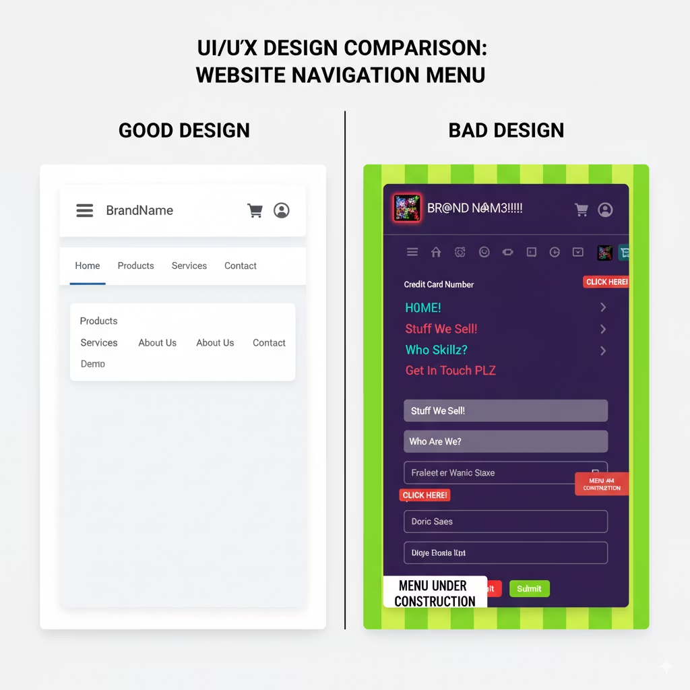
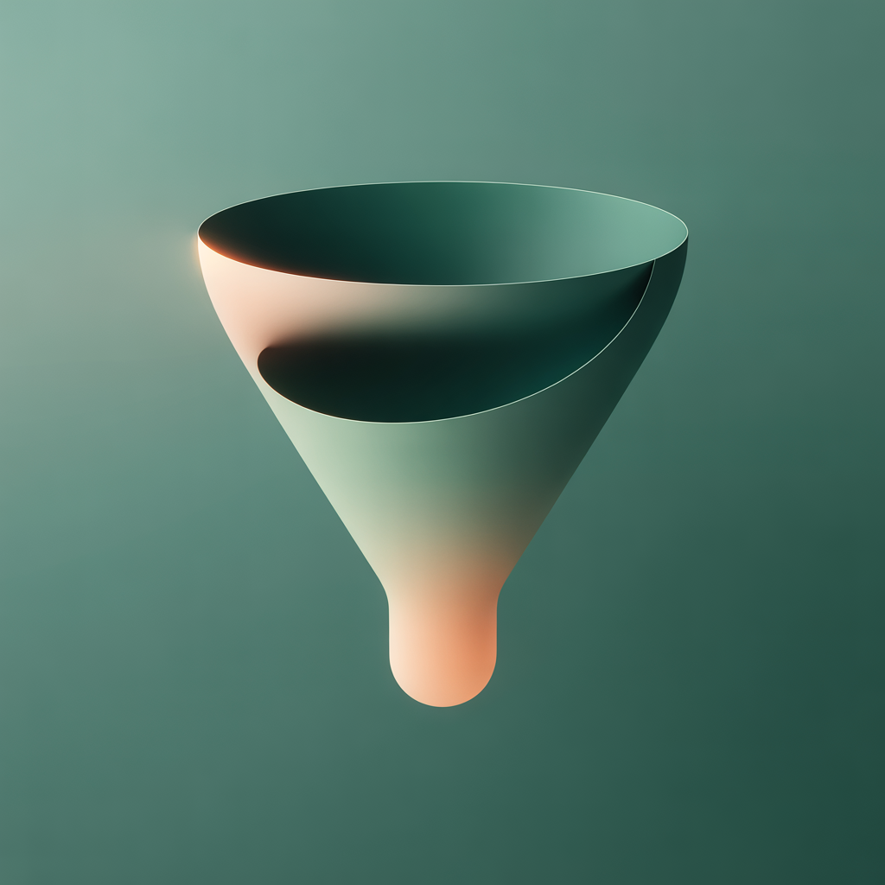
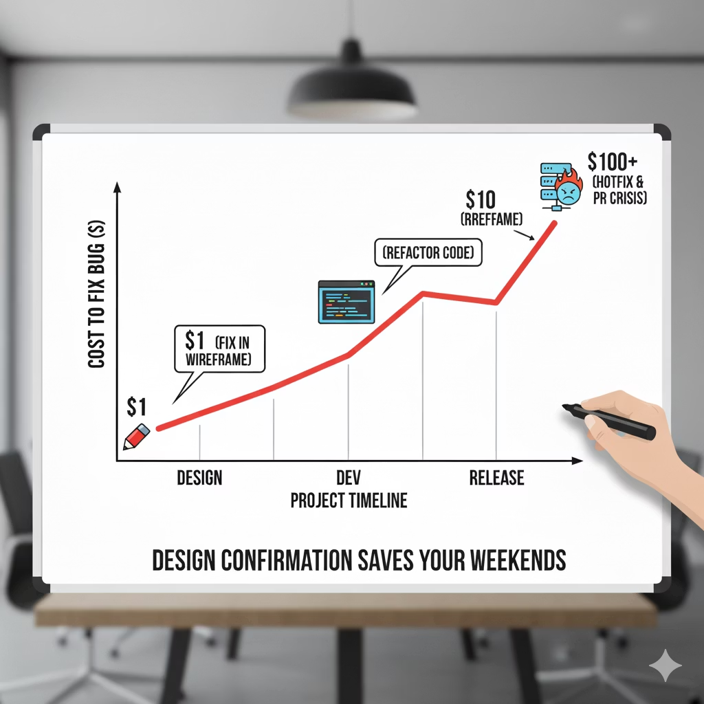

# Product Design & Confirmation: From Features to Design
This presentation explores the journey from product features to design implementation, focusing on UI/UX principles and design confirmation processes.  
本演示探讨了从产品功能到设计实施的旅程，重点关注 UI/UX 原则和设计确认流程。

## Learning Objectives
1. Understand and articulate the principles of innovative product design. 理解和阐述创新产品设计原则。
2. Master the fundamental concepts of User Interface (UI) and User Experience (UX) design, including their differences and connections. 掌握用户界面（UI）和用户体验（UX）设计的基本概念，包括它们之间的区别和联系。
3. Recognize the importance of design validation in reducing development risks and costs. 认识到设计验证在降低开发风险和成本中的重要性。
4. Understand the basic process of converting user stories and features into concrete design solutions. 理解将用户故事和特性转化为具体设计解决方案的基本流程。
5. Establish connections between the design process and the delivery performance domain and quality principles of PMBOK. 在设计过程与交付性能领域以及 PMBOK 的质量原则之间建立联系。

> [!NOTE]
> When two apps offer nearly identical functionality, why do you end up using one long-term while uninstalling the other?  
> 当两个应用提供几乎相同的功能时，为什么你会长期使用一个而卸载另一个？

## The Power of Design
Why do we choose one app over another with identical functionality?  
为什么我们会选择一个功能相同的应用程序而不是另一个？

"Design is more than just 'making a product look good.'  
“设计不仅仅是‘让产品看起来好看。’  

Good design makes products easier to use, more efficient, and even capable of building emotional connections with users. It's a key driver of product success."  
好的设计让产品更易于使用，更高效，甚至能够与用户建立情感联系。它是产品成功的关键驱动力。”  

## The Cornerstones of Innovative Product Design: Principles and Concepts
The Code-Design Parallels  
代码与设计的平行

- **Good design is understandable (self-documenting):** UI should be like good code—it doesn't need comments.
- **好的设计易于理解（自文档化）：** 用户界面应像好的代码一样——不需要注释。
- **Good design is unobtrusive (algorithm optimization/redundancy removal):** Less but better.
- **好的设计不显眼（算法优化/冗余移除）：** 少而精。
- **Good design is thorough (robustness/boundary handling):** Pay attention to Empty State and Error State.
- **优秀的设计是全面的（鲁棒性/边界处理）：** 注意空状态和错误状态。

  
**Summarizing Core Concepts:** User-centered design, simplicity, consistency, and accessibility.  
总结核心概念：以用户为中心的设计、简洁性、一致性和可访问性。

## Principles of Innovative Product Design

| Innovative 创新                                                                                                                | Useful 有用                                                                                                                                                | Aesthetic 美观                                                                                                                                   | Understandable 易懂                                                                                                                  | Unobtrusive 不显眼                                                                                                                       |
| ------------------------------------------------------------------------------------------------------------------------------- | ----------------------------------------------------------------------------------------------------------------------------------------------------------- | ------------------------------------------------------------------------------------------------------------------------------------------------- | ------------------------------------------------------------------------------------------------------------------------------------- | ---------------------------------------------------------------------------------------------------------------------------------------- |
| Design should not imitate but synchronise with technological innovation to provide new solutions. 设计不应模仿而应与技术创新同步，以提供新的解决方案。 | Products must satisfy functional, psychological and aesthetic standards. Design's core purpose is to optimise usability. 产品必须满足功能、心理和审美标准。设计的核心目的是优化可用性。 | A product's aesthetic quality is integral to its utility. Thoughtfully designed products touch people's hearts. 产品的审美质量是其实用性的组成部分。精心设计的产品触动人心。 | Design should clearly display product structure, ideally allowing the product to be self-explanatory. 设计应清晰地展示产品结构，理想情况下使产品具有自解释性。 | "Less, but better." Design should remain neutral and restrained, leaving room for user self-expression. "少而精。"设计应保持中性和克制，为用户自我表达留出空间。 |

Core design philosophy: user-centered, simplicity, consistency, and accessibility. 核心设计理念：以用户为中心、简洁、一致性和可访问性。
  

## UI & UX: The Twin Pillars of Design

（维恩图）

#### Case: UI Perfect, UX Negative – "The Beautiful Trap"
Product Name: VogueWeather (A Fictional Weather App)  
产品名称：VogueWeather（一个虚构的天气应用）  

UI Description (Visible): The interface is extremely beautiful, with a full-screen 4K dynamic background. Raindrops actually slide off the screen, and the font is an elegant serif typeface. The color scheme is a sophisticated Morandi gray.  
UI 描述（可见部分）：界面极其美观，拥有全屏 4K 动态背景。雨滴实际上会从屏幕上滑落，字体是优雅的衬线字体。配色方案是复杂的莫兰迪灰色。  

UX Description (Usability):  
UX 描述（可用性）：  

1. Issue 1: To maintain a "minimalist" look, there are no temperature figures. You need to long-press the screen for 3 seconds to see the specific temperature. 问题 1：为了保持“极简”风格，没有温度数字。需要长按屏幕 3 秒才能看到具体温度。
2. Issue 2: Switching cities requires a two-finger swipe and drawing a circle (the gesture is extremely complex and lacks any prompts). 问题 2：切换城市需要用两指滑动并画圆（这个手势极其复杂且没有任何提示）。
3. Issue 3: The loading animation is too elaborate, resulting in a 5-second logo animation every time the app is opened. 问题 3：加载动画过于复杂，每次打开应用时都会出现 5 秒的标志动画。

### Online Shopping Checkout
The checkout process is clear, with each step clearly marked and a progress bar provided.  
结账流程清晰，每个步骤都有明确的标记，并提供进度条。  

The form layout is well-organized, and button text is explicit.  
表单布局井然有序，按钮文本明确。  

> 结账流程清晰  
> 每一步都明确标示 提供进度条  
> 表单填写区布局合理 按钮文字明确。

### Weather Forecast App
Key information (temperature, weather conditions) is prominently displayed, using clear icons and legible fonts. The layout is clean, with background images that are relevant to the weather conditions.  
关键信息（温度、天气状况）突出显示，使用清晰的图标和易读的字体。布局简洁，背景图像与天气状况相关。  

> 主要信息（温度、天气状况）突出，使用清晰的图标和易读的字体，布局简洁，背景图与天气状况相关。

### Website Homepage
The navigation bar is concise and clear, using common icons (like the hamburger menu), with highly readable text and a logical categorization system.  
导航栏简洁明了，使用常见的图标（如汉堡菜单），文本易于阅读，分类系统逻辑清晰。  

> 主要信息（温度、天气状况）突出，使用清晰的图标和易读的字体，布局简洁，背景图与天气状况相关。

## UI & UX: The Twin Pillars of Design

| UX Design Basics                                                                                                                                        | UI Design Basics                                                                                                                                                                                                                                                      |
| ------------------------------------------------------------------------------------------------------------------------------------------------------- | --------------------------------------------------------------------------------------------------------------------------------------------------------------------------------------------------------------------------------------------------------------------- |
| - Ensures logical product flow and usability   - 确保产品流程的逻辑性和可用性   - Deliverables: Personas, User Flows, Wireframes   - 可交付成果：人物角色、用户流程、线框图  | - Visualises wireframes with consistent, attractive interfaces   - 使用一致、吸引人的界面可视化线框图   - Focus: Layout, colour, typography, icons, controls   - 重点关注：布局、色彩、字体、图标、控件   - Deliverables: Mockups, Prototypes, Design Systems   - 可交付成果：原型、原型、设计系统   |

Excellent UX requires good UI, but beautiful UI cannot salvage poor UX. 优秀的用户体验需要良好的用户界面，但美观的用户界面无法挽救糟糕的用户体验。

## From User Stories to Design: The Process

<table>
    <tr>
        <td><h4>Step 1: Requirement Input</h4><h4>步骤 1：需求输入</h4>Start with a specific user story: "As a student, I want to see my learning progress bar on the course page, so I can understand my learning status and motivate myself." 从特定的用户故事开始："作为一名学生，我希望在课程页面上看到我的学习进度条，以便了解我的学习状态并激励自己。"</td>
        <td><h4>Step 2: UX Design (Building the Skeleton)</h4><h4>步骤 2：UX 设计（构建骨架）</h4>Create wireframes focusing on structure and layout: Where should the progress bar be placed? Should it show percentages or chapter numbers? Is it clickable? 创建关注结构和布局的线框图：进度条应该放在哪里？应该显示百分比还是章节编号？它是可点击的吗？</td>
    </tr>
    <tr>
        <td><h4>Step 3: UI Design (Adding Flesh)</h4><h4>步骤 3：UI 设计（添加细节）</h4>Develop high-fidelity mockups based on wireframes, determining colors, styles, and font sizes that align with the product's visual identity. 基于线框图开发高保真原型，确定颜色、样式和字体大小，以确保与产品的视觉身份相符。</td>
        <td><h4>Step 4: Design Confirmation</h4><h4>步骤 4：设计确认</h4>Validate designs through internal reviews and usability testing with interactive prototypes before coding begins. 在编码开始之前，通过内部审查和交互式原型的可用性测试来验证设计。</td>
    </tr>
</table>

> [!NOTE]
> "Modifying a design costs far less than changing code after launch."  
> "修改设计比在发布后更改代码成本低得多。"

## Design Confirmation: Reducing Risk and Cost
#### Why Design Confirmation Matters

Confirming designs before development significantly reduces risk and waste. It's about validating that we're building the right thing, the right way.  
在开发前确认设计可以显著降低风险和浪费。这关乎于验证我们是否正在以正确的方式构建正确的事物。  

#### Confirmation Methods

- **Internal Reviews:** Evaluate designs with product owners and developers to ensure they meet requirements and technical feasibility
- **内部评审**：与产品所有者和开发者评估设计，确保其满足需求和技术可行性
- **Usability Testing:** Show interactive prototypes to real users, observe their ability to complete tasks, and collect feedback for rapid iteration
- **可用性测试**：向真实用户展示交互式原型，观察他们完成任务的能力，并收集反馈以进行快速迭代

## PMBOK Connection & Conclusion

| Delivery Performance Domain 交付绩效领域                                                                                                                                                                                                                     | Quality Principles 质量原则                                                                                                                                                                                                                                                                     |
| --------------------------------------------------------------------------------------------------------------------------------------------------------------------------------------------------------------------------------------------------------- | ---------------------------------------------------------------------------------------------------------------------------------------------------------------------------------------------------------------------------------------------------------------------------------------------- |
| Wireframes, mockups, and prototypes are key deliverables that bridge requirements and final products.   线框图、原型和原型是连接需求和最终产品的关键交付成果。      Design quality is an essential component of overall product quality.   设计质量是整体产品质量的一个基本组成部分。   | **Customer Focus:** UI/UX design exemplifies customer-centricity.   客户至上：UI/UX 设计体现了customer-centricity.      **Prevention over Inspection:** Design confirmation and user testing prevent costly rework by identifying issues early.   预防胜于检查：设计确认和用户测试通过早期发现问题，防止了昂贵的返工。   |

> "Design is not decoration at the end of development, but a core element in creating product value. It's a systematic process that transforms user needs into high-quality deliverables through continuous ideation, validation, and iteration."  
> 设计不是在开发结束后进行的装饰，而是创造产品价值的核心要素。它是一个系统性的过程，通过持续的构思、验证和迭代，将用户需求转化为高质量的可交付成果。

## PMBOK and Business Value: The 1-10-100 Rule (Project Management)
- **Core Question:** "Why do we spend time on design confirmation? Isn't it faster to just write code?"
- **核心问题**：“为什么我们在设计确认上花费时间？直接编写代码不是更快吗？”
- Concept Introduction: The Cost of Change Curve
- 概念介绍：变更成本曲线

